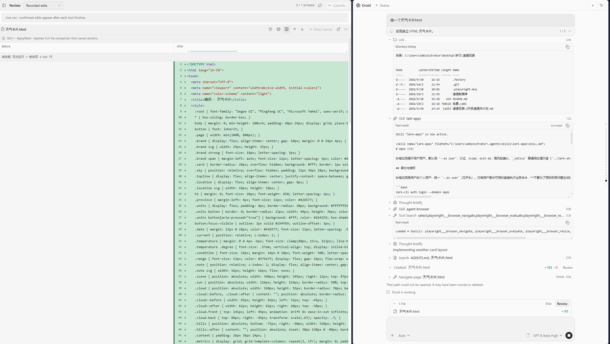

# Droid

**在 VS Code 里使用 Droid：阅读对话、随时旁问、审阅改动。**

[下载安装包](https://github.com/fireman-droid/droid-for-vscode/releases/latest) · [使用文档](docs/README.md) · [参与开发](docs/DEVELOPMENT.md) · [报告问题](https://github.com/fireman-droid/droid-for-vscode/issues)

Droid 是 **Factory Droid CLI 的非官方开源 GUI**，支持 VS Code 和兼容版本的 Cursor。
它连接你本机的 Droid，把终端里的会话、工具执行和文件修改带进编辑器，支持使用自己的模型渠道（BYOK）。



*在同一个编辑器里看任务、读代码、检查修改。截图来自实际使用；界面会随版本演进。*

## 为什么做它

起因很简单：用 CLI 学习和写代码时，长回复、工具输出和代码修改读起来不够方便。
找了一圈 GUI，没有遇到同时合自己习惯、又支持 BYOK 的，于是围绕日常使用的 Droid 做了这个插件。

外观与交互借鉴了 Cursor、Claude for VS Code、Codex 和 Kilo。
希望它能让对话更好读，让文件改动更容易检查，也让临时冒出来的问题有个单独的位置。

## 可以用它做什么

| 场景 | Droid 提供的入口 |
| --- | --- |
| 读一段长回复，跟进任务进度 | 聊天中查看 Markdown、代码、任务计划和工具执行，细节按需展开 |
| 不打断主线，顺便问一句 | **BTW 旁问**引用选中文字，支持图片、独立模型和模型支持的推理强度 |
| AI 改完文件，先检查再继续 | **Review** 查看逐次编辑、整轮工作区变化或 Git 差异，支持分栏、改动跳转和审阅标记 |
| 使用自己的模型服务 | 管理 **BYOK** 渠道、模型别名和启停状态；可用能力取决于 Droid 与服务商 |
| 配置 Droid 的工具能力 | 查看和管理 **Skills、MCP 与插件**，支持范围由当前 Droid 环境提供 |
| 手动写代码时少打一些字 | **灰字补全与 Next Edit**，分别提供光标续写和下一处编辑建议 |
| 跟进并行任务 | 从子代理卡片进入子会话，或在 **Mission Control** 查看任务与 Worker |

补全默认关闭，单独配置服务，不读取聊天历史。普通补全支持 Codestral、DeepSeek 兼容 FIM、
Ollama 等协议；Next Edit 接入 Mercury。配置方法见 [补全指南](docs/AUTOCOMPLETE.md)。

## 开始使用

### 1. 准备 Droid CLI

需要支持 VS Code API **1.108.0+** 的编辑器，以及已经安装、认证且可正常使用的 Droid CLI。
先按 [Factory 快速开始](https://docs.factory.ai/droid-cli/quickstart.md) 完成配置，并在终端确认：

```sh
droid --version
```

使用自己的 API Key 时，按 [Factory BYOK 文档](https://docs.factory.ai/model-independence/byok.md) 配置模型服务。
**插件不附带模型订阅或免费额度**；聊天和编辑器补全的服务分别配置、分别计费。

### 2. 安装 VSIX

1. 到 [Releases](https://github.com/fireman-droid/droid-for-vscode/releases/latest) 的 **Assets** 下载 `droid-版本号.vsix`。
2. 在编辑器扩展面板的 `…` 菜单选择 **Install from VSIX…**，安装该文件。
3. 执行 **Developer: Reload Window**，打开项目文件夹，再运行 **Droid: Open Chat**。

安装包用户不需要 Node.js、pnpm 或源码。GitHub 下载版通过安装新版 VSIX 手动更新；
内部扩展 ID 保持 `droidvisx.droidvisx`，无需先卸载旧版。

### 3. 从一个小任务开始

选择可用模型，先让 Droid 介绍项目，再尝试修改一处文件：

> 阅读 README 和项目入口，解释各目录的用途。先不要修改文件。

接下来可以选中回复中的文字打开 BTW，或从文件修改记录进入 Review。
完整步骤见 [安装与第一次对话](docs/GETTING_STARTED.md)。

## 当前边界

- **平台**：主要在 Windows 上开发和验证；macOS、Linux、WSL、Remote SSH 和容器环境尚未完成同等验收。
- **会话**：默认 daemon 模式下，重载窗口或关闭面板不等于停止后台任务；遇到异常先确认任务状态。
- **Diff 与撤销**：比较默认围绕改动展示。查看历史完整文件、撤销编辑，需要对应的版本或完整修改证据，不能从残缺记录补造。
- **Mission**：已有入口和任务视图，但日常使用与验证较少，欢迎提供可复现的问题。

功能范围见 [能力说明](docs/CAPABILITIES.md)，故障处理见 [排障指南](docs/TROUBLESHOOTING.md)。
仓库 `main` 和 Releases 安装包可能处于不同进度，已发布内容以各版本说明为准。

## 数据如何处理

聊天、附件和工具内容会按你的操作交给 Droid、所选模型以及相关 MCP / 插件服务。
扩展在本机保存恢复元数据、暂存附件和诊断日志；这些内容不随 Git 迁移，也不保证卸载后自动清除。
编辑器补全密钥保存在编辑器 SecretStorage 中。

诊断包需要手动导出，导出命令不会自动上传。公开截图或日志前请去除密钥、私人路径和对话内容。
[数据保存位置与诊断步骤](docs/TROUBLESHOOTING.md)

## 文档与贡献

| 我想…… | 从这里开始 |
| --- | --- |
| 学会聊天、模型、旁问和 Review | [使用文档](docs/README.md) |
| 跑起源码，完成第一个修改 | [开发指南](docs/DEVELOPMENT.md) |
| 理解发送、流式消息、恢复和状态归属 | [架构与代码导航](docs/ARCHITECTURE.md) |
| 复用 React 聊天界面 | [独立 UI 包](packages/chat-ui/README.md) |
| 提 Bug 或改进建议 | [Issue](https://github.com/fireman-droid/droid-for-vscode/issues) · [反馈要点](docs/FEEDBACK.md) |

欢迎 PR。请说明解决的具体问题、复现步骤和验证结果；开发前阅读 [贡献与验证规则](AGENTS.md)。
版本变化在 [CHANGELOG](CHANGELOG.md)，维护进度在 [STATUS](docs/STATUS.md)。

社区交流：[LINUX DO](https://linux.do/)。感谢社区为开源项目提供交流与分享的平台。

## 许可与致谢

原创代码采用 [MIT](LICENSE)。补全实现参考并适配了 [Kilo Code](https://github.com/Kilo-Org/kilocode)
和 [Continue](https://github.com/continuedev/continue)，第三方代码与依赖保留原许可，分发包附带对应条款。

本项目由社区独立维护，不由 Factory 官方发布、维护或背书。
Factory 名称和风车标识归各自权利人所有，不随本项目 MIT 许可证重新授权。
[标识来源](docs/DESIGN.md#分发标识)
