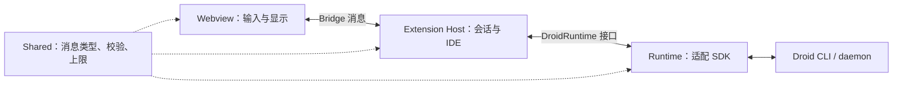
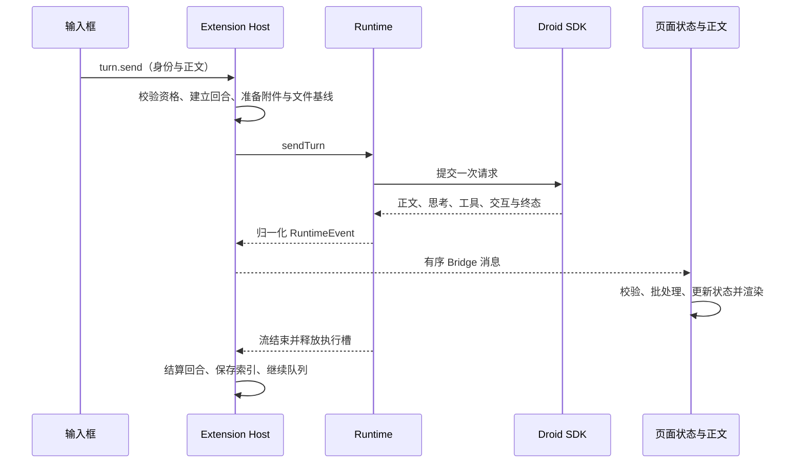
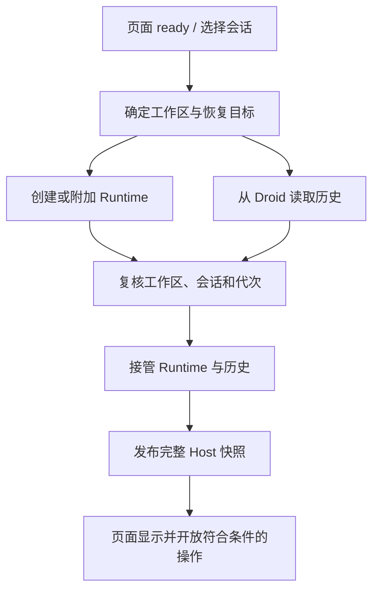

# 架构与代码导航

本文面向第一次维护这个项目的人：先确定改动属于哪一层，再沿一条实际调用链阅读。
当前能力和未验收事项见 [STATUS](STATUS.md)、[CAPABILITIES](CAPABILITIES.md)，
界面规则见 [DESIGN](DESIGN.md)。这里说明代码如何协作，不把文档描述当作测试结果。

## 先认识四个部分

Droid CLI/SDK 执行任务；扩展管理 IDE、会话和文件；页面只收发消息和显示结果。
`Shared` 是双方共用的类型与校验规则，不是另一个后台服务。

| 目录 | 负责什么 | 不应放入什么 |
| --- | --- | --- |
| `src/runtime/` | 调用 SDK、连接 daemon、发送/恢复会话，把 SDK 事件转成项目事件 | VS Code API、React、页面状态 |
| `src/extension/` | 扩展装配、工作区、当前会话、权限、文件、存储、各面板生命周期 | 页面排版、第二套模型执行器 |
| `src/shared/` | 消息类型、上下限、严格校验、纯数据转换 | 文件/网络操作、VS Code、React、SDK 实例 |
| `src/webview-v2/` | 全部前端页面、Droid 业务状态、接收 Host 消息、把数据接到公共组件 | SDK、文件系统、直接模型请求 |
| `packages/chat-ui/src/` | 可复用的控件、聊天/只读内容、Markdown、滚动、输入与 Diff 展示 | Droid 会话身份、Bridge、Host、VS Code API |

前端只有 `src/webview-v2/` 一套实现，目录名保留，生产页面是 Chat、Models、Mission、
Viewer、Review。`chat/` 按 composer、attachments、btw、interactions、queue 等业务
划分；文件变更在 `review/`，模型、Mission、历史查看分别在 `models/`、`mission/`、
`viewer/`。`state/` 保存根业务状态，`host/` 接收消息，`bridge/` 校验并发送消息，
`shell/` 管页面挂载和主题，`content/` 接 Markdown/Mermaid，`dev/` 提供预览与真实联调。

### SDK 0.9.1 设置与恢复

模型元数据由 Runtime 的正式 `listModels` 目录投影到共享契约，禁用检查保留在 Host
应用边界，Webview 只负责显示与交互。系统提示使用独立请求／确认消息和 Host 用户配置
存储，工厂仅给新建目标注入 `systemPrompt`，恢复／分叉不注入。

daemon 提交前由 Runtime 产生后端回合 ID，Host 刷新恢复 checkpoint 后才继续发送；
该 ID 原样传入 `addUserMessage.messageId`，断线恢复用 `loadSession.agentTurnOutcomeTurnId`
查询持久结果。待审批由交互协调器保留，不能从 registry idle 推断任务成功。

历史记录追加使用 SDK 公开低层 Process 客户端，在 Host 空闲操作锁内关闭、追加并恢复
原会话；`user_only` 在历史投影中独立显示，不成为可重发用户回合。daemon 没有公开
追加接口，不使用私有 SDK 字段或直接修改 CLI 历史。

### 编辑器补全的独立路径

`src/extension/autocomplete/registerAutocomplete.ts` 装配原生 Inline Completion
Provider、状态栏和配置向导；`AutocompleteProvider.ts` 持有编辑器快照、防抖、取消、
文档/光标/关联上下文版本，也负责接续语言服务的候选文本。CompletionHistory 复用 Kilo 的
匹配策略，保留 20 条/30 秒历史；CompletionRequests 分离调用者取消与网络取消，
兼容请求在 100ms 交接窗口内可保留，并在新调用收集上下文时持有租约；已被输入的
结果前缀会剔除，不匹配则按当前上下文重新请求。防抖以近期延迟限幅，错误分类退避。
`completionText.ts` 在插入边界以语言模式区分文本与代码：代码建议的独立反引号围栏
返回明确拒绝值，不猜测词法状态或截断文本。Provider 将拒绝缓存为当前上下文的空结果，
显示状态提示；手动重试清缓存，新文本/新文档不受全局冷却。

普通 FIM 由 `context/KiloContextService.ts` 调用固定版本的 Kilo/Continue：HelperVars、
ImportDefinitionsService、RootPathContextService、可选 StaticContextService、近期编辑/浏览、
getSnippets 排序裁剪、模型模板。启用补全时立即建立浏览/编辑跟踪，不等首次 FIM 请求。
原生定义和近期修改补充与 Kilo 片段合并，按来源优先级去重后再套用模型模板与总预算。`KiloContextIde` 是唯一 Host 文件/LSP/剪贴板适配边界，
复用 CompletionFilePolicy 的同根、真实路径、Git/Droid ignore 与大小限制，优先未保存文本。
LSP 查询跟随请求取消，从首次查询起共享 150ms 等待预算；超时来源不阻塞已就绪的其他片段，
记录 context.timeout，下一次请求可重试，其他错误仍向调用边界传播。导入缓存每次核对语法树中的
完整导入语句与位置，只改主体时复用；外部定义、配置或忽略规则变化清理依赖缓存，迟到结果不能
写回新一代缓存。读取到的新关联文件加入现有 watcher。
解析器/语法资源来自包内 `dist/extension/autocomplete`；AST/Query 由请求资源作用域释放。
静态上下文默认关闭，仅 TS 有上游查询，候选枚举最多 2,000 个；剪贴板需要用户级显式启用。

`CompletionContextService` 为 FIM 收集原生定义、近期编辑和打开文件（最多 6 文件/400ms），
另为 Next Edit 收集实际浏览过的其他文件（最多 5 文件/400ms，按旧→新返回，每个片段围绕
浏览位置保留最多 20 完整行）。关闭页签保留浏览位置，重新读取磁盘保存内容并检查文件策略。
`CompletionPrompt` 控制 FIM 最终 UTF-16 字符预算。
Codestral 在文件中间和末尾均使用多文件模板保留关联定义；Mercury FIM 将关联片段作为语言注释保留在 prefix 中，
避免上游 Mercury 模板主动丢弃 snippets。`LanguageComments` 从语言扩展 JSONC 读取元数据。
Notebook 拼接同语言相邻单元，并将当前光标映射至虚拟上下文；缓存包含所有相关单元版本和顺序。

`src/runtime/autocomplete/requestCompletion.ts` 根据显式协议调用原生 FIM、Ollama generate
或 SiliconFlow 的 prefix/suffix FIM 扩展。Runtime 不引用 VS Code；共享 transport 提供
取消、12 秒超时、大小限制与固定错误。当前完整响应收齐后再返回灰字。
Host 从 SecretStorage 即时读取完整 endpoint 的 key；仅官方 Mercury FIM/Edit 两个地址共用，
配置只接受用户级值。本地无认证服务不附认证头，不进入 Droid 聊天 Session。

Kilo 源码固定为 `7d977bce994af36f0edf752cb53e3aefc7aeb214`，位于 autocomplete/kilo。
新接入的 Continue 子树保留 Apache-2.0 声明，Kilo 自身为 MIT；llamaTokenizer 保留原作者
belladore.ai 的 MIT 头，语法包和 js-tiktoken 许可证随包 notices 分发。CLI 文件系统适配器
未引入生产包。普通补全的后处理接入上游模型、重复与语言过滤，Droid 额外保留明确的
围栏拒绝反馈、CRLF 和纯缩进；Markdown 不套用代码围栏剥除。

NextEditSupport 管理经过文件策略过滤的 EditHistoryTracker、光标可编辑区域与接受后继续预测。
启用补全期间持续记录编辑；FIM/Next Edit 切换只清待接受建议，停用时销毁跟踪器并清空编辑历史。
Runtime nextEdit.ts 使用上游 editPrompt.ts 组装 Mercury 标记格式；预算优先保留完整编辑区域、
光标及最新可容纳的完整 diff，再分配较旧历史、浏览片段和邻近完整代码行，不截断 diff，
请求独立 `/edit/completions`，要求完整 fenced region 和 finish_reason=stop。
NextEditPresenter 将纯续写交给原生 InlineCompletionItem；其他修改使用 Kilo decoration 和
SuggestionManager 的单个待接受项。Tab 先跳转再接受，editor.edit 保留 Undo，文档变化使旧建议失效。
普通文件按配置选择 FIM 或 Next Edit；Notebook 在官方 Mercury 模式切换为其 FIM endpoint。
自动/手动与 snooze 时间戳同时约束 Provider 和连续预测；定时器只刷新状态，不自动插入代码。
补全不经过 Webview/Bridge，也不进入聊天队列。聊天 daemon 仍在聊天视图首次解析时预热。

### 历史内部会话过滤

`src/runtime/editorAssistance/sessionIdentity.ts` 仅保留旧 `droid-editor-assistance` 标签识别，
供历史、归档和搜索过滤使用；不再注册编辑器辅助入口或创建这类请求。

### 第一次阅读按这个顺序

1. [extension.ts](../src/extension/extension.ts)：扩展启动时创建哪些服务，以及谁负责释放它们。
2. [ChatController.ts](../src/extension/chat/ChatController.ts)：当前窗口持有哪些状态，消息如何进入和发出。
3. [dispatchChatMessage.ts](../src/extension/chat/dispatchChatMessage.ts)：从一个用户动作找到对应处理函数。
4. [turnFlow.ts](../src/extension/chat/turns/turnFlow.ts)：一次发送如何进入 Runtime，何时可以结束。
5. [DroidRuntime.ts](../src/runtime/DroidRuntime.ts) 与 [FactoryDroidRuntime.ts](../src/runtime/FactoryDroidRuntime.ts)：Host 需要什么能力，SDK 如何提供。
6. [useHostMessageFlow.tsx](../src/webview-v2/host/useHostMessageFlow.tsx)、[state/store.ts](../src/webview-v2/state/store.ts) 与 [Transcript.tsx](../src/webview-v2/chat/Transcript.tsx)：
   后台事件怎样变成页面内容。

不必先通读所有文件。例如改输入框，先看 Composer；修正文不更新，先查消息接收和
状态转换；调整 SDK 行为，再进入 Runtime。后面的定位表给出常见入口。

## 一次发送经过哪里

1. 页面 `Composer` 负责输入形态；`chat/composer/useComposerFlow.tsx` 负责草稿、
   发送锁、排队、Slash 和请求提交。按钮不能直接调用 Runtime。
2. `DroidViewProvider` 接收页面消息；`webviewMessageRouter.ts` 和共享校验器核对
   消息结构，`dispatchChatMessage.ts` 选择业务处理函数。剪贴板等独立动作在面板边界处理。
3. `turns/turnFlow.ts` 的 `handleSend` 检查会话、工作区、设置与交互资格，建立当前回合。
   `consumeTurn` 等待 before 文件基线，再调用 `runtime.sendTurn` 并消费结果。
4. `FactoryDroidRuntime` 使用 Process 或 daemon adapter，SDK 负责实际执行。
   `runtime/events/` 归一化事件，Runtime 不决定页面布局。
5. `turns/turnRuntimeEvents.ts` 将事件投影到当前 Host 转录，调用权限、工具、Mission、
   子代理等已有模块。`ChatController.emit` 统一分配 sequence 并通知页面消费者。
6. V2 `host/hostMessageSource.ts` 校验入站消息，`useHostMessageFlow.tsx` 处理握手、
   主题/路由及 rAF/50ms 合并；`state/store.ts` 检查顺序与身份，再交给对应 reducer。
   同步应用后，`host/stateReceipt.ts` 回传当前页面实际应用的序号，不能先确认后改状态。
7. `chat/store.ts` 给每个页面创建独立 Zustand store；顶层控件与流式正文分开订阅。
   `Transcript` 将 Droid 数据转成公共 UI 的展示数据，公共组件不修改 Host 状态。
8. 正常流在 Runtime generator 关闭、执行槽释放后，才由 `turnSettlement.ts` 结算。
   异步 Changes 只更新对应回合；不能拿旧转录覆盖后来已收到的新消息。

### 发送流程中的几个文件

| 文件（位于 `src/extension/chat/turns/`） | 要解决的问题 |
| --- | --- |
| `turnFlow.ts` | 接受发送、建立回合、消费真实流 |
| `turnRuntimeEvents.ts` | 每类 Runtime 事件怎样修改转录/展示状态 |
| `turnSettlement.ts` | 完成、失败、Stop、状态发布及结束后的收尾 |
| `specHandoff.ts` | Spec 产生后继会话时的检测与接管 |
| `turnRetry.ts` | 重试连接和工作区恢复，不负责重发已提交消息 |
| `turnIdentity.ts` | 当前回合/Runtime/工作区身份是否仍有效 |
| `turnFlowPort.ts` | 各流程允许读写的字段及可调用的跨模块操作 |

`Stop` 请求不等于已经停止。watchdog 只能请求中断，不能凭超时或 idle 把回合写成
成功/完成；未确认时保留锁定和重试入口。恢复中的回合没有本地 iterator，必须由
恢复路径依据后台终态完成结算。Spec Handoff 使用自己的接管流程，不偷偷开启第二次发送。

## 打开、切换和恢复经过哪里

启动与发送是两条不同的链。恢复首先要找回同一会话及其权威历史，不能用缓存正文
提前制造“已经恢复”的画面。

- `chat/sessions/` 管理启动、目录、切换和 Runtime 生命周期；`startupTarget.ts`
  处理已选目标不在最近目录中的情况，不因“最近 50 条没有”就断言会话不存在。
- `chat/recovery/activationTranscript.ts` 装配历史与 Conversation 关联，
  `runtime/history/` 从 Droid 读取并投影；`recovery.ts` 处理已运行轮次的后续对账和检查点。
- Runtime 和权威历史都就绪后才能接管并开放发送；加载期间工作区或代次变化，
  旧候选必须释放，不能覆盖用户刚选择的新会话。关闭失败保留失败事实，允许重试。
- `SessionRecoveryStore` 持久化的是扩展专属元数据：选择、节点关联、未发队列、
  轮次/Changes 索引、有界操作证据与恢复标记，不是另一份聊天全文或图片缓存。
  历史正文从 Droid 来；旧 display payload 不参与按位置拼接。
- Compact/Handoff 可换 backend session 而保留同一 Conversation；Fork/Rewind
  建立新 Conversation。历史用 SDK 消息 ID 接回本地轮次/Diff 索引，不能靠相似正文认领。
- 轮次 `sessionId` 是执行与文件快照来源；Fork/Rewind 中继承的轮次可以指向父
  Conversation 的会话，不把这些来源注册为新 Conversation 拥有的节点。复制时重置
  轮次的 display revision，保留消息 ID、变更与操作证据。恢复解码对明确的 Fork/Rewind
  记录兼容旧版源 revision；普通根会话的外部轮次和本地越界 revision 仍视为非法。
- 恢复提交与存储写入有成功边界；未完成 durable write 不确认已保存的 revision。
  旧图片文件不再用于全文恢复，也不顺带跨工作区清扫用户文件。

### 会话生命周期的文件分工

这些文件位于 `src/extension/chat/sessions/`。需要改流程时从编排入口读起，
不要把不同文件各自看成能独立激活或关闭会话的服务。

| 文件 | 负责什么 |
| --- | --- |
| `runtimeLifecycle.ts` | startup/ready，以及一次会话替换的完整编排 |
| `runtimeActivation.ts` | 准备 Runtime/历史，复核后提交激活结果 |
| `sessionGuards.ts` | 只读检查当前 Runtime、工作区与代次 |
| `workspaceLifecycle.ts` | 将工作区变化排成有序的切换流程 |
| `sessionCleanup.ts` | 清理会话关联状态、关闭资源；Mission/模型发现的取消交回各自 state |
| `SessionLifecycleState.ts` | 保存生命周期状态，并合并重复关闭、保留失败重试语义 |

### 页面重新打开不等于重新执行

`DroidViewProvider` 先注册监听再加载 HTML。`browserReplay.ts` 等待初始化后给
请求页面发完整快照，快照同时包含转录、当前回合和仍待处理的交互。

`webviewStateDelivery.ts` 管理投递与页面状态应用确认。页面 ready 携带 pageId，
`host/stateReceipt.ts` 在 store 更新后通过 `webview.state-applied` 回传精确序号；
Host 拒绝旧页面回包。后续增量确认不会自动覆盖前面漏收的消息，确认完整快照才可
覆盖此前普通状态。待确认集合只保存序号、身份和时序，不复制聊天正文。

可见页面 2 秒无确认会补权威快照，连续未确认最多重试 3 次；新 ready、重新可见
可开启新的补同步机会。旧 replay 尚未结束时到达的新 ready 会排队，不因合并而丢弃。
`plan.document.state` 的正文不在普通快照内，按 session/turn/request 单独追踪最新
正文与状态的确认；同身份新正文 ACK 可消除旧缺口，关闭或切会话后清理旧身份。

V2 `host/useStartupSync.ts` 在首次有效已结算状态到达前按 5–30 秒退避持续重发 ready，
隐藏时暂停。手动刷新由 `chat/ConnectionFeedback.tsx` 等待同会话且更新的完整快照，
10 秒无响应恢复入口并说明未收到状态。以上路径均不重放用户请求、工具或模型调用。
`postMessage` 成功仅表示平台接受消息，应用 ACK 也不证明 DOM 已绘制；
`useTranscriptReceipt` 的 commit 诊断用于定位，不代替真实可见结果验收。

## 状态由谁保存、谁可以改

先找状态的负责模块，再修改使用它的组件。`ChatController` 是装配点，不应新增
一个所有功能都可任意写入的“大状态包”。各 `*Port.ts` 限定该流程需要的字段和操作。

| 状态 | 保存位置 | 修改边界 |
| --- | --- | --- |
| SDK 会话、执行、模型、工具和认证结果 | Droid CLI/SDK | Runtime 调用公开能力；UI 不推断成功 |
| 当前 Runtime、连接、工作区与会话身份 | `chat/sessions/SessionLifecycleState.ts` | 主要由 `sessions/` 创建/接管/替换/关闭，IDE 重连与 Mission 启动仍有协调写入 |
| 当前回合、停止请求、回合代次 | `chat/turns/TurnState.ts` | `turns/` 及确认后台结果的恢复流程 |
| 当前窗口转录与待保存标记 | `chat/recovery/ConversationRecoveryState.ts` | 实时事件投影、权威历史对账、对应轮次结算 |
| 未发送队列 | `chat/queue/QueueState.ts` | `queue/` 按顺序、暂停、取消和完成规则修改 |
| 附件字节与暂存身份 | `chat/attachments/AttachmentStagingState.ts` | Host 暂存/发送/历史编辑流程；页面只持预览信息 |
| 设置、用量、目录、命令与更新状态 | `chat/capabilities/sessionMetadataState.ts` | capabilities 的窄接口；不可顺手修改回合/队列 |
| 待权限、AskUser、Plan 请求 | `interactions/pendingInteractionCoordinator.ts` | Host 核验身份并单次结算，Runtime 等待结果 |
| Mission、子代理、模型管理 | 各自目录中的 state/service | 各自流程；通过 `chatEffects.ts` 连接跨域操作 |
| 页面收到的业务状态 | `webview-v2/state/`，由 `chat/store.ts` 承载 | reducer 接受合法消息与有限本地意图；不能成为后台权威 |
| 草稿、展开、选区、滚动与临时预览 | 对应页面 Hook/公共组件 | 本地交互；只通过明确动作请求 Host 写入 |
| BTW 未发送文字、引用、图片和显式模型 | `chat/btw/useBtwPanel.ts` 与其 `useBtwImages` | 当前 session 的统一 owner；面板只接受受控值和回调，关闭仅隐藏，切会话清理 |
| 密钥、OAuth 回调和原生终端输入 | Host/SDK | 原生入口处理，不经聊天 Bridge 或诊断正文 |

历史用户图片携带所属 SDK `userMessageId`，不从内容块前后位置推断所属消息。
`shared/transcript/userImageOwners.ts` 统一阅读展示、编辑附件和重发截断的归属判断，
保留尚无 SDK 归属的实时回显与旧快照排列；显式归属缺失时不挪到邻近消息。

表中描述主要负责路径，并非所有字段已经由私有方法独占修改：`chat/ideIntegration.ts`
仍会更新连接/操作锁，`chat/mission/controller.ts` 仍会接管 Mission 的 Runtime 与会话身份。
这些协调路径也必须核对身份和资源顺序，不能从状态文件位置推断只有一个写入者。

`chat/hostOperations.ts` 声明 Host 服务，`chat/chatEffects.ts` 绑定跨功能调用。
这让一个模块可以“请求保存检查点”，而不必获得整个 Controller 的修改权限。
现有 Port 中仍有跨域写字段，维护时应沿真实操作边界收窄，不能只把大接口换个名字。

读代码时，`ctl` 表示当前窗口的控制器接口；`Port` 是该函数参数允许访问的字段清单，
仅用于 TypeScript 检查，不会创建另一个服务。`effects` 是绑定好控制器的跨模块函数。
例如 `workspaceLifecycle.ts` 调用 `ctl.effects.startup()`，在 `chatEffects.ts` 搜索
`startup:`，即可看到它调用 `runtimeLifecycle.ts` 的 `startup(controller)`。
跟踪其他 `effects.xxx()` 也使用同一方法；流程自己的内部步骤直接调用本模块或邻近模块。

### 常见身份字段

| 字段 | 用来区分什么 |
| --- | --- |
| `conversationId` | 用户看到的逻辑对话；决定哪些页面内状态可以保留 |
| `sessionId` | 当前 Droid backend 会话；Compact/Handoff 后可能改变 |
| `turnId` | 一次回复/执行回合；操作和结果不能串到下一轮 |
| `toolUseId` / `callId` | 某次工具调用；补历史和子代理证据靠身份关联 |
| `requestId` | 一次异步读取/管理动作；拒绝迟到的旧回包 |
| `sequence` | Host 发布给页面的顺序；不是 SDK 执行是否成功的证明 |
| `runtimeGeneration` 等代次 | 本地对象是否已被替换；旧 Promise 返回时据此停止接管 |

不是每条消息都携带上表全部字段。使用该业务已有的身份契约，不能新造一套平行 ID。
同一 session 内也会连续运行多个 turn，仅检查 session 不能保护旧异步结算。

## 改一个功能，先找哪里

以下路径均相对于仓库根目录；生产入口改动要追到直接消费者，不按相邻文件猜行为。

| 需求/现象 | 先读 | 再追到 |
| --- | --- | --- |
| 发送、停止、排队、重试 | `src/extension/chat/turns/`、`queue/` | `src/runtime/FactoryDroidRuntime.ts`、`src/webview-v2/chat/composer/useComposerFlow.tsx` |
| 启动慢、切换失败、恢复旧目标 | `src/extension/chat/sessions/`、`recovery/activationTranscript.ts` | `src/runtime/catalog/`、`history/`、`daemon/` |
| 后台有结果但正文没更新 | `src/extension/chat/hostSnapshot.ts`、`webview/webviewStateDelivery.ts` | `src/webview-v2/host/` → `state/` → `chat/Transcript.tsx` |
| 输入/问题卡/菜单视觉 | `src/webview-v2/chat/` 的业务适配 | `packages/chat-ui/src/chat/`、`ui/`、`styles/` |
| Markdown、代码、公式或滚动 | `packages/chat-ui/src/content/`、`markdown/`、聊天滚动组件 | V2 `content/`、`chat/transcriptProjection.ts` 的环境回调与展示数据 |
| 工具内容或 Diff 缺失 | `src/runtime/tools/operationResult.ts`、`toolResultPreview.ts` | `src/shared/transcript/`、`src/extension/chat/changes/`、V2 工具适配 |
| Review 范围、审阅或 Undo | `src/extension/review/` | `src/extension/changes/`、`src/shared/protocol/review*`、`src/webview-v2/review/` |
| BTW | `src/extension/btw/`、`src/runtime/btw/` | `src/webview-v2/chat/SideChatSheet.tsx` 与 `chat/btw/` Hook |
| Mission/子代理 | `src/extension/chat/mission/`、`subagents/` | Runtime 通知/历史适配、V2 `mission/`、`viewer/` |
| 自定义模型 | `src/extension/models/` | `src/runtime/models/`、独立协议、V2 `models/` |
| Skills/MCP/Plugins/终端管理 | `src/extension/management/`、`terminal/` | `src/runtime/daemon/resources.ts` 及对应公开资源 |
| 新增跨层消息 | `src/shared/protocol/` 和双向 parser | Host 路由/处理、Runtime 能力、页面状态及消费者 |

新增字段先稳定共享契约，再依次接 Runtime/Host/Bridge/UI。仅改某层的类型、按钮或
样式不会自动接通整条功能。纯显示行为留在公共 UI；Droid 专属身份和权限留在业务适配。

## 几条容易改错的业务边界

### Diff 比较、AI 归因和撤销是三件事

- `changes/turnSnapshots.ts` 保存 before/after，使用私有 index/对象目录。
  非 Git 工作区可用扩展存储里的私有 bare Git 仓库；不修改项目 index 或创建项目 `.git`。
  快照说明文件变化，不证明作者。无原始基线不回退 HEAD，忽略且未捕获的文件不当空文件。
- `runtime/tools/operationResult.ts` 从实际工具结果建立逐文件操作证据。
  拟议输入、失败和未知结果不能算已应用；Create 没有旧内容就不能编造旧正文。
  共享 `protocol/operationDiff.ts` 过滤纯上下文/相同替换，保留真正元数据变化。
- `reviewTurnScope.ts` 负责轮次工作区比较，`reviewOperationScope.ts` 负责记录操作。
  聊天 AI 汇总只用已确认操作；手动保存不能混进 AI 计数。子代理须有父调用/实际来源
  关联，描述相似或 Viewer 的导航映射不足以作为撤销证据。
- daemon Branch/Workspace 使用 SDK committed/unstaged；后者包含暂存和未跟踪，
  不等于本地 Unstaged。Staged/Unstaged 仍是 HEAD→Index、Index→工作树。
  `reviewSdkDiff.ts` 用固定基线和 SDK 补丁恢复两侧，不能读后来磁盘内容替代 after。
- `operationUndoFiles.ts` 只对完整、确认、可逆的文本更新做精确逆向匹配和写前复核，
  使用恢复日志并保留冲突；未知顺序、歧义、链接、未保存编辑等拒绝自动写入。
  整轮最多 200 文件，超量不做部分撤销；不宣称具有跨外部进程的原子事务。
- `file.diff.invalidate` 只使正文缓存失效，不证明写入。预览按身份读取、失败可重试，
  刷新期间保留旧正文但不能把旧内容标成最新已审阅。缺证据的历史片段明确只读。
- Commit 检查完整 Index，不能夹带未选暂存项；Agent Review 使用独立公开会话，
  不代替 reviewed 标记、不自动 push。完整行为限制集中在 STATUS/CAPABILITIES。

### 旁问、Mission 和子代理不另建权威

- BTW 由 Host `BtwSideChat` 管理隐藏分支。图片/模型随每条问题一起排队，只更改
  分支模型；等待条目先于 fork，Stop/失败负责结算，不能在取消后补发原问题。
  引用仍编码成完整普通文本；公共 QuoteChips 只接文本和删除回调。
- 未发送草稿由页面 `useBtwPanel` 持有，`SideChatSheet` 卸载不销毁同会话的输入。
  关闭不发送 dismiss/stop；会话身份与能力可用性分开，短暂无可用能力不切换草稿 owner。
  图片读取按会话隔离，同步 pending 门禁保护同批次粘贴/发送。Host 返回新的匹配条目
  或排队状态后只清对应提交内容，保留后来的输入；发送失败或 5 秒未确认均保留草稿，
  超时解除等待但不自动重发。`btw.prepare` 已有 sidecar 时不会重新发当前状态，不作为补查询。
- Mission 的权限/AskUser 回调在创建 retained handle 前接好，初始化完成才转交 owner；
  失败时 detach 临时 handle，不夺走原聊天审批或关闭用户后台。目录使用公开分页与
  正式 Mission tag 匹配会话，元数据 ID 不能直接当恢复 sessionId。
- Mission snapshot 订阅独立于聊天 turn，随 retained session 切换；页面重载重放真实
  进度，模型目录更新只合并设置能力，不覆盖 Feature/Worker 内容。控制请求绑定版本，
  “接受请求”不能当作“动作已完成”。
- `daemonNotificationSource.ts` 集中归一化子代理通知；Host 不解析 SDK controller。
  实时和历史按消息/调用身份合并，隐藏请求只传有界 ancestry 身份，不传隐藏正文。
  `parentSessionEvents.ts` 观察后台触发的父自动续写，复用原回合消费，不再提交 prompt。
- 子代理绑定依据 ledger 中的 Task 调用与 child 身份，父聊天分叉后的明确续用不能
  仅因父 ID 改变而拒绝。同一 Task 在不同父历史中的副本共享 prompt 边界；不同
  Task 按各自 prompt 分段，缺失或冲突的边界不能归属文件操作。活动所有权沿子会话
  的真实 prompt 顺序推进，旧父历史刷新不能退回已经结束的调用。
- Viewer 消费 Host 核验的只读身份，不持有另一套执行器。缺映射、部分历史、未知时间
  明确说明；不能根据相似文本猜 child 或把迟到工具事件改成新的运行状态。

### 页面状态和性能

- `webview-v2/state/` 是根 reducer 的唯一实现；`host/` 是生产 Host 消息接线。
  附件、交互、队列等 reducer/helper 位于 `chat/` 对应业务目录，各页面按需复用，
  不保留旧页面、复制状态实现或反向兼容导出桶。
- `ChatApp` 组合页面、状态和回调，`chat/useAnswerScroll.ts` 单独处理收到 Host
  确认回答后的滚动；主聊天、BTW、Mission 与 Viewer 的行为 owner 不合并为一个全局 Context。
- 批处理只合并连续、同身份且 sequence 递增的正文/思考增量；首条保留消息 ID，
  不跨工具、快照、权限和终态。重新可见时一次 flush，不能按积压 token 反复扫描全历史。
- 公共滚动协调器是外层 scrollTop 的唯一写入协调点。手势、选择与阅读可中断跟随；
  虚拟列表补偿、导航和流式跟随不能抢写。编辑/选区跨虚拟卸载保持原身份和草稿，
  发送意图/队列编辑不直接冒充新消息入场。计划按创建问题保存，完成后保留历史。
- 长 Markdown 使用每页面复用的 Worker 公平队列，完整解析并回传变化节点；
  不按空行割断语义，不截短正文。替换/卸载释放任务，短文本/无 Worker 环境仍同步解析，
  真正解析错误不吞掉。等待期间保留已知行高，布局变化唤醒导航而不持续轮询。
- Composer 同宽隐藏副本只测高度所需前缀，实际草稿完整；普通文本不走引用解析。
  图片请求按路径合并，缓存有界，淘汰后可见重入可重取，不能形成反复自动请求。
- 主输入与历史编辑共用 `chat/useAttachmentIngress.ts`；开始读取即同步增加准备计数，
  提交入口查询 `isPreparing()`，界面渲染数值只负责展示。切会话/取消使旧读取失效，
  不能以一次渲染前的数字判断当前附件已经就绪；BTW 使用同样的同步查询原则。
- Review Bridge 的 context 支持 all；普通比较从已有完整版本生成全上下文补丁。
  recordedFileDiffs 使用原执行会话的 before/after 树核对同一会话的完整操作链；执行中
  以当前文件核对重放终态，不把当前文件当作历史基线。缺快照时可从已确认的完整创建／
  写入内容开始重放；撤销证据不足不阻止全文查看。还原不符则保留原补丁。全文只随 Review 请求
  有界传递，不写入聊天历史。改动锚点独立于延迟渲染块，未渲染区也保留跳转位置。
- 公共 `review/DiffView.tsx` 继续分块呈现完整补丁，Unified 隐藏测宽只取最长可打印
  ASCII 行；Unicode/tab 行保留原生排版测量，不靠字符数推断不同字形宽度。
- 工具展示定义集中在 shared/transcript/toolCatalog.ts；Runtime 的 toolDetail 与
  toolResultPreview 分别从实际输入提取目标、从完整结果提取预览及诊断摘要，实时和
  history/toolResultHistory 共用。Bridge 沿 resultPreview 传递经验证的可选摘要，
  普通工作区外 Read/Grep/Glob/LS 返回文本用 external 只读来源标记，保留来源与内容
  过滤；不会增加磁盘读取或进入工作区 Diff／Undo。混合内外路径的 ApplyPatch 按规范
  完整路径匹配声明与结果，分别保留工作区／Mission 文件，不因外部文件丢掉整次结果。
  Webview 复用既有 Activity 组件与分类定义，不另建工具名单。未知工具走通用文本预览；
  执行命令、文件修改、计划、权限和委派继续由各自专属展示负责。
- 工具结果按实际调用上下文有界投影；淘汰保留来源/原因及已有计数摘要，不等于执行失败或整段历史
  丢失。片段可从 Droid 历史重建，不以扩展全文缓存补造，未知敏感内容不能声称全已检测。

## Runtime 与 IDE 兼容点

`DroidRuntime` 是 Host 面对的接口，`FactoryDroidRuntime` 管理执行和 session 适配。
SDK 负责 transport/RPC/协议转换；项目只在以下已知边界补充产品所需行为。

- SDK 0.9.1 通过公开 `DaemonSessionController`、`MultiSessionStateManager` 连接，
  不访问 `.sessions.controller`。`sessionHandle.ts` 管理 attached handle、替换与 detach；
  权限路由缺 handler 默认取消。detach 不等于关闭 backend，关闭失败不报告成功。
- `windowDaemonPool.ts` 给每个主聊天分配 daemon/IDE relay，`routedDaemon.ts` 按
  实际 session 归属路由；侧聊/原生子任务沿父后台。后台发现批量核验 PID/命令身份，
  共享扫描且有界并发；仅移除确认过期的精确登记，不误杀被复用 PID 或重复启动未知后台。
- `nativeIdeRelay.ts` 只在 loopback 透传官方 MCP，根连接身份固定。完整初始化、
  工具发现和初始编辑器通知后才 connected；端口可达或 child 握手不能代替根握手。
  `recoverableIdeEventStream.ts` 有界续接完整 SSE 帧，不重放 POST，也不伪造心跳。
- `ideSessionHandle.ts` 发送前先加载同一原会话再等 IDE；空闲回收后的代次重置隔离
  迟到旧请求。失效 attachment 只有满足无活动任务/受管终端等安全条件才重建。
  已提交请求不重发，运行中 Reload 不保证无缝连接，旧活动后台仍保留。
- `transportRecovery.ts` 区分 SDK 恢复中/最终失败，认证时重读凭据并恢复原订阅/配置。
  连接恢复后补历史确认终态，不能从 idle 猜成功。监听换代解绑，历史 child 不为展示另 attach。
- `ideDaemonFeatures.ts` 为 CLI 0.228 生成独立 feature snapshot，覆盖
  `shared_process_agents=false` 以保留 IDE 初始化；全局缓存不改，其他 flags/configs
  在该 daemon 生命周期内一起冻结，登记移除才清文件。依赖 CLI 私有行为，升级必须复核。
- `persistedSessionMessages.ts` 只读已核实的 version-2 JSONL，以固定边界/文件身份
  验证并复用 SDK 转换。未知格式/不稳定读取回退 daemon 分页/Process，不改原文件。
  `asyncHistoryProjection.ts` 让出长投影执行；持久历史 `SessionHistoryReader` 在复用 Worker 中
  读取、解析、修复并投影，只回传受限展示数据与分段耗时；目录 `SessionCatalogReader` 复用 Worker，
  不增结果缓存。持久日志中的同步工作在历史 Worker 执行；不支持格式的 API 回退仍有
  单消息解析成本，不能承诺固定延迟上界。历史先以只读状态展示，连接握手与恢复
  检查点完成后才 ready；页面等待遮罩只覆盖尚未收到目标历史的阶段。
- Context meter 的系统提示调整取自已核对 CLI，SDK 未提供同等公共常量；
  最近调用用量与字符估算分开，压缩只有明确 SDK 阶段才显示，自动压缩仍属于 Droid。
- Rewind 已写文件而 attach 失败时只重试接管后继，避免二次恢复；待接管标记仅在
  当前 Runtime 生命周期有效，尚不保证跨 Reload。模型验证会话的工具拒绝不是系统沙箱。

## 安全、资源与构建约束

- Host 入站使用 `src/shared/validateMessage.ts`/`validation/`，页面入站使用
  `src/webview-v2/bridge/validateHostMessage.ts`/`bridge/host/`。封闭类型、exact-key、
  长度与身份校验在信任边界执行；共享协议版本/上限从源码常量读取，不在消费者复制数字。
- Webview 不直接访问网络/文件/SDK，不接收凭据、OAuth 回调、原始工具参数或未筛选
  敏感输出。经支持的字段投影命令/有界结果与转发原始请求对象不是同一件事。
  诊断记录边界状态和长度，不记录正文、Thinking、认证头或终端输入。
- SDK 管理终端由 Host `DaemonTerminalManager` 和原生 Pseudoterminal 接管输入/输出，
  write 串行且失败不重发，resize 合并；关闭视图只 detach，关闭 shell 单独确认。
  它与 Execute 只读镜像分开，也不能接管任意工具后台进程。
- Skills/MCP/Plugins/Defaults 由原生管理调用公开资源，核对 session/代次/cwd 与目标。
  OAuth 先订阅再启动，回调核对 state/redirect_uri，收到 SDK 完成通知才成功；
  取消不冒充已发送写入的回滚，不直接重写 settings.json。
- 公共 UI 包只接受 props、回调和插槽；ESM/声明构建拒绝父仓库、Node、VS Code 与
  Factory 依赖。宿主注入剪贴板、Mermaid 与 Auto 主题；纯展示层不拥有业务状态机。
- `esbuild.mjs` 构建 Host/目录及历史 Worker，调用 `buildWebviewV2.mjs --production` 生成
  Chat、Models、Mission、Viewer、Review 五个页面到 `dist/webview/`。构建拒绝 UI 打入 SDK/Host/Runtime/assistant-ui，
  保留脚本 nonce、零网络、延迟 Mermaid；Markdown Worker 仅增加 `worker-src blob:`。
- `packages/chat-ui/scripts/thirdPartyNotices.mjs` 按实际构建依赖收集许可证，
  包内固定版本副本不能自动沿用到升级版本；法律注释、MIT、第三方条款及图标随包。
  门禁不等于完成全部版权/秘密来源审查，剩余发布限制见 STATUS。
- `package:vsix` 由 prepublish 进入类型、预算与生产构建，`verify:vsix` 校验清单、
  manifest 与 bundled externals。生产代码按项目规则构建、校验并安装；行为测试仅在
  用户授权范围内运行。准确命令见根 README，验证结果写 STATUS，不写成架构保证。
- 开发浏览器 `/live` 通过 loopback Bridge 与同一 Host 联调，临时令牌/固定 Origin
  限制访问；模拟预览使用独立 transport。重载需新连接，失败不伪装成模拟成功。

维护时先保持上述所有权和调用顺序，再考虑拆文件。文件变短、类型检查或局部回归
通过，都不能单独证明真实交互、恢复正确性和长期稳定性已经完成验收。
