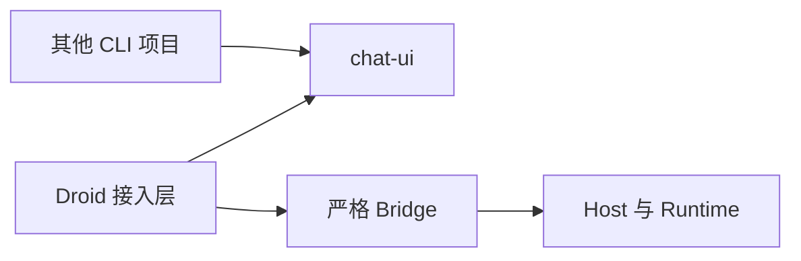
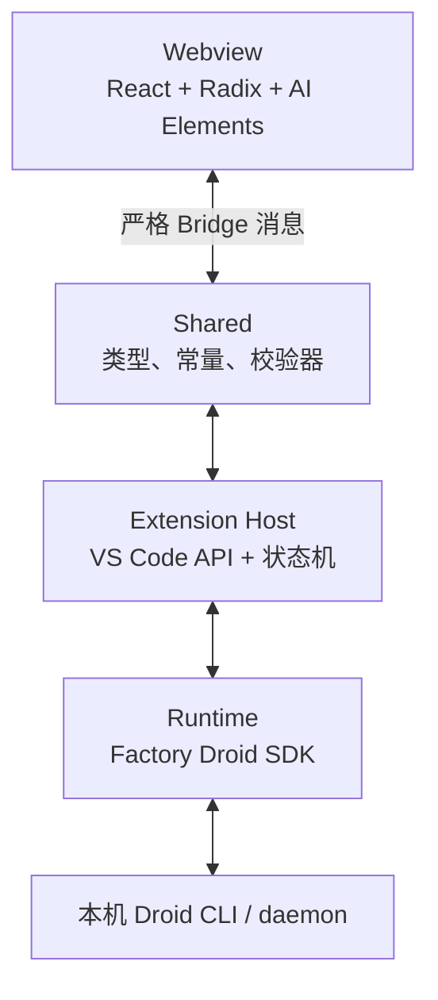
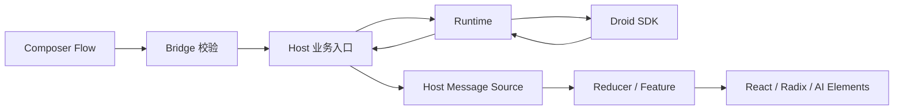

# 架构

多段引用由公共 `chat/selectionQuote.ts` 编解码普通 Markdown 引用块，保留旧单引用
API；业务 draft／queue／resend 仍传完整 text。共享 QuoteChips 仅接展示文本和删除
回调，Runtime／Host 身份不进入公共组件。BTW 的可选 progress 枚举由两种 Runtime
活动事件生成，Host 去重并沿现有 50ms 合并消息链路发布；等待条目先于异步 fork
创建，Stop／失败负责结算，原有正文 delta 和终态协议继续生效。

## 长会话结算与滚动所有权

异步 Changes 结算只能合并对应 turn 的行，持久化之后不得用旧转录覆盖新消息，
也不得把仍运行的新 turn 写成 null。最终文件列表由有效前后快照决定；快照不可用时
才使用已测量路径作降级，未知读取不能当成“零变化”，ignored 且未捕获的内容
不能被假设为空文件。

watchdog 只请求受确认约束的中断。正常流的 Host 终态必须晚于 Runtime generator
及 daemon stream slot 的释放；idle 不代表成功，Stop 超时不代表中断已确认。
恢复轮次没有本地 iterator，仅在后台确认中断后可由恢复控制层完成结算。

公共滚动协调器拥有外层跟随，用户在嵌套代码／Diff 内滚动时停止外层跟随。
显式到底部优先于残留正文选区，最新用户问题实际入场也触发定位；不改历史顺序。
发送／队列编辑信号不直接滚动，暂停状态在布局提交时取消跟随和导航。
被中断活动的自动展开状态按消息／活动保存在公共 Conversation 展示上下文，
不随新回合恢复跟随或虚拟行重挂而折叠。滚动动画以实际位置进展决定是否继续，
向上阅读期间不叠加虚拟行高度补偿。

转录派生按会话保留当前投影，复用未变化的消息分组、回复尾文、操作证据汇总和
导航结构；正文 delta 不再重新解析历史补丁。证据替换、回退和历史重载按输入身份
失效，不缓存工作区快照为 AI 修改。显式跳底使用同一滚动协调器缓动，尺寸变化
不打断正在执行的跳底；会话初始化与 reduced-motion 仍直接定位。

## 发布产物与法律声明

主项目与公共 UI 原创代码采用 MIT，第三方源码保留各自许可证。许可证收集器
位于 `packages/chat-ui/scripts/thirdPartyNotices.mjs`，不反向引用父仓库。
Host、五个 Webview 和懒加载 Mermaid 的构建按 esbuild 实际字节贡献收集依赖，
预处理 CSS 另行记录 Tailwind；KaTeX 字体通过资源贡献计入。
运行依赖在公共 UI ESM 中保持 external，只有实际随包分发的内容进入其生成声明。

构建保留法律注释，收集依赖根目录 LICENSE／COPYING／NOTICE／COPYRIGHT，
对 npm 遗漏许可证的三个固定版本使用包内 `licenses/` 的上游副本。
副本记录来源及版本溯源限制，升级不能自动沿用旧版本例外；无法收集则构建失败。
此门禁不等于完整许可证合规认证，尤其不自动证明预打包依赖的全部来源。
MIT、生成的第三方条款和 PNG 图标随 VSIX 分发，源码、个人配置及日志排除。
发布预备不改变 Runtime／Host／Bridge 权限、恢复或网络行为。

## 独立前端包

`packages/chat-ui` 是可单独构建／打包的 React 19 库 `@droidvisx/chat-ui`。
它拥有公共组件、内容渲染、聊天／只读虚拟列表、选区和滚动、输入框、
问题编辑、回复操作、计划、工具／命令卡、会话列表、侧聊和 Diff 展示。
包的源码和声明不依赖父仓库，Runtime、Host、VS Code Bridge 均不进入公共包。
其他项目的构建、导入与状态接线以包的 README 为准。



`src/webview-v2` 保留 Droid 状态订阅、协议校验、业务 Hook 和专属面板。
接入层将原始工具名称／结果来源、Todo 文本、模式和会话身份转为展示数据；
公共组件只接收 props、动作回调和插槽，不实现另一套运行状态机。
`src/webview-v2/ui`／`content` 的可复用模块及部分旧辅助模块保留薄 re-export，
避免复制两份实现和破坏已有消费者。Mission、Models 配置、权限执行、文件恢复
及 CLI 管理仍由 Droid 项目负责，不通过空实现模拟其他 CLI 能力。

独立构建输出 ESM、类型声明、scoped CSS 和本地数学字体。React 为 peer；
构建拒绝父仓库源码、Node／VS Code／Factory 依赖及未声明的外部运行依赖。
生产五个 IIFE 从同一包源码构建，并检查各入口确实使用公共包。
包的 light/dark 和语义样式由同一份源码拥有，Droid shell 仅映射宿主 Auto 主题。
剪贴板与受 CSP 约束的 Mermaid 加载由环境回调注入，原关联回执／nonce 保留。
公共 UI 包不拥有 Bridge、Mission Panel 协议或 Runtime 历史身份。

## Webview V2 边界

当前主 Bridge 为 48，Mission Panel 协议为 2。IDE 状态／重连通过独立的
`host.ide`、`ide.refresh`、`ide.reconnect` 与快照字段传递。Skills 原生管理和交互终端
只在 Webview 中提供已验证的管理入口，不新增传输正文／路径／终端输入的消息。

五个生产构建入口统一使用 `src/webview-v2/`，输出到 `dist/webview/`。
V2 的 panel store 使用 Zustand，状态转换仍调用同一份
`assistant/state/store.ts`；Composer 业务 Hook 与临时诊断算法已从旧 UI 组件拆开。
共享业务模块仍位于 `src/webview/`，不复制第二套业务 reducer。
旧 V1 组件及其依赖仅保留开发/回归用途，不进入生产包；不批量删除与既有未提交重构重叠的源码。

公共包基础组件使用 Tailwind 4、Radix 和按需适配的 shadcn/AI Elements 源码；
它们不创建模型请求或 assistant-ui runtime。`build:webview-v2` 输出独立
IIFE 和 CSS，拒绝实际打入包内的 assistant-ui、Runtime、Host 及外部模块依赖。
Chat、Models、Mission Control、Session Viewer、Review 共用语义 CSS，独立 IIFE 入口。
主壳订阅控制状态和消息到达，流式正文由独立 Transcript 订阅；切换仍读取最新权威 sequence。

主聊天的 `useTranscriptScroll` 统一协调到底部、流式跟随和问题导航的逐帧写入。
Transcript 提供动态目标位置并限制在真实内容范围内；导航期间屏蔽虚拟器独立补偿，
手动手势和文本选择取消动画。没有第二个平滑滚动所有者，也不修改 Runtime／Bridge。
导航中的虚拟测量位移在布局提交时同步补偿到当前坐标，缓动只负责剩余导航距离，
不让目标位置变化引入反向缓动。

Mission Panel 使用独立协议 2；`navigationRejected` 只携带请求 ID 和固定原因，
由目录 Hook 关联并展示，不进入 Chat transcript store。Mission 控制继续复用
现有 requestId／snapshotRevision，详情面板不持有 Worker Session 身份；
Viewer 按 Host 的唯一身份解析结果投影。启动标志清除后发布权威快照，确保
setup 可用性订阅收到状态恢复。窄窗口聊天／详情切换仅为 Webview 显示状态，
退出 Mission 仍由 Host 工作区状态机负责。

`DaemonApi.terminals` 使用公开 create／write／resize／list／close。
`connectPublicDaemon` 将公开 terminalData／terminalExit／disconnected
转换为独立终端事件订阅，不塞入聊天 transcript；`DaemonTerminalManager`
捕获 sessionId／runtimeGeneration／cwd，Host 通过原生 Pseudoterminal 接收输入、
显示输出。输入写入串行且不自动重试，尺寸变化合并；关闭原生视图不关闭 daemon
shell，会话归属变化断开本地视图。Execute 只读镜像保持独立。

Skills 检查和范围写入复用公开 skills.list／setDisabled。文件路径、正文、
资源和禁用来源仅留 Host 原生界面；SDK settingsLevel 只选择 User／Project，
每次确认后重读身份与项目可用性，并以重读的有效状态报告结果。

`ui/droid-motion.tsx` 提供状态点阵、连接点和加载展示，样式集中在
`styles/droid-motion.css`。各页面传入现有加载／连接／轮次状态，展示层不持有请求、
计时器或新的进度状态；减少动态效果通过 CSS 媒体查询统一处理。

Chat 的 Cursor 参照样式限制于 `.v2-chat-surface`，不覆盖其他工作台布局。
V2 Transcript 复用旧版 `selectPlanAnchors` 从原始 Todo 快照投影最新计划，
`describeTranscript` 使用默认规则排除过程区中的重复 Todo 展示；
活动展开沿用 `ProcessPresentationProvider` 的消息级选择和暂停跟随机制，每项独立保存。
计划锚定创建它的问题卡片底部，原位与吸顶副本共享展开选择。回复操作栏按所属
问题的活跃轮次等待提交、输出和停止完成，不由单条工具的结束状态提前触发。
行内路径由共享 Button 的链接载体
呈现，阻止默认导航后调用现有 Host 文件动作；上述调整不增加 Bridge 字段或运行时能力。

最终设计及功能对齐门槛见 `PLAN.md`；以下四层、安全与业务权威约束继续有效。

## 四层结构



### Runtime：`src/runtime/`

- 适配 `@factory/droid-sdk`
- 创建或恢复 Session，发送回合，处理中断、Rewind、Fork 和 Compact
- 把 SDK 事件归一化为内部 Runtime Event
- 不 import `vscode`

关键文件：

- `FactoryDroidRuntime.ts`
- `events/normalizeSdkEvent.ts`
- `events/runtimeInteractions.ts`
- `catalog/FactorySessionCatalog.ts`
- `session/`、`process/`、`capabilities/`、`tools/`、`subagents/`
- `history/`
- `daemon/`

### SDK 通知与命令边界

- `extension/ide/officialIdeConnection.ts` 准备当前窗口官方原生 IDE 服务。
  `windowDaemonPool.ts` 为每个主聊天分配独立 daemon 与 IDE relay，窗口后台只
  处理全局元数据；`windowDaemonRegistry.ts` 持久化实例及根会话归属，兼容旧记录。
  `routedDaemon.ts` 按实际会话路由，侧聊与原生子任务继续使用父后台。
  首次归属发现保留全局重复 worker 检查，但整批共用监听表／进程身份查询，连接和
  开放会话查询各最多 6 并发；并发消费者共享本轮扫描，分配仍按各自 attach 意图决定。
  不把活进程不可达或身份未知视为可新建，仅清理已确认死亡且 PID／端口仍匹配的记录。
  消息历史由元数据 daemon 直接读磁盘，不扫描或加载所属 worker；路由对象立即可用，
  元数据预热、历史与主会话启动并行，模型目录也不再排在 IDE 握手之后。预热完成事件
  仍等待真实元数据连接，`daemon.discovery.finished` 记录数量与耗时，不含会话正文。
  `persistedSessionMessages.ts` 为本机已核实的 version-2 私有 JSONL 提供只读快路径：
  固定起始大小、分块读取并验证头部／文件身份，复用公开 SDK 父链修复，按 CLI
  规则转换内容、替换重复 ID 后进入同一受限投影。未知格式或无法确认的读取回到
  原 daemon 分页，不写入会话文件，也不因快路径改变历史的完整／部分状态语义。
  Host 仍在权威历史与会话握手共同完成后提交恢复状态和开放发送；
  `host.perf.activation-ready` 记录该边界，不等待后续 context 元数据。
- `runtime/ide/nativeIdeRelay.ts` 仅在 127.0.0.1 上透传官方 MCP 协议，不拼接
  编辑器上下文，不记录消息正文。专属后台首个原生 Droid 客户端被固定为根连接；
  子客户端不能覆盖其身份。initialize、initialized、工具发现及初始编辑器通知
  完成后才报连接。根 GET 短暂中断由 `recoverableIdeEventStream.ts` 在保留下游
  通道的前提下有限续接，只转发完整 SSE 帧并使用最后已交付事件 ID；不重放 POST。
  恢复 HTTP 连接不伪造原生心跳；心跳过期、会话拒绝或续接耗尽才终止原通道。
  迟到但完整的初始化可恢复握手超时状态，已拒绝的发送不重放。活动根流独立追踪，
  旧流关闭不会覆盖新流。DELETE、dispose 及明确握手失败仍为终止。
  Pool 从 relay 创建时记录静态状态、原因与耗时，不采集 MCP 正文或认证头。
- daemon 明确通知根会话 `session_inactivity` 时，Pool 在转发通知前重置该会话
  relay 的根连接代际；旧请求的关闭、心跳及握手结果不影响新代际。空闲期间
  不运行握手倒计时，新根 initialize 或实际等待就绪时才开始有界等待。
  这也覆盖 Context 等元数据 RPC 先于用户发送而自动加载 worker 的情况。
- `ideSessionHandle.ts` 在发送前先调用 SDK `ensureSessionLoaded` 恢复原 daemon
  上的原会话；失效的空闲 IDE attachment 自动重建，再等待完整握手。逻辑 handle
  保留原订阅和权限回调，Pool 只持有实际物理 handle；随后只提交一次用户消息。取消只
  结束当前等待，不取消其他读取共享的 SDK 加载，也不会在加载完成后补发。
  Bridge 48 将连接／断开／失败实时投影到 IDE 控件，不使用端口存在或日志作回执。
  空闲历史会话在保留持久化内容、确认无活动任务及受管终端后迁移到专属后台。
  Reload 的活跃任务继续留原实例，空草稿不通过关闭迁移；显式重连保留历史、
  附件和队列，尚未就绪时不偷偷发送缺少 IDE 上下文的问题。
  恢复后的工作状态明确 idle 时，Host 按 Runtime 代际自动尝试一次重连；初始化
  尚持有会话锁则记录意图，在解锁边界消费。关闭源前重新核对任务树、终端及会话
  身份，安全条件不足正常延后；队列等待重连完成，失败或延后保留队列并暂停。
  重连结束负责释放自身会话锁，不以旧 Runtime 代际判断锁的归属。
- 同一 owner 的 relay 断线／错误也可触发空闲 attachment 重建，复用原安全条件，
  新 handle 返回前等待完整 IDE 握手。idle worker 等待正常重载与失效客户端分开处理；
  原生客户端明确失效／心跳过期后不凭迟到心跳恢复，短暂 SSE 结束优先原通道续接。
- 手动 `runtime.retry` 携带失败轮次标识；activation 确认恢复和 IDE 就绪后，仅解除
  对应当前失败并写入恢复检查点，保留 transcript，不重发用户消息。
  Windows 会话租约文件的原子替换在原独占锁内有限重试共享冲突，保留旧记录。
- `daemon/daemonNotificationSource.ts` 统一 process/daemon 子代理通知的解析、工具结果
  采集和事件转换。Host 只接收 `SubagentEvent`，不再读取 SDK controller 或调用 SDK converter。
- `daemon/connectPublicDaemon.ts` 直接持有 SDK 0.7.0 公开导出的
  `DaemonSessionController` 与 `MultiSessionStateManager`，不再读取
  `.sessions.controller`，也不创建第二条竞争连接。
- `transportRecovery.ts` 区分 SDK 正在恢复与最终失败；认证成功后重新加载保留的
  根会话和原配置，再解除发送／交互等待并通知子会话重附。凭据在认证时重新读取。
  泛化 SDK error 不再永久污染连接状态；恢复有独立 45 秒总时限，不依赖 socket
  刚打开就重置的重试计数。已提交轮次不重发、不因断流自动中断，Host 保留原 turn
  和 messageId，立即补齐历史并按约 2 秒间隔跟踪；真实终态按对应调用身份保留，
  断线期间确实缺失的终态明确标记未确认，不从 idle 推断模型成功或编造用量。
- 子代理映射先接实时事件，历史在旁路补齐；提前到达的 child_available 等待父行。
  历史保留有效原始 toolUseId，消息 turnId 按 sourceSessionId／messageId 生成，
  快照与实时行按身份合并，不按相似文本认领。加载中与加载失败分离；当前证据
  限制留在 Review，旧的瞬时映射／历史提示不作为永久聊天记录恢复。
  子代理结果按调用 ID 恢复 SDK 转换后缺失的工具名，再进入同一有界预览投影；
  工作区外只读目标仅显示文件名与外部标记，不生成可打开路径或扩大内容预览。
  `startedAt` 来自通知 timestamp／账本 createdAt，贯穿 Runtime、Host、Bridge 和
  历史解码；未知时间保持缺失，最终时长仍以已报告 durationMs 为准。
- `parentSessionEvents.ts` 被动观察会话通知，仅自动系统回合使用完整流式投影。
  `ParentFollowup` 复用 Host 原有回合处理、停止与恢复流程，不提交新 prompt；
  前台与自动回合交叠时有界暂存，代际变化或溢出改走历史恢复。正常前台内容不
  重复解析。后台账本核对随任务状态结束，不在 10 分钟后丢弃仍运行的任务；
  `parentFollowupHistory.ts` 仅负责遗漏事件的最终补齐，读取中出现新回合则延后合并。
  历史加载附带 Host-only `messageAncestry`，仅保存有界消息 ID／parentId／投影
  身份和请求边界；恢复时沿隐藏请求父链映射原 UI 回合，涵盖断流未见的工具与
  Diff，遇新 user／system 请求停止继承。没有额外 I/O，隐藏正文不跨 Bridge。
- `daemon/api.ts` 仅暴露生产消费者使用的资源。`sessionHandle.ts` 管理唯一 attached
  handle、metadata 和 replacement；`permissionDispatch.ts` 管理权限/AskUser 的
  原会话及关联父会话路由，缺失或失败的 handler 默认取消。
- `sessionStream.ts` 使用 SDK converter、schema 和 `StreamStateTracker`，项目只管理
  一次提交的迭代队列、匹配 turn completion、abort、中断和监听释放。detach 不关闭
  backend，关闭失败不冒充释放成功。SDK 仍负责 transport、RPC、重连和协议转换。
- 连接更换时解除旧监听；历史子代理不因注册而额外 attach，实时 child 使用同一连接。
- daemon session 的命令目录使用同一连接的 `commands.list(sessionId)`；
  process 继续通过短命公开 client 读取。两者共用有界命令行投影。
- `FactoryDroidRuntime.adoptSession` 统一 replacement 元数据更新和子代理监听重绑，
  保留各 adapter 自己的 rewind/compact/fork、lease、detach 与 close 语义。
- 已检查 npm 的 0.9.1 发布物声明，其高级 daemon facade 仍无所需公开通知订阅。
  本项目继续锁定 0.7.0。在线示例、SDK 发布物和 CLI 能力分别核对，不以新版文档
  冒充安装版 API；未进行跨版本真实 CLI/daemon 兼容验收。daemon MCP OAuth 通过
  独立管理链订阅实际 sessionNotification，支持原生回调输入、state 校验与取消，
  仅在 SDK 报告完成后成功；不把 raw notification 的存在视为已认证。

### Extension Host：`src/extension/`

- 唯一允许使用 VS Code API 的业务层
- 持有当前 workspace、conversation、backend session、turn、transcript 和 sequence
- 拒绝旧 Runtime、旧 Session 和旧 Turn 的迟到结果
- 负责文件、Diff、日志、恢复存储和 Webview 生命周期

关键文件：

- `extension.ts`
- `chat/ChatController.ts`、`chat/dispatchChatMessage.ts`
- `webview/DroidViewProvider.ts`
- `panels/mission/MissionControlPanelController.ts`
- `recovery/SessionRecoveryStore.ts`
- `interactions/pendingInteractionCoordinator.ts`
- `attachments/`、`changes/`、`review/`、`workspace/`、`terminal/`、`diagnostics/`

### 独立 Models 管理

- `shared/protocol/modelManagerProtocol.ts` 定义独立版本 2 的 exact-key 请求、快照与
  关联结果。主 Bridge 的 `models.open` 仅打开面板，不进入聊天 reducer。
- `extension/models/ModelsPanelController.ts` 持有编辑器、主题和操作取消生命周期；
  原生确认用于删除与计费验证。请求结果前刷新列表，错误不销毁页面草稿。
- `ModelManager.ts` 串行协调注册表、daemon 配置和发现；模型清单始终来自 Droid，
  不覆盖整个 settings.json。密钥经 Host 输入与 SecretStorage，在最终调用时交给
  daemon/发现请求，不进入新面板协议。
- `modelProjection.ts` 使用完整协议/URL 归组；以配置与目录两侧唯一显示名及协议
  匹配实际 Droid ID，不从 rawIndex 构造 ID。目录命中不等于上游调用成功。
- `webview/models/providerGroups.ts` 仅按 URL host 组织服务商展示组，接口身份仍为
  协议＋规范化完整 Base URL。组内选择留在 Webview，不调用聊天模型应用路径。
  ProviderRegistry 在 `droidvisx.modelProviderAliases.v1` 单独保存 host 别名；
  接口别名沿用连接元数据，纯改名不重写模型或密钥。模型别名通过独立 renameModel
  请求调用既有 daemon upsert，保留其余配置，名称唯一性仍由当前目录映射要求约束。
- `modelChatApply.ts` 在无任务、队列、权限、Mission 和设置操作时复用 resume，
  等待目录和设置就绪后更新 modelId，最终读取权威确认并检查会话身份。
- `runtime/models/modelManagement.ts` 通过既有公开 daemon facade 读写模型和目录，
  验证用空临时目录、独立私有会话和固定提示，不带入当前聊天历史；
  权限/AskUser 默认拒绝，工具调用中断并判失败。结束时 close/archive/rm，
  清理失败不报验证成功。公开 SDK 没有完整工具白名单/Hook 隔离，不是系统沙箱。
- `webview-v2/models/` 独立构建 `models.js`，使用共享 `webview.css`；不依赖 Runtime 或 Host。
  `dev/ModelsPreview.tsx` 仅提供模拟交互，不进入生产包。旧聊天模型管理消息保留，
  当前 Add Model 入口不再使用旧替换聊天页。

### Droid 能力管理

- `management/DroidManagement.ts` 提供 `droidvisx.manageCapabilities` 原生管理命令；
  Webview 只发送 exact-key `capabilities.manage` 入口消息，安装来源和 OAuth
  回调材料留在 Host。现有 daemon MCP Authenticate 入口绑定请求 sessionId 后
  路由到同一管理流程；Process 继续原认证通道。
- `runtime/daemon/resources.ts` 转发安装版公开 controller 的 Plugins、Marketplaces、
  MCP、默认设置、终端列表／关闭和更新方法；沿用唯一 Runtime-owned daemon 连接。
  SDK 负责实际配置写入、终端关闭、更新与认证，Host 不直接改 settings.json。
- `management/plugins.ts` 按 ID＋scope 重新确认目标与受管限制；更新逐项检查结果，
  失败不伪造回滚。`management/defaults.ts` 按公开请求字段修改默认值，受管字段
  和嵌套字段先检查，最终以 SDK success 为准。
- `runtime/daemon/mcpAuthentication.ts` 订阅匹配 Session／server 的通知，先监听
  再启动认证；原生回调 URL 必须匹配 state 与公开的 redirect_uri。代码接受后仍
  等待完成通知；取消／超时调用 cancelAuth，清理订阅与原生输入框。不开私有端口，
  不读取 Cookie 或账号 Token，不把 OAuth URL、state、code 写入日志和 Bridge。
- 管理动作捕获 sessionId、runtimeGeneration、cwd，切换后不继续变更旧目标；
  写入要求受信任工作区和空闲会话，原生确认提示可执行插件、凭据清理、终端中断、
  云同步上传或共享更新的影响。已经送出的写入不能因取消而声称回滚。

### Host 状态与操作所有权

- `chat/capabilities/sessionMetadataState.ts` 持有 settings/update token、context/generation、
  model catalog、token usage、commands cache/refresh generation 和 MCP auth timer。
  会话重绑及 dispose 通过该 owner 结束相应在途状态。
- `chat/capabilities/metadataPorts.ts` 分别限制 settings、capabilities 和 MCP 模块可访问的状态与
  操作。它们不再依赖 `ChatControllerInternals`，不能修改 queue、attachments、turn
  或 runtime replacement 字段；工作区检查和 Mission setup 联动通过 Host 方法连接。
- `chat/sessions/`、`turns/`、`attachments/`、`queue/`、`recovery/`、`mission/`、
  `subagents/`、`models/` 各自保存状态对象、实现和窄接口。纯读取字段使用 readonly
  view，写接口只列实现需要修改的字段；不再存在 `ChatControllerInternals = ChatController`。
- `chat/hostOperations.ts` 声明注入服务；`chat/chatEffects.ts` 仅在组合根绑定跨域操作，
  各 feature 通过明确的 `Pick` 使用，不得到完整 controller。根 dispatcher 是业务消息
  装配点，sequence/listener 仍由 `ChatController` 管理。
- `SessionLifecycleState` 私有持有关闭中的 Promise 和已关闭 Runtime 集合，保证重复
  关闭合并、失败可重试。session lifecycle 协调激活/替换，queue 保留顺序与暂停语义，
  recovery 只在当前窗口保留活跃转录，持久化扩展专属元数据，聊天历史由 Droid 提供。
- `MissionGateway` 在 attachment 转交 Runtime 前持有 provisional 所有权；创建后的
  配置或初始化失败统一 detach，成功交接后不释放，不替用户关闭 daemon backend。

### Conversation Recovery

- `SessionRecoveryStore` V2 以可见 `conversationId` 为唯一 owner
- backend `sessionId` 只标识当前 Runtime node；Compact/Handoff 追加 successor，
  Fork/Rewind 创建新 Conversation
- Store 保存会话选择、节点关联、有界轮次／workspace Changes 索引、操作序列、
  未发送队列和恢复标识；V3 额外保存有界操作 Diff 证据与执行阶段，不缓存整份
  聊天正文、原始工具输出或图片。兼容 V2 元数据，不将旧输入片段升级为执行证据；
  旧 display payload 仍不作为历史正文来源，已有工作区 Diff 快照保留。
- 激活／切换不提前显示旧快照；等待 Droid 历史与 Runtime 就绪。Compact/Handoff
  根据本地节点关联从 Droid 逐段加载历史，沿用转录预算；加载失败明确报告并允许重试。
- 历史通过 SDK 用户消息 ID 接回本地轮次与 Diff 索引；聊天正文不再与缓存按位置合并。
  当前窗口的实时转录保留在内存，后台恢复刷新同样以 Droid 历史为权威。
- 元数据读取没有写副作用，普通文本流不触发整份转录的校验／拷贝／持久化。
  旧 conversation-images 文件不再读取、写入或跨工作区清扫，本次不主动删除用户文件。
- Host Snapshot 同时发送 `conversationId` 和 `sessionId`；Webview 用前者决定保留
  Conversation-scoped state，用后者校验 Runtime 命令和迟到事件

### 轮次快照与 Review
- daemon 的 Branch／Workspace 由 `runtime.readGitDiff({ includePatch: true })`
  提供文件、统计与完整补丁。Runtime 将 `committedDiff` 映射为 Branch，
  将包含暂存和未跟踪文件的 `unstagedDiff` 映射为 Workspace；
  不把总体 `localDiff` 当作 HEAD → 工作区。该语义已在 SDK 0.7.0／CLI 0.218.2
  的隔离仓库验证，不作为未经验证的其他版本保证。
- `review/reviewSdkDiff.ts` 只在本地解析固定 Git 基线；列表和默认三行上下文
  不重新执行 Git Diff。扩大上下文／原生 Diff 从该基线应用 SDK 补丁还原
  两侧内容，不读取可能已更新的工作区正文来替换 SDK 的 after 版本。
  补丁不完整、二进制或基线不匹配时明确不可用。补丁仅存于活动 Review 内存，
  不进入聊天恢复存储；标记已审阅前重新读取 SDK 范围核对版本。
- Staged／Unstaged 仍由 `reviewGitComparison.ts` 计算 HEAD → Index／
  Index → 工作区；官方 `unstagedDiff` 与后者不同。Process 明确不支持 Git RPC
  时保留本地 Workspace；daemon 请求失败不静默回退本地计算。
- 活跃轮次在 before 就绪后订阅当前 Runtime 根目录的文件事件；工具结果与命令
  写入共用有界候选队列，经原始基线核对后发布，不将候选路径直接当作变更。
  完整快照结算只取树差异；缺快照时仅允许独立测得的基线差异，不使用 HEAD。
  监听随轮次／Runtime 关闭释放；Reload 不覆盖已有 before 快照。

- `changes/turnSnapshots.ts` 使用独立 index 和对象目录捕获 before/after Git tree。
  非 Git 根目录在扩展存储内初始化私有 bare 仓库，以有界文件枚举和忽略规则捕获
  嵌套项目真实字节，不触碰项目 index，也不向工作区写入 `.git`。
- 对象目录位于 `context.storageUri`；旧全局对象仅作为读取来源。空元数据不清空
  对象目录，避免工作区之间误删；仍保留对象总大小上限。
- 新回合在 `runtime.sendTurn` 前等待 before 捕获边界完成；捕获失败仍明确不可用，
  不回退 HEAD。后续命名文件捕获仅补齐原先被忽略的路径，不覆盖已有普通文件基线。
- `review/reviewTurnScope.ts` 区分 writing、完整 settled 和缺失快照；
  writing 读取实时工作区 ledger，settled 正文只读固定树；它们不证明作者，也不能
  用于撤销 AI 操作。独立 `operations` scope 按实际工具结果读取不可变操作证据，
  `reviewPanel.file.recordedOperations` 保留来源、逐文件 outcome 和错误提示。
- `shared/protocol/operationDiff.ts` 按 hunk 比较前后文本，过滤纯上下文与相同替换，
  保留元数据变化；同一规则用于新证据和旧证据消费者。Host 通过
  `review.state.recordedOnly` 明确只读历史模式，UI 不从错误文字猜测可用操作。
  `operations` scope 的该标记只说明正文来自记录，动作仍由逐文件资格决定。
- `runtime/tools/operationResult.ts` 校验 Edit 结构化 diffLines 与 ApplyPatch files，
  按原调用路径核对结果，不把省略标记当作正文；Create 成功只确认操作路径，
  不伪造旧内容。原始 execution-phase 通知经有界 buffer 在 tool-start 后投影，
  许可、执行与成功保持独立。工具私有格式不支持时明确不可用。
- 子操作只在父工具 ID／实时关联确认后归入父回合；描述 FIFO 匹配仍可供 Viewer
  导航，但不能证明 AI 操作归属。子历史缺失／部分／关联歧义明确提示并阻止撤销，
  使用实际 sourceSessionId 与 callId 去重，异步结果不改绑新回合。
- `reviewOperationScope.ts` 只对完整、确认、可逆的修改补丁进行严格反向应用；
  拒绝模糊定位、重叠、未知结果、跨会话顺序不明、编码／换行边界不完整等情况。
  `operationUndoFiles.ts` 在写前保存有界恢复日志，核对路径、文件身份和当前字节，
  拒绝链接／多硬链接及未保存编辑；恢复只在当前内容仍为原值或计划结果时进行。
  旧格式／异工作区／冲突日志保留待处理，不宣称具备跨外部进程的原子事务。

### 有界工具结果

- `runtime/tools/toolResultPreview.ts` 只接受原生 Read/Grep/Glob/LS 的完整调用上下文，
  从实际文本返回有界提取；历史与实时共用规则，不发送原始参数、图片或完整日志。
- `shared/transcript/toolResultPreview.ts` 定义可选片段、来源和不可用原因；每条 8,000 文本单位/
  120 行，每个 Conversation 128,000 文本单位，独立于答案文本预算。
- Host、恢复、历史补齐与 Webview 使用同一淘汰规则；只删除较早片段的文本，
  保留工具行及调用来源的淘汰标记，不把片段淘汰标为对话历史不完整。
- 片段只存在于当前窗口转录，重新打开时从 Droid 工具历史按同一预算重建；
  不以扩展缓存补齐原始调用结果，历史未提供的片段保持不可用。
- Activity 只派生当前 session/turn 的等待状态；详情按需挂载，展开状态以
  Conversation 为范围，不写回 Host。只读子代理复用显示链路而不获得写操作。

### Context 压缩进度

- `runtime/capabilities/contextWindow.ts` 消费 daemon 的最近一次模型调用统计和当前模型的压缩
  阈值，按已核对的 CLI meter 规则投影；不把字符估算或累计消耗当作当前压缩用量。
- `shared/protocol/contextState.ts` 保存调整后的 used/limit、零下限 remaining、独立可选
  estimatedTokens，以及尚未报告用量的状态；估算值不控制 meter 可用性。
- Host 与 Bridge 保留同一数值语义；UI 仅限制视觉百分比，不截掉真实超阈值计数。
  自动压缩仍归 Droid，扩展只转发明确的手动 Compact 操作。
- SDK 0.7.0 未提供 meter 的系统提示调整常量；当前适配依据是本机 CLI 0.212.0，
  未来 CLI 变动需复核，不把一次采样当作跨版本保证。

### Shared Bridge：`src/shared/`

- 只包含纯类型、常量、校验函数和无副作用的 transcript 算法
- 当前主 Bridge 版本：`47`
- Inline Diff 明确区分 not-found（两侧均不存在）与 unavailable（基线不可用），
  不将不存在的候选文件归因为快照丢失。
- Runtime 将 SDK 明确的 CompactingConversation 阶段投影为可选 compacting 布尔标记，
  经 CurrentTurn、turn.state、host.snapshot 及严格校验进入 Webview；工作状态切换
  或终态清除。此字段只影响阶段展示，不改变 agent_turn_completed／result 的完成权威。
- `rewind.info` 在原始计数及工作区路径之外提供有界 `details` 和 `evictedCount`。
  Runtime 为工作区外文件仅保留 basename 与位置标记；Webview 明确动作和省略数量，
  Host 拒绝旧 Runtime／目录迟到结果，诊断只记录数量，不记录文件名或正文。
- 操作级 Diff 由 Runtime 在完整原生调用及成功结果边界提取有界片段，
  `operationDiff` 随 ToolActivity → transcript → Conversation recovery 保存。
  它标明成功工具输入来源，不能视作执行前后原子快照。实时／历史复用同一提取器，
  原始 callId 将历史重建片段关联到 canonical 调用，替换缺失标记，不回填累计 Diff。
- 剪贴板使用独立 `clipboard.write/result` 有界契约；各 Webview Host 接收入口
  调用原生剪贴板并返回同一 requestId，前端不通过 DOM 选区或编辑器命令复制。
- 独立 `ReviewPanelController` 绑定当前会话和工作目录，使用 `review.js`。
  ReviewCoordinator 仍是审阅与恢复权威；文件选择不自动打开原生编辑器。
  `reviewGitComparison` 固定 HEAD／Index tree／merge-base，文件读取共享相同比较版本；
  `reviewPanelProtocol` 有界传输按需正文，界面按请求身份拒绝迟到响应。
  Git Commit 复用 Host 工作流，提交前后均检查未选中的暂存路径。
- Review 元数据保留完整文件清单，Host 与 Bridge 不再静默截断／拒绝第 201 项；
  正文仍按选中文件和字节预算读取。操作刷新按 session／turn 合并待执行任务，
  运行期间的新证据排到队尾，保留用户选择与最终状态。整轮撤销最多 200 文件，
  预览和写入前明确拒绝超量范围，不执行部分撤销。
- 公共 ReviewFiles 超过 200 行时按可见范围渲染，键盘导航与焦点保留在共享 UI hook；
  Diff 超过 128 行时按 64 行延迟首次挂载，高亮只随附近块执行。标题保留以支持
  hunk 定位，已挂载正文不卸载；统一视图预先测量完整横向宽度，分栏保留原生换行。
- 聊天内 Diff 使用 `file.readDiff` / `file.diff` 按需交换有界 hunk 正文；Host 从
  已归属回合的路径和 TurnSnapshotStore 读取 before / after，live 右侧读取当前磁盘。
  Webview 校验结果并按 Session、Turn、Path、Request 隔离临时展开状态，不写 transcript。
  `file.openTurnDiff` 将同一基线内容交给原生 Diff 的虚拟文档入口，不回退 Git HEAD。
- `changes.update` 只维护累计清单与统计；`file.diff.invalidate` 在已归属文件
  测量后定向通知正文失效，即使行数未变也可刷新。通知不持久化、不作为写入证据。
  writing Review 通过原有串行队列仅重算受影响文件版本，保留其他版本和当前选择。
  Chat 按路径、Review 按当前文件版本触发各自预览队列；一个预览只保留一个有效
  在途请求，连续失效合并为后续读取，超时／切换丢弃旧响应。结算强制读取固定 after；
  刷新保留旧正文并显示状态，失败显式提示及重试，不把旧结果当作最新审阅内容。
- 每种消息都有封闭类型、长度上限和 exact-key 校验
- 不依赖 React、VS Code 或 Droid SDK

关键文件：

- `bridgeMessages.ts`
- `validateMessage.ts`
- `protocol/`：按附件、交互、设置、会话、回合、工作区及功能协议分域
- `validation/`：入站 parser 与信任边界 guard
- `transcript/`：有界工具字段、pending activity 结算、尾部诊断去重和显示预算

`bridgeMessages.ts` 保留顶层联合与兼容导出，`validateMessage.ts` 保留可穷举入口。
Webview 出站 parser 在 `bridge/host/` 按域组织。Host 与 UI 共享纯更新算法，
但各自保留 canonical/optimistic ID、顺序、终态和预算处理，不互相调用 reducer。

### Webview：`src/webview-v2/` 与共享 `src/webview/`

- React 19、Tailwind 4、Radix、AI Elements 展示组件和 Zustand
- 只消费经过校验的 Bridge DTO
- 不直接访问 Droid SDK、文件系统或网络
- reducer 只接受 sequence 递增且身份匹配的消息

关键文件：

- `webview-v2/chat/ChatApp.tsx`、`store.ts`、`Transcript.tsx`、`Composer.tsx`
- `webview-v2/models/ModelsApp.tsx`
- `webview-v2/mission/MissionControlApp.tsx`、`MissionWorkspace.tsx`
- `webview-v2/viewer/SessionViewerApp.tsx`
- `webview/assistant/state/store.ts`、`webview/bridge/validateHostMessage.ts`

### Webview 输入和呈现边界

- `shell/hostMessageSource.ts` 维护共享的 window message 入口并使用现有协议 parser；
  `shell/useHostMessageFlow.tsx` 保留主聊天 rAF/50ms 批处理、握手、主题及路由处理。
  一个批次只 dispatch 一次；`state/hostMessageBatch.ts` 合并连续同身份的流式增量，
  首条单独处理以保留消息 ID，不跨生命周期事件或非递增序号。页面恢复可见时立即
  flush 并取消旧调度，避免隐藏页积压逐 token 重放造成长历史的重复扫描。
  Custom Models、Subagent 各自保留身份和状态规则，不把它们的所有 payload 放进根 reducer。
- `composer/useComposerFlow.tsx` 持有草稿、发送锁、发送/队列/slash 操作和 composer 命令同步；
  文本替换、清空和持久化共用入口，队列编辑期间持久化原普通草稿。
  设置更新阻止直接发送；Host 通过既有 `turn.error` 的 `turn-send-rejected` 代码
  关联未接受的请求，输入版本未变化才恢复被拒绝的草稿。Session、Workspace、Capabilities、Message actions
  分别在专属 Hook 中组合，V2 `ChatApp.tsx` 负责顶层状态、页面和 provider 装配。
- `state/store.ts` 只负责 sequence 入口、身份路由和 reducer 装配；snapshot、
  optimistic intent、capability、workspace、interaction、turn 更新有各自模块。
  身份判定集中在 `state/turnIdentity.ts`，不把 sequence 守卫分散到组件。
- `thread/threadProps.tsx` 定义 transcript、messageActions、slots；
  `composer/composerTypes.tsx` 与 `editing/editTypes.ts` 持有各自输入契约。
  Thread 直接传递 composer 对象，不再拆开再转发几十个参数；`SlashCommandPopup`
  负责菜单视图，输入状态仍属于 Composer。
- `thread/messageContexts.ts` 独立于 Thread 组件，深层工具行不反向依赖组装它们的
  Thread；Git、图片、子代理、模型页保持各自 Context，不引入一个全 App Context。
- `attachments/attachmentIngress.prepareAttachment` 统一两个输入面的图片/PDF/文本读取、限制和错误
  提示；预览缓存与 Host staging 仍由调用者管理。
- `images/localImageSource.tsx` 合并同路径 pending 请求并在响应时结算；字节缓存继续遵守
  reducer 的 24 项限制。可见访问触发读取，淘汰时不反复自动请求，离开后重入可重取；
  会话切换重建请求协调器，不把旧响应当作新会话结果。
- 共享 Markdown 对较长的流式正文和静态历史完整解析 GFM、数学及引用定义，
  不按空行切割文档。每个 Webview 共用一个 Worker 和公平队列，各正文只保留
  一个在途解析并合并后续追加；切换正文身份时重置节点差量，避免串用解析结果。
  Worker 逐顶层节点比较精确序列化结果，只回传变化节点，主线程复用未变节点。
  完整解析得到的顶层节点分批挂载，全部呈现后才清除等待状态；不截断源文本。
  活动流保留空闲线程以便追加，完成／替换／卸载释放自身任务，队列和活动流均
  为空时终止线程。短正文及无法创建 Worker 的环境保留同步解析，解析错误明确抛出。
  解析线程不持有 Host／Runtime 状态。
- Droid 适配层按 `turnId` 汇总已确认的工具结果，以会话／调用身份去重并合并文件路径。
  进行中的 `FileChangeView` 与完成后的 `ChangeSummaryView` 只接收展示数据及回调；
  不改变 Runtime 操作账本。累计行数来自记录补丁，工作区快照不参与 AI 归因。
  Review 的可选打开意图 `action: undo` 仅限整轮 operations；Host 在本次打开之后
  的队列屏障消费一次文件定位／撤销预览，绑定打开代际并复用现有确认写入流程。
- 历史虚拟行在 Markdown 等待期间保留已知行高；导航等待异步内容的最终布局，
  通过布局／状态变更唤醒，不持续轮询。用户手动滚动仍立即取消导航和跟随。
  Worker 源码在包、生产及 Vite 构建中静态内联，Webview 仅增加 `worker-src blob:`，
  保留原脚本 nonce、零网络和原始 HTML 禁用规则；独立解析产物依赖也纳入许可证清单。

### 目录与可读性约束

- 以功能组织实现、类型、状态与测试，不使用跨功能的全局 `hooks/utils/components` 桶。
- Extension 根只保留 `extension.ts`；assistant 根保留 App 与其集成测试及样式入口。
  目录移动同时更新调用者、测试 mock、构建和脚本路径，不留下空壳兼容文件。
- 文件预算仍为 TS/TSX 900、CSS 800、测试 2000 行。已拆开的文件移出 allowlist；
  剩余两个生产超限文件是 `runtimeLifecycle.ts` 934 行与历史 projector 953 行，
  ceiling 已收紧，不以切碎生命周期链条换取行数达标。
- 静态结构和自动测试不证明真实交互或性能更快，Reload、长会话、滚动和视觉由用户验收。

## 不可破坏的边界

1. Droid 是 Session、模型、工具、权限和认证的唯一权威。
2. Webview Bundle 不得包含 SDK、Runtime 或 Extension Host 代码。
3. Webview 不发网络请求，不接收凭据、原始工具参数或敏感输出。
4. Host 和 Webview 两侧都校验消息。
5. 共享上限只定义一次，消费者不得复制数字。
6. 异步结果必须绑定 workspace、conversation、session、turn 和 generation。
7. 无能力时 fail closed，不能使用样例数据；已知非公开兼容点必须集中隔离并说明限制。

## 一次消息的路径



## 构建

```powershell
pnpm run typecheck
pnpm run lint:budgets
pnpm run build
pnpm run package:vsix
pnpm run verify:vsix
```

`esbuild.mjs` 检查 Extension external 边界，并调用 `buildWebviewV2.mjs --production`
统一生成四页资源。V2 构建拒绝 assistant-ui、Host、Runtime、SDK、外部模块，
Mermaid 仍为独立延迟脚本；Chat 与 Viewer 从各自入口继承同一 nonce，不放宽 CSP。
