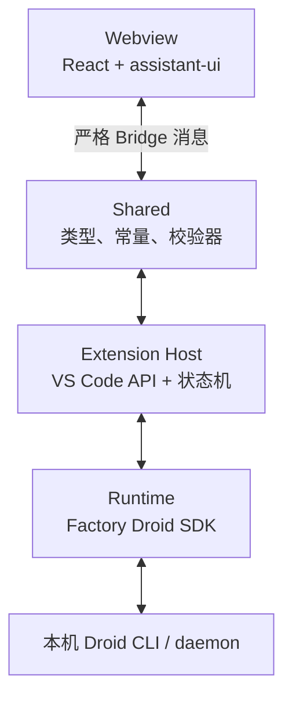

# 架构

## 四层结构



### Runtime：`src/runtime/`

- 适配 `@factory/droid-sdk`
- 创建或恢复 Session，发送回合，处理中断、Rewind、Fork 和 Compact
- 把 SDK 事件归一化为内部 Runtime Event
- 不 import `vscode`

关键文件：

- `FactoryDroidRuntime.ts`
- `normalizeSdkEvent.ts`
- `runtimeInteractions.ts`
- `FactorySessionCatalog.ts`
- `history/`
- `daemon/`

### Extension Host：`src/extension/`

- 唯一允许使用 VS Code API 的业务层
- 持有当前 workspace、conversation、backend session、turn、transcript 和 sequence
- 拒绝旧 Runtime、旧 Session 和旧 Turn 的迟到结果
- 负责文件、Diff、日志、恢复存储和 Webview 生命周期

关键文件：

- `extension.ts`
- `ChatController.ts`
- `DroidViewProvider.ts`
- `MissionControlPanelController.ts`
- `SessionRecoveryStore.ts`
- `pendingInteractionCoordinator.ts`

### Conversation Recovery

- `SessionRecoveryStore` V2 以可见 `conversationId` 为唯一 owner
- backend `sessionId` 只标识当前 Runtime node；Compact/Handoff 追加 successor，
  Fork/Rewind 创建新 Conversation
- Store 保存 canonical Display Snapshot、稳定 logical Turns、独立 settled Changes
  ledger、bounded operation log 和 managed image artifact references
- 激活先恢复 durable Display Snapshot，再并行加载 catalog、history 和 Runtime；
  daemon history 只允许 append/enrich，不能覆盖 canonical 可见状态
- Host Snapshot 同时发送 `conversationId` 和 `sessionId`；Webview 用前者决定保留
  Conversation-scoped state，用后者校验 Runtime 命令和迟到事件

### Shared Bridge：`src/shared/`

- 只包含纯类型、常量和校验函数
- 当前主 Bridge 版本：`31`
- 每种消息都有封闭类型、长度上限和 exact-key 校验
- 不依赖 React、VS Code 或 Droid SDK

关键文件：

- `bridgeMessages.ts`
- `validateMessage.ts`
- `strictValidation.ts`
- `interactionProtocol.ts`
- `missionProtocol.ts`

### Webview：`src/webview/`

- React 19 + assistant-ui
- 只消费经过校验的 Bridge DTO
- 不直接访问 Droid SDK、文件系统或网络
- reducer 只接受 sequence 递增且身份匹配的消息

关键文件：

- `assistant/App.tsx`
- `assistant/store.ts`
- `assistant/runtimeAdapter.ts`
- `assistant/Thread.tsx`
- `assistant/ComposerControls.tsx`
- `bridge/validateHostMessage.ts`

## 不可破坏的边界

1. Droid 是 Session、模型、工具、权限和认证的唯一权威。
2. Webview Bundle 不得包含 SDK、Runtime 或 Extension Host 代码。
3. Webview 不发网络请求，不接收凭据、原始工具参数或敏感输出。
4. Host 和 Webview 两侧都校验消息。
5. 共享上限只定义一次，消费者不得复制数字。
6. 异步结果必须绑定 workspace、conversation、session、turn 和 generation。
7. 无公开能力时 fail closed，不能使用硬编码或样例数据。

## 一次消息的路径

```text
Composer
→ Webview message
→ Host validator
→ ChatController
→ Runtime
→ Droid Session stream
→ Runtime event
→ Host projection
→ Webview validator
→ reducer
→ assistant-ui
```

## 构建

```powershell
pnpm run typecheck
pnpm run lint:budgets
pnpm run build
pnpm run package:vsix
pnpm run verify:vsix
```

`esbuild.mjs` 会检查 Webview 禁止依赖和 Extension external 边界。
