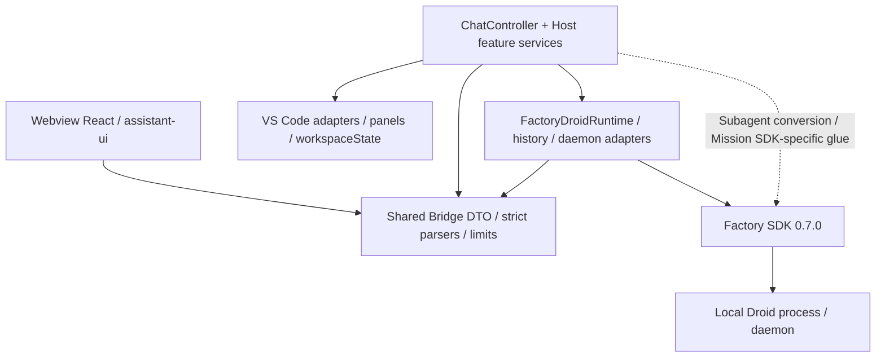
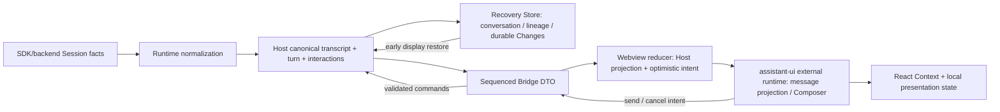
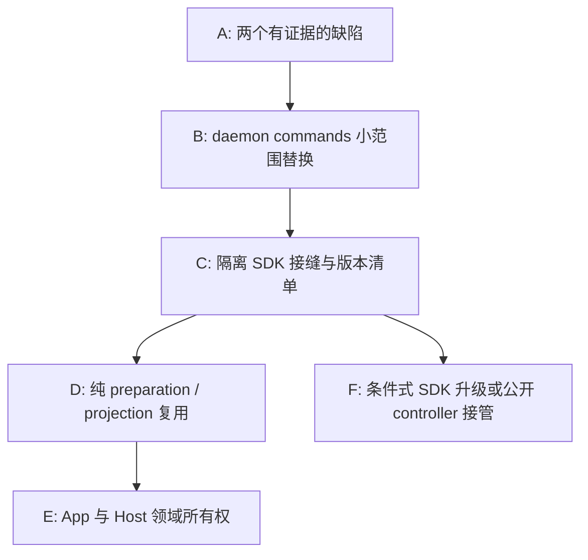

# DroidVisX 架构、状态所有权与官方 SDK 对比调查

> 状态：静态调查报告已完成；覆盖有明确边界。四层架构、主要状态链路和要求的 SDK 能力类别均已调查；未完成全仓逐文件审计、SDK 原始 TypeScript 全量源码审计、最新 npm 发布验证或动态验证。以下计划未实施。

## 1. 基线、权限与官方资料获取

### 1.1 调查边界

- 日期：2026-09-05。
- 工作区：`D:\E\前端好玩的东西\droidvisx`。
- 父任务给定基线：`main`，`a29dec1f7d7f80b76035c8092fc815cd28676f3b`，包含 `bb89d03` 主聊天改造。未执行 Git 命令，未证明当前工作树与该提交逐字一致。
- 当前根包声明 `droidvisx@0.8.0`、`@factory/droid-sdk@0.7.0`、`@assistant-ui/react@0.15.12`、`react@19.2.0`。证据：`D:\E\前端好玩的东西\droidvisx\package.json`。
- 按父任务确认以 heavy worker 调查，不读取、修改或推测实际模型路由。本报告不处理主对话最初的 provider 配置错误。
- 根 `AGENTS.md` 使用父任务已提供的完整内容，未重复读取。读取了文档入口、架构、能力、状态和计划；文档中的已安装、测试通过或历史探针结果均只视为历史声明，不冒充本轮验证。
- 开始时报告已经存在，仅有进行中提纲；已先阅读。原提纲“创建时不存在”和模型档位文字不能作为本轮独立事实。未发现需另外保留的用户正文，现将提纲完善为本报告。
- 唯一写入文件为本报告。未执行 Execute、构建、测试、安装、Git 写操作、CLI/SDK 会话或真实业务工具；未读取个人 settings、`.env`、密钥、会话内容/日志；未读取另一个 worker 的报告，未再委派代理。
- SDK `node_modules` 的发布包是授权例外；读取其代码、声明、文档和例子，不执行它们。读取的 FetchUrl 工具输出缓存是本轮公开网页内容，不是用户会话日志。

### 1.2 官方资料清单与版本可信度

| 编号 | 官方来源、实际获取结果 | 可支持的结论及限制 |
| --- | --- | --- |
| O1 | <https://docs.factory.ai/llms.txt>，成功获取目录 | 定位当前官方 SDK 入口；不是带版本的发布说明。 |
| O2 | <https://docs.factory.ai/sdk/typescript.md>，成功获取全文；工具中间截断部分另从本次工具输出读取 | 当前在线指南包含 `listModels()`、`droid.models.list()`、`systemPrompt` 等；不能直接认定安装版 0.7.0 具备。 |
| O3 | <https://github.com/Factory-AI/droid-sdk-typescript>，通过官方 GitHub 只读工具获取根目录、README、package.json、MIGRATION.md、最近提交和模型发现例子 | 当前主分支根目录没有 `src/`；仓库包名为 `@factory/droid-sdk-examples`，说明它当前主要发布指南/例子，不能称为完整 SDK 实现源码镜像。 |
| O4 | <https://github.com/Factory-AI/droid-sdk-typescript/blob/main/MIGRATION.md> | 明确 0.6 → 0.7：Node API 移至 `/node`；低级 RPC 返回完整 envelope；transport 改 string-framed；`requestTimeout`、`droidExecPath`、`droidExecExtraArgs` 等发生变更。 |
| O5 | <https://github.com/Factory-AI/droid-sdk-typescript/commit/87b4c4c4e4fc093e10a94f1e767ed57b7cbf597e>，2026-08-20，`docs: add model discovery example (#74)` | 此次可见最新主分支提交；不是 SDK npm 发布。其 `examples/node/model-discovery.ts` 导入 `listModels`，根示例包却仍依赖 0.7.0，需实物核对。 |
| O6 | <https://github.com/Factory-AI/droid-sdk-typescript/commit/cb20fe3aa5f0b92546c427fbc2db4080d32675da>，2026-08-06，`docs: publish 0.7 SDK guides and examples (#73)` | 可验证的 0.7 文档发布事件；不把提交时间等同 npm 发布时刻。 |
| O7 | GitHub `releases/latest` 返回 404，`list_releases`、`list_tags` 均返回空数组；公开 npm 检索未返回有效结果 | 最新 npm dist-tag、是否有更新版本及其发布日期：未确认。不能写“0.7.0 是全网最新版”。 |
| O8 | `D:\E\前端好玩的东西\droidvisx\node_modules\@factory\droid-sdk\package.json:1`、`README.md:1`、`docs\typescript-sdk-reference.md:1` | 安装包确为 0.7.0；Node ≥18；根入口 browser-safe、`/node` 增加进程/本地能力。随包参考文档完整读取。 |
| O9 | `D:\E\前端好玩的东西\droidvisx\node_modules\@factory\droid-sdk\dist\node.d.ts:578-736`；`dist\index-D_SzTnFR.d.ts:106170-106454,107678-107718,113158-113424,114099-114306` | 核对公开 Node API、daemon resources/handle、state managers/controller。声明包包含约 11.5 万行 schema 展开，未逐行审计全部 schema。 |
| O10 | `D:\E\前端好玩的东西\droidvisx\node_modules\@factory\droid-sdk\dist\node.mjs:3163-3223,3482-3850`；`dist\chunk-5UXINOXG.mjs:9008-9109,23273-23752` | 阅读发布实现中的默认认证、stream、设置、替换回滚、daemon handle 注册/释放与 controller 所有权；SDK_VERSION 在 chunk 的 8292 行为 `0.7.0`。这是发布 JS，不是全量原始 TS。 |
| O11 | 安装包 `examples\node\spec-mode-new-session.ts`、`examples\browser\daemon-lifecycle.ts`，以及 GitHub O5 的 `examples/node/model-discovery.ts` | 直接验证跨 Session handoff 需 raw envelope、daemon successor 返回 ID、源 handle 仍可用；例子只阅读未运行。 |

**关于“完整获取官方 SDK”：** 已确认公开仓库当前内容范围，获得完整随包参考指南和所需公开 API 声明/关键发布实现。没有证据证明可以从当前公开仓库获取完整原始 SDK TypeScript 实现；本轮也没有下载、执行或声称逐行读完发布 JS、所有生成 schema 和例子。后续若坚持原始源码全量审查，需要官方提供对应 npm 版本的源码快照/可访问仓库；不能把缺失部分用推测补齐。

## 2. 执行摘要

1. **四层方向合理，主要依赖边界真实存在；内部职责封装不均衡。** Webview 没有直接调用 SDK；Host 负责 VS Code 和产品状态；Runtime 已在使用 SDK。最需要继续处理的是共享可变 `ChatController`、App 的动作/状态/消息入口集中，以及部分 Host 直接理解 SDK 原始协议。不是重建四层架构。
2. **React 页面确实承担过多协调职责，但不是 Hook 本身有问题。** `App` 同时处理消息接收/批处理/握手、草稿同步、queue/send/slash 路由、会话动作、MCP/设置、Git、图片请求和整体布局。抽出一个同样巨大的 `useChatApp()` 不会改善所有权；应按输入流、面板、会话动作和消息 transport 的生命周期拆分。
3. **项目已有状态管理，不能简单说“没有状态库”。** 主 Webview `useReducer`、assistant-ui 外部 runtime、Host 的显式状态与代际守卫、恢复 Store、领域 reducer、Context、子代理 `useSyncExternalStore` 都在工作。未发现根包直接引入 Redux/Zustand/Jotai/Recoil/XState。没有证据要求迁移状态库；先解决权威来源、身份和订阅边界。
4. **官方 SDK 已替代了大部分基础运行能力。** Session stream、permission/AskUser、settings、fork/rewind/compact、daemon RPC 都在调用 SDK。最小收益明确的候选是 daemon 的 commands 读取：现有 Runtime 仍默认启动短命进程，而 0.7.0 已有 `droid.commands.list(sessionId)`。
5. **“只依赖公开 API”存在重要例外。** `SubagentTranscriptService` 从 `droid.sessions` 强转后读取未声明的 `.controller`；发布 JS 恰有此字段，公开 `SessionsResource` 没有。SDK 类 `DaemonSessionController` 本身公开导出，不等于 facade 内部对象字段公开。应先隔离此兼容接缝，再评估使用公开低级 controller 的单一连接所有者；不能再建一条竞争连接。
6. **不能全面删掉自建恢复、Bridge、VS Code、Review/Restore。** SDK 保存 backend Session；产品还拥有 conversation lineage、canonical display、durable Changes ledger、附件引用、编辑器未保存状态、精确选文件提交/回滚以及跨窗口 lease。这些语义不是 SDK state manager 的同义词。
7. **有静态可证明的问题，也有未验证机会。** 重点实际问题：workspace 图片缓存淘汰后被永久请求 Set 阻止重取；Mission create 成功但 settings 更新失败时未释放暂存 attached handle。设计建议与这些缺陷分别列出，不以文件行数推断 bug 或性能。

## 3. 架构、公共契约与代码组织

### 3.1 实际依赖图

图中实线是静态代码依赖；运行时消息双向通过 Bridge，不是 Shared 主动调用 Host。`D:\E\前端好玩的东西\droidvisx\docs\ARCHITECTURE.md` 的四层叙述总体准确，但需要注明 Host 存在 SDK 接缝，而不是绝对“所有 SDK 知识只在 Runtime”。

### 3.2 边界有效性与例外

| 边界 | 已核对的生产证据 | 评价 |
| --- | --- | --- |
| Webview → Bridge | `D:\E\前端好玩的东西\droidvisx\src\webview\bridge\vscode.ts:1-104`；`src\webview\assistant\runtimeAdapter.ts:128-204` 的完整路径为 `D:\E\前端好玩的东西\droidvisx\src\webview\assistant\runtimeAdapter.ts:128-204` | UI 发送封闭 DTO，assistant-ui 是外部消息投影，未直接跑 SDK agent。 |
| Bridge 入站/出站验证 | `D:\E\前端好玩的东西\droidvisx\src\shared\validateMessage.ts:139-257`；`D:\E\前端好玩的东西\droidvisx\src\webview\bridge\validateHostMessage.ts:263-345` | 已有 `satisfies Record<union discriminant, parser>` 和 `Object.hasOwn`；不能建议再造一份通用消息注册框架。 |
| Host 统一入口 | `D:\E\前端好玩的东西\droidvisx\src\extension\webviewMessageRouter.ts:38-113`；`D:\E\前端好玩的东西\droidvisx\src\extension\ChatController.ts:545-875` | router 先验证，再区分主题/Mission/业务；业务 switch 很长但可穷举，长度本身不是不正确。 |
| Bundle 禁止依赖 | `D:\E\前端好玩的东西\droidvisx\esbuild.mjs:174-277`，`assertNoForbiddenWebviewInputs`/`isForbiddenWebviewInput` | 构建检查 SDK、Host、Runtime、assistant-cloud 的实际输出贡献，并保持 Mermaid lazy。该检查有价值；本轮没运行构建。它不覆盖所有未发出到 bundle 的类型依赖，也不是全仓层级 lint。 |
| Runtime | `D:\E\前端好玩的东西\droidvisx\src\runtime\FactoryDroidRuntime.ts:162-250,274-334,392-527` | 自有 session facade 与 `DroidRuntime` 限制 SDK 外泄；事件归一化、设置目录安全投影合理。定向 import 检索未发现 Runtime 导入 vscode。 |
| Host 的 SDK 例外 | `D:\E\前端好玩的东西\droidvisx\src\extension\SubagentTranscriptService.ts:1-24,137-157,418-424,694-706`；`D:\E\前端好玩的东西\droidvisx\src\extension\chat\mission\MissionRuntime.ts:1-42` | 子代理服务混合 SDK 转换、raw subscription 与 Host transcript/Viewer；适合把 SDK event source 收回 Runtime，保留 Host registry 与 View projection。MissionRuntime 是 integration glue，可集中隔离，没必要强行通过 Shared 暴露 SDK 类型。 |

### 3.3 大文件：有数值，但不把数值当结论

使用只读检索末行行号统计 TS/TSX/CSS；没有运行预算脚本。以下为最后内容行位置，预算脚本以 `split(/\r?\n/).length` 计数，末尾换行可能再加 1。

| 文件绝对路径 | 最后内容行 | 主要职责 | 对应处理 |
| --- | ---: | --- | --- |
| `D:\E\前端好玩的东西\droidvisx\src\webview\bridge\validateHostMessage.ts` | 3886 | 大量 DTO parser | 依协议域迁移纯 parser，保留已有 registry；不减弱 exact-key。 |
| `D:\E\前端好玩的东西\droidvisx\src\shared\bridgeMessages.ts` | 2201 | 类型、常量、re-export | 按稳定契约域拆分并兼容原 barrel；不是优先运行时缺陷。 |
| `D:\E\前端好玩的东西\droidvisx\src\runtime\FactoryDroidRuntime.ts` | 2172 | facade、lifecycle、settings、MCP、目录与纯投影 | 先迁纯 metadata/MCP 投影，再保留小的 session owner。 |
| `D:\E\前端好玩的东西\droidvisx\src\webview\assistant\store.ts` | 1597 | 全局 DTO reducer + transcript 更新 | 先分纯 transcript 运算，不把身份守卫分散。 |
| `D:\E\前端好玩的东西\droidvisx\src\webview\assistant\App.tsx` | 1580 | transport、动作流、草稿、布局 | 是高收益职责拆分点，不只搬 Hook。 |
| `D:\E\前端好玩的东西\droidvisx\src\shared\validateMessage.ts` | 1533 | 入站 parser | 复用现有域 parser 模式。 |
| `D:\E\前端好玩的东西\droidvisx\src\webview\assistant\thread\Composer.tsx` | 1170 | 输入、slash/mention、附件解码、菜单、呈现 | 抽附件 preparation 与 popup view；aui composer 仍持有文本。 |
| `D:\E\前端好玩的东西\droidvisx\src\extension\chat\turnFlow.ts` | 1151 | turn 生命周期、tool/changes、queue、handoff | 只有明确的 turn owner/效果接口才是真正缩小职责。 |
| `D:\E\前端好玩的东西\droidvisx\src\extension\ChatController.ts` | 1119 | 共享状态容器、依赖注入、消息路由 | 缩小 internals 能力面优先于再拆 switch。 |
| `D:\E\前端好玩的东西\droidvisx\src\extension\chat\sessionDirectory.ts` | 1116 | 目录与各类 session 操作 | 目录纯投影可保留现成拆分；不要混入 lifecycle transaction。 |
| `D:\E\前端好玩的东西\droidvisx\src\extension\chat\runtimeLifecycle.ts` | 1057 | 激活、替换、关闭、workspace 代际 | 保留一条协调链，不为减少行数拆成互相回调。 |
| `D:\E\前端好玩的东西\droidvisx\src\runtime\history\projectSessionHistory.ts` | 1039 | 原始历史 → 安全 transcript | 复杂度大部分来自多种消息内容；本轮未逐段证明可整体替换。 |
| `D:\E\前端好玩的东西\droidvisx\src\webview\assistant\Thread.tsx` | 982 | 大型 props 转发、编辑环境与滚动 | 滚动所有权值得保留，业务 props 应就近组合。 |

最长测试文件是 `D:\E\前端好玩的东西\droidvisx\src\webview\bridge\validateHostMessage.test.ts:4706`；测试只做长度检索，未运行、未据此判断用例质量。CSS 最大被检索内容行是 `D:\E\前端好玩的东西\droidvisx\src\webview\assistant\styles\25-custom-models.css:791`。

`D:\E\前端好玩的东西\droidvisx\scripts\checkFileBudgets.mjs:10-33,64-77` 规定 TS/TSX 900、CSS 800、tests 2000，有 legacy allowlist。实际机制是固定 ceiling，不会自动把“本次减少后的行数”写回，因此例如 App 当前约 1581 行仍可回长到 1748 而过门禁。根规则的“只可缩小”比脚本更强；后续涉及这些文件时同步降低其 ceiling 即可，不需要为了本报告更新预算。

### 3.4 哪些拆分是实质性的

- `D:\E\前端好玩的东西\droidvisx\src\extension\chat\internals.ts:22-29` 明确 `ChatControllerInternals = ChatController`，原 private 字段为机械拆分提升成公开。`settings.ts:34-129`、`queue.ts:30-78`、`runtimeLifecycle.ts:84-136` 都能直接改整个 controller。
- 这已改善导航和阅读，但没有建立领域封装。函数所需依赖与可改状态没有被类型系统限制；settings 模块理论上也可改附件、queue、runtime generation。不是“函数拆出来就已完成职责拆分”。
- 有效反例：`PendingInteractionCoordinator` 内部 Map、runtime symbol、turn context 都是 private，对外只有受限动作（`D:\E\前端好玩的东西\droidvisx\src\extension\pendingInteractionCoordinator.ts:58-235`）；`SessionRecoveryStore` 隐藏 revision/writeInFlight/sessionOwners（`D:\E\前端好玩的东西\droidvisx\src\extension\SessionRecoveryStore.ts:49-72`）；它们有真实生命周期所有权。
- 同样，`operationEligibility.ts:38-243` 已区分 user panel、session replacement、active transform、turn start，不应把所有 guard 合成一个模糊的 `canOperate()`。
- Runtime 不建议一次拆成十几个只有 `runtime` 参数的 free functions。先把 `projectSessionSettings`、`projectModelCatalog`、附件/Skill/MCP DTO 纯映射迁走；生命周期仍归一个 session owner，必要迁移只暴露明确的 runtime 方法。

## 4. 状态所有权：并非没有管理，也不是所有重复都是错误

### 4.1 状态链路图

### 4.2 所有权表

| 状态域 | 权威来源与当前存放位置 | 重复、同步和生命周期判断 |
| --- | --- | --- |
| Backend session/settings/working state | Droid；Runtime 持有 SDK handle；Host 投影 | `FactoryDroidRuntime.readSessionSettings/readSessionWorkingState`，Host 不应自行发明 model/reasoning。 |
| 可见 Conversation、Turn、sequence | Host `ChatController`；Recovery Store 管理 conversation → backend lineage | `D:\E\前端好玩的东西\droidvisx\src\extension\ChatController.ts:243-421,976-1014`；sequence 在单一 `stamp` 生成，`emitTo` 可定向 replay。与 SDK session ID 不应合并。 |
| Durable display、Changes | `SessionRecoveryStore` + workspaceState + managed image 文件 | `D:\E\前端好玩的东西\droidvisx\src\extension\extension.ts:136-140,204-226`；`D:\E\前端好玩的东西\droidvisx\src\extension\createPersistentSessionRecoveryStore.ts:9-23`；SDK 无相同承诺。 |
| Webview transcript、turn、settings、queue | App 的 `useReducer` 与 `AssistantWebviewState` | `D:\E\前端好玩的东西\droidvisx\src\webview\assistant\store.ts:303-598,1172-1183`：optimistic 意图可以先行，Host echo 最终校准；这是不同层投影，不是两份 backend 权威。 |
| 消息 render model | `useExternalStoreRuntime` 输入来自上述 reducer | `D:\E\前端好玩的东西\droidvisx\src\webview\assistant\runtimeAdapter.ts:128-204`：messages/onNew/onCancel，默认窗口 60、每次展开 120；map/cache 是衍生状态，不应另持久化。 |
| Composer 文本 | assistant-ui composer 实际输入；App draft/ref 用于禁用、保存与外部 prefill | `D:\E\前端好玩的东西\droidvisx\src\webview\assistant\App.tsx:77-92,438-550,679-686,1496-1521`；`D:\E\前端好玩的东西\droidvisx\src\webview\bridge\vscode.ts:83-96` 只保存 `{draft}`。多处清空/替换必须一致，适合归一入口，不该持久化整个 Host snapshot 到 Webview。 |
| 设置 optimistic label | `useOptimisticSettingPick` 的 pendingPick，仅 mode/model 显示 | `D:\E\前端好玩的东西\droidvisx\src\webview\assistant\useOptimisticSetting.ts:23-91`：updating → settled 清理，4 秒兜底。Host 有 settingsUpdate symbol；daemon adapter 还有 pendingSettings overlay。三者用途不同，但需要明确一次操作的确认链，不宜再新增第四份 model state。 |
| 子代理 activity | Host child registry；Webview keyed external store | `D:\E\前端好玩的东西\droidvisx\src\webview\assistant\subagentPanelFlow.ts:53-127,140-184`：按 toolUseId 订阅、相同 activity 不通知。这是比让整个 App 因每条 child activity 重渲染更明确的局部所有权。 |
| BYOK 页面数据 | `useCustomModelsFlow` 的组件 state + Context | `D:\E\前端好玩的东西\droidvisx\src\webview\assistant\customModelsFlow.tsx:140-213`：独立 listener、session/sequence 守卫和按需 refresh。store 对同类消息只推进 sequence，不另存 payload（`store.ts:723-729`）。有分工，不是无条件重复存储。 |
| BTW | Host 管内容；Hook 管开关、输入、引用、宽度 | `D:\E\前端好玩的东西\droidvisx\src\webview\assistant\useBtwPanel.ts:17-89`：session 变化清空；关闭只隐藏。无需让全局 store 管宽度。 |
| Mission | Host MissionSnapshotReducer 管产品状态；App 收 route/setup；reducer 收 mission snapshot/result | `D:\E\前端好玩的东西\droidvisx\src\extension\chat\mission\MissionSnapshotReducer.ts:33-199`；`App.tsx:75-76,179-193`。三类分别是导航、配置、运行投影；需画清协议归属，不能把 route 当后端生命周期。 |
| 展开、跟随、导航 | Thread/VirtualizedMessages/ProcessPresentation | `D:\E\前端好玩的东西\droidvisx\src\webview\assistant\Thread.tsx:516-625`；`D:\E\前端好玩的东西\droidvisx\src\webview\assistant\processPresentation.tsx:24-102`：展开 Map 跨虚拟卸载保留，详情暂停 follow；不该上移到 Host。 |
| 图片 | Host bytes 与合法路径；Webview 有按需 preview cache | `App.tsx:767-792`、`store.ts:805-830` 的完整路径见上；`D:\E\前端好玩的东西\droidvisx\src\webview\assistant\imagePreviewCache.ts:10-40` 为 module Map。缓存必须有身份/淘汰/请求结算语义，已发现具体不一致，见 B1。 |

### 4.3 真正需要改善的同步链

**入口订阅。** App 对 `message` 做验证、rAF + 50ms fallback 排队（`App.tsx:148-237`）；BYOK/子代理还有独立 DOM listener，再验证各自子协议。分开订阅不是天然 bug，但会让“全局 sequence 接受”和“独立 feature 接受”形成两套路径。BYOK 有 latestSequence，子代理 activity listener 只有 session 检查（`subagentPanelFlow.ts:148-160`）。本轮未证明消息重排在真实 transport 中发生，因此不把它列为已复现错误。建议同一 decoded Host message source 分发到 reducer/feature subscribers，分别保持有界 scope 和必要 sequence；不强迫把所有 payload 放入根 reducer。

**草稿。** App `draft`/`draftValueRef`、`draftCommand` 和 aui composer text 各有用途：读取最新值、渲染依赖、命令式 prefill 与实际输入。问题是 queue 编辑/清空/slash/send 各自手写 `setDraft/persistDraft`，`replaceComposerDraft` 尚未覆盖全部清空路径。收敛为少数显式操作如 `replaceDraft`/`clearAfterAcceptedIntent`，并规定哪个动作更新 composer，不要不加区分地双向 effect 同步，否则会把正在输入的内容回写覆盖。

**恢复。** `startup` 先读取 durable display，再 load catalog/initialize（`D:\E\前端好玩的东西\droidvisx\src\extension\chat\runtimeLifecycle.ts:84-136`）；early paint 的连接仍为 connecting（`D:\E\前端好玩的东西\droidvisx\src\extension\chat\recovery.ts:84-129`）。`SessionRecoveryStore.flushPending` 在 persistence 成功后推进 persistedRevision（`SessionRecoveryStore.ts:448-484`）。这些不是 SDK 内存 store 的重复代码；先落盘再确认的边界必须保留。

**渲染成本。** 已有 rAF 批处理、消息缓存、消息窗口、virtualizer、lazy Mermaid、keyed child store；不能断言每个 Hook 都导致卡顿。静态可见根 reducer 收到不同消息都会改 sequence，App 全体协调代码仍运行，值得后续测量订阅/投影次数。报告不复述源码注释中旧的毫秒数作为当前性能数据。

## 5. 真实复用点、现有抽象与不宜合并项

### 5.1 有调用链支持的共享候选

| 候选 | 两条实际调用链/已有抽象 | 最小合理共享边界；反证 |
| --- | --- | --- |
| 主 Composer 与历史编辑的文件 preparation | `D:\E\前端好玩的东西\droidvisx\src\webview\assistant\thread\Composer.tsx:250-391`；`D:\E\前端好玩的东西\droidvisx\src\webview\assistant\thread\UserMessage.tsx:249-325`；都调用 `D:\E\前端好玩的东西\droidvisx\src\webview\assistant\attachmentIngress.ts:1-98` | 已共享 URI 提取、MIME 和 base64；还重复图片/PDF/text 判别、remaining slots、截断与 NUL 检查。主路径有 empty/read rejection 提示，编辑路径 `blob.text().then` 没有对应 catch，行为已分叉。将 file → prepared payload/notice 的有界 preparation 提取到现有模块或同域新模块，stage、预览缓存、焦点和发送回调留在各 UI。不要合并整个 Composer/User editor。 |
| Host/Webview transcript 的纯行更新 | Host `D:\E\前端好玩的东西\droidvisx\src\extension\hostTranscriptState.ts:245-320,380-546,762-819`；Webview `D:\E\前端好玩的东西\droidvisx\src\webview\assistant\store.ts:845-975,1313-1539` | 两边都 append assistant/thinking、upsert tool、terminal finalize。已有 `D:\E\前端好玩的东西\droidvisx\src\shared\hostTranscriptState.ts:13-27` 只共享 stable ID；`transcriptLimits` 已共享限额。可共享 terminal status/安全字段 patch 的纯算法，随后逐类扩大；Host canonical ID 与 UI optimistic ID 不同，不可直接让两个 reducer 互相调用。 |
| Process 只读 client 的建立/清理 | `D:\E\前端好玩的东西\droidvisx\src\runtime\history\FactorySessionHistoryLoader.ts:145-158` 和 `D:\E\前端好玩的东西\droidvisx\src\runtime\commands\FactoryCommandCatalog.ts:47-60` 都 `new ProcessTransport → connect → new DroidClient`，失败 close | 先把 daemon commands 改走公开现有连接，再决定是否抽短小 typed factory。Btw/capability probe 有各自 handler/生命周期，不因看到同一构造器而统一成大模板。 |
| Runtime successor adoption | `D:\E\前端好玩的东西\droidvisx\src\runtime\FactoryDroidRuntime.ts:730-747,817-835,878-897` 三处捕获 availableModels、换 session、更新 target | 可抽私有 `adoptSession`，仅统一已存在的元数据/所有权更新；不把日志、rewind 参数、daemon lease、Node rollback 合并。新方法应明确是否重绑 notifications，而不是继续复制隐含行为。 |
| capability list 的保留旧值 | `D:\E\前端好玩的东西\droidvisx\src\webview\assistant\store.ts:639-703` skills/plugins/mcp 的 loading/error 逻辑近同 | 可一个很窄的纯列表合并器，或者接受三段短代码。收益低，排在真实缺陷之后，不创建远程状态管理框架。 |
| App 动作与 UI 接口 | `App.tsx:794-1196` → `Thread.tsx:164-353` → Composer 大量一对一透传 | 把 Composer 所需模型/设置/附件/queue 作为内聚接口就近消费，App 保留壳与 provider。现有 `UserEditorEnv`、`ThreadMessageChrome`、`ReviewDockSlot` 已是组合点，应复用，不再引入一个暴露整个 App state 的 Context。 |

### 5.2 应当保留的差异

- **Node/daemon lifecycle：** Node replacement retire source；daemon replacement 返回 ID 且源仍可用；daemon detach 保活、close 结束。看起来相似的两个 adapter 不可简单删掉一个（O8/O9/O10/O11）。
- **Host/UI 安全验证：** Webview 不可信，即使 SDK Zod 已验证 backend envelope，也不能省略 UI → Host 的 path/identity/action 校验；相反，SDK 全量 schema 不能直接替换受限 Bridge DTO。
- **Main/readonly viewer：** `D:\E\前端好玩的东西\droidvisx\src\webview\assistant\ReadOnlyTranscript.tsx:40-120` 已复用主消息 mapping、Markdown、Tool 和 virtualizer，并显式移除写能力；无需把 viewer 改成“完整 App + 一堆 disabled 布尔值”。
- **SDK history/canonical display：** backend 原始消息排序不等于用户关闭前的 visible conversation。`DaemonSessionHistoryLoader.ts:216-286` 明确选择 chronological 而非 SDK `orderMessagesByParentChain`，注释说明 disconnected branches 反例。未经覆盖这些场景，不能以官方 helper 同名近似为由替换。
- **Review/Restore/Commit：** daemon `git.commit(sessionId,message)` 没有等价的产品级 paths 选择、dirty editor 预检、review version、before/after snapshot 与回滚 journal。将其接入不能当成删除 VS Code Git/Review 层的理由。
- **BTW 与用户 queue：** BTW 的 hidden fork、deny-all、lastCompletedTurn 标签和独立关闭，与主会话 queue 顺序/编辑/暂停语义不同；SDK 只有 `resolveQueuedMessage` 也不能证明等同产品 queue。

## 6. 官方 SDK 的实际能力与替换矩阵

### 6.1 先明确 SDK 内部已经做了什么

- 高级 Node `DroidSession.stream()` 和 daemon handle stream 都调用 SDK `streamFromClient`，它处理一回合并发、abort、error subscription、提前 break 的 interrupt、bridge release；不需要项目再实现 JSON-RPC token 流队列（O10；`D:\E\前端好玩的东西\droidvisx\node_modules\@factory\droid-sdk\dist\chunk-5UXINOXG.mjs:9008-9109`）。
- `connectToDaemon` 内部创建 `MultiSessionStateManager` 和 `DaemonSessionController`，facade 注册 attached handle，阻止同一连接同一 session 双 handle，转发 permission/AskUser（同文件 `23526-23752`）。所以项目已经间接使用 SDK 的 session state manager；不是完全自造其替代品。
- `MultiSessionStateManager` 公开导出，支持 LRU、pending notification、optimistic submit、子代理关系、session loading；`MultiMissionStateManager` 支持 Mission association/store（O9）。但当前 `ConnectedDroid` 没有公开暴露这些实例，不能将 `.sessions.controller` 强转取内部实例称为公开使用。
- 从纯 SDK backend state 进一步投影到 VS Code 产品状态仍然必要。若未来直接构造低级 controller，就必须接管现有 facade 的注册、权限默认取消、stream/error/reconnect 管理，不是换一个 constructor 的工作量。

### 6.2 能力矩阵

判定：**已复用**＝底层能力当前已经调用 SDK；**可直接替代**＝在当前安装版有等价原语、仍需保留调用者安全/产品适配；**需要适配**＝语义/形状不同；**必须保留**＝SDK 无等价产品承诺；**无法确认**＝版本或公开接口证据不足。

| 能力 | 0.7.0 官方 API/实现证据 | 项目实际入口与自建内容 | 判定、成本与顺序 |
| --- | --- | --- | --- |
| Process transport | O8/O9；`ProcessTransport`，`DroidClient`，`createSession/resumeSession`；`node.d.ts:432-447,635-704` | `D:\E\前端好玩的东西\droidvisx\src\runtime\FactoryDroidRuntime.ts:1610-1689`，`createLocalDroidSession`；`processSessionTransport` 合并 close；`modelCatalogCaptureTransport` 读取 init/load 目录 | **已复用 + 保留必要适配。** 直接改成默认 `createSession({cwd})` 会触发 SDK 默认 FACTORY_API_KEY 要求，也丢失 model catalog 捕获。成本中；在明确新版本公开 metadata 与认证策略之前不删。 |
| Daemon transport/connection | `connectToDaemon({url,auth})`；O10 chunk `23732`，含 controller/reconnect/state manager | `D:\E\前端好玩的东西\droidvisx\src\runtime\daemon\daemonConnection.ts:47-119`；`D:\E\前端好玩的东西\droidvisx\src\extension\DaemonSidecar.ts` 负责安全 endpoint、warmup 与连接缓存 | **已复用。** SDK 连接不替代端口发现、listener PID 身份、CLI sign-in 适配和窗口生命周期。新 SDK 原语尚不能删除本地 sidecar；不展开认证整改。 |
| Session 创建/恢复 | Node `createSession/resumeSession`；daemon `sessions.create/resume`，O9 `107678-107718` | `D:\E\前端好玩的东西\droidvisx\src\runtime\daemon\createDaemonDroidSession.ts:70-186`、`FactoryDroidRuntime.ts:1357-1439` | **已复用，保留 lease/临时所有权/失败释放。** VS Code 当前 workspace 与 conversation adopt 属于 Host。 |
| 会话目录/搜索/archive | Node `listSessions` 无进程；daemon `sessions.list/listOpened/search/archive/unarchive`，O9 `106201-106216` | `D:\E\前端好玩的东西\droidvisx\src\runtime\FactorySessionCatalog.ts:57-127`；`D:\E\前端好玩的东西\droidvisx\src\runtime\daemon\DaemonSessionCatalog.ts`；Host `sessionDirectory`/conversation 去重 | **大部已复用，目录投影保留。** Node metadata 不返回足够 worker tags，项目有 sidecar 补读。daemon list 有 tags/parent ids，是后续减少私有文件依赖的候选；需保持 normal/Mission/worktree 过滤、inactive 后端恢复。没有稳定 Delete API，不能把 archive 叫 delete。 |
| Session 切换 | SDK create/resume/handle cleanup，不提供 VS Code conversation switch 事务 | `D:\E\前端好玩的东西\droidvisx\src\extension\chat\runtimeLifecycle.ts:187-205` 起的替换链；`D:\E\前端好玩的东西\droidvisx\src\webview\assistant\conversationTransition.tsx` | **必须保留产品协调。** SDK 不知道旧 draft、early snapshot、workspaceGeneration、lease 和最后可信 display；不能以官方 MultiSessionStateManager 直接取代全部 Host。 |
| 流式文本/thinking/tool | `stream(...,{includePartialMessages:true})`、`convertNotificationToStreamMessage`、typed stream；O9 Node `654-660` | `D:\E\前端好玩的东西\droidvisx\src\runtime\FactoryDroidRuntime.ts:392-527`；`D:\E\前端好玩的东西\droidvisx\src\runtime\normalizeSdkEvent.ts:42-208`；Host `turnFlow`、UI reducer | **底层已复用；需要安全显示适配。** 完整 tool inputs/results 不能原样进入 Webview；保留归一化、限额、脱敏、Turn 身份。纯 transcript 算法可逐类复用，成本中，阶段 D。 |
| Raw notifications | Node `DroidSession.onNotification`；daemon `ConnectedDroidSession` 无同名公开成员；公开低级 controller 有 events | `D:\E\前端好玩的东西\droidvisx\src\runtime\FactoryDroidRuntime.ts:1287-1324`；`D:\E\前端好玩的东西\droidvisx\src\extension\SubagentTranscriptService.ts:694-706` 越过 facade 类型 | **Node 已复用；daemon 当前是未声明接缝。** 隔离并写明版本 pin，之后评估由 Runtime 自有公开 controller；成本中到高，阶段 C。不额外开连接。 |
| Permission | `permissionHandler`，只接受 offered outcome；缺省/异常取消；O10 chunk `23421-23445` | `D:\E\前端好玩的东西\droidvisx\src\runtime\runtimeInteractions.ts:134-215` → `D:\E\前端好玩的东西\droidvisx\src\extension\pendingInteractionCoordinator.ts:106-199` → Bridge → UI | **已复用 + 必须保留产品 pending coordinator。** SDK 处理 protocol reply，Host 处理 request/session/turn/runtime 关联、UI pending promise、重放和 VS Code 编辑 Plan。两个安全边界不可合并。 |
| AskUser | `askUserHandler`，result 包含 index/question/answer；无 handler decline | `D:\E\前端好玩的东西\droidvisx\src\runtime\runtimeInteractions.ts:218-275`；`pendingInteractionCoordinator.ts:201-235` | **已复用。** 保留问题索引映射、答案限制、取消和会话守卫；无需自己实现 SDK server request dispatcher。 |
| Plan / Spec / handoff | `enterSpecMode/updateSettings`；ExitSpecMode permission；Node raw envelope 是 handoff ID 已公开文档方案；O11 | `D:\E\前端好玩的东西\droidvisx\src\runtime\specHandoffWatch.ts`；`FactoryDroidRuntime.ts:1242-1285`；`D:\E\前端好玩的东西\droidvisx\src\extension\chat\turnFlow.ts:103-111` 与后续 adopt | **已复用 + 适配保留。** TodoWrite 是项目对工具内容的显示投影，不是 SDK Plan document store。跨 backend handoff 无可直接替换的高级 API；当前 daemon adapter 又缺 raw notification，不能无条件宣称与 process 同能力。 |
| Model/reasoning/settings | Node `updateSettings`、live settings；daemon `sessions.updateSettings`、`settings.getDefaults().availableModels`；O9 | `D:\E\前端好玩的东西\droidvisx\src\runtime\FactoryDroidRuntime.ts:534-632`；`createDaemonDroidSession.ts:293-341,503-568`；`D:\E\前端好玩的东西\droidvisx\src\extension\chat\settings.ts:34-129` | **已复用 + 保留 confirmed projection。** Node 实现自带 settings revision patch；daemon handle settings 等通知，项目 overlay 有具体动机，不能据“重复”删。model/reasoning 必须基于实时目录。 |
| Model discovery 新 API | 当前 O2/O5 有 `listModels`、`droid.models.list`；安装 `node.d.ts` 全部函数与根 resources 中均没有相应成员 | `D:\E\前端好玩的东西\droidvisx\src\runtime\modelCatalogCaptureTransport.ts:21-95`；daemon defaults read | **当前版无法直接替代。** 先验证目标 npm tarball 的 exports、types、implementation 及 CLI 协议再提升级。不是让现有 0.7.0 直接 import 在线文档 API。 |
| Custom provider/model | daemon `customModels.list/upsert/delete`；O9 `106245-106249` | `D:\E\前端好玩的东西\droidvisx\src\extension\chat\customModels.ts`；`D:\E\前端好玩的东西\droidvisx\src\extension\chat\providerModels.ts:32-111,125-149`、ProviderRegistry/发现/test | **存储 CRUD 已复用，provider UX/安全策略保留。** SDK CRUD 不等于 provider grouping、凭据 inputbox/SecretStorage、外部 provider discovery/test、expectedModel 校验。此审查没有读取凭据。 |
| Cancel / dispose | Node `interrupt/close`；daemon `interrupt/detach/close/disconnect`；O10 明确语义 | `D:\E\前端好玩的东西\droidvisx\src\runtime\FactoryDroidRuntime.ts:634-668,1336-1355,1442-1480`；daemon adapter `close` 映射 detach | **底层已复用，产品 preserveBackendTurn/lease 保留。** 把 facade close 直接替代 adapter close 会终止本应跨 Reload 运行的任务；高风险语义变更，禁止顺手清理。 |
| Fork/rewind/compact/rename | Node 自动 successor/retire/rollback；daemon 返回 `newSessionId`，源 handle usable；O9/O10/O11 | `FactoryDroidRuntime.ts:677-928` 完整路径同上；`D:\E\前端好玩的东西\droidvisx\src\runtime\daemon\createDaemonDroidSession.ts:437-498,596-626` | **已复用。** 可合并 Runtime 的重复 adopt 代码，但 daemon acquire/resume/detach/release 与 Host conversation lineage 必须保留；不重写 Node `_runReplacement`。 |
| History / persistence | Node `listSessions`；低级 `DroidClient.loadSession` envelope；daemon `sessions.getMessages`/list | `D:\E\前端好玩的东西\droidvisx\src\runtime\history\DaemonSessionHistoryLoader.ts:105-171,216-286,345-385`；`FactorySessionHistoryLoader.ts:88-116`；Host Recovery Store | **读取已复用；分页/安全投影/产品恢复保留。** SDK state manager 是内存，不保证 canonical 显示不回退、Changes settlement durable、managed images。raw tags/token/invocations 补读是私有文件契约，应隔离但不能无来源删。 |
| Tools / Skills / MCP / Plugins | Node `listTools/listSkills/setSkillDisabled/listMcp*`；daemon `skills/mcp/plugins`；O9 `106278-106311` | `FactoryDroidRuntime.ts:930-1241`；`D:\E\前端好玩的东西\droidvisx\src\runtime\daemon\DaemonPluginCatalog.ts`；Host capabilityPanels | **大部已复用。** SDK 提供 install/write 能力，不表示产品必须开放；readonly plugin 产品边界保留。MCP auth RPC 在 daemon 存在，但接收 OAuth URL/完成事件仍需 event source 适配，不能只有发起请求就宣告完成。 |
| Commands | Node 低级 `DroidClient.listCommands`；daemon `commands.list(sessionId)`，O9 `106300-106302` | `D:\E\前端好玩的东西\droidvisx\src\runtime\FactoryDroidRuntime.ts:965-1004` 默认统一调用短命 `loadSessionCommands`；`D:\E\前端好玩的东西\droidvisx\src\runtime\commands\FactoryCommandCatalog.ts:29-60` | **daemon 读取可直接替代，优先候选。** 保留 bounded RuntimeCommand projection、Host cache/generation、slash UI。daemon factory 或 runtime 注入 commands loader，process 继续原实现。成本 1–2 人日，阶段 B。 |
| SDK MCP custom tools/hooks | `/node` 的 `tool/createSdkMcpServer`；Hooks 为配置/stream，不是通用注册 API | 项目没有为了 VS Code UI 重造 MCP server harness；工具展示不等于工具执行 | **无替换需求。** 不新增 SDK MCP server、端口、工具权限或 Hook 文件；只在以后产品真需要自定义 agent tool 时再设计。 |
| Subagents | stream/raw child 通知、公开 MSSM child lookup；daemon listOpened 的 parentSessionId/parentToolUseId；killWorker 不是通用 child UI | `D:\E\前端好玩的东西\droidvisx\src\extension\SubagentTranscriptService.ts:137-218,304-327,694-706`；`D:\E\前端好玩的东西\droidvisx\src\runtime\history\DaemonSessionHistoryLoader.ts:173-211,345-385` | **需要适配 + 保留 Host row/Viewer ownership。** 先移除业务层对未声明 controller 的直接依赖；以后可用 SDK child relation 替换部分实时匹配，但 MSSM 只知道已载入 child，官方声明也要求历史 fallback。不能把全部 invocation ledger 恢复删掉。 |
| Mission | enum/tags/missionSettings；`unstable.missions.inspectReadiness/acknowledgeReadinessWarning`；`sessions.killWorker`；MultiMissionStateManager | `D:\E\前端好玩的东西\droidvisx\src\extension\chat\mission\MissionGateway.ts:117-213,237-270`；`D:\E\前端好玩的东西\droidvisx\src\runtime\daemon\missionOrchestrator.ts:33-48`；MissionSnapshotReducer | **已复用 + 产品适配保留。** readiness 明确 unstable；profile 选择、设置核对、目录/selected-chat scope、worker viewer、控制 eligibility 不是 SDK orchestration engine 替代品。无证据存在更高级 `startMission()` 可一换全部。 |
| Context / token usage | Node `getContextStats`；daemon `sessions.getContextBreakdown`；typed token/result | `D:\E\前端好玩的东西\droidvisx\src\runtime\FactoryDroidRuntime.ts:560-610`；`createDaemonDroidSession.ts:570-595`；`D:\E\前端好玩的东西\droidvisx\src\runtime\normalizeSdkEvent.ts:178-202` | **当前上下文已选用更符合产品语义的官方 API。** 不用累计 token 猜 context；process 高级 getContextStats 与 daemon budget 不必同义。0.7 文档称 result 为 last observed totals，在线文档称 turn usage；发布实现还有 fallback，后续应确认缺失 terminal usage 的来源，不把最新措辞回套旧版。 |
| Error handling | ConcurrentStream/SessionReplaced/SessionReplacement/Connection/Protocol/ProcessExit 等；error event 与失败 result、throw 分开 | Runtime normalize、Host `turnFlow`、availability/error DTO、fixed message，`D:\E\前端好玩的东西\droidvisx\src\runtime\daemon\daemonConnection.ts:84-106` 丢弃潜在敏感原文 | **已复用 + 产品分类保留。** SDK 负责 transport/protocol 错误，Host 决定用户状态和恢复；不得把 raw SDK error 全传 UI，也不以所有异常都 catch 后 success 作为简化。 |
| VS Code / Bridge / Git Review / Canvas | SDK 无对应 VS Code Webview 安全与本产品 undo 契约 | `D:\E\前端好玩的东西\droidvisx\src\extension\webviewMessageRouter.ts`、`createReviewFeature.ts`、`turnSnapshots.ts`、`reviewCoordinator.ts`、`PreviewPanelController.ts` | **必须保留。** 公共 SDK 的 browser-safe 不意味着可把它打进不可信 Webview；不迁移 VS Code API 至 UI，不扩大网络/凭据/工具权限。 |

### 6.3 版本偏差必须变成下一轮前置条件

1. **安装包没有 `listModels`。** 不是搜索一次没命中就下结论：核对完整 Node exports/functions（O9，737 行文件）、root daemon resources、发布入口和在线例子，确认当前声明面缺失。在线例子与示例包依赖存在偏差；需独立验证新的 npm 发布物，而非猜测版本号。
2. **在线 `systemPrompt` 不能直接用于当前 CreateSessionOptions。** 0.7.0 Node `SessionInitOptions:588-604` 没该字段；某些低级 schema 有 `systemPromptOverride` 不等于高层 `systemPrompt` preset API。项目本次没有需要它的替换目标，禁止为“跟上文档”新增配置。
3. **SDK result token usage 的来源需要明确。** 安装指南说“last observed totals”，在线 O2 说本 turn；发布 chunk `8815,8849-8875` 记录 lastTokenUsage 并在 terminal 无 tokenUsage 时回退。项目 `normalizeSdkEvent.ts:187-202` 把 result 一律投为 turnUsage。当前 CLI 通常是否都提供终结 usage 未运行验证，所以列为待验证兼容性风险，不据此宣称所有 token 展示都错。
4. **Facade 中没有 raw daemon subscription。** 这是 0.7.0 类型和实现的实际差距；不能因为 SDK 导出了底层 controller 就声称 `.sessions.controller` 是稳定 API。

## 7. 问题与改进机会（实际缺陷和设计建议分开）

### 7.1 静态可证明的缺陷

#### B1 / P2：workspace 图片缓存淘汰后无法在同 Session 再请求

- 证据：`D:\E\前端好玩的东西\droidvisx\src\webview\assistant\App.tsx:767-784` 的 `requestedImagesRef` 在请求时加入 path，只在 session ID 改变时清空；不是实际 in-flight Set。
- `D:\E\前端好玩的东西\droidvisx\src\webview\assistant\store.ts:301,805-830` 将 localImages 限制为 24 项，插入第 25 项移除最早 entry。
- 消费者 `D:\E\前端好玩的东西\droidvisx\src\webview\assistant\MarkdownText.tsx:352-365` 在 entry 缺失时调用 `request(path)`。原 path 已在 Set 中，因此早期图片再进入视图不会请求，也无法恢复。
- 最小触发：同一会话依次查看 25 个不同 workspace 图片，首图被淘汰，再返回首图。无需假设网络重排或特殊 SDK 行为。
- 最小修复方向：在同一个图片 request/cache owner 内区分 pending 与 resolved，响应时结束 pending；淘汰后允许再次读取，同时避免多个已挂载图片导致淘汰/重取循环。需要按需可见加载或保留有界状态标记，而不是删掉 Set 无条件请求。
- 验收：重复请求合并；第 25 张导致淘汰后首图可重取；拒绝/失败不无限循环；会话切换不接受旧响应。未运行复现。

#### B2 / P2：Mission 初始 settings 更新失败丢失临时 handle 清理

- 证据：`D:\E\前端好玩的东西\droidvisx\src\extension\chat\mission\MissionGateway.ts:174-190`，同一 try 中先 await create，后 await `sessions.updateSettings`；catch 直接返回 rejected，没有 detach 已创建的 session。
- SDK 会立即把 create 的 handle 放进 `sessionHandles`；detach 才 unregister（`D:\E\前端好玩的东西\droidvisx\node_modules\@factory\droid-sdk\dist\chunk-5UXINOXG.mjs:23552-23595,23633-23650,23333-23338`）。它不会因调用者更新 settings 失败自动清除。
- 调用者 `D:\E\前端好玩的东西\droidvisx\src\extension\chat\mission\controller.ts:38-63` 只收到 rejected，没有 handle 可清理；该 handle 尚未进入 `managedRuntimes`。重复失败会在共享 connection 持有无 UI 所有者的 attached sessions，直到断连。
- 反证检查：settings-mismatch 和 runtime initialize 失败分支已显式 detach（MissionGateway 的 192-212 行），唯独初始 update catch 缺失，不是建议把所有错误都附加清理。
- 最小修复方向：在 create 成功到 Runtime 接管之间显式记录暂存 handle；只释放本次已成功创建且未转交的 attachment。`detach` 保持与现有失败分支一致，不擅自 `close()` 结束/删除 daemon backend；若产品要求清理 backend 另定政策。
- 验收：create reject 没有 detach；update reject 对创建 handle detach 一次；成功路径仍保留同一 handle；后续 retry 正常。未运行故障注入。

### 7.2 兼容性与架构建议，不当成已发生故障

| 编号/优先级 | 结论、证据与风险 | 建议 |
| --- | --- | --- |
| A1 / P1（升级前） | 子代理 `.sessions.controller` 未声明接缝；`SubagentTranscriptService.ts:694-706` 与 SDK `SessionsResource:107686` 对照 | 集中 Runtime 兼容 adapter，显式能力结果；锁定并记录 0.7.0 依赖。升级前必须验证；不要泛化成每层均 catch 的防御框架。 |
| A2 / P2 | `ChatControllerInternals = ChatController` 使全部领域共享可改状态；职责拆分只完成目录层面 | 选择一个领域先收窄接口与状态 owner，不一次性把全仓改为新状态机。建议从 settings/MCP metadata domain 开始，lifecycle transaction 留在统一 owner。 |
| A3 / P2 | App/Thread/Composer 动作与状态传递过长，App 同时拥有多种不同生命周期 | 输入与 queue/draft flow、decoded message source、Composer feature composition 分步抽取；不要仅把 1500 行移动到巨型 Hook。 |
| A4 / P2 | daemon commands 没用已有公开 API，默认仍走 process load | 以同一 daemon connection 的 `commands.list` 替换这一个读路径，process 保留原 fallback；不引入新 daemon。 |
| A5 / P2 | 主/编辑附件 preparation 重复且错误处理已分叉；Host/UI transcript 更新重复 | 先提取附件 preparation；transcript 用每一事件类别的窄 pure helper，保留上下文不同的守卫与 ID 策略。 |
| A6 / P2（版本验证） | 新在线 API 与安装 0.7.0 不一致；result usage fallback 来源可能影响 lastTurn | 建立目标版本实物 API 清单；不在当前依赖下注入 `any` 来调用 `listModels/systemPrompt`。token 来源验证通过后再修改 DTO。 |
| A7 / P3 | 预算脚本不自动 ratchet，保留大量低价值历史注释与“moved verbatim”说明 | 随涉及文件下调 ceiling，注释只保留隐藏约束/兼容原因；不启动全仓格式化和文档清理。 |
| A8 / P2（事实校准） | 能力文档笼统说 MCP authentication 已接通；daemon adapter 明确没有 authenticate/onNotification；子代理“公开通知”描述不含内部字段接缝 | 下次改产品状态文档时区分 process/daemon，明确公开 API 与非公开字段/私有文件。说明能力受限，不把缺少 OAuth 链路误写成 SDK 无 auth RPC。 |

### 7.3 不下的结论

- 没有证据表明必须上 Redux/Zustand、assistant-ui 有问题、所有 Context 都造成性能瓶颈。
- 不把 SDK 的所有 namespace 都当成应立即开发的功能；cron/automation/cloud/terminal writes 不在当前改造范围。
- 不将“size 大”或“有 catch/有 Hook/有重复字段”自动报告为 bug。
- 不声称实时 subagent、Mission、reload、性能、视觉已在 Cursor 验证。
- 没有读取当前 CLI 版本、真实模型 ID 或协议握手；是否支持某 SDK 原语仍需后续明确授权的兼容验证。

## 8. 分阶段整改计划（仅计划，需下一轮批准）

### 8.1 原则与依赖

- 先修具体缺陷和低风险 SDK 复用，后调整所有权；不要把 SDK 升级、Host 架构、UI 拆分和 Recovery schema migration 合在一个大提交。
- 保持 `DroidRuntime` 和现有 Bridge 外形稳定；必须改公共契约时先稳定 Shared，再 Runtime/Host，再 Webview。
- 不迁移 canonical Recovery Store，不改 model/provider 路由，不使用 SDK internal 字段扩展新功能。
- 按用户规则，代码工作开始前执行 scope skill；涉及公共契约/状态机按 Spec Mode 获批再实施。跨里程碑实施需要另行批准 Mission；此报告不是实现或并行改代码的授权。

### 阶段 A：修复 B1/B2，不做架构大搬迁（1.5–3 人日）

- 文件：`D:\E\前端好玩的东西\droidvisx\src\webview\assistant\App.tsx`、`D:\E\前端好玩的东西\droidvisx\src\webview\assistant\store.ts`（必要时同域图片 request 模块）、`D:\E\前端好玩的东西\droidvisx\src\webview\assistant\MarkdownText.tsx` 的消费者边界；`D:\E\前端好玩的东西\droidvisx\src\extension\chat\mission\MissionGateway.ts`。
- 前置：明确图片失效/可见加载行为及 Mission 临时 attachment 交接点；不改变 daemon backend 的关闭策略。
- 最小改动：图片 pending 与 cache eviction 共用 owner；Mission catch 释放暂存 attachment。不提前抽通用 ResourceManager。
- 验收：B1/B2 所列行为；正常图片预览和 Mission 成功启动不退化；不读真实密钥。
- 验证方法：typecheck、budgets；行为回归测试仅在下一轮用户授权后增加/运行，最少覆盖两个生产缺陷，使用 fake transport/SDK handle，不创建真实 agent 会话。
- 回滚：两个独立改动可分别撤回，不触及持久化格式、协议版本或用户模型配置。

### 阶段 B：daemon commands 使用 SDK 0.7.0 现成 API（1–2 人日）

- 文件：`D:\E\前端好玩的东西\droidvisx\src\runtime\FactoryDroidRuntime.ts`、`D:\E\前端好玩的东西\droidvisx\src\runtime\commands\FactoryCommandCatalog.ts`、`D:\E\前端好玩的东西\droidvisx\src\runtime\daemon\createDaemonDroidSession.ts` 或实际 runtime 构造入口 `D:\E\前端好玩的东西\droidvisx\src\extension\extension.ts`。
- 前置：从现有 `getDaemonDroid` 注入读取函数，不为 commands 初始化另一条连接/Session；保留 process mode 的公开低级读取。
- 最小改动：把 command row 投影与 response envelope 提取分开；daemon array 和 process result.commands 进入同一 bounded row projection。保留 Host `commandsCache` 与 generation 判定。
- 验收：daemon `/` 首开只请求 `commands.list`，没有额外 ProcessTransport；process 模式仍正常；失败/断连保持现有错误 UI；session 切换后的迟到 catalog 不覆盖新会话。
- 回滚：runtime loader 注入可退回原 process catalog，无用户数据迁移。
- 不做：顺带把 Skills/MCP/全部 history 改新 facade；升级 SDK。

### 阶段 C：SDK 接缝治理（2–4 人日；不含全面低级 controller 重构）

- 文件：`D:\E\前端好玩的东西\droidvisx\src\extension\SubagentTranscriptService.ts`、`D:\E\前端好玩的东西\droidvisx\src\runtime\daemon\daemonConnection.ts`、`D:\E\前端好玩的东西\droidvisx\src\extension\extension.ts`；必要新增 `D:\E\前端好玩的东西\droidvisx\src\runtime\daemon\daemonNotificationSource.ts`。
- 前置：列清 process raw notification 与 daemon sessionNotification 的 envelope 差别；session permission owner 不能因此更换。
- 最小改动：Host 接收自有 typed notification source，不再直接查 `.sessions.controller`；兼容 adapter 集中唯一的版本敏感接缝，并返回明确 unsupported 能力。当前版不能立即消除内部访问时如实保留 pin 与限制，不伪装成“纯公开 API 已完成”。
- 同时完善版本清单：安装 exports/online docs/CLI capability 分开；确认 O5 示例与 0.7.0 artifact 的偏差，不修改 provider。
- 验收：单一 daemon connection、单一原权限 owner；重复 bind/unbind/disconnect 不积累 listener；Host 无 SDK raw converter；child ids 不穿主 Bridge；能力不可用时有真实降级。
- 回滚：兼容 adapter 可切回原路径，不改变 child registry/持久化数据。
- 不做：为了订阅 raw events 建第二个 controller 与现有 facade 同时 attach 同一 Session；不全量接管 reconnect。

### 阶段 D：基于真实重复的纯逻辑复用（2–4 人日）

- 文件：`D:\E\前端好玩的东西\droidvisx\src\webview\assistant\attachmentIngress.ts`、`D:\E\前端好玩的东西\droidvisx\src\webview\assistant\thread\Composer.tsx`、`D:\E\前端好玩的东西\droidvisx\src\webview\assistant\thread\UserMessage.tsx`；其次是 `D:\E\前端好玩的东西\droidvisx\src\shared\hostTranscriptState.ts`、Host `hostTranscriptState.ts`、Webview `store.ts` 的完整路径见第 5 节。
- 前置：阶段 A 图片 request 生命周期先稳定；附件 preparation 不包含 Host stage ownership。
- 最小改动：先共享 `File → prepared payload/notice`；text empty/unreadable/binary 的差异做明确产品选择。再挑一个 transcript 纯更新类共享，不直接统一全 reducer。
- 验收：主/编辑相同输入得到相同 payload/notice；保留 stage、remaining slots、preview cache、替换附件身份；Host canonical 与 Webview optimistic/replay 输出关系不变。
- 回滚：按 preparation、transcript 两小块撤回，无 schema 迁移。
- 不做：万能 utils、泛型远程 CRUD 框架、所有相似函数自动合并。

### 阶段 E：App 与 Host 的职责收敛（4–7 人日，可进一步分两次计划）

**E1 Webview：**

- 具体入口：`D:\E\前端好玩的东西\droidvisx\src\webview\assistant\App.tsx`、`Thread.tsx`、`thread\Composer.tsx`（后二者完整路径：`D:\E\前端好玩的东西\droidvisx\src\webview\assistant\Thread.tsx`、`D:\E\前端好玩的东西\droidvisx\src\webview\assistant\thread\Composer.tsx`）、`customModelsFlow.tsx`、`subagentPanelFlow.ts`。
- 消息 source 负责验证/批处理/生命周期订阅；input flow 负责 send/queue/draft/slash；面板/Composer 就近消费内聚 action 接口；App 主要组合 shell、provider、routes。
- 不以行数作为唯一验收：每个新模块必须有明确输入、输出、owner 与 cleanup；不能接收整个 App state 并返回 80 个 callback。
- 不把每个 feature payload 都放全局 store；保留 keyed child subscription；保持 safe `useExternalStoreRuntime`，不替换成直接 SDK runtime。

**E2 Host：**

- 具体入口：`D:\E\前端好玩的东西\droidvisx\src\extension\ChatController.ts`、`D:\E\前端好玩的东西\droidvisx\src\extension\chat\internals.ts`、`D:\E\前端好玩的东西\droidvisx\src\extension\chat\settings.ts`、`D:\E\前端好玩的东西\droidvisx\src\extension\chat\mcp.ts`、`D:\E\前端好玩的东西\droidvisx\src\extension\chat\operationEligibility.ts`。
- 从 settings/MCP domain 的 narrow port 开始：读取 captured identity、提交结果/错误、管理本域 operation token。类型上不能改 turn/queue/attachments。
- 保留统一 Runtime replacement/Turn owner；不把 lifecycle 拆成互相传整个 controller 的函数环。
- 验收：类型检查能阻止本域修改无关状态；相同 guard/诊断/sequence 语义；Switch/Stop/Reload 不受影响。动态交互/性能由后续明确授权验证，不以静态拆分承诺更快。
- 回滚：E1/E2 分别交付，无需新持久化版本。涉及公共接口先更改内聚接口及调用者，保持 Bridge DTO 不动。

### 阶段 F：条件式升级或采用公开低级 controller（另估 3–6 人日以上）

- 仅在新的 npm 发布物已核实公开 `listModels`/所需 raw source，或决定由 Runtime 完整持有公开 `DaemonSessionController` 时启动。
- 前置材料：目标 SDK 精确版本/tarball API、当前 CLI 协议兼容证据、替换/权限/断连行为差异；不能用 main 文档替代安装包声明。
- 若走 SDK 升级：锁定单次版本，先确认现有 process 自定义 transport/CLI sign-in 策略、settings overlay、token usage、Mission enums、new-session handoff；再移除被新 API 真正取代的 capture/workaround。
- 若走公开 controller：统一连接所有者，复现 facade 当前 handle registry/default-cancel/stream/error/metadata 行为，之后才让 Host 订阅自己的 source。保持现有 lease 与 durable recovery。
- 验收门槛：process/daemon 建立恢复、跨窗租约、同回合权限/AskUser、中断、成功/失败 replacement、active detach、Mission/subagent、历史最终对齐。只有下一轮授权后才运行具体测试和真实 session。
- 回滚：依赖版本及 adapter 在同一可逆改动中回滚；禁止同时迁移 Recovery schema，避免被数据格式锁死。
- **本报告不指定未经验证的“最新版”版本号，不建议立即更换 state library。**

### 8.2 文档、预算与交付验收

- 后续代码修改执行用户要求的 `pnpm run typecheck`、`pnpm run lint:budgets`；相关旧超限文件缩小时同步下降 allowlist ceiling。
- 测试/浏览器/截图/CLI smoke 不因本报告建议而自动获得授权；按下一轮请求及项目规则执行。优先 fake adapter 的行为验证，不跑真实工具或读取真实对话。
- 产品事实变化后同步 `D:\E\前端好玩的东西\droidvisx\docs\STATUS.md`、必要时 `CAPABILITIES.md`/`ARCHITECTURE.md`（完整路径分别为 `D:\E\前端好玩的东西\droidvisx\docs\CAPABILITIES.md`、`D:\E\前端好玩的东西\droidvisx\docs\ARCHITECTURE.md`）。本次不改这些文件。
- 若用户要求发布安装，构建 → VSIX → 安装严格串行，最后用户 Reload Window/真实 Cursor 验收；本报告没有执行任何安装动作。
- 估算为单个熟悉项目工程师的纯实施/静态验证人日；阶段 A–E 约 10.5–20 人日，F 独立。用户等待、SDK 官方答复与真实验收不在估算内；无需一次批准全部阶段。

## 9. 覆盖清单与未验证项

### 已覆盖

- 根规则使用父上下文；文档入口/ARCHITECTURE/CAPABILITIES/STATUS/PLAN、根 package、esbuild 和预算脚本。
- 主生产链：App、root reducer、runtimeAdapter 入口、Thread/Composer 相关职责段、readonly transcript、subagent keyed store、BYOK flow、draft/theme/BTW/optimistic setting/展示状态的关键实现。
- Host 入口/共享可变 controller、operationEligibility、settings、queue、turnFlow/runtimeLifecycle/recovery 的关键调用段、pendingInteraction、Host transcript、Recovery Store 结构、Mission start/adapter/reducer 与 child event source。
- Runtime session facade、process 创建/捕获、daemon adapter 全文、connection、commands/history loader、normalizer、SDK lifecycle 对照。
- 全 `src` TS/TSX/CSS 文件末行位置与关键 import/symbol 定向搜索，支持大文件和依赖方向判断；不等于全文审计。
- SDK 0.7.0 package/README/完整参考指南、公开 Node 核心声明、daemon 所有资源类别、关键高级 state manager/controller 声明、相关发布实现和代表例子；官方公开仓库版本/提交/标签/发布查询。

### 未覆盖或无法证明

- 未逐字审查每个 production/test/CSS 文件；大型 Runtime 纯投影尾段、所有 Host async 分支、Review/Restore internals、全部 SDK schema/stream mapping 不在全量覆盖承诺内。
- 未查看用户 settings、CLI auth 文件、当前真实 session、日志、`.env`、dist/VSIX、artifacts 中旧探针；源码注释引用的历史 probe 不作为本轮复现实证。
- 未验证最新 npm dist-tag、目标 SDK CLI 兼容矩阵和原始 SDK TypeScript 全量源码可获得性；公开 main 当前只证明 guides/examples。
- 未运行任何测试、构建、typecheck、budget 命令、浏览器、Cursor、SDK/CLI 会话；未测动态耗时、render 次数或内存。两条缺陷是静态路径证明，不是已运行复现。
- SDK token usage terminal 缺省、daemon Spec handoff、raw notification 兼容、disconnect/reconnect 细节需后续明确授权的定向验证。
- 未核对 Git diff/status；其他 worker 可能同时修改它被授权的报告。本 worker 仅主动写入 `D:\E\前端好玩的东西\droidvisx\docs\ARCHITECTURE_SDK_REVIEW.md`，未提交。

**下一轮最小建议：先批准阶段 A 和 B，修复已证明的所有权问题并替换一条明确冗余的 daemon commands 读取；SDK 连接重构与 App/Host 大范围拆分单独审批。**
