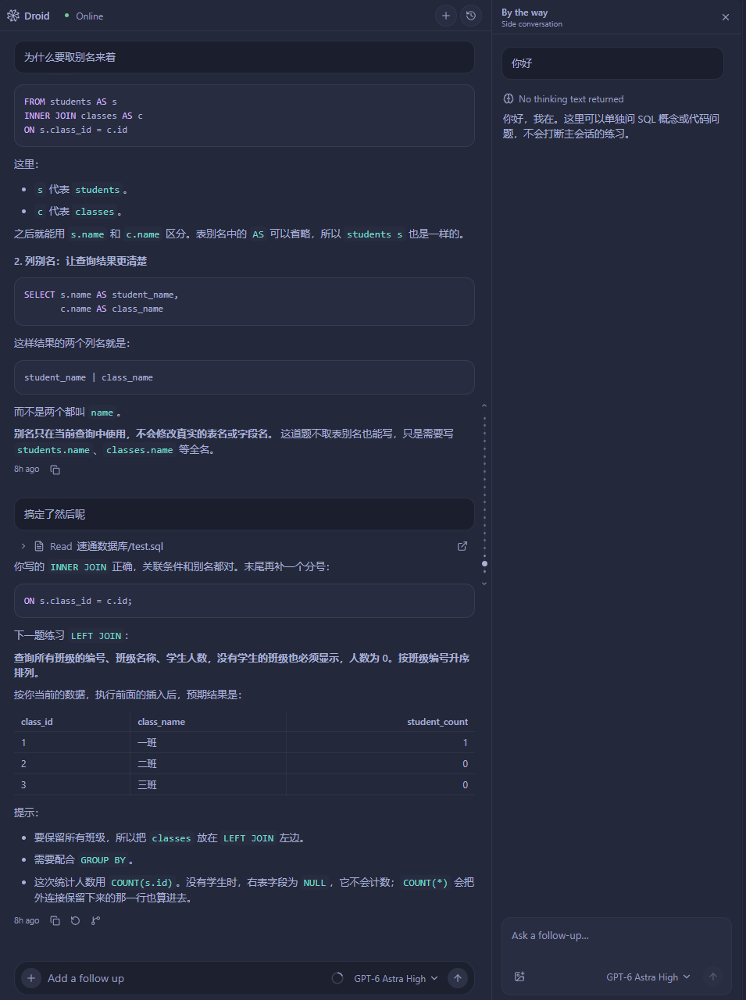
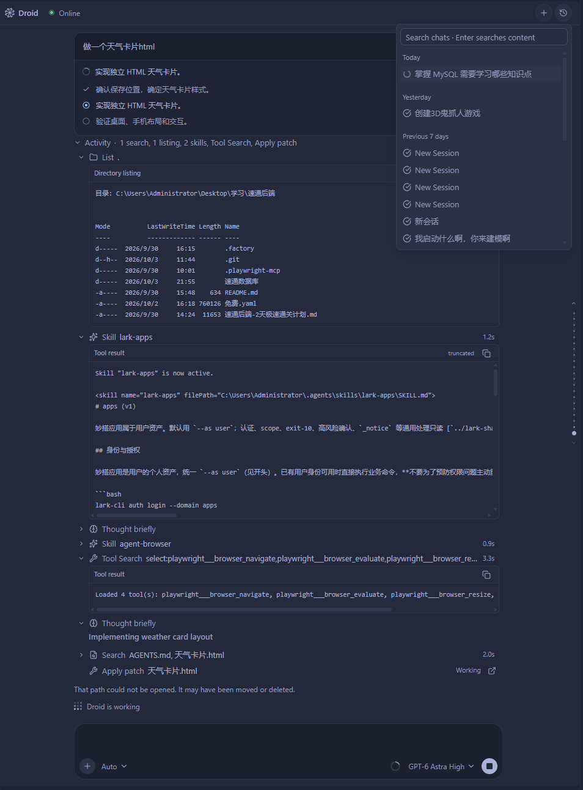

# 聊天与 BTW 旁问

主聊天承载当前任务，BTW 用来围绕一段内容临时追问。
你可以继续阅读主对话，也可以回到旁问查看答案。

## 编辑消息与文件回退

编辑并重发历史消息会调用 Droid SDK 原生 `rewind`，从该消息之前创建后继会话；
默认保留磁盘文件。勾选 **Restore … using Droid checkpoints** 后，Droid 按自己的
检查点恢复可用旧文件并删除新建文件，范围包含该消息之后的后续轮次，同一文件里的
后续手动修改也可能被替换。展开列表检查范围；已回收的检查点会明确列为不可恢复。

文件恢复结果与会话回退结果分别处理。若 Droid 报告恢复／删除失败，或没有确认文件
结果，插件仍接管已创建的后继会话，但停止自动重发，把修改后的文字和可用附件放回
输入区。检查文件后再发送；重接后继会话不会重复执行文件恢复。

聊天改动卡片上的 **Undo** 只针对该轮已确认的文件操作，保留聊天历史，与这里的消息
回退范围不同。详见 [审阅文件改动](REVIEW.md)。

## 把问题放进项目上下文

通过 **Droid: Open Chat** 打开侧栏，在输入框里描述目标。
使用输入区提供的文件、图片和引用入口附上必要信息；发送前可以检查和移除附件。

一个容易执行的请求通常包含目标、范围和完成标准。例如：

> 修复设置页保存后没有更新的问题。先找到保存和读取调用链，修改后说明原因和影响范围。

工具执行过程集中在 Activity 中，点击可以查看细节。
计划、权限请求和提问卡片出现在所属对话里，需要你确认的操作会等待答复。

## 引用一段内容

选中聊天正文时，浮动菜单提供 **Add to Chat** 和 **By the Way**：

- **Add to Chat**：把选中的内容作为引用加入主聊天草稿。
- **By the Way**：带着选中的内容打开旁问。

可以继续追加多段引用，点击引用块查看完整原文，或移除不需要的段落。

## 打开 BTW

除了选中文字，也可以在输入框使用 `/btw` 打开旁问。
在 BTW 中输入问题，按需附上图片，并通过其模型菜单独立选择模型。
模型菜单复用主聊天的搜索与列表。点击当前模型旁的铅笔进入 **Reasoning effort**，
通过单选列表选择档位，或点击 **Back to models** 返回；可选档位以模型能力为准。
所选强度显示在模型名旁；切换模型后使用该模型的默认档位，不会把不支持的档位带过去。
设置只用于 BTW，已排队的问题保留发送时的模型和强度，不改变主聊天配置。

<figure class="droid-screenshot">

<figcaption>主聊天与 BTW 并排显示，各自保留对话和输入区。点击图片查看原图。</figcaption>
</figure>

例如，主任务正在修改登录流程，你可以选中一段说明，问：

> 这里的 refresh token 和 access token 各自负责什么？

BTW 使用独立的侧问答会话，这段追问不会作为新消息追加到主聊天。
它仍属于当前主会话，切换到另一会话后不会把这段旁问混进去。
模型能使用哪些能力取决于当前 Droid 会话与服务配置。

关闭旁问面板只收起界面；要中断正在生成的旁问，请使用其停止按钮。
重新打开可以继续查看同一会话中的旁问和未发送草稿。

## 连续提问、停止与恢复

主任务仍在运行时，新消息可能进入队列。排队表示等待当前轮次，不能据此判断模型已经读到新问题。

需要停止时点击输入区的停止按钮。后台确认结束后才能确定任务已停止；
如果显示停止未确认，先检查状态，避免反复发送同一句话。

默认 daemon 模式支持后台持续运行。Reload Window 之后界面会尝试恢复原会话，
但断线期间的任务状态需要重新确认。连接提示和任务进度含义不同，
具体处理见 [排障与诊断](TROUBLESHOOTING.md)。

## 历史与导出

从聊天顶部的历史入口切换已有会话，查看该会话的消息与工具记录。
需要保存可阅读的副本时，执行 **Droid: Export Session as Markdown**。

<figure class="droid-screenshot">

<figcaption>从右上角打开历史菜单，搜索或切换会话。点击图片查看原图。</figcaption>
</figure>

导出前检查正文、路径、附件和工具输出是否含有个人或项目敏感信息。
本地历史与恢复数据不随代码仓库自动迁移到另一台电脑。
