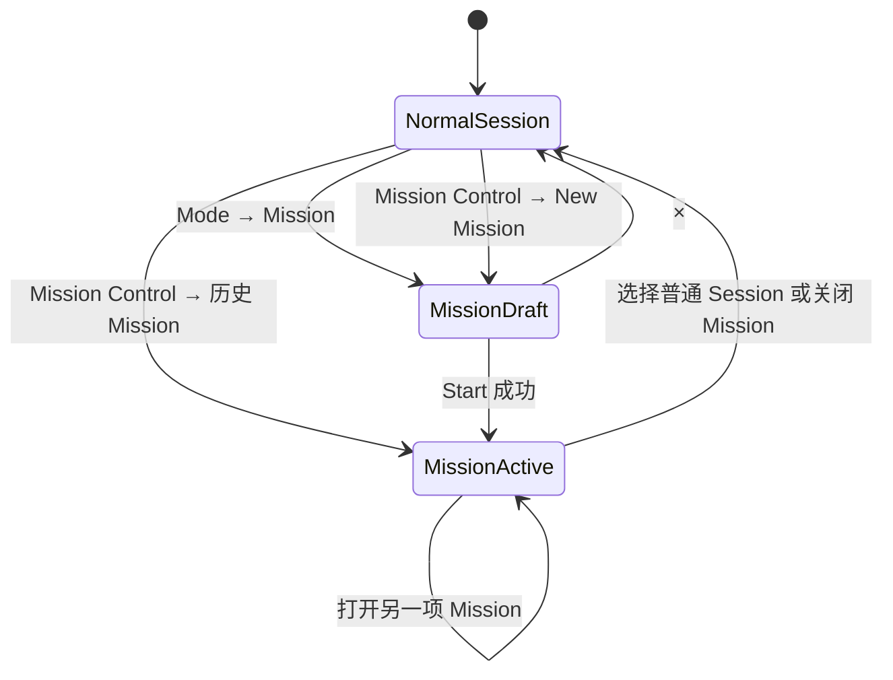
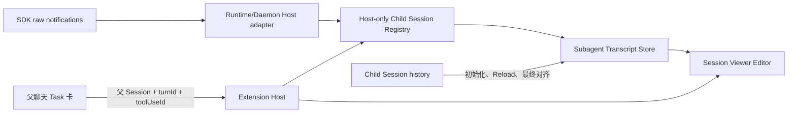
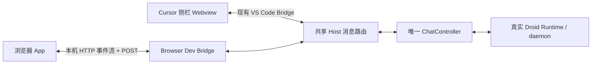
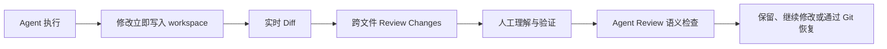

# 设计规则

## 系统提示与 SDK 设置

- 系统提示使用共享 Dialog、选择器和多行输入，明确“新会话”作用范围；默认、追加和
  替换分别说明效果，保存须收到 Host 确认，失败保留输入，不把用户默认设置显示为
  当前旧会话的实际提示。设置搜索应覆盖新增入口。
- 模型选项保留真实禁用原因及图片能力，禁用项不可选择；Mission 的目录只投影其协议
  支持的字段。Worktree 删除与强制归档通过原生管理流程展示实际对象、影响并确认。
- 仅供用户查看的历史记录以只读记录展示，不冒充一次模型回复或可重发的用户问题；
  daemon 不支持追加时在入口说明后端限制。

## 多段引用与侧问状态

- 引用以轻边框、紧凑单行小块显示，多段可换行并在集合过高时滚动；点击或键盘
  打开气泡查看可选择、保留换行的完整原文，长原文在卡片内部滚动。悬停不缩放，
  不使用整段强底色；关闭遵循 Radix 焦点语义，主动删除引用后回到对应编辑框。
- 聊天正文中的 Add to Chat 与 By the Way 追加引用，不覆盖已有段落或正在编辑的正文；超限
  明确提示且保持原稿。已发送问题的引用预览与正文编辑为独立按钮区域。
- BTW 从准备、等待到思考、使用工具、接收正文持续显示真实状态，已有正文时
  状态位于回答末尾，结束即移除；未知活动只显示等待，不编造思考内容或百分比。
- BTW 复用主聊天的 UserMessageBubble、正文排版与代码块，不显示 You／Droid
  说话人标签。面板标题与输入区固定，当前问题在自己的回合内吸顶，下一回合
  自然推离；吸顶使用不透明背景遮挡后方正文，长问题和引用在卡内滚动查看全文。
- Composer、控件、菜单及快捷键提示不参与拖选；共享输入控件仅在空值占位状态
  禁止选择，实际输入内容仍可编辑和复制。引用气泡标题不可选，引用原文、回复
  正文、代码和错误信息保留选择能力，不对整个 Webview 禁用文本选择。
- 浮在主聊天滚动区之外的问题卡、问题导航和跳到底部按钮将纵向滚轮转交给所属
  聊天；内部长内容在当前方向还有可滚距离时优先原生滚动。代码、工具预览、计划、
  历史编辑和 BTW 问题到边界后继续滚动聊天，顶层聊天与侧栏之间仍隔离滚动。
  滚轮取消自动导航，向上阅读解除跟随；只有实际滚回底部才重新跟随。

## 子代理进度

- Mission worker 与普通 Task 的数据来源不同，但都必须在聊天中提供明确的查看入口；
  Mission 的“查看子代理”在执行时保持可用，打开真实 worker 的持续更新查看器，
  不把只读查看操作随发送／修改设置一起禁用。绑定不可用或状态过期须反馈并提供刷新。

- 子代理任务卡独立显示在所属轮次，不进入默认折叠的 Activity；运行与完成后均
  保留记录，主回复结束不隐藏后台任务，也不因此改变前台运行状态。
- 任务卡片展示实际生命周期与最新活动；未知状态不伪装 Pending，未知起始时间不
  从组件挂载时间计时。运行时使用记录的 startedAt，终态使用实际 durationMs。
- 当前回合全部活跃工具均为委派时显示 Waiting for subagent(s)；普通工具并行或
  父会话正在继续回复时保留对应工作状态，后台任务不把父会话永久标成等待。
- 外部只读文件显示文件名和 outside workspace，活动目标与可打开路径严格分开。
  长描述可换行，状态保持可见，沿用原有轻量卡片、共享按钮和主题。

## 分发标识

产品展示名称为 Droid，扩展列表、Activity Bar、命令、设置分组、关于弹层、
日志频道及导出文字保持一致。既有扩展身份 `droidvisx.droidvisx`、命令／配置
命名空间和本地存储路径保留，覆盖安装沿用原设置及会话。

标识按用户要求直接提取自 [Factory 官网](https://factory.com/) 的内联 SVG
（2026-09-23，`mobile-nav-logo`），保留原始 `viewBox="0 0 67 65"` 与完整路径，
不重新描边或修改叶片形状。Activity Bar 使用 `resources/droidvisx.svg` 并随主题
着色；扩展列表 PNG 为原图等比栅格化的 256×256 黑线浅底版本。聊天标题与关于
弹层复用同一路径的共享 `PinwheelIcon`，不增加持续旋转。图形来源为 Factory，
扩展仍保留非官方说明，不将使用该图形表述为获得官方背书。

聊天头部的 Droid 标题提供版本弹层，显示 package.json 版本和本次构建标识；
同一生产构建的各入口共用一个标识，浏览器开发版明确显示 browser-dev。
入口不依赖 Runtime 连接，不增加常驻版本行，更新后须 Reload Window 加载新构建。

## 可复用前端边界

- 公共视觉与交互唯一实现位于 `packages/chat-ui`；抽包不改变现有布局、尺寸、
  主题、选区、问题导航、计划高度或运行中操作栏规则。
- 公共界面接收展示数据、可用回调和插槽。产品名由环境注入，模式／模型及权限
  语义由项目提供，不能要求其他 CLI 冒充 Droid 的工具名称或 Mission 状态。
- 独立 CSS 的 reset／选择器限制在 `.agent-chat-ui`，Portal 留在同一根容器。
  light/dark 与字体使用公共 token，VS Code Auto 颜色映射留在应用 shell。
- 文件恢复、权限、真实执行、会话管理结果及 HTML 沙箱均由宿主负责；
  控件不能因为提供回调就声称后台已经完成，不支持的会话操作隐藏。

## 控件状态与轻量动效

- Chat、Models、Mission、Viewer、Review 共用柔和状态层；保留既有布局、尺寸、
  字号与主题色调。主聊天框使用 18px 圆角，侧聊与消息编辑框使用 12px 圆角；
  输入聚焦只加深原有 1px 边线，不增加光晕、外阴影或内部重复焦点环。
- 普通按钮统一 6px 圆角，悬停和按下以轻微底色变化反馈；模型入口、发送按钮、
  卡片和菜单均不进行装饰性缩放或位移。发送按钮仍为 26px 圆形。
  模型、模式及设置入口的打开态使用轻底色，选中状态保留勾选、文字等既有标识。
- 聊天中的思考、活动、命令及同类展开标题保持透明背景；悬停和按下均不铺整行
  色块，命令外框不随悬停加深。展开箭头和键盘焦点仍清晰可见。
- 同类工具标题复用共享 Button 的单线键盘焦点，标题与图标随父级轻量变色；
  AskUser 选项的闲置底色不覆盖悬停和真实选中状态，等待期间保持禁用并标识 busy。
- `--control-surface-hover`／`--control-surface-active` 从正文色与背景派生 6%／9%
  状态层；分隔用 `--panel-edge`，悬停与输入聚焦边线分别使用 18%／24% 混色。
  Auto 基础边线为 14% 混色。只降低装饰对比，正文、错误和状态标签保持可读。
- 键盘操作保留单线 `focus-visible`，Auto 使用编辑器 `focusBorder`；输入框使用
  独立的柔和聚焦边线。共享 Radix 继续负责定位、焦点返回、禁用和键盘导航。
- 控件颜色过渡 120ms，菜单、Select、Popover 与 Tooltip 仅淡入 120ms／淡出 100ms；
  Dialog 遮罩轻淡入，弹层阴影统一收敛。稳定连接状态不持续闪动，连接中与工作中
  保留真实进度反馈；媒体预览的缩放／拖拽以及开关、折叠的状态运动照常保留。
- `prefers-reduced-motion: reduce` 关闭上述过渡，保留静态悬停、选中和焦点反馈；
  动效不改变输入自动增高、IME、选区或聊天滚动策略。

## 聊天空白页与输入区

- 新会话使用居中的窄内容区、左对齐标题和两条轻量起步入口；只常驻工作区名称，
  完整路径放在悬停提示中。模型以输入区选择器为准，设置未就绪时才显示状态说明。
  起步入口只填入草稿，不自动发送。
- 聊天框内部宽度不超过 520px 时，输入独占上行，模式、模型和发送按钮位于下行；
  更宽时保留紧凑单行。文字 14px／20px，按实际宽度和行高测量；空占位文字也计入，
  只有超过 168px 高度上限才显示纵向滚动条。模型变化导致输入宽度变化时重新测量。

## 计划确认

- ExitSpecMode 的原文与可编辑计划来自同一正文时，只展示一份 Markdown；编辑器
  同步后的正文优先，包括空正文，不回退显示旧计划。其他工具详情和风险提示保留。
- 计划确认使用一个正文滚动区，标题与审批操作保留在滚动区外，不叠加原文预览。
- Approve plan 默认匹配当前会话已确认的 autonomy，继续使用 SDK 默认的当前／新
  会话目标；匹配只在本次请求真实提供的选项中进行。下拉菜单保留显式改选，编辑计划
  的草稿提交继续使用同一默认批准项，不由页面另行猜测档位。

## Changes 与 Auto 可读性

- Review 文件列表和代码区分别滚动，长路径不撑开页面；统一 Diff 的所有行背景
  覆盖相同内容宽度，横向滚动仅在代码区。切换文件清零横纵位置，分栏随宽度换行。
  工具栏与底部动作保持可见，窄窗口按操作组换行；长列表保留键盘导航和选中定位。
- 长对话的显式跳底保留平滑动画，输入区／窗口尺寸变化不令动画中途瞬移。
  用户上滑、选择文字或进入嵌套滚动区可停止跟随；减少动态效果偏好直接到达目标。
- 生成中的已确认操作显示轻量单文件行，点击才展开完整保留的 Diff；停止尚未确认
  仍保持进行态。成功编辑行独立于折叠活动区，避免回复继续时看不到刚修改的文件。
  文件行占满消息宽度，Review 固定在右侧；悬停、按下、展开均保持透明，文字轻微
  变色，Review 悬停加下划线，键盘焦点保留细描边，不铺整行灰底。
- 回合结算后成功编辑行收进该轮回复正文后的单张汇总卡，复制／时间等回复操作
  位于卡片后。默认列三个文件，其余由 Radix 折叠展开；新轮次不挪用旧轮卡片。
  卡片使用 8px 圆角、轻边框和极浅中性背景；标题与统计优先同排，窄宽度自然换行。
  头部上下留白 6px，图标 14px、文字 12px，操作按钮最小 24px，文件行 28px；
  窄卡隐藏装饰图标以保留标题和按钮空间；进行中的单文件行维持原尺寸。
  点击只有颜色反馈，不缩放。
- 点击文件进入该轮 AI operations 并定位文件；Review 查看整轮，Undo…进入已有
  撤销预览与确认。只读／离线无写操作，文件行改为展开已存的操作片段。
  同一路径合并显示，行数明确为累计操作行数；失败、未确认和缺失正文不伪装成功。
- 聊天 Diff 和底部修改计数只使用工具结果中已确认的 AI 操作；整轮工作区
  快照不进入回复。目标路径、输入片段和文件监听不能证明作者归属；缺补丁
  明确提示缺失，不根据同文件的工作区净变化补齐。
- 底栏只显示当前轮已确认的 AI 文件数并打开 AI operations，历史操作留在
  所属消息。Workspace／Turn workspace／Branch／暂存区比较在独立 Review
  主动选择；这些范围可以包含手动修改，不作为 AI 修改卡片的数据来源。
- Auto 使用编辑器前景／背景的配套色；辅助文字保留正文色 85%，不直接沿用
  descriptionForeground。输入、引用、弹层与代码表面从同一背景轻量派生，
  不把按钮背景当卡片底色。Diff 正文显式使用正文色，不能继承工具元信息的淡色。
- Auto 的语法高亮、增删底色与上述表面成组调整；保留外部主题的基础色调、
  按钮色对和焦点色，不修改用户主题配置，手动 Light／Dark 继续使用各自基底色。

## BTW 侧聊

- 标题栏为 44px，显示 By the way 与轻量的 Side conversation 说明；
  真实状态和关闭操作保持可见，不放大标题或使用装饰性面板。
- 用户问题使用浅底卡片，回答不套框，不显示 You／Droid 标签；
  正文统一 13px／21px，段落间距 8px。样式只作用于 BTW，不改主聊天正文。
- BTW 思考文本放在所属回答前的紧凑折叠行，默认收起，沿用共享 Tool 和思考 Markdown
  渲染。展开后独立限高滚动，代码复用多语言高亮；接收中显示 Thinking／Receiving，
  结束后显示 SDK 返回的实际耗时，缺少耗时使用 Thoughts。只有思考状态／耗时则使用
  不可展开的轻量行；已完成回答未返回思考文本时标明 No thinking text returned。
  不编造耗时或未返回的文本，不显示空折叠区；超过本地文本上限时明确提示。
- 引用使用紧凑摘要块，点击共享 Popover 查看可滚动的完整原文；
  移除操作独立于展开，使用共享 Button 保留键盘语义。
- Composer 沿用主聊天的轻边框、12px 圆角与圆形发送按钮。聚焦只轻微加深
  原边框，不增加光圈；发送和停止互斥占用同一个 26px 位置。
  保留排队追问，移除冗余 Shift+Enter 说明，不增加额外操作行。
- 输入高度在脱离布局、不可聚焦的同宽副本中测量，再应用最终 44–144px 高度，
  不临时压低真实输入框；保留拖拽宽度、IME、焦点恢复和既有滚动跟随规则。
- 关闭只隐藏侧栏，不停止侧答、不清空同会话草稿；重开保留文字、引用、图片和
  显式模型选择。切换主会话后清理，短暂恢复/不可用状态不丢当前草稿。
- 图片准备中拦截发送。提交后显示 Sending，Host 确认接受后只清本次提交内容，
  后续输入保留；5 秒无确认恢复发送入口并说明“尚未确认，先检查对话”，不将
  超时伪装成拒绝或成功，也不自动重复发送。失败时保留完整草稿供用户处理。

## 共享下拉菜单

- Select 弹层与触发器同宽，并受视口边界限制；文字左对齐，选中勾在右侧。
  长选项在已有宽度内换行，不以内容撑宽弹层。
- Review 范围与上下文行数使用稳定触发器宽度，切换选项不使工具栏横向跳动。

## 恢复文件列表

- 工作区内的文件名可点击查看当前文件，查看动作与恢复勾选、重发分开。
  明确区分当前文件与恢复前后 Diff；没有可信目标正文时不得冒充恢复预览。
- 工作区外／未知工作区的 basename 不作为可打开路径，不猜测绝对位置。

## 正文选区与操作控件

- 普通按钮、选择器、菜单、页签、单选组和 Plan 折叠标题不允许选中文字；
  正文中的路径按钮显式启用 textSelectable，拖选不执行点击动作。
- 选区菜单和滚动／吸顶保护共用 `readTranscriptSelection`。同时检查选区
  起点与终点，排除整个编辑区、弹层和恢复文件操作区，不能把控件标签当正文。
- 正文、代码、工具输出和 Plan 条目保持可选；输入框保留原生编辑及复制，
  不弹出正文 Copy／Add to Chat／By the Way 浮条。菜单动作执行前重读选区。

## Plan 高度与回复操作栏

- Plan 折叠和展开的标题行统一为 22px；仅条目内容展开，不改变标题高度。
- Copy／Regenerate／Fork 归属用户问题之间整次回复的最后一个分组，
  包括末尾工具或诊断分组；复制内容仍汇总整次回复的助手正文。
  独立系统诊断不因此获得回复操作栏。
- 提交、流式与停止处理中，当前用户回复行继续隐藏操作栏。恢复历史不重写
  Runtime turnId，也不将历史加载完整性当作回复完成状态。

## Runtime 与 Skills 原生管理（2026-09-13）

- 设置页签使用共享 Radix Tabs。Runtime 页提供 daemon 终端及 Droid 更新入口；
  Skills 页保留快速启停，另提供定义检查和用户／项目范围管理。
- 交互终端和只读 Execute 镜像明确区分。打开前说明直接 shell 输入和关闭行为；
  关闭本地终端只断开视图，Close daemon shell 必须另行确认。
- 已有终端只展示新输出，并明确说明缺少历史；启动中、输入队列满、连接失败
  和未确认输入均给出提示，不静默重发。切换会话后必须重新从管理入口打开。
- Skills 区分设置范围、禁用来源和最终有效状态。Frontmatter／其他层级仍禁用时，
  不将移除当前层级的禁用记录说成技能已启用。检查快照与原文件分开，打开原文件
  需确认，插件或技能内容不作为界面指令执行。

## 聊天滚动过渡（2026-09-11）

- 程序导航与流式跟随由 `useTranscriptScroll` 统一写入滚动位置；用户滚轮和
  触控板仍由浏览器处理，不通过 preventDefault 接管原生手势。
- 到底部、右侧问题点、上一题／下一题使用按时间差计算的渐近缓动，
  不按固定帧数执行；临近目标至少推进一个像素，防止取整造成动画停不下来。
- 历史目标从虚拟列表实时测量值读取，并扣除吸顶上边距 12px；动画期间不再叠加
  虚拟器的独立位置补偿。目标连续稳定后结束，不使用一次性的估算像素作为终点。
- 虚拟测量改变目标坐标时，同步移动当前坐标并保持剩余导航距离；只对导航本身
  缓动，不把测量变化再做一次向上／向下的追赶动画。
- 问题导航不添加末尾补白；靠后问题无法对齐顶部时，落点限制在实际内容底部，
  不通过撑大 scrollHeight 强行吸顶。
- 选择文本、手动滚动、触摸和滚动按键优先，随时中断跟随／导航；
  Escape 可取消导航。会话更换／发送重置即时定位，减少动态效果时即时到达。
- 上滑后即使距底部不足 4px，也保持阅读状态；只有实际向下回到底部或显式
  到底部动作恢复跟随。滚轮意图在聊天根区域捕获，但不 preventDefault 或重写手势。
- 跟随／导航持有滚动位置时，虚拟列表不再独立写入位置；手动阅读时保留高度补偿。
  已有跟随状态只由用户输入解除，布局引起的 scroll 事件不作为用户上翻意图。
- 重新跟随同时要求用户滚动意图与当前真实底部；布局补偿及旧底部位置不作为
  返回底部。滚动结束清理手势意图，回复完成不触发重置。活动组默认收起，
  显式展开／收起选择在追加、完成和虚拟卸载后保留，不跟随运行状态反复切换。
- 子代理／只读 Session Viewer 共用该协调器，禁止自行在每次 transcript 更新时
  强制写到底部。正文为单一有界纵向滚动区，Invocation details 不再另设纵向
  滚动上限；离底时提供显式到底部按钮，不改变只读与 Stop 行为。
- 滚动像素变化不驱动整个 Transcript React 树更新；问题边界与虚拟范围变化
  才更新内容，吸顶推离只在 RAF 更新 transform。选区保持期间不更新吸顶位置。
  主聊天和 Viewer 每侧预加载 2 个虚拟项，选区涉及的主聊天行额外保留。
- 选区冻结吸顶 owner 时仍按最新测量判断问题是否越过顶部边界；原位重新进入
  视口就恢复显示，保留的吸顶节点只隐藏并 inert，不卸载或继续留下不可见问题卡。
- 只读回复复用既有 memo 渲染器，不用每次新建的回调破坏缓存。流式代码按
  150ms 节流着色，已知语言的完整代码块不等待整条回复结束；未着色的新文字
  立即以正文前景色追加，替换内容或语言时不沿用不匹配的高亮。流式阶段不猜
  未标明的语言，回复结束后再有界识别；超过 32,000 字符的代码块保留完整纯文本。
  代码块显式设置正文前景色与透明背景，不继承宿主行内代码色；复制始终使用
  完整原文，不以性能优化截断正文。
- 正文、思考代码块与源码预览使用共享 `CodeSyntax` 着色，保留各自容器和动作。
  语言语法、别名与嵌入候选集中在 `markdown/codeLanguages.ts`，不在业务页面添加
  语言判断。明确语言优先、文件后缀辅助、缺失信息有界识别；无法可靠识别时保留
  原文。思考继续使用紧凑容器，不增加复制工具栏、Canvas 或其他正文动作。
- 虚拟行重新进入视口时，短中篇正文也可复用共享 Markdown 缓存；同步渲染必须
  全文完全匹配，不能把已缓存的流式前缀冒充完整回复。缓存最多 128 条、总输入
  1,048,576 字符；代码高亮另外按完整源码及有效语言配置有界复用，最多 128 条、
  键与结果合计 1,048,576 字符。两者均为当前 Webview 内存缓存，不持久化源码。
- Viewer 相同快照不触发正文更新；追加输出时保留所有字段未变的历史消息引用，
  复用主聊天描述器与操作摘要选择器。状态和停止反馈仍独立更新，目标变化不沿用
  前一快照。手动滚动仍由原生事件即时处理，不增加停止滚动后的延迟刷新。
- 同一文件的累计 Diff 后台刷新保留已有正文直到新结果返回，避免 Loading 占位
  与完整差异反复切换高度；首次加载、身份切换、失败和重试继续明确反馈。
- 右侧圆点改变 transform、opacity 和颜色，不动画宽高；提示框短淡入。
  不重建消息 DOM，不改变虚拟行选择保护和吸顶遮挡。

## Droid 状态动效（2026-09-11）

- 使用现有工作提示的 3×3 像素点阵作为统一图形。行内尺寸 13px，页面加载尺寸
  32px，不给文字加闪烁、渐变扫光或逐字动画，不改变文本选择与流式节点。
- 主聊天过程记录不重复显示点阵：Activity 组头只保留箭头和文字，
  工作点阵集中在底部状态提示；页面加载与连接点动效不受此限制。
- 工具工作中以 1440ms 周期逐格推进；思考采用 2600ms 呼吸；加载点阵周期
  1800ms，状态区域仅在挂载时执行 200ms／4px 的淡入，不等待动画结束才展示数据。
- 顶部连接点：在线 3600ms 低强度呼吸，工作时 2000ms 柔光圈，连接中黄色
  1600ms 脉冲；不可用红点静止。此规则允许在线状态的低频呼吸，不将其解释为任务进度。
- 加载统一为点阵、真实状态标题和必要说明，不增加进度百分比、假骨架内容或
  新后台请求。错误、无数据及不可用均不播放加载循环。
- 动画由真实组件状态挂载／卸载，不记录额外生命周期；只动画 opacity／transform。
  `prefers-reduced-motion: reduce` 关闭全部新增动画、光圈与位移，仍显示静态状态。
- 范围为工作／思考提示、连接点和主要页面加载；不顺带重做菜单、Diff、正文或
  表单布局。未获许可不进行测试或浏览器视觉探测。

## Cursor 中间聊天区域参照（2026-09-10）

用户批准按 Cursor Agent 已登录页面的中间聊天区域调整 V2 Chat。此节覆盖此前
Chat 的 V1 排版、单项 Activity 详情和历史 Plan 位置约定；不扩展到侧栏及其他工作台。

- 轨道 720px、正文 702px；窄面板保留两侧留白。后续按旧 Cursor 截图修正底部：
  单行状态整体约 44px，依次是加号、输入、Context 圆圈、模型和发送／停止。
  多行状态正文独占上方，操作固定在底部，并显示模式入口（含 Mission）；
  短文本／清空后恢复单行并隐藏模式入口。
  已确认的局部改版只调整输入框上方队列、文件条与问题下的任务卡。队列／文件区
  共用边线并平面堆叠，左右内收 12px；队列默认展开，文件区默认收起，无内容隐藏。
  队列标题与普通消息行最小 28px，文件标题最小 30px，文件行最小 28px；
  展开列表分别限高 144px／128px（同时受视口高度限制）。队列悬停／聚焦显示
  Send Now、编辑、删除并预留位置；触控可直接操作，窄面板缩为带标签的图标。
  Review／Stop 使用现有动作，文件路径悬停可读；暂停、恢复、清空和附件／引用保留。
  折叠状态不因点击外部或流式内容更新重置，切换会话重置。
  加号菜单不放额外 Context／Mission 文字行及重复模式项。加号与 Context 弹层
  以整个 Composer 为定位锚点，跟随其宽度并对齐左右边线，顶部间距 8px；
  模型弹层独立保持 240px，
  并受视口限制；附件使用 32px 单行与悬停说明，模型长名称允许换行，推理强度使用
  弱化文字，编辑入口始终可见。搜索、附件和真实设置功能保留。
  搜索图标和输入使用独立布局列，不叠加定位；两个搜索栏左边距一致，焦点以底边
  提示，不显示额外输入框。Autonomy／Theme 标题、值和箭头保持横排，
  点击在原菜单内推开选项，不弹独立卡片；共享 Collapsible 与 RadioGroup
  管理展开和选择，保留高度过渡，选中后收起并将焦点还给标题行。
  Context 保留用量与事实说明，长帮助移到悬停提示，压缩动作单行。
  这一多行修正按用户禁令不运行测试或截图探测，实际效果由用户查看。
  按后续边线反馈，Footer 与 Transcript 共用两侧 9px 内边距，使消息卡、代码块、
  Review 和 Composer 外边线一致。无附件时不渲染附件区域，避免额外的顶部空白。
- 顶栏下方的吸顶卡保留 12px 上间距，该区域由不透明背景遮挡，不允许滚动正文
  从卡片上方透出。吸顶进入阈值、导航归属和下一条问题的推离计算使用同一间距。
  遮挡只覆盖顶部空隙，不在卡片底部添加额外背景占位，不改变编辑和选区所有权。
- 正文 13px／19.5px；h1/h2 为 16px／24px、600 字重，h3 为 13px／18px、600 字重。
  标题上间距 16px；列表缩进 26px、项内上下 4px。用户在窄版预览反馈“太挤”后，
  段落下间距由参照 4px 调为 8px，连续代码块间距由 4px 调为 12px，
  保留 13px 正文字号，不以缩小文字换取空间；320px 仅作边界检查，默认展示宽版。
  原文结构保持原样，不能把短段落猜成标题或自动合并。
- 代码块 12px／18px、12px 圆角和内部滚动；复制入口 hover／焦点出现，
  触摸环境始终可见。长路径使用等宽行内链接，优先在目录分隔处断行，
  超长单个文件名仍可换行；点击由 Host 打开文件，
  不由浏览器访问本机路径。
- 表格实测单元格 12px／16px、5px 9px 内边距，透明表头、600 字重，
  淡色右边界与下边界；保留横向内部滚动。
- Activity 汇总按真实过程状态显示，各 Thinking／文件工具／Todo／终端独立行内展开。
  单项活动和纯思考记录直接显示原行；两项及以上的混合活动显示分组摘要，
  默认收起。展开时组头显示调用汇总，避免 Thinking 再包一层 Thinking；
  逻辑分组及消息／活动身份不变。工具状态和耗时只在行头显示，详情不重复
  工具名称、Lifecycle 或进度事件计数；没有实际详情时不显示空展开入口。
  用户消息下方仅留 8px，再接 Activity 的内部间距；回复结束后的轮次留白不变。
  Thought／工具活动行不使用整行悬停灰底，保留展开箭头及键盘焦点提示。
  活动组不叠加上下内边距和行间距；活动行最小高度 24px，详情块间距及底部留白
  为 4px。运行中回复末尾留 8px，运行提示上下内边距 4px；完成后的轮次分隔保留。
  收起的组头最小高度 24px，可见内容块间距 4px；空白正文与隐藏的 Changes
  不留下空布局行。仅调整显示，不修改原文、复制文本或工具组的独立身份。
  Todo 与所属问题组成 12px 圆角一体卡片并参与吸顶；任务区垂直内边距 2px，
  标题行最小 32px，无独立悬停底色，保留键盘焦点与折叠箭头动画。标题取真实
  当前任务，右侧始终显示完成数；运行中圆环、待执行空心圆、已完成勾号区分状态。
  展开步骤行距 18px、上下内边距各 4px，列表限高 168px／30vh；后续更新同一条计划，
  完成后保留摘要，新计划不删除历史，不在过程区或 Composer 上方重复展示。
  缺整轮时间时不显示“Worked for”猜测值，失败与中止分别标识。
- Chat Diff 沿用有来源的操作片段，13px／18px、实际增删计数、主题增删底色。
  生成中逐文件折叠详情，结束后按轮次汇总；工作区快照仅在独立 Review 比较。
  Review 工作台和恢复保护不变，操作记录与工作区净变化分别标注。

明确保留的参照差异：Droid 品牌与专属控件、VS Code 字体／主题、吸顶编辑和问题导航、
Host／Bridge 安全动作。组件使用项目共享 shadcn/Radix，不移植 Cursor 私有实现。
取证是授权的可见 UI／样式测量；不宣称完成 website-rebuild 的匿名镜像或源码等价门。
浏览器用于尺寸、状态和局部截图核对，最终视觉及实际功能由用户在 Cursor 中验收。

## 统一组件库

- 生产 CSS 扫描统一前端目录，包含已归位的 SettingsPopover、ModelPopover、
  ContextPopover；公共组件样式由 `packages/chat-ui` 提供。
- 五个生产入口的交互使用共享 `ui/` shadcn/Radix 组件；具体执行规则见 AGENTS.md。
  Select、单／复选、开关、页签、菜单和折叠交给对应 primitives 管理语义与键盘操作。
- 紧凑行、附件、文本操作使用共享 Button 的 plain 变体，保留现有 CSS 的布局与主题，
  不强加按钮高度／图标尺寸。编辑输入使用共享 Textarea，保留原有尺寸、选区和 IME。
- 需要保留选中／流式节点的折叠使用 Radix Root／Trigger 与共享动画内容层组合，
  不引回测量导致的终端动画跳变。多行补全使用 Popover／Button 组合且不抢输入焦点。
- Slash 技能候选只显示名称、单行简介和 View；完整描述不在候选列表底部常驻。
  悬停 400ms 后以共享 HoverCard 浮层预览，View 以 Popover 固定查看，二者互斥。
  浮层随视口避让、长文内部滚动，悬停保留输入焦点；点击名称和 Enter/Tab 仍选择技能。
- 主聊天的用户气泡和 Composer 使用独立底色，深色主题分别在当前背景上混入
  24%／20% 黑色，浅色主题分别混入 7%／4% 前景色；Auto 保留编辑器主题色调。
  已发送消息的阅读态与点击后的编辑态共用同一气泡底色，聚焦只强调边框，吸顶副本同步。
  正文、工具结果和代码块保持各自底色，用户消息与输入区有更明确的明暗层次。
- Chat Review 入口为紧贴 Composer 的紧凑文件条，左右内收 8px：14px Diff 图标、
  左侧 `N Files` 和 `This turn`／完成状态，右侧明确的 `Review` 动作外观。
  最小高度 30px、细边框和独立底色；整条复用共享 Button 打开当前轮已确认操作，
  不展示不存在的展开箭头，不改变统计来源。Hover／按压强调右侧动作，键盘焦点保留轮廓。

## 最新体验纠偏
- 主聊天使用 Runtime 明确报告的压缩阶段显示“Compacting conversation…”，
  不把停止输出文本等同任务结束，不猜测压缩进度；正式完成仍以 Host 为准。
- 工具／命令标题、路径与耗时，以及 Source preview／truncated 等过程标记不可
  拖选；实际读取结果、命令正文、代码、Diff 与回答仍可复制。
- 会话菜单搜索框遵循共享输入的主题焦点色和轻光晕，保留 1px 边框和自动聚焦。

- Changes 总增删只在全部文件计数完整时显示；未知不能当零，完整零值使用
  “No net line changes”说明。工具启动事件可能晚于写入，实时统计优先使用
  轮次 before 快照作基线，不把修改后的文件再次当作原始版本。
- 选中文字时保留原 DOM 节点，吸顶副本不交接、虚拟行不移除。
  同一会话、同一问题的吸顶推离位移保持选择前实际呈现的值，不强制归零；
  清除选区后恢复计算，切换会话或问题不复用旧位移。
- 正文、实际命令内容、结果片段、Plan 与正文中的路径可选中复制；文本型按钮
  使用共享 Button 的 `textSelectable`，拖选后的鼠标点击不执行动作，普通点击和
  键盘操作保留。只读消息用普通文字容器，不借禁用按钮展示正文。
  链接拖选不触发导航；选区浮条提供 Copy，保留选区及原始空白，通过 Host 回执反馈。
  拖选结束后才显示引用浮条，浮条本身不可选，滚动跟随不能抢夺选择动作。
- 问题卡片阅读态、Thinking 标题与正文、Processing／Worked 组标题及底部工作状态
  不允许文本选择，不触发普通拖选复制／引用；点击编辑、折叠和键盘操作保留。
  问题编辑输入框不受此限制，正文回答、工具结果、代码和 Diff 仍可复制。
- 计数和明细必须指向同一事实；外部文件保留安全名称和位置标记，截断列表显示
  省略数量，未知位置与不可恢复分别说明。恢复明确区分恢复内容和删除新文件。
  Review 列表显示筛选匹配数／总数，区分没有变化与没有匹配，并提供清除过滤。
- 计划留在创建它的已发送问题底部，默认以 32px 透明进度行显示当前步骤、完成数
  和展开箭头；不叠加标题、描边容器或进度条。长标题省略，展开后完整换行显示。
  进行中强调当前步骤，其余步骤弱化；完成项用勾选标记，不加删除线。全部完成后
  标题改为完成步骤数，继续保留历史摘要。每个计划的手动展开选择优先，原位和
  吸顶共享选择；长计划内部滚动，Chat 与 Viewer 共用展示组件。
  首次挂载以 180ms 淡入及上移 4px 出现，展开／收起过渡 200ms；步骤更新只对
  标记和标题做局部变化，不重新播放整块入场动画。活动轮次的状态点轻微呼吸，
  非活动计划静止；减少动态效果时关闭上述动画与过渡。
- 提交、流式输出和停止尚未结束时，所属问题下的回复时间／复制／再生成／分叉
  操作栏均不显示；单条工具停止不等于回答结束，其他已结束历史回答保持原样。
- 用户消息下方不单独占行显示时间；悬停或键盘聚焦问题气泡时，通过共享 Radix
  Tooltip 展示本地完整日期、秒数和时区，吸顶副本与只读 Viewer 保持一致。
  点击进入编辑时不展示时间浮层，保存的原消息时间不变。已结束助手回复仍在底部
  使用紧凑相对时间，悬停／聚焦查看具体时间。记录缺失时在相应提示中显示
  `Time unavailable`，不得用组件挂载、回合渲染或导出时间替代。
  助手回复尾部使用该回复最后一条正文的记录时间，工具尾行不改变时间；它不是
  推算出的完成时间或耗时。Markdown 直接为每条正文写出含 UTC 偏移的完整时间。
- 终端标题保持同行同基线，单层小菜单不做满宽按钮嵌套；
  导航出现不改变正文宽度。开关正文保持连续高度过渡，不能先卸载内容。
- 输入栏的模型、模式、Context 和设置弹层复用 Radix 关闭焦点规则：外部点击
  保留被点击输入框的焦点，键盘关闭返回触发按钮；不在业务关闭回调里无条件
  重新聚焦按钮，以免阻断紧接着的输入、复制与粘贴。
- 复制不改变页面选区，成功反馈等待 Host 剪贴板回执。鼠标打开小菜单不制造
  默认键盘聚焦描边，键盘焦点仍可见。Context 打开主动刷新，不要求额外手动点击。
- 流式正文只渐显新增部分，不打字重播、不人为延迟输出；重解析和正文增长不应
  打断输入或拖慢底部跟随，用户已离底阅读时不抢回滚动。

## 逐次 Diff 与 Review 例外

2026-09-09 用户明确授权 Review 大幅重设计，并选择独立编辑器标签页，保留 Chat。
该区域不再受旧 ReviewDock 布局约束；其他 V1 等价迁移规则不变。

- Chat 修改操作下方直接露出有来源的变化片段，可展开；不照搬第一张参考图，
  不嵌套卡片，不复制整轮统计到每次修改。
- Review 采用 Figma Make Version 2 的编辑器结构：40px 主工具栏、36px 文件栏，
  移除独立范围栏、代码外卡片和底部操作栏，代码直接铺满主区，使用 13px／22px。
  文件路径在同一行显示，长目录优先省略；窄宽度操作自然换行，不压缩代码字体。
- 文件区默认平铺文件名与次行目录，选中项用浅蓝背景和左侧细标识；单文件默认收起，
  多文件默认宽 224px。保留树切换、筛选和虚拟列表，弹层仅保留未审阅筛选。
  宽度通过右侧分隔线拖动；分隔线有 8px 命中区，悬停／聚焦／拖动时显示主题焦点色，
  平时只保留原边线，不使用浏览器原生 resize 角标或额外宽度滑块。左右键调整，
  Home/End 到边界，双击／Enter 恢复默认宽度；宽窄屏均按实际容器限制范围。
- 文件顶栏集中放布局、差异跳转、Viewed、打开文件和更多菜单；更多菜单保留文件导航、
  Mark viewed & next、上下文、原生 Diff 和撤销入口，继续使用原有确认与禁用规则。
- 修改历史使用共享 Radix 菜单，按真实顺序选择单条操作；前后切换显示 Edit N of M，
  选择后回到代码顶部。菜单保留失败、未确认和无正文项，缺失时间不编造。
- Review 范围、修改历史、更多操作和筛选浮层共用锚点动效：160ms 展开、100ms
  收起，仅透明度和朝触发器的 4px 位移／轻微缩放，不改变布局。范围菜单选中项
  保留底色和勾选，悬停／键盘高亮加深；工具栏、文件项和筛选行提供一致悬停反馈。
  使用系统 reduced motion 时关闭上述动画和过渡，禁用操作不提供悬停反馈。
- Recorded edits 以文件内容为主、操作历史为辅。有完整写入记录时默认查看记录版本，
  可切换操作记录；历史菜单显示工具、位置和结果，选择后展示对应正文／补丁。
  空正文条目集中提示，不连续堆叠错误式横条；记录版本不称为当前文件或整轮净 Diff，
  无基线及后续未合入操作须明确标注。此范围不借用 Git A/M/U 徽标或显示空行数统计。
- 文件区与代码区用主题表面色区分，分隔线取代代码卡片；窄屏文件区覆盖展开，
  选择文件后收起。交互采用共享 Radix，未选历史不挂载重复代码 DOM，正文可选择／
  复制，菜单和刷新反馈尊重 reduced motion。
- 缺完整比较证据时不伪造 Native Diff、上下文切换和恢复能力。片段内修改导航
  仍须可用；纯上下文和相同替换不展示为 Diff，保留纯元数据变化。
- 正常快照模式的 Mark & next 必须持久化后更新文件及进度；恢复须有预览、
  二次冲突检查及可见成功／失败反馈，不能仅测试按钮是否发出了消息。
- 增删色低饱和，复用当前主题和 Host CSS 兼容层；文件过滤、树／列表、
  键盘焦点、禁用态、恢复确认、提交失败保留草稿属于实际功能。
- Chat Review 区只作摘要与入口；恢复和 Commit 的确认流程在独立工作台。

## V2 实施方向

2026-09-08 已确认：全部 Webview 保持 Cursor 原生风格，使用 Tailwind 4
与 shadcn/Radix 统一基础控件，AI Elements 仅承担按需展示。
四页 V2 已安装版本因自由重设计被用户否决。完整 V1 的布局、入口、菜单、信息、
状态和操作链路均是等价迁移基线，不限于用户截图，不得因换库删减、合并或挪动。
最终 Cursor 内视觉和交互由用户验收，不再安排额外浏览器验收。

- `src/webview-v2/theme.css` 统一语义 token，Auto 映射 VS Code/Cursor 变量，
  Light/Dark 使用相同 token。弹层沿用相同主题作用域，不加载远端字体。
- 使用编辑器字体、13px 正文与紧凑控件；不采用 AI Elements 默认品牌色、
  消息气泡密度或自动滚动，不给各功能再建立独立主题。
- 底部跟随、问题导航、吸顶与虚拟列表必须由同一个滚动协调层负责；
  一个编辑草稿 owner，原位与吸顶不能同时可操作，不能重复挂接自动跟随。
- 基础组件统一处理禁用、焦点、错误和 Portal；业务组件只接收 props/actions，
  不从基础组件订阅 Bridge 或获取模型凭据。

## 目标

界面融入 Cursor Secondary Sidebar，内容优先，操作轻量，状态变化连续。
依靠排版、间距、对齐和可读的文字层级建立秩序，不用背景色、方框和竖线包装
每一项内容；动画表达真实变化，不为等待或输出增加表演性延迟。

## 视觉原则

- 主聊天位于 Cursor Secondary Sidebar。
- Light 使用柔和的近白中性色，Dark 使用 charcoal，Auto 跟随编辑器主题变量。
- 过程记录和次要操作默认透明；必要容器使用 1px 边界，阴影只用于真正浮出的层。
- 正文约 13px，元信息约 11px，命令和路径使用等宽字体；辅助文字仍需可读。
- Markdown 正文保留旧版层级：标题使用 700 字重，h1 为 1.18em、h2 为 1.08em，
  标题上／下间距 1.45em／0.58em；段间距 12px、列表缩进 24px、相邻项间距 8px。
  Thinking 的紧凑排版独立保留，不能用正文样式覆盖，也不把普通文本猜成标题。
- 相同角色的控件统一高度、内边距、图标和对齐，不要求不同长度的文字强行同宽。
- 次要文字操作 hover 以文字和图标明暗为主，不统一变成圆角色块。
- 保留键盘焦点、选中状态、错误和权限语义；减重不等于移除操作反馈。
- 不新增醒目的 Banner、Badge、彩条或塑料感填色。

## 布局原则

- Composer 固定在底部
- Transcript 是主要滚动区域
- AskUser 和计划审批可在 Composer 上方停靠，但不能遮住操作；Todo 计划归属问题卡片
- 窄侧栏不产生横向滚动
- 长内容在组件内部滚动，不把页面整体撑坏
- 同一信息只出现一次，历史摘要与当前操作区域不能重复

## 动效

- 只给正在发生的状态使用动画
- 进入和退出约 120 到 200ms
- 展开收起保持连续，不使用弹跳和大位移
- `prefers-reduced-motion` 下关闭非必要动画
- 流式更新不能抢走用户的阅读位置

## 交互

- 键盘、焦点、hover、disabled 和 error 状态必须可区分
- 破坏性操作需要明确确认
- 没有权威能力的按钮不显示
- 加载失败保留用户草稿和最后一次确认数据
- Tooltip 只补充信息，不承载唯一操作

## 已发送用户消息的吸顶与编辑

设计日期：2026-09-06。安装与验证状态见 `STATUS.md`。

- 点击可编辑的旧用户消息，直接进入编辑重发；不增加独立阅读展开状态。
  未编辑正文按自然高度显示，最多 4 行；编辑时展示完整可修改文本。
  阅读态正文／引用使用普通块布局，分别按 4lh／2lh 限高裁剪，不依赖
  line-clamp 的旧式 -webkit-box；不重建消息 DOM，不改原文，裁剪不生成省略号。
- 吸顶归属只取决于用户消息在记录中的原始位置，编辑期间也不锁定。
  向上滚回当前消息原位，它恢复原位，上一条按位置接管；向下接近下一条时，
  下一条继续逐像素推走当前吸顶卡，再接管。
- 原位与吸顶是同一个编辑草稿的两种呈现；切换或虚拟卸载不取消编辑、不重新
  初始化附件、不重复请求文件恢复信息。保留正文、恢复文件选项、文本选区和
  输入区滚动位置；恢复输入焦点时不得自动滚动聊天记录。
- 同一时刻只有一个可操作编辑框。吸顶期间原位不可交互，不进入 Tab 顺序或
  辅助技术阅读；普通消息保留自身自然高度，仅编辑态使用该消息的实测高度占位，
  不沿用其他消息的测量值。编辑开始时暂停尾部跟随。
- 原位与吸顶共享版心上限和左右留白，问题导航出现时两处同步预留空间。
  吸顶归属切换不得改变普通消息的高度，避免重新测量反过来改变吸顶归属。
- 附件位于正文上方，复用 Composer 的图片及文件组件，保留添加、预览、替换与
  移除入口；无附件时不留空白行。无法恢复的历史附件继续明确提示需重新添加。
- 输入框从单行自然增高，上限 168px，超出后内部滚动。保留现有底部工具栏、
  重发按钮和文件恢复控件，不新增醒目状态条或新取消按钮。
- Escape 与卡片外点击继续取消，Enter 重发、Shift+Enter 换行。滚动本身不取消
  或发送；切换编辑目标、发送新消息和切换 Conversation 继续清理旧编辑。
  草稿不跨 Reload 持久化，不改变 Host 暂存、Rewind 或发送协议。

## Models 编辑器
独立 Manage models 按 cc-switch 式服务商分组组织，聊天模型选择菜单不改。
采用中文操作说明：服务商 → 兼容接口 → 模型，连接参数与高级选项按需打开。
- 侧栏按 URL host（含显式非默认端口）归组，主行显示服务商名称与模型数；名称和
  域名不同时才显示次行域名，接口数在服务商标题下显示。不同 host 不自动合并；
  名称不是唯一标识，改别名不改变分组身份。
- 多接口组用共享 Select 选择兼容接口，单接口显示协议摘要；选项保留协议、接口别名与完整 Base URL，
  地址允许换行以区分路径。同协议不同路径仍是独立接口，密钥不跨接口合并。
  当前组可添加接口；服务商别名与接口别名独立，改接口名称不改组名。
- 选择服务商或接口仅改变管理视图，不应用到聊天。模型行突出别名、ID 和右侧操作；
  当前行用勾选文字替代使用按钮。改别名、验证、配置编辑和删除统一进入更多菜单。
  聊天状态导致的切换限制只在列表上方提示一次，加载错误与验证结果仍在对应行显示。
  接口设置用于改别名、地址、协议或更换 Key。
- 添加模型分为连接接口、获取模型列表或手动填写 ID 两步；已有当前接口时直接
  进入模型步骤，接口摘要提供返回入口，不重复显示同一连接信息。
  模型别名直接可填，不自动附加接口后缀；不同配置需要可供 Droid 识别的唯一
  别名。输出 Token、图片限制和保存并验证放进高级设置。
- 添加与编辑使用共享 Dialog，点击外部不丢草稿；操作进行中不能关闭，仍可取消
  当前操作。同接口返回步骤、获取／手动页签切换保留填写内容；换接口清理旧草稿，
  成功添加后清除主列表旧筛选。标题留在滚动区外，主要操作在正文滚动时吸底。
- 使用现有编辑器浅深色主题，移除 Models 独立暖色覆盖；当前使用为轻量中性标记，
  搜索图标与输入分列，不增加宣传 Banner 或嵌套大卡片。
  窄屏按内容换行，长地址和 ID 不撑开页面；轻量反馈提供 reduced-motion 分支。
- 页标题与服务商标题为 20px，模型名 14px，辅助信息 12px；ID 使用无底色的等宽
  文本，不继承编辑器注入的 code 背景。桌面模型行最小 76px，操作按钮为 32px，
  当前行以浅底和细标识区分，悬浮／键盘聚焦轻微提亮。接口摘要取消独立外框；
  当前聊天模型收进页头，搜索与列表标题同行。窄窗口服务商列表横向滚动，模型操作换行。

- Add Model 在编辑器标签页打开 Models，不替换或卸载聊天区。服务商列表靠左，
  接口选择、搜索和模型行靠右；窄页改为上方服务商选择和下方详情。
- 使用现有主题中性色、细边框、紧凑行和文字状态。模型默认不展开成大卡片；
  仅编辑时出现表单。无彩色 Badge、状态条或宣传 Banner。
- Model ID 与显示名分开。协议明确使用 Messages、Responses 或 Chat Completions
  名称，不从模型名猜协议；Base URL 保留显式路径，不擅自补齐或移除版本前缀。
  主列表不再展示 API route，也不冒充捕获的最终请求地址。
- 发现优先，允许手动添加；已添加 ID 禁止重复选择，批量添加最多 100 项。
  搜索同时匹配上游 ID 与显示名，可选择筛选结果、清空选择、隐藏已添加或只看已选；
  筛选不丢选择，显示筛选之外的已选数量，重新获取后仅保留仍可添加的选择。
  批内或与已有模型重名时，阻止导入并在对应行提供别名编辑，不自动替用户改名。
  部分写入成功后按刷新结果排除已保存项，保留其余选择用于重试。
- 字段失焦后就近展示错误，修改后更新提示；提交聚焦第一个错误，高级设置中的
  无效 Token 自动展开。HTTP(S) 地址、必填空白、同接口重复 ID、全局显示名冲突
  按共享协议及 Host 保存规则校验，错误通过无障碍描述关联字段；忙碌期间禁止重复提交。
- 保存、加载和验证为不同事实。保存失败保留表单，成功确认后才关闭；
  未保存编辑期间停用旧行操作。“保存并验证”先保存，再取刷新后的模型身份验证。
- 密钥只通过 Host 密码框输入。页面只显示是否配置，不显示明文或掩码；
  提示 Droid 会把模型凭据保存到自己的配置。
- 删除和可能计费的验证使用原生确认框；操作期间显示真实待确认状态并提供取消。
  已完成的部分写入不会因取消自动回滚，应以刷新后的列表为准。
- 聊天忙碌、排队、权限或设置操作期间不选用新模型；空闲时刷新会话目录并等待
  Droid 确认设置，不显示乐观的“已生效”。聊天状态随刷新更新。

## Droid 能力管理入口

- Plugins 菜单提供管理入口；MCP 菜单提供工具与登录管理，daemon Authenticate
  直接进入对应服务器原生登录流程；设置页提供全局默认值与高级设置入口。
- 命令面板的 `Droid: Manage Droid Capabilities` 汇总 Plugins、市场、MCP、
  默认设置、daemon 会话终端及更新请求。列表／编辑使用 Cursor 原生 QuickPick、
  InputBox 和确认对话框，不在紧凑聊天菜单里堆叠安装与凭据配置表单。
- 插件及市场操作明确 scope 与受管状态；取消不声称撤销已完成写入。云同步、
  终端关闭和共享更新明确影响范围。默认值编辑不自动改变当前聊天设置。
- OAuth URL 和回调仅由原生 Host 处理，回调输入框为密码模式；提供进度与取消，
  自动完成会关闭输入框。无法自动结束时提示粘贴最终回调 URL，未收到 Droid
  的成功通知不得显示登录成功。

## UI 验收

1. 320px、400px 和常规宽度均可操作。
2. Light、Dark、Auto 下文字和边界清楚。
3. Composer、停靠卡片和滚动区域互不裁切。
4. Tab 顺序、Escape、Enter 和方向键行为符合控件语义。
5. 长标题、长路径、长计划和多问题不会溢出。
6. 动画不制造重复内容、布局跳动或滚动抢夺。

## 主聊天过程、流式输出与视觉减重

设计日期：2026-09-05。状态：**过程区与有界结果片段已实现并通过定向验证，真实行为与视觉待 Cursor 验收**。
下列规则约束过程分组、状态、工具详情与结果保留；既有流式输出与主题规则继续适用。
剩余交付只在 `PLAN.md` 维护，实际能力、验证范围与安装状态以 `STATUS.md` 为准。
其他子系统的专项设计不因此被重做。

### 范围与取舍

覆盖主聊天中的 Thinking、连续探索、正文流式呈现、消息操作栏、Composer
底部控件，以及相关权限选项、提示、Markdown 和三主题配色。

- 答案始终是主内容；运行时能看懂当前动作与待办，完成后能简短回顾，展开后能追查
  有用依据。保留当前 Runtime、Host、Bridge、会话与权限的职责边界。
- 新增结果片段只覆盖 Read、Grep、Glob、LS，接通必要的提取、共享契约、Host 保存、
  恢复和 Webview 表达；不向界面传递通用原始参数或完整工具日志。
- 命令沿用现有终端与输出保留规则，修改沿用实际变更入口；网页、MCP 等第三方工具
  不新增结果片段。工具是否参与过程分组与是否支持结果片段是两个独立判断。
- 不新建动画库、主题引擎或第二套 Markdown 渲染器，不升级依赖。
- 不重做 Mission、会话目录、BTW、子代理面板、ReviewDock、命令终端或设置页架构。
- 共用消息组件和主题变量会影响只读 Viewer 等消费者；保留其只读语义并做必要
  兼容检查，不复制一套组件来隔离颜色，也不借此增加专属功能。
- 用户问题卡、代码块和输入框只减轻相关边界、阴影与颜色，不改吸顶、导航、
  附件、草稿或发送行为。
- 不将所有工具折叠到过程区，不删除权限范围或风险说明，不把普通引用猜成重点。
- 不采用过程区默认左侧竖线、逐字打字、整段反复淡入、弹跳、缩放呼吸或跑马灯。

### 稳定的过程区

一个过程区只包含同一 assistant message 内相邻的思考与工具活动；正文、图片、
其他 data 和独立显示的已确认文件修改是边界。不跨消息或跨回合搬动记录，
不按推测的任务阶段重排。单项活动和纯思考记录不另加外层汇总。

1. 连续段按原记录建立身份，混合活动达到两项后显示分组摘要。
   后续相邻内容只追加到原区；分组身份取 message 身份与连续段起点，不能依赖文本、
   成员数量或状态文案。状态变化不替换容器，不清空手动展开选择。
2. 采用中性名称 `Activity`，不再用 Explore 概括混合的思考与工具记录。正常摘要是
   一行真实按钮：箭头、过程名称、当前真实动作与可截断的目标；异常说明允许换行。
3. 完成后原位显示简短的调用统计，例如 `Activity · 1 read, 1 search`。按实际工具调用
   计数，不把一次 Read 猜成读取的文件数量；纯思考使用思考状态，不显示零工具统计。
4. 摘要不调用模型额外总结，不把并行工具耗时之和当作总墙钟耗时。没有可靠时间或
   结果数量时省略，不生成看似准确的累计进度。
5. 已记录的工具失败、用户停止、推理或结果片段截断在收起时仍可辨；不只用颜色表达。
   大量工具只提供必要的汇总说明，不在摘要堆叠每条详情。

- 动作标题描述实际请求，排队、执行和失败不提前使用“已完成”表述。浏览器仅按工具名
  和已确认的动作枚举命名，未知工具保留具体名称；不展示原始输入、定位器或脚本。
  Host 保留输入给出的具体摘要，后续通用进度事件不覆盖；历史旧默认文案统一迁移。
- 缺失目标直接省略；缺失预览说明留在提示或已有详情中，不占据常驻行。
  失败状态、原始错误及截断事实继续可见；缺耗时的子代理不显示空占位。

### 过程状态与详情可用性

过程状态由当前回合、组内活动和对应的待处理交互共同派生；只作用于有关的当前
过程段，不将当前会话的忙碌状态传播到历史段。工具自身状态与详情可用性独立。

| 事实 | 摘要规则 |
| --- | --- |
| 思考内容正在接收 | 显示 Thinking，不以历史已收到文本推断仍在生成 |
| 工具正在执行 | 显示最近的实际运行动作；必要时补充其他运行项数量 |
| 当前需要权限确认或问题回答 | 显示等待确认或等待回答，操作留在独立交互卡中 |
| 等待用户时还有并发工具 | 保留其他运行项数量，不把整个过程描述为暂停 |
| 无活动工具、当前回合仍继续且没有已知等待原因 | 使用中性的处理中，不猜测模型、网络或服务状态 |
| 过程段已经结束 | 原位更新完成摘要，保留已发生的失败、停止或截断事实 |

- 收到正文不代表所有工具成功，单个工具失败也不等于整个回合失败；回合结果仍以
  权威回合状态为准。后台任务继续沿用自己的真实生命周期，不被前台结束强制完成。
- 停止后不播放假运行信号；旧记录没有可靠时间时不补造耗时或卡住判断。
- 详情缺失、截断或未保存不改变工具成功/失败状态；缺少返回文本不能推断为搜索无命中。
- 现有待确认状态需要传到有关的过程呈现层，不复制一套权限状态机，也不修改授权决策。

### 展开选择与内容生命周期

- 默认收起。手动选择只作用于当前过程区；追加、完成、失败、主题切换都不重置。
- 展开后使用紧凑活动列表，思考与工具按原顺序显示图标、动作、目标和耗时。
  详情按需展开，各行保留自己的展开选择；命令沿用执行期间显示输出的策略。
  每条路径只出现一次，不同时放在标题、右侧元信息和展开正文中。
- 普通工具行不展示 `progress updates`、`Latest: tool result` 或重复的 Completed。
  成功状态弱化，失败、停止明确表达；耗时作为次要信息，不争夺动作与目标的空间。
- 只有可显示的结果、错误或既有专用详情才提供工具展开入口。没有额外内容不显示箭头，
  不保留点开后空白的容器；未保存、受限或格式不支持使用行内短提示，详细原因放在
  hover 说明，组摘要不重复统计这些非失败状态。失败、停止和截断继续保留明确提示。
- 目标仅取已保留的安全元数据；缺失时说明未记录，不猜文件名或放宽工作区边界。
- 思考使用现有安全 Markdown 栈，详情统一为 11.5px 常规正文；标题与强调最多使用
  medium 字重，不沿用回答正文的大号／粗体层级。连续流式 Markdown 强调边界必须
  保留可读间隔，不让相邻片段粘成单词或直接暴露 `****`。不执行 HTML，
  不因思考中的图片或代码自动触发图片读取或预览操作。
- 文件入口与当次结果入口分开表达。打开文件取得的是当前文件；当次结果只来自实际返回，
  不通过重读当前文件、重新执行工具或模型补写来替代。
- 工具结果只增加一级缩进；过程区最多两层展开，不继续叠加工具名称或生命周期面板。
  列表本身保持无卡片边框，当前记录可使用轻底色；详情使用一个有界内容面，
  不给每一行结果重复加框。
- 展开已有记录不从头打字。超长历史保留现有分块渲染和安全上限，优先让首屏可读，
  后续分块是性能处理，不添加装饰性延迟或为“完整展开”同步渲染全部超长文本。
- 首次展开才挂载重详情；关闭期间保留详情完成退出，随后允许卸载。重复点击从
  当前高度反向过渡，不叠加定时器。折叠内容不可点击、不可进入 Tab 顺序。
- 显式选择保存在当前 Thread 范围的轻量展示状态中，覆盖虚拟列表卸载再挂载；
  不保存内容副本或写入 Host。切换会话、Reload 后默认收起，不承诺跨会话记忆。
- 键盘收起时，若焦点在内部控件，将焦点还给摘要；指针操作不无故抢焦点。

### 聊天内文件 Diff

聊天中的单文件详情和逐轮卡片遵循上方“Changes 与 Auto 可读性”。生成中点击
文件行展开记录的 unified Diff，显示真实可用的行号、增删符号和浅色底纹；
没有绝对行号时保留未知。完成后的卡片不常驻展开代码，Review 按该轮／路径打开。

- 正文使用有界工具结果，缺失时提示；不发工作区 Diff 请求来填充聊天操作详情。
- 相同文件的多次操作合并文件入口与累计行数，详情保留各条操作顺序，不拼造净差。
- Diff 保留内部纵横滚动和键盘访问，窄侧栏文件路径截断但保留完整 title。
- Viewer 与离线 Chat 在卡片内展开保留片段；可用的 Review／Undo 由宿主回调决定。
- 当前用户 `.factory/missions/<UUID>/...` 的已返回工具内容属于只读 Mission 工件，
  使用独立来源标记和 `Mission/<UUID>/...` 展示路径；该分类不授权读取路径，也不
  表示已核验当前 Mission 归属。工件的已确认内容／Diff 留在自身活动行，不进入
  工作区文件汇总、Review、Open 或 Undo；混合操作仍正常展示其中的工作区文件。
- 结果来源超出工作区与敏感内容限制分别反馈，不能冒充工具失败。历史重投影可以
  用可用 Mission 证据替换旧范围限制提示，但不恢复容量驱逐的内容。

### 有界真实结果片段

结果片段是现有工具记录上的小型可选数据，随本地 Conversation 保存；不另建结果
数据库、文件引用仓库或加载服务。只在展开时挂载结果正文，不为收起行预先渲染重详情。

| 工具 | 支持的详情 |
| --- | --- |
| Read | `Source preview` 内容面；共用语言注册表，以可信后缀及有界片段识别着色，不虚构起始行号 |
| Grep | `Matches` 内容面；不以已保留片段的条数推断总命中数 |
| Glob | `Matched paths` 内容面，不推断被截断的其余路径 |
| LS | `Directory listing` 内容面，保留当次返回的目录文本，不猜测额外字段 |
| 其他工具 | 仅保留已有命令、错误、变更或专用入口，不新增通用结果片段 |

来源必须由可信的当次调用上下文提取。生产 `filePath` 主要表示修改的文件，Read 的
目标目前通过 `target` 表达；不能直接把修改文件字段、自由文本摘要或模拟场景数据
当成读取来源。新增结构化来源只携带必要信息，不传递整包原始输入。

#### 可用性与截断

- 有可显示片段时展示原始返回的受限文本，不生成额外模型总结，不执行其中的指令、
  HTML 或脚本。工具类型匹配不等于任意同名第三方工具都获准进入此通道。
- 单独区分：有片段、显示端截断、无可显示文本、旧记录未保存、预算淘汰、
  内容不适合展示或类型暂不支持。原因描述的是详情，不覆盖工具生命周期。
- 即使本应用未截断，也不保证工具返回了全部文件或全部命中；界面始终称为结果片段，
  不宣称完整结果。没有可信范围、行号或总数就不展示推测值。
- 内容清理必须在进入界面与持久化之前完成。终端控制字符清理不等于敏感信息过滤；
  对已识别的敏感路径、内容或不可信来源不提供片段，不宣称过滤能识别所有秘密。
- 结果片段不进入诊断日志或诊断导出。原始输入、完整输出、图片和其他二进制结果
  不借本设计扩大到新的展示/存储通道。

#### 预算与恢复

下列值是已实现的初始预算。合成恢复数据测量见 `STATUS.md`；真实长会话响应和
窄侧栏渲染仍待用户验收，不能把预算数字当作性能保证。

| 范围 | 初始上限 |
| --- | --- |
| 单次调用的结果片段 | 8,000 个文本单位、120 行，任一达到上限就截断 |
| 一个本地 Conversation 的结果片段总量 | 128,000 个文本单位，backend session 切换不能重置此配额 |

- 文本单位沿用 JavaScript 字符串计量习惯，不是 token 或磁盘字节。提取过程本身也要
  有界，不能先连接或复制完整巨量输出再截断。
- 片段使用独立预算，超限先淘汰较早的片段，保留操作记录和不可用原因；不能因为新增
  片段而使正文预算更早淘汰答案。原有对话自身的条数与正文保留上限继续生效。
- 绑定 Conversation、回合和具体工具调用的身份，不通过工具名或路径猜配；重复事件
  不重复追加片段，旧会话或旧回合的迟到结果不覆盖当前记录。
- 实时与历史使用同一受限提取规则；只有原始结果确实可取得且来源明确时才能补齐
  旧记录缺失的片段，不覆盖已经保留的当次结果。
- 主动因预算淘汰的状态需要随记录保留，Reload 或历史补齐不能反复把这些片段填回来。
  记录本身随现有会话裁剪或删除时，附带片段一起释放，不留下独立的悬空结果缓存。
- 新字段保持可选，旧版本记录继续可读；命令 `outputTail` 仍按现有规则只供实时展示，
  不因结果片段持久化而开始保存命令日志。

### 动效与阅读位置

下列值是实施起点，允许在验收范围内调校，不是人工等待时长。

| 场景 | 目标 | 约束 |
| --- | --- | --- |
| 次要控件 hover / 按下 | 80–120ms 明暗变化 | 不改宽高、边框占位、字重或文字位置 |
| 过程区展开 / 收起 | 180–220ms 高度过渡，箭头同步 | 不用任意大 max-height、弹跳或滚动到详情底部 |
| 当前活动切换 | 100–140ms 新标签淡入 | 固定行高，不上下翻滚，不累计标签播放队列 |
| 正文新增文字 | 100–140ms 轻淡入 | 只作用于新内容，不隐藏整段或推迟完成状态 |
| 运行信号 | 单个 1.6s 低幅透明度循环 | 不缩放；标题、图标和文字不同时循环 |

- 展开时优先保持摘要在视口中的位置，手动查看详情应暂停尾部跟随；后续正文不能
  把用户拉走。通过回到底部或现有返回底部动作恢复跟随。
- 复用 `Thread.tsx` / `followScroll.ts` 的唯一主聊天滚动所有者；动画与虚拟列表
  高度测量接入同一链路，不再挂一套滚动控制器或对每次 token 调用 smooth scroll。
- 正在跟随时可以随内容增长更新位置；不跟随时不纠正用户的 wheel、键盘、触控和
  拖动滚动条行为。受滚动边界限制的自然 clamp 不算人为回跳。
- `prefers-reduced-motion: reduce` 下立即展开、切换和呈现文字，运行信号静态化；
  关闭透明度循环、位移、平滑追赶及非必要过渡，行为与内容保持一致。

### 正文流式呈现

现有 `MarkdownTextPrimitive`、Markdown 安全处理、数学公式、路径链接、复制和
代码预览继续保留。`smooth` 的逐字推进不等于小批次淡入，不直接开启它替代设计。

- 到达的内容进入当前 Markdown 渲染；新增普通文字在提交时轻淡入，不等待凑够
  一句话或一段，不通过字符定速队列制造落后于模型的打字效果。
- 只处理当前运行消息中新到达的普通文本叶节点，历史内容、首次挂载时已有内容、
  已读前缀和虚拟列表重挂载均不重播。主题切换也不重置呈现标记。
- 粗体、列表、链接等语义保留。Markdown 闭合导致既有节点重解析时直接更新格式，
  不把整块节点当成新文字再淡入；无法证明是新增后缀时以稳定、完整显示为优先。
- 代码块、公式、表格、Mermaid 和 HTML 预览不逐字符包装。保持现有流式和完成后
  渲染策略，不给语法高亮或整张表反复加动画。普通段落的轻动效已足够表达输出。
- 保留 `defer` 和大内容分块；动画层不修改原始消息、不插入零宽字符、不增加第二份
  可复制或可供屏幕阅读器读取的文字，也不手动重写 React 管理的 DOM。
- 每批新增文本完成淡入后恢复普通渲染，不在长回复中永久积累每 token 的 span、
  定时器或监听。大量增量可合并到下一次渲染提交，动画不得拖延最终文本呈现。
- 选择文本期间优先保持选区，不为淡入拆装已选择内容；Copy、Add to Chat 和
  By the Way 继续取得真实完整文本，不能包含重复或漏掉的动画片段。

### 控件尺寸与状态

采用局部统一的几何规则，不新增全局 Button 框架，也不通过全局 `button:hover`
清空所有组件反馈。

| 对象 | 尺寸起点 | 表现 |
| --- | --- | --- |
| Composer 底部触发器 | 26px 高；文字左右 6px；间隔 4px | 内容宽度；图标 14px、箭头 12px |
| 图标动作（添加、发送、停止） | 26 × 26px | 点击区域固定，不额外套圆圈；发送/停止仍可辨认 |
| 回复操作图标 | 24 × 24px | 已完成的普通回复常驻，复制勾号与处理中转圈原位替换，保留说明与焦点 |
| 代码块文字操作 | 至少 24px 高；文字左右 4px | 默认透明，hover 改文字与图标，保留独立焦点轮廓 |
| 权限主要动作 | 28px 高；文字左右 10px | 一层必要轮廓，不用高饱和大填色 |
| 菜单选项 | 至少 28px 高；文字左右 8px | 选中勾选与语义属性，轻微行高亮仅用于定位选项 |

- 相同角色统一高度、内边距、基线与图标笔画；不把短标签和长模型名做成等宽卡片。
- 未换标签时，default、hover、active、expanded 的盒模型不变；边框预留位置，
  打开菜单不增加按钮宽度，箭头旋转不改变占位。
- 标签明确改变时允许内容宽度更新；Copy / Copied 等暂态标签为两种状态预留宽度，
  不改字重来表示选中，不为文案每帧动画宽度。
- 320px 侧栏下先压缩模型名，保留 Mode、箭头、发送与停止；模型名及 effort 作为
  有上限的文本区域截断，完整当前值在菜单和可访问名称中可读，不让后缀挤出控件。
- 菜单宽度按内容与可用视口限制，四周至少 8px；不与触发器强制同宽，不反向撑大
  Composer。长说明可换行，长列表内部滚动，保留现有向上/向下定位和关闭行为。
  Effort 在模型菜单的原有占位内切换，提供返回模型列表入口，不再向侧栏外叠加子菜单。
- 按钮不因视觉减重缩成难点的小字；关键点击目标至少 24 × 24px，区域不重叠。
- hover、选中、busy、disabled、focus-visible 各自明确；禁用不显示可执行反馈。
  普通已完成回复的操作图标常驻；Regenerate/Fork 仍限于可操作的最新回复，只读子代理
  仅保留复制。整段复制成功后才显示勾号，不为反馈改变按钮宽度。
- Mode、Autonomy、Theme 的内联选项统一使用 180ms 高度与透明度过渡，箭头同步旋转；
  关闭时退出键盘与辅助技术访问，减少动态效果设置下关闭过渡。

### 权限、选项与提示

- Allow 是授权动作，High / Low 可能是 autonomy 或 reasoning 选项；保留各自
  原始值、能力过滤、提交回执和失败回退，不按相似文字合并业务语义。
- 权限区只留一层必要的结构，动作对象、权限持续范围、风险与拒绝入口始终可读。
  主授权动作紧凑可见；更多授权选项继续明确选择，不能用 hover 或默认选择扩大权限。
- High / Low 等复用现有紧凑菜单选项，不新建分段大色块或让每项重复承载一段说明。
  选中状态用勾选和文字，保留 radio 语义；必须理解的权限说明不能只放 tooltip。
- 普通提示使用简短原位文字；Copy 等成功反馈也原位展示，不新建成功卡片。
  错误和警告保留语义颜色、必要图标、原因和现有恢复动作，不整块铺警告色。
- 不把授权、AskUser 或必须响应的错误藏到过程区。不能删除真实错误以换取干净界面。
- 已回答的 AskUser 使用单层 1px 中性边框、8px 圆角和 12px 内边距；每组纵向显示
  `AI` 与完整问题、`我` 与完整回答，多组之间用细线分隔，不显示 Answers 标题或圆点。
  正文为 13px / 21px，自然换行并保留换行，不摘要或省略；角色标签为 11px 元信息。
  实时结果和历史恢复均保留原问题；旧记录缺少原文时明确提示，不能以主题冒充完整问题。

### 正文、引用与表面层级

- 正文维持 13px / 约 21px 行高、约 12px 段落间距；过程详情同样可读，元信息才用
  约 11px。先统一节奏，不通过整体缩字号获取所谓精致感。
- `blockquote` 保留原生语义，字号、行高和正文一致，以 10–12px 缩进和段落留白
  区分；不加默认左侧竖线、灰色背景、小字号或弱化文字。嵌套引用限制视觉缩进，
  避免窄栏被不断挤窄，不改变引用内容或层级语义。
- 模型用 `>` 表示重点时仍按引用渲染，不猜意图或自动注入标题。已有 `strong`
  使用适度字重；不得在普通段落外统一包“重要提示”卡片。
- 代码块保留一个必要容器，标题栏与代码共享表面；Copy 轻量化。禁止外框、内层 pre
  再各画一次边框，不新增装饰性分割和阴影。
- 用户消息保留辨识度，去掉非必要浮起阴影和叠层观感；吸顶只保留防止正文穿透的
  不透明表面与必要边界，不改吸顶几何规则。
- Composer 保留主操作区轮廓；不为聚焦增加厚阴影。菜单采用不透明表面、细边界和
  克制浮层阴影，普通过程行不使用阴影。

### Light、Dark 与 Auto

Light、Dark 是两套固定配色，Auto 是编辑器变量映射；复用现有 `theme.ts` 的
Host 首帧主题、`ui.theme` 更新和文档/Portal 作用域，不新增主题协议或配置。

固定主题目标色板如下，值只定义在现有 token 层；组件不新增平行硬编码色板。

| 角色 / 现有 token | Light | Dark |
| --- | --- | --- |
| 主表面 `surface` | `#fafafa` | `#1e1e20` |
| 输入等必要表面 `raised` | `#ffffff` | `#242427` |
| 代码 / 工具结果 `code`, `well` | `#f4f4f5` | `#262629` |
| 菜单表面 `overlay` | `#ffffff` | `#2a2a2e` |
| 正文 `ink` | `#292929` | `#e4e4e7` |
| 强调 `text-strong` | `#202024` | `#f0f0f2` |
| 次级 `text-secondary` | `#57575c` | `#b6b6bd` |
| 辅助 `muted`, `subtle` | `#6b6b70` | `#a1a1aa` |
| 装饰分界 `border` | `#dedee2` | `#3e3e44` |
| 必要控件边界 `border-strong` | `#85858d` | `#777780` |
| 焦点 `focus` | `#65656c` | `#a1a1aa` |

- 正常活动与次要操作使用中性色；链接、错误、警告、Diff 和代码语法保留语义颜色，
  不以“黑白风格”为由抹掉区别。现有语义与高亮色按新表面检查对比度，不重建高亮器。
- 普通文字目标对比度至少 4.5:1；必要非文字状态与焦点至少 3:1。装饰分隔线不承担
  唯一操作提示。静态色值计算不能替代实际主题和 opacity 合成后的可读性验收。
- Auto 的聊天背景优先使用 sideBar，其次 editor；正文使用 foreground，输入使用
  input，浮层使用 editorWidget / menu，焦点使用 focusBorder，语义色使用已有
  editor 变量。缺失变量按已解析的 light/dark 基础色板回退，不在深色下固定回退白色。
- Auto 不给文字按钮套上全局 `list-hoverBackground`；该变量只用于实际菜单行等
  需要定位的对象。固定主题的残余字面颜色不能覆盖 Auto 的引用、标题或代码表面。
- 代码着色只能声称使用现有高亮规则与可用主题变量，不能承诺复刻编辑器完整
  TextMate 语法主题。高对比模式优先使用 contrastBorder / focusBorder 等边界，
  不依赖轻微透明度区分选中、禁用或焦点。
- 手动 Light / Dark 保持所选明暗，Auto 跟随编辑器实时变化；页面底色、正文、输入、
  菜单和已有 Portal 同步更新。切换时不 remount 对话、不淡入整屏、不重播历史。

### 验收依据

1. 单个 Thinking、超长 Thinking、连续探索和交错正文按同一规则显示，没有跨边界合并。
2. 从第一项到多项、并发工具结束、失败与停止时容器身份和手动展开选择保持稳定。
3. 展开历史先可读；运行中展开只对后续普通新文字应用动效，不对整段追赶打字。
4. 快速连续展开/收起无空壳卡住、不可见焦点或抢滚动；虚拟列表返回后保留当前选择。
5. 正文已有前缀不重播，代码闭合、表格与公式解析保持正确，复制和选区不重复或丢失。
6. 用户离开底部后，流式更新、折叠和主题变化不强制回到底部；返回底部仍可恢复跟随。
7. 相同标签的控件在 hover、按下与菜单打开前后无可见尺寸跳变；布局测量差不超过
   1 CSS px。改变标签后的合理内容宽度变化与菜单宽度不计入该限制。
8. 320px、400px 与常规侧栏宽度下长模型名、权限文案和菜单不造成横向页面溢出，
   发送、停止、拒绝及键盘焦点不被裁切。
9. Light、Dark、Auto 浅色、Auto 深色及高对比主题均无残留异色块；文字与焦点可辨。
10. 普通文字操作 hover 不成为色块，正文引用不再是竖线灰字；风险与权限范围仍完整。
11. Reduced Motion 不播放本轮动效；历史恢复和会话切换不播放新文字动画。
12. 共用消息的只读 Viewer 没有新增写操作或破坏消息顺序；其他面板不被全局选择器误改。
13. 等待权限/回答与并发工具可同时准确表达；单工具失败不被当作整个回合失败，历史段
    不继承当前回合的忙碌状态。缺少等待原因时不猜测网络或模型故障。
14. 四类本地工具的结果来自当次实际返回；重复读取同一路径不串片段。无文本、截断、
    旧记录未保存及预算淘汰可区分，不伪造行号、总数或完整性。
15. 结果片段单条、行数与总量均有界；加入片段不额外淘汰答案。恢复后仍遵守预算，
    已主动淘汰的片段不被历史反复补回，命令输出仍不持久化。
16. 迟到或重复结果不串会话/回合/工具记录；历史补齐不覆盖已保留的当次片段。
17. 无有用详情的工具行没有空展开入口；路径不重复，当前文件入口不冒充历史结果。

## Conversation 恢复与切换过场

最后确认：2026-09-01

### 目标

启动、Reload 和用户从 Sessions 目录切换已有 Conversation 时使用同一套 Droid
循环信号，明确表达“正在加载或切换会话”，减少空白等待。过场只反映真实等待，
不展示百分比、骨架屏或无法验证的阶段，也不能为了播放动画而延迟 Snapshot
提交或增加最短展示时间；已提交内容可在遮罩后更新。

视觉沿用 Factory/Droid 的克制黑白语言和现有 Runtime 3×3 点阵。循环从中心点
扩散到十字，再扩散到四角，约 1.2 秒完成一次。点阵使用当前主题的前景与表面
Token，不增加品牌色、Spinner、Banner 或填充式状态组件。

### 状态与触发

- 初始化 Webview 后，首个权威 `host.snapshot` 尚未提交或 Runtime 尚未可发送时
  进入 `restoring`。
- `restoring` 持续 120ms 仍未完成时，才在聊天区中央显示完整点阵和
  `Restoring conversation`，避免快速恢复产生闪烁。
- 首个持久化 Conversation 快照到达后立即在过场后渲染真实 Transcript；Runtime
  仍为 `connecting` 时完整过场继续循环。
- 启动尚未收到完整连接结果时自动补同步，等待 5 秒后说明状态会自动刷新；
  持续一分钟才展示手动刷新及 Reload 提示。未完成初始化不当作明确失败，
  会话身份尚未恢复时 IDE 显示 Connecting，收到真实不可用结果后保留错误及重连入口。
- 手动 Refresh 等待新完整状态时暂时禁用重复点击；收到当前会话的新快照再反馈
  已收到，10 秒仍无响应则说明未收到并恢复入口。刷新只补状态，不重启会话、
  不重发问题；页面状态 ACK 不等于用户已经看到全部正文。
- 回复失败保留 SDK 返回的错误原因，底部提示检查错误后再次发送；模型或服务配置
  可使用原入口修改，不因单轮失败展示重连按钮。只有 Runtime 连接明确不可用时
  提供 Reconnect；连接错误优先于上一轮失败提示，重连仍不自动重发问题。
- 顶部在 Droid 旁合并聊天服务与 IDE 连接为一个状态入口；两者均连接时显示一个绿点
  与 Online，右侧不再重复显示 IDE 图标、文字、状态点或重连图标。连接中、聊天离线、
  IDE 错误及需要重连分别显示短状态；普通 IDE 断开保持弱提示，不冒充完全在线。
  悬停或键盘聚焦时刷新 IDE 并通过共享 Tooltip 分别显示聊天、IDE 原始状态和原因，
  保留 Mission 信息，不打开详情卡片。需要 IDE 重连时直接点击同一入口；等待或
  不满足条件时保留禁用语义及原因提示，健康状态点击仅刷新 IDE，不重启会话。
  聊天服务离线仍由底部原有 Reconnect Droid session 恢复；合并不改变 Host 状态来源
  或重连权限，状态变化使用一个完整的可访问性播报。
- IDE 重连区分建立连接与恢复对话两阶段，底部复用轻量点阵并展示实际阶段，
  暂时禁用发送、新会话、历史重发和设置操作，保留草稿和附件；恢复期间不显示
  上轮 Stopped。持续一分钟才提供状态刷新，失败后恢复对应重试入口。
  Reload 恢复的后台任务仍在执行时不迁移，确认结束后才自动尝试重连；
  子任务或受管终端等条件不允许迁移时保留原后台与人工入口。
- 用户选择另一已有 Conversation 时立即进入 `switching`。
  旧 Transcript 留在原位并降低透明度、轻微模糊，完整点阵和
  `Switching conversation` 覆盖聊天区。目标 Conversation 的权威快照可以先替换
  背景内容，但完整过场继续等待 Runtime 可用。
- New、Worktree、Fork、Rewind、Compact 和 Handoff 不属于本过场范围。

过场是 Webview 本地的表现状态，使用现有 `sessionId`、`connection.status` 和
快照时序判断，不新增 Runtime 进度、Bridge 百分比或持久化动画状态。真实内容和
连接状态仍以 Host Snapshot 为权威。

### 完成、失败与可访问性

- 目标 Snapshot 已提交、`connection.status === 'connected'` 且 `sessionId`
  非空后，完整过场才以 150ms 淡出。该条件与 Composer 的 Runtime 可调用前置条件
  一致；聊天框仍为连接禁用状态时，过场不能提前结束。
- 切换失败或 Runtime 变为 `unavailable` 时停止循环，保留最后一个可信
  Conversation、草稿和现有错误/重试入口，不切换到空白页。
- 过场文字使用 `role="status"` 和 polite live region，但循环帧不重复播报。
- `prefers-reduced-motion: reduce` 下禁用点阵循环、模糊和位移动画，显示静态点阵
  并直接切换内容。
- 过场覆盖聊天区期间不改变滚动位置，不挂载重复 Transcript，也不把焦点移出用户
  当前控件。

### 验收

1. 快于 120ms 的 Reload 不出现完整过场或闪屏。
2. 慢 Reload 持续循环到当前会话已加载且 Composer 的 Runtime 前置条件满足。
3. Runtime 慢于历史恢复时，真实历史可以在过场后更新，但完整过场不能提前结束。
4. 选择已有 Conversation 时保留旧内容作为背景，目标会话可发消息后才结束过场。
5. New、Worktree、Fork、Rewind、Compact/Handoff 不触发本过场。
6. 失败、Reduced Motion、320px 宽度以及 Light、Dark、Auto 主题行为符合上述规则。

## Mission 工作区

### 产品模型

Mission 和普通 Session 是两类产品对象。SDK 底层使用带 Mission 标记的
Orchestrator Session 承载 Mission 对话，并使用 Worker Session 执行 Feature；
这些 Session 是实现细节，不能混入普通 Sessions 目录。

产品只保留一个可交互 `ChatController` 和 Runtime，通过明确工作区状态切换：

- `normal-session`：普通聊天和普通 Session 导航
- `mission-draft`：宽窗口保留普通聊天并排配置，窄窗口切换聊天／设置
- `mission-active`：宽窗口并排显示 Mission 对话和详情，窄窗口切换展示

Host 保存进入 Mission 前的普通 Session、当前 Mission 身份和 Orchestrator
Session 身份。离开 Mission 时优先恢复原普通 Session；无法恢复时新建普通对话。

### 入口与创建

- 普通聊天选择 Mode → Mission 时只展开右侧 New Mission 配置，不修改普通
  Session 的 `interactionMode`。
- New Mission 打开期间，左侧普通 Session、草稿和滚动位置保持不变。
- Cancel setup 关闭创建设置；All Missions 打开独立目录。
- Show chat 只切换窄窗口的显示区域，保留 Mission 会话和草稿；Leave Mission
  执行原 Host 退出流程，不用它代替 Mission 内的聊天切换。
- Mission 路由用可选 `view` 区分显式导航和后台同步；状态刷新、会话恢复及发送
  不重置聊天／总览选择。主动打开 Mission 或从目录选择才展示总览；启动成功
  展示聊天。生命周期 `Awaiting input` 保留原值，但 Input needed 与待回答横幅
  必须来自当前 Orchestrator 的实际待处理交互。
- Start 通过 readiness 后创建 Orchestrator、应用设置并发送 task。
- Start 成功后左侧切换为 Mission 专属对话，右侧原地切成详情，不能继续显示
  New Mission 或停在 `Starting…`。

### 当前 Mission

- 左侧保留完整 Composer、附件、权限和 AskUser，消息发送给当前 Mission 的
  Orchestrator。
- 右侧显示生命周期、进度、当前 Feature、Workers、Validator 和受支持控制。
- Features／Validation 使用共享 Tabs；每项功能使用 Collapsible 展示已发布
  描述和里程碑，Worker 入口仅在 Host 能唯一解析身份时显示。
- 控制结果按请求关联；失败可见、接受不宣称完成。Stop feature 使用共享
  Dialog，确认快照版本变化后禁用并要求重开；验证开关只表示配置。
- 当前已经是 Mission 时，Mode → Mission 打开现有详情，不创建新 Mission。
- 已完成 Mission 仍允许继续与 Orchestrator 对话。
- 用户从顶部 Sessions 目录选择普通 Session 时，退出 Mission 工作区并关闭
  右栏；Mission 在后台继续运行。
- 顶部历史入口始终只管理普通 Sessions。

### Mission Control 目录

- 独立 Editor 只渲染 Mission 目录、筛选和刷新，不包含聊天 App。
- New Mission 返回 Droid 并展开创建侧栏。
- 点击历史 Mission 后，Host 解析安全 Mission 身份、附着对应 Orchestrator、
  恢复 Mission 对话与状态投影、关闭目录页并返回 Droid。
- 历史 Mission 打开后，左侧必须显示该 Mission 的对话，右侧必须显示该
  Mission 的详情。
- Mission Orchestrator 和 Worker 不出现在普通 Sessions 目录。
- 目录增加筛选数量、明确空状态及拒绝说明。当前工作区聊天目录不能解析的
  Mission 保留目录并提示切换仓库／刷新，不静默关闭或声称跨工作区恢复成功。

### 布局与共享组件

正文 13px、说明 12px、设置标题 16px；使用 12／16／20px 分组间距，
不使用 8–10px 字号挤入内容。目录仅保留一个纵向滚动区。
宽度至少 800px 时并排显示聊天和 360–480px 详情；更窄时采用完整宽度，
通过 Show chat／Mission 在同一会话内切换，保留组件状态：

- 创建页先展示任务目标和 Orchestrator；Execution settings 默认折叠，
  用简短继承状态和检查数量替代重复的角色摘要卡，展开后设置 Worker、Validator 和检查。
- 创建页标题和底部 Cancel setup / Start Mission 保持可见，中间设置区独立滚动；
  启动门禁和提交反馈合并在底栏。能力尚未加载时，取消入口保留在标题区。
- 模型与推理等级在设置区域至少 380px 时并排，更窄时使用单列；长模型名截断，
  下拉选项保留完整换行。说明与字段组间距 10px，标签与控件间距 6px。
- 任务输入通过 `focus({ preventScroll: true })` 聚焦，避免打开设置时首段被滚走。
  Radix 折叠内容和箭头有短过渡，减少动态效果时关闭动画；状态不依赖动画结束事件。
- 运行详情优先显示生命周期、进度、当前 Feature、Worker 状态和控制。
- 次要设置放入折叠区，标题区和主要控制保持可见，中间内容独立滚动。
- 选择、按钮、开关、页签、折叠、进度与确认统一通过共享 shadcn/Radix UI；
  业务页不直接实现原生交互控件。长标题可换行，模型选择保留键盘与 Portal 行为。
- `Starting`、`Running`、`Paused`、`Completed` 和 `Failed` 使用明确文字，
  不只依靠颜色表达。

### 状态与恢复约束

- Mission 详情只来自 SDK、daemon metadata 或恢复后的 reducer，不能根据
  Mode 文案猜测。
- Auto 和普通 Session 不因后台 Mission 事件自动展开右栏。
- 普通 Session 目录与 Mission 目录分别投影。
- Reload 后恢复当前 Mission 对话与详情。
- Mission Start 的 accepted 回执是从创建页切到详情页的最终依据。

## 实时子代理只读对话

最后确认：2026-09-30

### 产品目标

父聊天中的 Task 卡继续提供紧凑状态摘要；点击整张子代理卡后，为对应 child
Session 打开独立 Editor，使用主聊天相同的消息、Thinking、Tool、图片和流程
组件展示完整只读对话。

运行中和已完成的子代理都能打开。每个 child Session 保留独立 Editor 标签页，
重复点击只 reveal 已有标签页。子代理 Viewer 不提供 Composer、Mode、Model、Sessions、
Stop、Retry 或编辑动作；已有只读 Diff 继续展示，最终结果允许复制。

### 实时数据流

- daemon transport 复用当前 `ConnectedDroid` 内同一公开
  `DaemonSessionController.sessionNotification` 事件；process transport 通过
  `FactoryDroidRuntime` 的 Session notification sink 接入。两者都不创建第二条连接。
- `child_session_available` 在 Runtime/Host 内建立
  `parentSessionId + turnId + toolUseId → childSessionId` 映射。
- `childSessionId` 不进入共享 Bridge、Webview state、UI 或日志。
- Webview 只发送当前父 Session、Turn 和 Task 的 opaque `toolUseId`；Host 验证
  该 Task 确实存在后才解析 child Session。
- 同一父 Session 中，明确的 Task 调用 ID 可以指向同一续用 child；生命周期按
  调用保存，Viewer 仍显示该 child 的完整历史。活动与文件操作使用 ledger 的
  `promptMessageId` 匹配真实用户消息分段，ID 仅留在 Host/Runtime。边界缺失时
  显示证据不完整，不猜测归属或把相同操作重复分配；描述匹配不能授权续用映射。
- 父 Session 的原始通知按 envelope `sessionId` 分流。Child 的
  assistant text、Thinking、Tool call/progress/result、图片、working state 和
  turn completion 进入只读 Transcript Store。
- Store 建立时先加载 child 历史并缓冲同时到达的通知；Viewer 订阅 Store。
  正常运行由通知实时驱动，不使用定时历史轮询。
- History 只用于初始化补齐前文、Reload 恢复和 terminal state 后最终对齐；
  初始化期间先加载历史再重放缓冲事件，Tool 与图片按稳定身份合并，最终历史替换
  实时尾部以补齐遗漏。
- 不创建第二个 `ChatController`，不 resume child、不发送 prompt、不取得写权限。

### 卡片与 Editor

- 整个子代理任务条可点击，支持 Enter 和 Space，hover 使用共享表面颜色。
  任务目标优先显示，类型、明确状态、记录的子任务耗时与工具次数作为次级信息，
  最新活动单独一行；不叠加重复的 Delegate task/Executing 标题。
- 调用详情与结果通过同级折叠入口保留，委派失败仍明确可见。子任务在后台运行时，
  父工具失败不覆盖其真实运行状态；缺少 child 终态时不从工具调用完成推断完成。
- child 尚未建立时点击，卡片显示 `Conversation not ready yet`，不创建空标签页。
- Editor 标题使用 `类型 · 委派描述`，标题过长时截断。
- Header 使用 `Starting`、`Working`、`Completed`、`Failed` 或 `Cancelled`
  明确表达生命周期。
- 主体复用 `ReadOnlyTranscript`、主聊天样式作用域及阅读列；字号、行距、代码、
  Thinking、Tool、Diff 与消息气泡统一。委派目标和类型常驻，长任务说明默认折叠，
  展开使用共享 Markdown，原始 invocation 另行折叠；不继承消息气泡的纯文本换行。
  折叠状态跨虚拟卸载保留，展开时暂停跟随。运行中自动跟随底部；用户向上滚动时
  暂停，回到底部后恢复。最终结果保留复制，不能重新生成或分叉只读会话。
- 历史不可用时显示明确 unavailable 状态，不把失败投影为空对话。

### 生命周期与恢复

- `child_session_available` 创建 Registry 和 Store；后续 child 通知同时驱动
  Viewer 和父 Task 卡摘要。
- 移除现有每 2.5 秒读取 `getMessages()` 的卡片活动采样，避免轮询摘要与实时
  transcript 产生冲突。
- Child 进入 terminal state 后执行两次短间隔最终历史读取，覆盖 daemon
  working-state 与 transcript 落盘之间的短暂时间差，然后停止实时更新。
- Viewer 晚打开时读取已经积累的 Store；关闭再开优先复用 Store，Store 已释放
  时从历史重建。
- Reload 后，已完成 child 从 `subagentInvocations` 与 child history 恢复；
  daemon 中仍运行的 child 由 ledger 重建 Registry，并通过同一 controller 的
  `ensureChildSessionAttached()` 恢复通知订阅。
- 父聊天的本地快照与 daemon 分页历史也合并本地 ledger 摘要；process 历史沿同一
  匹配规则投影。调用 ID 优先，旧版无 ID 记录仅在候选唯一时匹配；同名或重复 ID
  存在歧义时保留未知状态，不按先后顺序分配完成状态或子会话。
- 历史刷新只补回缺失的已知摘要，保留历史中明确的 ledger 字段；Host 和 Webview
  按回合与工具调用 ID 对齐增量，支持恢复中保留历史行 ID 的回合重映射。
- 已知 running/pending 调用保留 ledger 生命周期追踪，状态未变时也更新次数和
  耗时；终态退出追踪。该追踪不读取 child 正文、不替代 Viewer 的通知订阅，
  不从父 Task 调用结束推断 child 完成。
- process 模式不能跨 Reload 保持后台 turn，只恢复已经落盘的历史。
- 切换或归档父 Session 不停止 child，也不关闭已经打开的 Viewer。
- 短暂丢失通知时保留最后可信状态，terminal history 对齐补齐缺口，不制造假进度。

### 验收标准

1. Child Thinking、文本和 Tool 进度在通知到达后直接更新，不依赖 2.5 秒轮询。
2. 点击运行中或已完成的子代理卡都打开正确 child 的独立只读 Editor。
3. 多个子代理同时打开时分别更新，不串 transcript 或生命周期。
4. Reload 后能恢复已完成 child；daemon 中仍运行的 child 能重建映射并继续更新。
5. 伪造、过期或不匹配的父 Session、Turn、Tool 身份不能打开其他 Session。
6. Viewer 与主聊天视觉和消息能力一致，但没有 Composer、Diff 或写操作。

## 真实浏览器联调

最后确认：2026-08-26

### 目标与边界

浏览器联调页运行与 Cursor 侧栏相同的 V2 `ChatApp`，连接当前 Cursor
Extension Host 中唯一的 `ChatController`，共享当前 Session、真实 Runtime、
实时消息和全部已暴露操作。它只用于本机开发联调，不是独立产品入口。

Studio 继续承担静态场景和视觉状态预览；真实联调使用独立 `/live` 路径。两者
不得混用 transport、状态或 fallback。浏览器 Bundle 不包含 Droid SDK、
Runtime 或 Extension Host 代码。

### 启动与生命周期

- 用户执行 `Droid: Start Browser Dev Client`。安装版从机器级设置
  `droidvisx.browserDev.sourceRoot` 读取 Droid 源码位置，扩展开发 Host
  未配置时回退到当前扩展开发目录。
- workspace 根目录独立作为 ChatController 的真实 Runtime cwd，可用于联调
  其他项目。
- Extension Host 启动只监听 `127.0.0.1` 随机端口的 Browser Dev Bridge，
  再从源码 workspace 使用 `vite.webview-v2.config.ts` 启动固定端口 4173 的 Vite
  （命令显式覆盖独立预览的 4176），并把 `/live` 一次性连接
  URL 写入剪贴板，由隔离的外部浏览器测试会话打开，不使用 Cursor Browser。
- 每次启动生成临时连接令牌。令牌放在 URL fragment，只由浏览器 JavaScript
  读取并发给 Bridge，不出现在 Vite HTTP 请求中。
- 再次执行 Start 时复用本次实例并重新打开当前地址，不启动第二套 Host 或 Vite。
- Browser Dev Client 关闭只断开浏览器连接，不停止 Runtime。显式 Stop 命令、
  Extension Host 停用或 Cursor 窗口关闭时关闭 Bridge 和本次启动的 Vite 子进程。
- 正常扩展激活不监听联调端口，也不启动开发进程。

### 组件职责

#### 共享 Host 消息路由

`DroidViewProvider` 现有入站逻辑提取为共享路由入口。侧栏和 Browser Dev Bridge
都先使用 `parseWebviewMessage` 校验，再通过同一入口处理主题、Mission 面板、
诊断和 `ChatController.handleMessage()`。浏览器不能拥有放宽校验的旁路。

#### ChatController 定向初始化

Runtime 增量继续由 `ChatController` 广播给侧栏和浏览器。浏览器连接初始化不能
调用当前广播式 `webview.ready` 流程，否则会让已打开的侧栏重复接收 Snapshot
和待处理交互。

`ChatController` 提供只读的当前 Snapshot 投影，待处理 Interaction 和 Plan
Document 也提供面向指定发送者的 replay。Browser Dev Bridge 只向新连接发送：

1. 当前主题；
2. 当前 Host Snapshot；
3. 待处理 Interaction；
4. 当前 Plan Document；
5. 当前 Mission setup。

这些定向消息仍使用同一 Bridge DTO 和全局递增 sequence，不能建立第二套状态
协议。

#### Browser Dev Bridge

Bridge 只负责一个浏览器客户端和以下边界：

- 管理 HTTP Host 事件流与浏览器 POST 入站；
- 校验临时 token、允许的 Vite Origin、HTTP 方法和共享 Bridge 消息；
- 订阅 `ChatController` 与 Mission setup 投影；
- 将浏览器消息交给共享 Host 路由；
- 启动、监控并停止 Vite 子进程。

首版不支持多个浏览器页，不引入客户端主从、写权限仲裁或独立 Session。

#### 浏览器 transport

`src/webview-v2/dev/main.tsx` 分离真实连接与模拟预览：

- 非 `/live` 页面使用现有 fake Studio runtime，保留 view、场景、主题和宽度参数；
- `/live` 创建 Browser transport，暴露与 `acquireVsCodeApi()` 相同的
  `getState`、`setState` 和 `postMessage` 接口，直接传给生产 `ChatApp`，
  复用 V2 mount、样式及 Host 主题，不施加预览宽度。
- 缺少或无效的实时连接参数明确显示启动提示，不创建模拟 runtime 或回退 V1。

Browser transport 使用页面内存保存 Webview state，Host→浏览器通过事件流，
浏览器→Host 通过 POST。事件流断开后自动重连并重新请求定向初始化，不重启
Runtime。

### 安全与失败行为

- Bridge 只绑定 `127.0.0.1`，不允许局域网或公网监听。
- token 或 Origin 不匹配时拒绝请求，不降级到匿名连接。
- 只接受自动启动的固定 Vite Origin。
- token、凭据、SDK 对象和 Host-only child Session 映射不能进入日志或页面
  状态。
- Vite 启动失败、4173 被占用或 Bridge 启动失败时，关闭本次已经启动的资源，
  并通过 Cursor 通知和 Droid 日志报告具体错误。
- Browser transport 不使用 Studio snapshot 作为断线或错误 fallback；真实
  Host 不可用时显示连接失败。
- 浏览器断开不取消正在运行的 Droid Turn；重新连接后使用当前真实状态恢复。

### 验收标准

1. 浏览器 `/live` 渲染生产 V2 `ChatApp`，没有 Studio 控制台或 fake scenario。
2. 浏览器与侧栏显示相同 Session、历史、设置、Interaction 和实时增量。
3. 浏览器可发送消息、停止回合、回答权限与 AskUser、切换 Session，并执行当前
   UI 已暴露的其他真实操作。
4. 浏览器操作产生的状态在侧栏同步出现，侧栏操作也同步到浏览器。
5. 浏览器 Reload 后恢复当前真实状态，不重启 Runtime，也不让侧栏重复重放。
6. 未执行 Start 命令时没有本地联调监听端口或 Vite 子进程。
7. Stop、扩展停用和 Cursor 窗口关闭后 Bridge 与 Vite 均停止。
8. 模拟预览使用 `pnpm run dev:webview`；生产与预览共用 `src/webview-v2`，旧 V1 Studio 已移除。

## Cursor Agent Diff 对标研究

研究日期：2026-08-25

### 研究结论

Cursor 的优势来自一条连续的审查链路，而不是某个 Diff 控件：

1. Agent 工作时持续显示正在发生的代码变化。
2. 任务结束后把跨文件修改收拢到统一的 Review Changes 入口。
3. 用户在只读 Diff 中理解改动，再通过测试、类型检查和人工判断确认质量。
4. 需要更深检查时，Agent Review 对本地改动做独立的语义审查。
5. 企业场景通过 Cursor Blame 把代码行追溯到产生它的 Agent 会话和模型。

Cursor 当前明确允许 Agent 无需逐文件批准就修改 workspace，文件立即写入磁盘。
因此 Review 是写入后的审查面，不是写入前的权限边界。界面不能使用会让用户误以为
修改尚未落盘的文案。自动重载还可能让修改在审查前执行，版本控制和运行权限仍是
独立安全边界。

### Cursor 的交互分层

#### 实时变化

Cursor Learn 建议用户在 Agent 工作时观察 Diff；方向明显错误时应立即 Stop，
不必等任务结束。实时 Diff 的任务是提供方向感和中止点，不承担完整代码审查。

#### 跨文件 Review Changes

Cursor 2.0 把多文件修改集中展示，避免用户在文件之间手工跳转。Cursor 2.4
进一步引入快速只读 Diff Viewer，专门优化 Review Changes 面板的性能。
这一层的核心是：

- 一个稳定、持续可见的 Review 入口；
- 文件范围和增删规模先于具体代码；
- 跨文件顺序浏览；
- 查看与编辑解耦，默认以只读理解为主；
- Diff 是工作区事实，聊天摘要只负责解释和导航。

#### Agent Review

Cursor 将 Agent Review 与普通 Diff Review 分开。它是针对本地修改运行的专用
代码审查，可以手动触发、通过 `/agent-review` 触发，或在配置后自动运行。
Source Control 入口会比较全部本地变化与主分支，不只检查最后一次编辑。

这说明两个概念不能混合：

- **Diff Review**：用户查看“改了什么”。
- **Agent Review**：另一次模型调用判断“可能有什么问题”。

#### 变更归因

Cursor Blame 在企业版本中区分 Tab 补全、不同模型的 Agent 执行和人工编辑，
并把代码行链接回产生它的会话摘要。它证明长期价值不止是显示增删行，还包括
回答“谁在什么上下文中生成了这行代码”。

### Cursor 方案有效的原因

- **入口靠近 Agent**：修改摘要留在对话附近，不要求用户先切换到 Source Control。
- **代码回到编辑器**：复杂 Diff 使用编辑器能力，不把聊天侧栏变成代码编辑器。
- **渐进披露**：先看文件数和增删规模，再展开文件，最后阅读代码。
- **实时与最终状态分开**：执行中用于监控，任务后用于审查。
- **机械审查与语义审查分开**：Diff 不伪装成质量结论，Agent Review 也不能替代人工确认。
- **大变更鼓励拆分**：Cursor 建议用小而语义明确的提交降低审查负担。

### 已暴露的失败模式

Cursor 官方更新和社区反馈也暴露出需要避开的风险。社区报告只作为失败模式
信号，不作为产品契约：

- Diff UI 缺失会让用户误以为修改被自动接受。
- “Review”入口若没有明确完成状态，可能长期停留并与 Commit 行为混淆。
- 旧会话 Diff 残留会导致用户审查错误的变更集。
- Agent 修改与用户后续编辑混合后，All Changes 可能显示过时归因。
- Dotfile、删除文件、重命名和 Worktree 容易成为 Diff 覆盖缺口。
- 一次打开大量文件会制造标签页和认知负担。
- 文件立即落盘时，Accept、Apply、Keep 等文案容易产生错误安全感。

由此得到的约束：

1. Review 必须绑定明确的 `sessionId`、`turnId` 和基线。
2. 新回合、切换会话和 Reload 后不能复用过期展示状态。
3. `writing`、`settled`、`reviewed` 是不同状态，不能只靠按钮是否出现推断。
4. 恢复操作必须说明范围，并保护回合开始前的用户修改。
5. Review 入口不能暗示代码尚未写入磁盘。

### Droid 当前基础

Droid 已有一条真实的纵向链路：

- `src/shared/changesProtocol.ts` 定义 `writing` 和 `settled` 的累计 ledger。
- `src/extension/chat/liveChanges.ts` 在文件工具完成后发布实时文件变化。
- `src/extension/turnChangesLedger.ts` 保持文件首次出现顺序，并防抖读取增删行数。
- `src/extension/turnSnapshots.ts` 保存回合前后 Git tree，用于回合级比较和恢复读取。
- `src/extension/chat/settleTurnChanges.ts` 在回合结束时生成最终文件清单。
- `src/webview-v2/chat/ReviewDock.tsx` 在 Composer 上方显示最新回合、Branch、
  Commit 和 Review 入口。
- `src/extension/vscodeFileDiff.ts` 优先打开 `Before turn ↔ Current` 原生 Diff，
  历史场景回退到 committed turn 或 `HEAD ↔ Working`。

当前实现已经比普通 Git Diff 更接近 Agent Diff：它能以回合开始时的内容为基线，
避免把会话前已有的未提交修改全部算进本回合。

### 与 Cursor 的主要差距

| 维度 | Cursor | Droid 当前 |
| --- | --- | --- |
| 实时可见性 | 工作中持续显示 Diff | 实时更新文件 ledger 和统计 |
| 多文件审查 | 统一只读 Review Changes | `Review` 依次打开每个原生 Diff |
| 审查进度 | 集中审查面 | 没有 reviewed / remaining 状态 |
| 范围 | 当前 Agent、全部本地变化、主分支 | 最新回合和 Branch 摘要 |
| 语义审查 | 独立 Agent Review | 没有独立审查层 |
| 长期归因 | Cursor Blame 追溯会话和模型 | 回合 ledger，没有行级来源 |
| 恢复语义 | 依赖 Git 和产品内操作 | 有基线与 Rewind 基础，但无安全的 Undo All |

最大的体验差距是“跨文件连续审查”。当前 `Review` 会为每个文件调用原生 Diff，
文件多时可能一次打开大量编辑器标签。Branch 视图则只打开文件，没有提供相同
范围的 Diff 审查。

最大的正确性风险是并发归因。最终 Git tree 比较能捕获工具未报告的真实变化，
但如果用户在 Agent 回合中同时手动编辑其他文件，这些变化也可能进入回合级
settled 清单。界面应把它表达为“回合期间发生的变化”，除非 Host 能证明具体
修改来自 Agent 工具。

### 产品建议

#### 推荐的下一个纵向切片

保持文件已经落盘的真实语义，先完善当前 ReviewDock：

1. Review 展开后提供明确的文件顺序、当前项和剩余数量。
2. 一次只打开一个原生 Diff，并提供 Previous / Next，而不是批量打开所有文件。
3. 文件可以标记 `reviewed`，该状态只代表用户看过，不等于 Git stage 或接受。
4. 新回合到来时保留旧回合历史，但 Dock 只固定当前回合，不能继承旧展开状态。
5. Branch 审查必须显示比较基线；无法提供可靠 Diff 时继续使用 `Open`，不伪装。

这能获得 Cursor 跨文件审查的主要收益，同时继续复用 Cursor/VS Code 原生 Diff，
不依赖私有命令，也不在窄 Webview 中重建代码编辑器。

#### 后续候选

- 在独立编辑器区域提供聚合只读 Diff，但前提是有稳定的公开 VS Code API；
- 从具体 Diff 行创建聊天引用，形成“看见问题 → 指向代码 → 要求 Agent 修改”的闭环；
- 为 settled 回合增加明确的审查完成状态；
- 证明 Runtime 能稳定提供专用审查入口后，再增加 Agent Review；
- 行级 Agent / Human 归因需要独立契约，不应从 Git 时间或工具路径猜测；
- Hunk 撤销和 Undo All 只有在能保护用户原有修改时才进入产品。

#### 明确不照搬

- 不把 Accept/Reject 当作文件是否已写入磁盘的开关；
- 不在窄侧栏内实现完整 Monaco Diff；
- 不让模型摘要替代原始 Diff；
- 不使用 VS Code 私有 Multi Diff 命令换取短期外观；
- 不在没有来源证据时声称某一行由 Agent 生成；
- 不把 reviewed、stage、commit 和质量通过合并成一个状态。

### 资料来源

官方资料：

- [Cursor Learn：Reviewing and testing code](https://cursor.com/learn/reviewing-testing)
- [Cursor Docs：Agent Review](https://cursor.com/docs/agent/agent-review)
- [Cursor Docs：Agent Security](https://cursor.com/docs/agent/security)
- [Cursor 2.0：Improved Code Review](https://cursor.com/changelog/2-0)
- [Cursor 2.4：只读 Diff Viewer、Cursor Blame 与 Diff 修复](https://cursor.com/changelog/2-4)
- [Cursor：Best practices for coding with agents](https://cursor.com/blog/agent-best-practices)

补充失败模式信号：

- [Cursor Forum 搜索：All Changes 显示旧 Agent 变化并忽略用户编辑](https://forum.cursor.com/search?q=%22All%20changes%22%20show%20stale%20agent%20changes%20and%20disregard%20user%20changes)
- [Cursor Forum 搜索：Agent Review/Accept 界面缺失后产生自动接受感知](https://forum.cursor.com/search?q=Agent%20mode%20no%20longer%20shows%20review%20accept%20interface)
- [Cursor Forum 搜索：Review 入口停留并与 Commit 行为混淆](https://forum.cursor.com/search?q=Agent%20%221%20File%20Review%22%20stuck)

## 统一 Diff 审查系统

设计日期：2026-08-27

本设计将上面的对标建议合并成一条完整链路，不再把连续导航、安全恢复、
Diff 引用和 Agent Review 作为彼此独立的候选功能。界面继续采用
**ReviewDock 导航 + Cursor / VS Code 原生 Diff**：聊天侧负责范围、顺序、
进度和动作，代码阅读始终回到编辑器。

### 产品语义

- Workspace 中的文件在 Droid 工具执行时已经写入磁盘。Review 是写入后的审查，
  不是写入前的 Accept / Reject。
- 默认范围是 `Latest Turn`，因为它有明确的 `sessionId`、`turnId` 和 before
  基线。`Workspace` 与 `Branch` 是显式切换的更大范围，不能反过来污染 Turn
  归因。
- `reviewed` 只表示用户对某个确定版本的 Diff 做了明确确认，不代表 stage、
  commit、测试通过、质量通过或接受修改。
- Diff Review 负责展示事实；Agent Review 是另一次 Droid 语义审查，两者有
  独立状态和结果。

### 用户流程

1. Turn 执行中，Dock 流式显示文件和增删统计。`View live` 可打开一个原生
   preview Diff，但此时不能标记 reviewed。
2. Turn settled 后，`Review` 从第一个未审查文件开始；任何时刻只复用一个
   preview Diff 标签。
3. Dock 展示文件顺序、当前项、`reviewed / total`、Previous、Next、
   `Mark reviewed` 和 `Mark reviewed & Next`。普通导航不会自动标记。
4. reviewed 进度跨 Reload 保存；被确认的文件之后再次变化时，只重置该文件。
5. 历史 `Changes` 重新进入对应 Turn 的同一审查流程。审查历史 Turn 时，新
   Turn 只提示 `Newer changes available`，不会静默切换当前范围。
6. 全部文件确认后显示 `N of N reviewed`，并提供 Ask Droid、Agent Review、
   Commit 和 Restore 等后续动作，不显示 Accepted 或 Approved。

### 范围

| 范围 | 比较事实 | 默认动作 |
| --- | --- | --- |
| Turn | `Before turn ↔ Current`；已提交历史回合可用 `commit^ ↔ commit` | 原生 Diff、reviewed、引用、安全恢复 |
| Workspace | `HEAD ↔ Working` | 原生 Diff、reviewed、引用 |
| Branch | `baseBranch ↔ branch / working tree`，标题必须显示基线 | 原生 Diff、reviewed、引用 |

无法建立可靠比较基线时，文件只能标记为 `Open only`，不能伪装成 Diff；
该文件也不能参与 reviewed 完成率或恢复。

### Host-owned Review Coordinator

Extension Host 新增唯一的 Review Coordinator。它按
`workspace + sessionId + reviewScopeId` 持有审查状态，Webview 不自行推导
文件身份或恢复安全性。

Coordinator 负责：

- 从 settled Turn ledger、Workspace Git 状态或 Branch diff 构建有序文件集；
- 维护当前索引、明确确认的 reviewed 版本和 remaining 数量；
- 打开或替换唯一的原生 preview Diff；
- 监听 Workspace 文件变化，使对应 reviewed 版本失效；
- 跨 Reload 持久化有界 Review 状态，并在 Session、Turn、workspace 或基线
  不匹配时拒绝恢复；
- 生成 Restore 预检，执行冲突安全的文件恢复；
- 为 Droid 打开的 Diff 注册真实 path、scope、side 和 Turn 身份；
- 启动独立的 `/review` Session，并把它交给现有只读 Session Viewer 展示。

ReviewDock 只渲染 Host 状态并发送用户意图。新 Turn 到来时 Dock 的“最新摘要”
可以更新，但正在进行的审查对象只有用户显式切换后才改变。

### Review 状态

Review scope 使用以下生命周期：

- `writing`：文件仍在变化，只允许 live view；
- `settled`：文件集和基线已确定，可以开始审查；
- `reviewing`：存在当前文件和 reviewed 进度；
- `complete`：所有可比较文件都被用户明确确认；
- `stale`：范围基线、workspace 或身份不再匹配，必须重新读取；
- `unavailable`：Runtime、Git 或快照无法提供可靠比较。

单文件状态为 `unreviewed`、`current`、`reviewed`、`changed-after-review`、
`open-only` 或 `restore-conflict`。状态不能从按钮是否可见推断。

reviewed 必须绑定 Diff 版本。Host 同时监听 `onDidChangeTextDocument` 和
Workspace 文件变化；进程内任一侧变化立即失效。跨 Reload 时，在现有 Diff
大小上限内重新读取双方字节并计算持久化版本指纹，只有基线身份和双方指纹都匹配
才恢复 reviewed。版本指纹只用于证明“仍是用户确认过的 Diff”，不承担来源归因
或权限用途。

### Bridge 契约

共享 Bridge 增加独立 Review 消息域：

- Webview → Host：
  `review.open`、`review.navigate`、`review.markReviewed`、
  `review.switchScope`、`review.refresh`、`review.restorePreview`、
  `review.restoreFile`、`review.restoreTurn`、`review.runAgentReview`。
- Host → Webview：
  `review.state`、`review.restorePreview`、`review.operationResult`、
  `review.agentReviewState`。

每条写操作消息都携带 `sessionId`、`reviewScopeId`、基线身份和当前版本；
Host 使用 exact-key validation，并在执行前重新验证当前 workspace、Session、
Turn、文件版本和恢复预检。Webview 的 reviewed 集合、文件内容或恢复判断从不
作为权限事实。

现有 `file.openDiff` 保留给 Tool 行和简单文件入口；ReviewDock 改用 Coordinator
的导航消息，避免 Webview 再循环打开全部文件。历史 `Changes` 也只请求打开
对应 Review scope。

### 原生 Diff 与双侧引用

Coordinator 继续使用公开 `vscode.diff`。Turn、Workspace 和 Branch 均生成
明确标题；Previous / Next 只替换同一个 `{ preview: true }` Diff，不批量打开
标签页。

`Add Diff Selection to Chat` 扩展现有选择附件管线：

- 当前文件侧和 before-baseline 虚拟文档侧都可使用；
- Host 从 Diff 注册表还原真实 `sessionId`、scope、path、side 和行范围；
- 引用明确标记 `Before turn`、`Current`、`HEAD` 或 Branch 基线；
- 选择文本继续走现有有界附件暂存、去重和 Composer 预览；
- 只允许加入当前已连接的主 Session。历史 Turn 引用保留原 scope 身份，界面
  不把它描述为当前回合内容。

### 冲突安全恢复

Turn scope 提供 `Restore file` 和 `Restore turn`，含义始终是“恢复到此 Turn
之前”。Workspace 与 Branch scope 不提供该动作。

恢复分两步：

1. Host 读取 before、after 和当前 Workspace，返回 restorable、created、
   deleted、conflicted、missing-snapshot 和 unsupported 清单。
2. 用户确认后携带预检身份提交恢复；Host 再次执行同一预检，通过后才写入。

安全规则：

- 修改文件只有在当前字节仍等于 Turn after 时才能写回 before；
- 新建文件只有在当前字节仍等于 after 时才能删除；
- 删除文件只有在当前仍不存在时才能恢复 before；
- 目标文件存在未保存的 TextDocument 修改时直接视为冲突；
- 快照被逐出、路径不安全、文件类型不支持、内容超限或任何后续编辑都 fail
  closed；
- `Restore turn` 是全有或全无。任一文件冲突时不写任何文件，用户可改用单文件
  Restore 处理其余安全项；
- 不提供“确认后覆盖冲突文件”，不执行 `git reset --hard`、`git clean` 或私有
  SCM 命令。

整回合恢复在串行 Coordinator 队列中二次预检，先建立有界恢复日志和临时副本，
再执行写入；任一写入失败时回滚已经处理的路径。进程崩溃无法获得真正的跨文件
文件系统事务，因此启动时必须检测未完成日志并恢复原状；恢复或回滚未完成时显示
准确路径和诊断，不报告成功。

恢复成功后刷新 Turn、Workspace 和 Branch scope，所有受影响文件的 reviewed
状态按新 Diff 版本重新计算。现有历史消息 Rewind 仍负责“回到一条用户消息并
重新发送”，不与 Review Restore 合并。

### Agent Review

Agent Review 使用 Factory 公开 `/review` 工作流，在独立的新 Droid Session
中审查 Workspace 或 Branch Git 范围。它不声称只审查私有 Turn baseline。

- ReviewDock 可启动 Agent Review，并清楚展示将审查的 Git 范围；
- Host 创建独立 Session，生命周期和身份沿用现有 Session 基础设施；
- 结果通过现有只读 Session Viewer 打开，不混入原任务 transcript；
- 具体 Turn 中发现的问题通过双侧 Diff 引用回主 Composer，由原 Session 解释
  或修复；
- Agent Review 失败、取消或不可用不会改变 reviewed、Git stage 或恢复状态。

### 持久化与边界

- 持久化记录有 workspace、Session、scope、Turn、基线、文件顺序、当前项、
  reviewed 版本和更新时间，并采用现有有界 storage 策略。
- Reload 后先验证 workspace 与基线，再恢复 UI；验证失败进入 `stale`，不会
  展示旧完成状态。
- 新 Session、切换 workspace、Turn snapshot 淘汰和 Branch base 变化都会使
  相关 scope 失效。
- 文件归因只能表达为“此 Turn 期间发生的变化”；没有工具级证据时不声称某行
  由 Agent 生成。

### 实施里程碑

1. **Review Core**：稳定 shared protocol、Host Coordinator、持久化与
   Webview Store，接通 Latest Turn 单 Diff 导航和 reviewed 失效。
2. **Scopes**：接通历史 Turn、Workspace 与 Branch 的可靠逐文件比较，移除
   所有批量打开 Diff 的入口。
3. **Safe Restore**：扩展 Turn snapshot 的 before / after 字节读取、双重预检、
   单文件恢复和原子 Restore turn。
4. **Diff Quote**：注册原生 Diff 双侧身份，扩展 Selection 附件到 Composer。
5. **Agent Review**：通过公开 `/review` 创建独立审查 Session，并复用只读
   Viewer。
6. **完成与恢复**：Reload、Session/workspace 切换、基线淘汰、Branch base
   变化和操作失败的状态对账。

每个里程碑按 Shared Bridge → Host → Webview 的依赖顺序实现。最终必须通过
类型检查、文件预算、相关协议/状态/恢复测试、生产构建、VSIX 校验和安装，并由
用户在真实 Cursor 中验收原生 Diff 标签复用、进度失效、冲突恢复和独立
Agent Review。

### 明确不做

- 不在 Secondary Sidebar 中重建 Monaco 或聚合 patch renderer；
- 不调用私有 Multi Diff 命令；
- 不把打开、Next、Commit 或 Agent Review 自动解释为 reviewed；
- 不把 reviewed、stage、commit、恢复和质量结论合并；
- 不覆盖 Turn 之后的用户编辑；
- 不承诺没有公开 API 的行级 Agent / Human blame。

## 编辑器补全与 Next Edit

沿用编辑器原生灰字、工具栏、主题色和 Undo。普通补全不增加业务悬浮面板；
Next Edit 同行插入优先灰字，替换、删除或跨行修改使用原行删除标记与邻接建议文本。
远处修改提示 Tab 跳转，光标已在目标时提示 Tab 接受；Esc 丢弃，只有一个待接受编辑。
普通输入、选区、多光标、snippet、候选列表和 Tab 导航优先于编辑预测快捷键。

状态栏始终保留启停入口，并提供模式切换、自动/仅手动、暂停 5/15/60 分钟、立即恢复、
模型配置和错误反馈。仅手动或暂时暂停时，显式 Request 仍可发出请求；总开关关闭时不发请求。
说明 Cursor Tab/Copilot 可能竞争，但不自动关闭其他插件，不恢复已移除的选区工具。

行中普通 FIM 只展示并接受首行，完整响应留在缓存，继续输入时复用；Next Edit 的截断
装饰预览仍接受完整修改。这两种行为分别处理。文档、关联文件或 Notebook 单元变化立即撤回旧建议。
Notebook 接受只修改当前单元；普通文件 Next Edit 无建议时不隐式切换模式追加请求。
