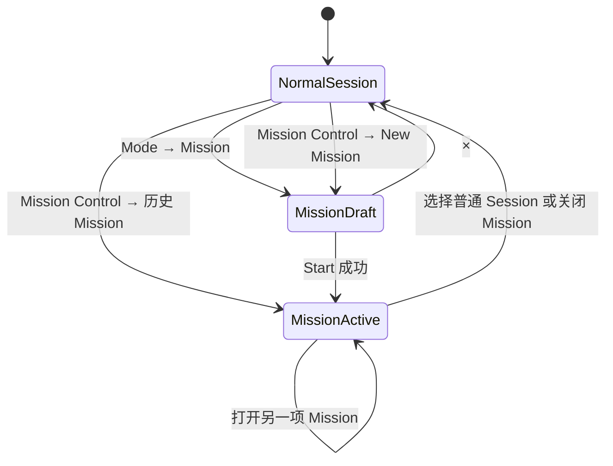
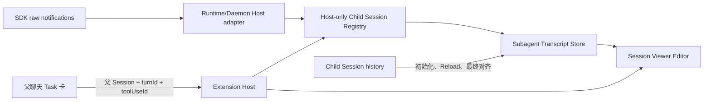
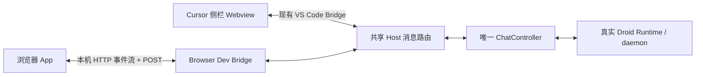
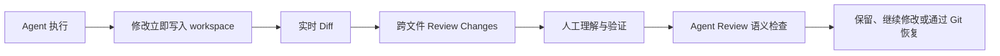

# 设计规则

## 目标

界面达到 Cursor 水平的克制、精确和轻奢质感。主表面使用安静的中性色，
依靠层级、边框、间距和排版建立秩序，不依靠大色块和装饰性组件。

## 视觉原则

- 主聊天位于 Cursor Secondary Sidebar
- Light 使用暖白中性色，Dark 使用 charcoal，Auto 跟随编辑器
- 卡片使用 1px hairline、细微表面差和轻阴影
- 正文约 13px，元信息约 11px，命令和路径使用等宽字体
- 常规行高保持紧凑，点击目标仍需满足可用性
- 主要操作有清楚层级，次要操作默认安静，hover 时再增强
- 不新增醒目的 Banner、Badge、彩条或塑料感填色

## 布局原则

- Composer 固定在底部
- Transcript 是主要滚动区域
- AskUser 和 Plan 可在 Composer 上方停靠，但不能遮住操作
- 窄侧栏不产生横向滚动
- 长内容在组件内部滚动，不把页面整体撑坏
- 同一信息只出现一次，历史摘要与当前操作区域不能重复

## 动效

- 只给正在发生的状态使用动画
- 进入和退出约 120 到 200ms
- 展开收起保持连续，不使用弹跳和大位移
- `prefers-reduced-motion` 下关闭非必要动画
- 流式更新不能抢走用户的阅读位置

## 交互

- 键盘、焦点、hover、disabled 和 error 状态必须可区分
- 破坏性操作需要明确确认
- 没有权威能力的按钮不显示
- 加载失败保留用户草稿和最后一次确认数据
- Tooltip 只补充信息，不承载唯一操作

## UI 验收

1. 320px、400px 和常规宽度均可操作。
2. Light、Dark、Auto 下文字和边界清楚。
3. Composer、停靠卡片和滚动区域互不裁切。
4. Tab 顺序、Escape、Enter 和方向键行为符合控件语义。
5. 长标题、长路径、长计划和多问题不会溢出。
6. 动画不制造重复内容、布局跳动或滚动抢夺。

## Mission 工作区

最后确认：2026-08-26

### 产品模型

Mission 和普通 Session 是两类产品对象。SDK 底层使用带 Mission 标记的
Orchestrator Session 承载 Mission 对话，并使用 Worker Session 执行 Feature；
这些 Session 是实现细节，不能混入普通 Sessions 目录。

产品只保留一个可交互 `ChatController` 和 Runtime，通过明确工作区状态切换：

- `normal-session`：普通聊天和普通 Session 导航
- `mission-draft`：左侧保留普通聊天，右侧配置新 Mission
- `mission-active`：左侧显示 Mission 专属对话，右侧显示 Mission 详情

Host 保存进入 Mission 前的普通 Session、当前 Mission 身份和 Orchestrator
Session 身份。离开 Mission 时优先恢复原普通 Session；无法恢复时新建普通对话。

### 入口与创建

- 普通聊天选择 Mode → Mission 时只展开右侧 New Mission 配置，不修改普通
  Session 的 `interactionMode`。
- New Mission 打开期间，左侧普通 Session、草稿和滚动位置保持不变。
- `×` 只关闭创建侧栏；`Missions` 打开独立 Mission Control 目录。
- Start 通过 readiness 后创建 Orchestrator、应用设置并发送 task。
- Start 成功后左侧切换为 Mission 专属对话，右侧原地切成详情，不能继续显示
  New Mission 或停在 `Starting…`。

### 当前 Mission

- 左侧保留完整 Composer、附件、权限和 AskUser，消息发送给当前 Mission 的
  Orchestrator。
- 右侧显示生命周期、进度、当前 Feature、Workers、Validator 和受支持控制。
- 当前已经是 Mission 时，Mode → Mission 打开现有详情，不创建新 Mission。
- 已完成 Mission 仍允许继续与 Orchestrator 对话。
- 用户从顶部 Sessions 目录选择普通 Session 时，退出 Mission 工作区并关闭
  右栏；Mission 在后台继续运行。
- 顶部历史入口始终只管理普通 Sessions。

### Mission Control 目录

- 独立 Editor 只渲染 Mission 目录、筛选和刷新，不包含聊天 App。
- New Mission 返回 DroidVisX 并展开创建侧栏。
- 点击历史 Mission 后，Host 解析安全 Mission 身份、附着对应 Orchestrator、
  恢复 Mission 对话与状态投影、关闭目录页并返回 DroidVisX。
- 历史 Mission 打开后，左侧必须显示该 Mission 的对话，右侧必须显示该
  Mission 的详情。
- Mission Orchestrator 和 Worker 不出现在普通 Sessions 目录。

### 窄右栏

约 280–320px 时使用紧凑布局并禁止横向滚动：

- Model、Reasoning、Worker 和 Validator 使用单列布局。
- Orchestrator、Worker、Validation 摘要改为纵向状态列表。
- Execution settings 默认折叠，展开项完整占一行。
- 运行详情优先显示生命周期、进度、当前 Feature、Worker 状态和控制。
- 次要设置放入折叠区，标题区和主要控制保持可见，中间内容独立滚动。
- `Starting`、`Running`、`Paused`、`Completed` 和 `Failed` 使用明确文字，
  不只依靠颜色表达。

### 状态与恢复约束

- Mission 详情只来自 SDK、daemon metadata 或恢复后的 reducer，不能根据
  Mode 文案猜测。
- Auto 和普通 Session 不因后台 Mission 事件自动展开右栏。
- 普通 Session 目录与 Mission 目录分别投影。
- Reload 后恢复当前 Mission 对话与详情。
- Mission Start 的 accepted 回执是从创建页切到详情页的最终依据。

## 实时子代理只读对话

最后确认：2026-08-26

### 产品目标

父聊天中的 Task 卡继续提供紧凑状态摘要；点击整张子代理卡后，为对应 child
Session 打开独立 Editor，使用主聊天相同的消息、Thinking、Tool、图片和流程
组件展示完整只读对话。

运行中和已完成的子代理都能打开。每个 child Session 保留独立 Editor 标签页，
重复点击只 reveal 已有标签页。Viewer 不提供 Composer、Mode、Model、Sessions、
Diff、Stop、Retry 或编辑动作。

### 实时数据流

- daemon transport 复用当前 `ConnectedDroid` 内同一公开
  `DaemonSessionController.sessionNotification` 事件；process transport 通过
  `FactoryDroidRuntime` 的 Session notification sink 接入。两者都不创建第二条连接。
- `child_session_available` 在 Runtime/Host 内建立
  `parentSessionId + turnId + toolUseId → childSessionId` 映射。
- `childSessionId` 不进入共享 Bridge、Webview state、UI 或日志。
- Webview 只发送当前父 Session、Turn 和 Task 的 opaque `toolUseId`；Host 验证
  该 Task 确实存在后才解析 child Session。
- 父 Session 的原始通知按 envelope `sessionId` 分流。Child 的
  assistant text、Thinking、Tool call/progress/result、图片、working state 和
  turn completion 进入只读 Transcript Store。
- Store 建立时先加载 child 历史并缓冲同时到达的通知；Viewer 订阅 Store。
  正常运行由通知实时驱动，不使用定时历史轮询。
- History 只用于初始化补齐前文、Reload 恢复和 terminal state 后最终对齐；
  初始化期间先加载历史再重放缓冲事件，Tool 与图片按稳定身份合并，最终历史替换
  实时尾部以补齐遗漏。
- 不创建第二个 `ChatController`，不 resume child、不发送 prompt、不取得写权限。

### 卡片与 Editor

- 整张子代理卡可点击，支持 Enter 和 Space，hover 只使用克制的边框与表面变化。
- 卡片保留类型、委派描述、明确状态、最新活动、耗时和工具次数。
- child 尚未建立时点击，卡片显示 `Conversation not ready yet`，不创建空标签页。
- Editor 标题使用 `类型 · 委派描述`，标题过长时截断。
- Header 使用 `Starting`、`Working`、`Completed`、`Failed` 或 `Cancelled`
  明确表达生命周期。
- 主体复用 `ReadOnlyTranscript` 和主聊天消息组件。运行中自动跟随底部；用户
  向上滚动时暂停，回到底部后恢复。
- 历史不可用时显示明确 unavailable 状态，不把失败投影为空对话。

### 生命周期与恢复

- `child_session_available` 创建 Registry 和 Store；后续 child 通知同时驱动
  Viewer 和父 Task 卡摘要。
- 移除现有每 2.5 秒读取 `getMessages()` 的卡片活动采样，避免轮询摘要与实时
  transcript 产生冲突。
- Child 进入 terminal state 后执行两次短间隔最终历史读取，覆盖 daemon
  working-state 与 transcript 落盘之间的短暂时间差，然后停止实时更新。
- Viewer 晚打开时读取已经积累的 Store；关闭再开优先复用 Store，Store 已释放
  时从历史重建。
- Reload 后，已完成 child 从 `subagentInvocations` 与 child history 恢复；
  daemon 中仍运行的 child 由 ledger 重建 Registry，并通过同一 controller 的
  `ensureChildSessionAttached()` 恢复通知订阅。
- process 模式不能跨 Reload 保持后台 turn，只恢复已经落盘的历史。
- 切换或归档父 Session 不停止 child，也不关闭已经打开的 Viewer。
- 短暂丢失通知时保留最后可信状态，terminal history 对齐补齐缺口，不制造假进度。

### 验收标准

1. Child Thinking、文本和 Tool 进度在通知到达后直接更新，不依赖 2.5 秒轮询。
2. 点击运行中或已完成的子代理卡都打开正确 child 的独立只读 Editor。
3. 多个子代理同时打开时分别更新，不串 transcript 或生命周期。
4. Reload 后能恢复已完成 child；daemon 中仍运行的 child 能重建映射并继续更新。
5. 伪造、过期或不匹配的父 Session、Turn、Tool 身份不能打开其他 Session。
6. Viewer 与主聊天视觉和消息能力一致，但没有 Composer、Diff 或写操作。

## 真实浏览器联调

最后确认：2026-08-26

### 目标与边界

浏览器联调页运行与 Cursor 侧栏相同的 DroidVisX `App`，连接当前 Cursor
Extension Host 中唯一的 `ChatController`，共享当前 Session、真实 Runtime、
实时消息和全部已暴露操作。它只用于本机开发联调，不是独立产品入口。

Studio 继续承担静态场景和视觉状态预览；真实联调使用独立 `/live` 路径。两者
不得混用 transport、状态或 fallback。浏览器 Bundle 不包含 Droid SDK、
Runtime 或 Extension Host 代码。

### 启动与生命周期

- 用户在 DroidVisX 源码 workspace 中执行
  `DroidVisX: Start Browser Dev Client`。
- 命令根据 workspace 根目录 `package.json` 的 `name: droidvisx` 确认源码
  位置，不扫描或猜测其他目录。
- Extension Host 启动只监听 `127.0.0.1` 随机端口的 Browser Dev Bridge，
  再从源码 workspace 自动启动固定端口 4173 的 Vite，并打开 `/live`。
- 每次启动生成临时连接令牌。令牌放在 URL fragment，只由浏览器 JavaScript
  读取并发给 Bridge，不出现在 Vite HTTP 请求中。
- 再次执行 Start 时复用本次实例并重新打开当前地址，不启动第二套 Host 或 Vite。
- Browser Dev Client 关闭只断开浏览器连接，不停止 Runtime。显式 Stop 命令、
  Extension Host 停用或 Cursor 窗口关闭时关闭 Bridge 和本次启动的 Vite 子进程。
- 正常扩展激活不监听联调端口，也不启动开发进程。

### 组件职责

#### 共享 Host 消息路由

`DroidViewProvider` 现有入站逻辑提取为共享路由入口。侧栏和 Browser Dev Bridge
都先使用 `parseWebviewMessage` 校验，再通过同一入口处理主题、Mission 面板、
诊断和 `ChatController.handleMessage()`。浏览器不能拥有放宽校验的旁路。

#### ChatController 定向初始化

Runtime 增量继续由 `ChatController` 广播给侧栏和浏览器。浏览器连接初始化不能
调用当前广播式 `webview.ready` 流程，否则会让已打开的侧栏重复接收 Snapshot
和待处理交互。

`ChatController` 提供只读的当前 Snapshot 投影，待处理 Interaction 和 Plan
Document 也提供面向指定发送者的 replay。Browser Dev Bridge 只向新连接发送：

1. 当前主题；
2. 当前 Host Snapshot；
3. 待处理 Interaction；
4. 当前 Plan Document；
5. 当前 Mission setup。

这些定向消息仍使用同一 Bridge DTO 和全局递增 sequence，不能建立第二套状态
协议。

#### Browser Dev Bridge

Bridge 只负责一个浏览器客户端和以下边界：

- 管理 HTTP Host 事件流与浏览器 POST 入站；
- 校验临时 token、允许的 Vite Origin、HTTP 方法和共享 Bridge 消息；
- 订阅 `ChatController` 与 Mission setup 投影；
- 将浏览器消息交给共享 Host 路由；
- 启动、监控并停止 Vite 子进程。

首版不支持多个浏览器页，不引入客户端主从、写权限仲裁或独立 Session。

#### 浏览器 transport

`src/webview/dev/main.tsx` 保留当前 Studio 入口：

- `/` 和 `/app` 使用现有 fake Studio runtime；
- `/live` 创建 Browser transport，暴露与 `acquireVsCodeApi()` 相同的
  `getState`、`setState` 和 `postMessage` 接口，然后直接挂载现有 `App`。

Browser transport 使用页面内存保存 Webview state，Host→浏览器通过事件流，
浏览器→Host 通过 POST。事件流断开后自动重连并重新请求定向初始化，不重启
Runtime。

### 安全与失败行为

- Bridge 只绑定 `127.0.0.1`，不允许局域网或公网监听。
- token 或 Origin 不匹配时拒绝请求，不降级到匿名连接。
- 只接受自动启动的固定 Vite Origin。
- token、凭据、SDK 对象和 Host-only child Session 映射不能进入日志或页面
  状态。
- Vite 启动失败、4173 被占用或 Bridge 启动失败时，关闭本次已经启动的资源，
  并通过 Cursor 通知和 DroidVisX 日志报告具体错误。
- Browser transport 不使用 Studio snapshot 作为断线或错误 fallback；真实
  Host 不可用时显示连接失败。
- 浏览器断开不取消正在运行的 Droid Turn；重新连接后使用当前真实状态恢复。

### 验收标准

1. 浏览器 `/live` 渲染现有真实 `App`，没有 Studio 控制台或 fake scenario。
2. 浏览器与侧栏显示相同 Session、历史、设置、Interaction 和实时增量。
3. 浏览器可发送消息、停止回合、回答权限与 AskUser、切换 Session，并执行当前
   UI 已暴露的其他真实操作。
4. 浏览器操作产生的状态在侧栏同步出现，侧栏操作也同步到浏览器。
5. 浏览器 Reload 后恢复当前真实状态，不重启 Runtime，也不让侧栏重复重放。
6. 未执行 Start 命令时没有本地联调监听端口或 Vite 子进程。
7. Stop、扩展停用和 Cursor 窗口关闭后 Bridge 与 Vite 均停止。
8. Studio 仍可通过原有 `pnpm run dev:webview` 使用。

## Cursor Agent Diff 对标研究

研究日期：2026-08-25

### 研究结论

Cursor 的优势来自一条连续的审查链路，而不是某个 Diff 控件：

1. Agent 工作时持续显示正在发生的代码变化。
2. 任务结束后把跨文件修改收拢到统一的 Review Changes 入口。
3. 用户在只读 Diff 中理解改动，再通过测试、类型检查和人工判断确认质量。
4. 需要更深检查时，Agent Review 对本地改动做独立的语义审查。
5. 企业场景通过 Cursor Blame 把代码行追溯到产生它的 Agent 会话和模型。

Cursor 当前明确允许 Agent 无需逐文件批准就修改 workspace，文件立即写入磁盘。
因此 Review 是写入后的审查面，不是写入前的权限边界。界面不能使用会让用户误以为
修改尚未落盘的文案。自动重载还可能让修改在审查前执行，版本控制和运行权限仍是
独立安全边界。

### Cursor 的交互分层

#### 实时变化

Cursor Learn 建议用户在 Agent 工作时观察 Diff；方向明显错误时应立即 Stop，
不必等任务结束。实时 Diff 的任务是提供方向感和中止点，不承担完整代码审查。

#### 跨文件 Review Changes

Cursor 2.0 把多文件修改集中展示，避免用户在文件之间手工跳转。Cursor 2.4
进一步引入快速只读 Diff Viewer，专门优化 Review Changes 面板的性能。
这一层的核心是：

- 一个稳定、持续可见的 Review 入口；
- 文件范围和增删规模先于具体代码；
- 跨文件顺序浏览；
- 查看与编辑解耦，默认以只读理解为主；
- Diff 是工作区事实，聊天摘要只负责解释和导航。

#### Agent Review

Cursor 将 Agent Review 与普通 Diff Review 分开。它是针对本地修改运行的专用
代码审查，可以手动触发、通过 `/agent-review` 触发，或在配置后自动运行。
Source Control 入口会比较全部本地变化与主分支，不只检查最后一次编辑。

这说明两个概念不能混合：

- **Diff Review**：用户查看“改了什么”。
- **Agent Review**：另一次模型调用判断“可能有什么问题”。

#### 变更归因

Cursor Blame 在企业版本中区分 Tab 补全、不同模型的 Agent 执行和人工编辑，
并把代码行链接回产生它的会话摘要。它证明长期价值不止是显示增删行，还包括
回答“谁在什么上下文中生成了这行代码”。

### Cursor 方案有效的原因

- **入口靠近 Agent**：修改摘要留在对话附近，不要求用户先切换到 Source Control。
- **代码回到编辑器**：复杂 Diff 使用编辑器能力，不把聊天侧栏变成代码编辑器。
- **渐进披露**：先看文件数和增删规模，再展开文件，最后阅读代码。
- **实时与最终状态分开**：执行中用于监控，任务后用于审查。
- **机械审查与语义审查分开**：Diff 不伪装成质量结论，Agent Review 也不能替代人工确认。
- **大变更鼓励拆分**：Cursor 建议用小而语义明确的提交降低审查负担。

### 已暴露的失败模式

Cursor 官方更新和社区反馈也暴露出需要避开的风险。社区报告只作为失败模式
信号，不作为产品契约：

- Diff UI 缺失会让用户误以为修改被自动接受。
- “Review”入口若没有明确完成状态，可能长期停留并与 Commit 行为混淆。
- 旧会话 Diff 残留会导致用户审查错误的变更集。
- Agent 修改与用户后续编辑混合后，All Changes 可能显示过时归因。
- Dotfile、删除文件、重命名和 Worktree 容易成为 Diff 覆盖缺口。
- 一次打开大量文件会制造标签页和认知负担。
- 文件立即落盘时，Accept、Apply、Keep 等文案容易产生错误安全感。

由此得到的约束：

1. Review 必须绑定明确的 `sessionId`、`turnId` 和基线。
2. 新回合、切换会话和 Reload 后不能复用过期展示状态。
3. `writing`、`settled`、`reviewed` 是不同状态，不能只靠按钮是否出现推断。
4. 恢复操作必须说明范围，并保护回合开始前的用户修改。
5. Review 入口不能暗示代码尚未写入磁盘。

### DroidVisX 当前基础

DroidVisX 已有一条真实的纵向链路：

- `src/shared/changesProtocol.ts` 定义 `writing` 和 `settled` 的累计 ledger。
- `src/extension/chat/liveChanges.ts` 在文件工具完成后发布实时文件变化。
- `src/extension/turnChangesLedger.ts` 保持文件首次出现顺序，并防抖读取增删行数。
- `src/extension/turnSnapshots.ts` 保存回合前后 Git tree，用于回合级比较和恢复读取。
- `src/extension/chat/settleTurnChanges.ts` 在回合结束时生成最终文件清单。
- `src/webview/assistant/ReviewDock.tsx` 在 Composer 上方显示最新回合、Branch、
  Commit 和 Review 入口。
- `src/extension/vscodeFileDiff.ts` 优先打开 `Before turn ↔ Current` 原生 Diff，
  历史场景回退到 committed turn 或 `HEAD ↔ Working`。

当前实现已经比普通 Git Diff 更接近 Agent Diff：它能以回合开始时的内容为基线，
避免把会话前已有的未提交修改全部算进本回合。

### 与 Cursor 的主要差距

| 维度 | Cursor | DroidVisX 当前 |
| --- | --- | --- |
| 实时可见性 | 工作中持续显示 Diff | 实时更新文件 ledger 和统计 |
| 多文件审查 | 统一只读 Review Changes | `Review` 依次打开每个原生 Diff |
| 审查进度 | 集中审查面 | 没有 reviewed / remaining 状态 |
| 范围 | 当前 Agent、全部本地变化、主分支 | 最新回合和 Branch 摘要 |
| 语义审查 | 独立 Agent Review | 没有独立审查层 |
| 长期归因 | Cursor Blame 追溯会话和模型 | 回合 ledger，没有行级来源 |
| 恢复语义 | 依赖 Git 和产品内操作 | 有基线与 Rewind 基础，但无安全的 Undo All |

最大的体验差距是“跨文件连续审查”。当前 `Review` 会为每个文件调用原生 Diff，
文件多时可能一次打开大量编辑器标签。Branch 视图则只打开文件，没有提供相同
范围的 Diff 审查。

最大的正确性风险是并发归因。最终 Git tree 比较能捕获工具未报告的真实变化，
但如果用户在 Agent 回合中同时手动编辑其他文件，这些变化也可能进入回合级
settled 清单。界面应把它表达为“回合期间发生的变化”，除非 Host 能证明具体
修改来自 Agent 工具。

### 产品建议

#### 推荐的下一个纵向切片

保持文件已经落盘的真实语义，先完善当前 ReviewDock：

1. Review 展开后提供明确的文件顺序、当前项和剩余数量。
2. 一次只打开一个原生 Diff，并提供 Previous / Next，而不是批量打开所有文件。
3. 文件可以标记 `reviewed`，该状态只代表用户看过，不等于 Git stage 或接受。
4. 新回合到来时保留旧回合历史，但 Dock 只固定当前回合，不能继承旧展开状态。
5. Branch 审查必须显示比较基线；无法提供可靠 Diff 时继续使用 `Open`，不伪装。

这能获得 Cursor 跨文件审查的主要收益，同时继续复用 Cursor/VS Code 原生 Diff，
不依赖私有命令，也不在窄 Webview 中重建代码编辑器。

#### 后续候选

- 在独立编辑器区域提供聚合只读 Diff，但前提是有稳定的公开 VS Code API；
- 从具体 Diff 行创建聊天引用，形成“看见问题 → 指向代码 → 要求 Agent 修改”的闭环；
- 为 settled 回合增加明确的审查完成状态；
- 证明 Runtime 能稳定提供专用审查入口后，再增加 Agent Review；
- 行级 Agent / Human 归因需要独立契约，不应从 Git 时间或工具路径猜测；
- Hunk 撤销和 Undo All 只有在能保护用户原有修改时才进入产品。

#### 明确不照搬

- 不把 Accept/Reject 当作文件是否已写入磁盘的开关；
- 不在窄侧栏内实现完整 Monaco Diff；
- 不让模型摘要替代原始 Diff；
- 不使用 VS Code 私有 Multi Diff 命令换取短期外观；
- 不在没有来源证据时声称某一行由 Agent 生成；
- 不把 reviewed、stage、commit 和质量通过合并成一个状态。

### 资料来源

官方资料：

- [Cursor Learn：Reviewing and testing code](https://cursor.com/learn/reviewing-testing)
- [Cursor Docs：Agent Review](https://cursor.com/docs/agent/agent-review)
- [Cursor Docs：Agent Security](https://cursor.com/docs/agent/security)
- [Cursor 2.0：Improved Code Review](https://cursor.com/changelog/2-0)
- [Cursor 2.4：只读 Diff Viewer、Cursor Blame 与 Diff 修复](https://cursor.com/changelog/2-4)
- [Cursor：Best practices for coding with agents](https://cursor.com/blog/agent-best-practices)

补充失败模式信号：

- [Cursor Forum 搜索：All Changes 显示旧 Agent 变化并忽略用户编辑](https://forum.cursor.com/search?q=%22All%20changes%22%20show%20stale%20agent%20changes%20and%20disregard%20user%20changes)
- [Cursor Forum 搜索：Agent Review/Accept 界面缺失后产生自动接受感知](https://forum.cursor.com/search?q=Agent%20mode%20no%20longer%20shows%20review%20accept%20interface)
- [Cursor Forum 搜索：Review 入口停留并与 Commit 行为混淆](https://forum.cursor.com/search?q=Agent%20%221%20File%20Review%22%20stuck)
