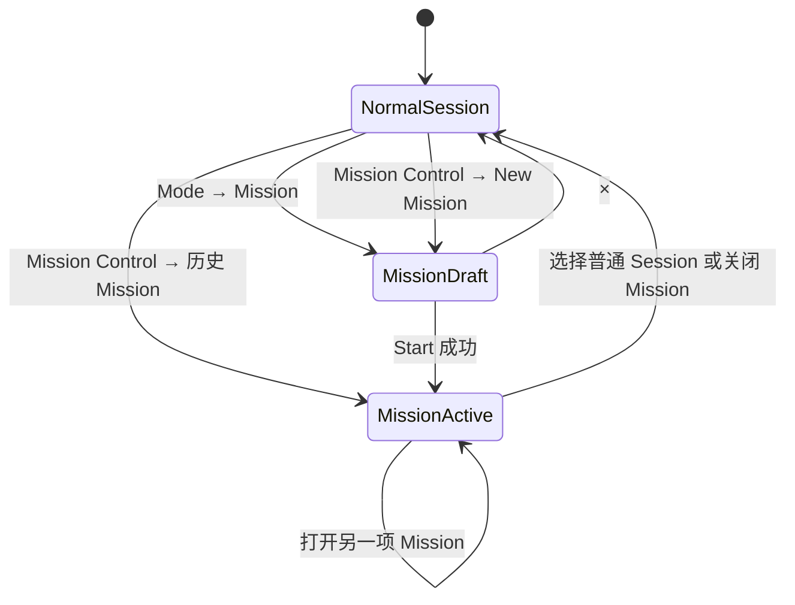
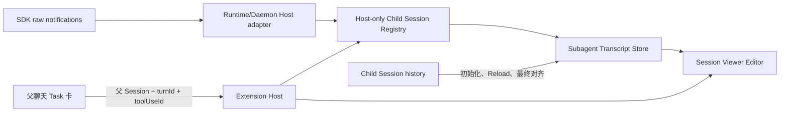
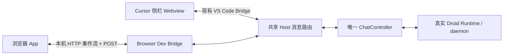
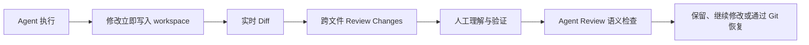

# 设计规则

## 目标

界面融入 Cursor Secondary Sidebar，内容优先，操作轻量，状态变化连续。
依靠排版、间距、对齐和可读的文字层级建立秩序，不用背景色、方框和竖线包装
每一项内容；动画表达真实变化，不为等待或输出增加表演性延迟。

## 视觉原则

- 主聊天位于 Cursor Secondary Sidebar。
- Light 使用柔和的近白中性色，Dark 使用 charcoal，Auto 跟随编辑器主题变量。
- 过程记录和次要操作默认透明；必要容器使用 1px 边界，阴影只用于真正浮出的层。
- 正文约 13px，元信息约 11px，命令和路径使用等宽字体；辅助文字仍需可读。
- 相同角色的控件统一高度、内边距、图标和对齐，不要求不同长度的文字强行同宽。
- 次要文字操作 hover 以文字和图标明暗为主，不统一变成圆角色块。
- 保留键盘焦点、选中状态、错误和权限语义；减重不等于移除操作反馈。
- 不新增醒目的 Banner、Badge、彩条或塑料感填色。

## 布局原则

- Composer 固定在底部
- Transcript 是主要滚动区域
- AskUser 和 Plan 可在 Composer 上方停靠，但不能遮住操作
- 窄侧栏不产生横向滚动
- 长内容在组件内部滚动，不把页面整体撑坏
- 同一信息只出现一次，历史摘要与当前操作区域不能重复

## 动效

- 只给正在发生的状态使用动画
- 进入和退出约 120 到 200ms
- 展开收起保持连续，不使用弹跳和大位移
- `prefers-reduced-motion` 下关闭非必要动画
- 流式更新不能抢走用户的阅读位置

## 交互

- 键盘、焦点、hover、disabled 和 error 状态必须可区分
- 破坏性操作需要明确确认
- 没有权威能力的按钮不显示
- 加载失败保留用户草稿和最后一次确认数据
- Tooltip 只补充信息，不承载唯一操作

## UI 验收

1. 320px、400px 和常规宽度均可操作。
2. Light、Dark、Auto 下文字和边界清楚。
3. Composer、停靠卡片和滚动区域互不裁切。
4. Tab 顺序、Escape、Enter 和方向键行为符合控件语义。
5. 长标题、长路径、长计划和多问题不会溢出。
6. 动画不制造重复内容、布局跳动或滚动抢夺。

## 主聊天过程、流式输出与视觉减重

设计日期：2026-09-05。状态：**已接入代码并安装，待 Reload 后真实交互/视觉验收**。
本节是本轮主聊天的设计依据，实施顺序只在 `PLAN.md` 维护，已发布能力仍以
`STATUS.md` 为准。下文其他子系统的专项设计不因此被重做。

### 范围与取舍

覆盖主聊天中的 Thinking、连续探索、正文流式呈现、消息操作栏、Composer
底部控件，以及相关权限选项、提示、Markdown 和三主题配色。

- 保留当前 Runtime、Host、Bridge、会话与权限事实，只调整 Webview 表达。
- 不新建动画库、主题引擎或第二套 Markdown 渲染器，不升级依赖。
- 不重做 Mission、会话目录、BTW、子代理面板、ReviewDock、命令终端或设置页架构。
- 共用消息组件和主题变量会影响只读 Viewer 等消费者；保留其只读语义并做必要
  兼容检查，不复制一套组件来隔离颜色，也不借此增加专属功能。
- 用户问题卡、代码块和输入框只减轻相关边界、阴影与颜色，不改吸顶、导航、
  附件、草稿或发送行为。
- 不将所有工具折叠到过程区，不删除权限范围或风险说明，不把普通引用猜成重点。
- 不采用过程区默认左侧竖线、逐字打字、整段反复淡入、弹跳、缩放呼吸或跑马灯。

### 稳定的过程区

一个过程区只包含**同一 assistant message 内相邻的 reasoning 和现有探索类工具**。
探索类别沿用 `activityGrouping.ts` 的映射；不扩大到 Execute、编辑、授权、
AskUser、Plan、子代理或未知工具。正文、图片、其他 data 和非探索工具均是边界，
不跨消息或跨回合把记录搬到顶部。

1. 第一项符合条件的内容到达时即建立过程区，不设工具数量、思考字符数或行数阈值。
   仅有 Thinking 时也使用同一结构，但不能显示 `Explored 0 files`。
2. 后续相邻内容只追加到原区；思考变长、下一次工具开始、状态完成都不替换容器。
   分组身份取 message 身份与该连续段的起点，不依赖文本、成员总数或状态文案。
3. 正常摘要是一行真实按钮：箭头、当前活动、可截断的目标。固定行高，异常说明
   允许换行以免隐藏失败或风险。长路径省略，
   完整路径在详情可读；不重复显示 `Exploring · Reading · Running` 等同义状态。
4. 活动状态由已有消息和工具生命周期决定。工具间的等待不提前报告完成；并发时
   展示最近的运行项及必要的其他运行项数量，不能把尚在执行的工具描述为完成。
5. 过程结束后原位更新简短摘要。纯思考用思考完成摘要，有探索时用现有真实类别统计；
   不把并行工具耗时之和当作总墙钟耗时，没有可靠总耗时就不显示。
6. 失败、中断、推理截断即使在收起状态也可见；使用明确文字，不能只有颜色。
   收到正文不代表尚未结束的工具成功。停止后只保留已收到的内容，不播放假进度。

### 展开选择与内容生命周期

- 默认收起。手动选择只作用于当前过程区；追加、完成、失败、主题切换都不重置。
- 展开后的思考正文直接可读，不再套一层必须点击的 Thinking 折叠；探索条目按顺序
  展示动作与目标，长工具结果仍可按需展开，沿用现有预览与大小限制。
- 记录靠缩进与间距区分，不默认加左侧竖线、底色卡片或每行分隔框。
- 展开已有记录不从头打字。超长历史保留现有分块渲染和安全上限，优先让首屏可读，
  后续分块是性能处理，不添加装饰性延迟或为“完整展开”同步渲染全部超长文本。
- 首次展开才挂载重详情；关闭期间保留详情完成退出，随后允许卸载。重复点击从
  当前高度反向过渡，不叠加定时器。折叠内容不可点击、不可进入 Tab 顺序。
- 显式选择保存在当前 Thread 范围的轻量展示状态中，覆盖虚拟列表卸载再挂载；
  不保存内容副本或写入 Host。切换会话、Reload 后默认收起，不承诺跨会话记忆。
- 键盘收起时，若焦点在内部控件，将焦点还给摘要；指针操作不无故抢焦点。

### 动效与阅读位置

下列值是实施起点，允许在验收范围内调校，不是人工等待时长。

| 场景 | 目标 | 约束 |
| --- | --- | --- |
| 次要控件 hover / 按下 | 80–120ms 明暗变化 | 不改宽高、边框占位、字重或文字位置 |
| 过程区展开 / 收起 | 180–220ms 高度过渡，箭头同步 | 不用任意大 max-height、弹跳或滚动到详情底部 |
| 当前活动切换 | 100–140ms 新标签淡入 | 固定行高，不上下翻滚，不累计标签播放队列 |
| 正文新增文字 | 100–140ms 轻淡入 | 只作用于新内容，不隐藏整段或推迟完成状态 |
| 运行信号 | 单个 1.6s 低幅透明度循环 | 不缩放；标题、图标和文字不同时循环 |

- 展开时优先保持摘要在视口中的位置，手动查看详情应暂停尾部跟随；后续正文不能
  把用户拉走。通过回到底部或现有返回底部动作恢复跟随。
- 复用 `Thread.tsx` / `followScroll.ts` 的唯一主聊天滚动所有者；动画与虚拟列表
  高度测量接入同一链路，不再挂一套滚动控制器或对每次 token 调用 smooth scroll。
- 正在跟随时可以随内容增长更新位置；不跟随时不纠正用户的 wheel、键盘、触控和
  拖动滚动条行为。受滚动边界限制的自然 clamp 不算人为回跳。
- `prefers-reduced-motion: reduce` 下立即展开、切换和呈现文字，运行信号静态化；
  关闭透明度循环、位移、平滑追赶及非必要过渡，行为与内容保持一致。

### 正文流式呈现

现有 `MarkdownTextPrimitive`、Markdown 安全处理、数学公式、路径链接、复制和
代码预览继续保留。`smooth` 的逐字推进不等于小批次淡入，不直接开启它替代设计。

- 到达的内容进入当前 Markdown 渲染；新增普通文字在提交时轻淡入，不等待凑够
  一句话或一段，不通过字符定速队列制造落后于模型的打字效果。
- 只处理当前运行消息中新到达的普通文本叶节点，历史内容、首次挂载时已有内容、
  已读前缀和虚拟列表重挂载均不重播。主题切换也不重置呈现标记。
- 粗体、列表、链接等语义保留。Markdown 闭合导致既有节点重解析时直接更新格式，
  不把整块节点当成新文字再淡入；无法证明是新增后缀时以稳定、完整显示为优先。
- 代码块、公式、表格、Mermaid 和 HTML 预览不逐字符包装。保持现有流式和完成后
  渲染策略，不给语法高亮或整张表反复加动画。普通段落的轻动效已足够表达输出。
- 保留 `defer` 和大内容分块；动画层不修改原始消息、不插入零宽字符、不增加第二份
  可复制或可供屏幕阅读器读取的文字，也不手动重写 React 管理的 DOM。
- 每批新增文本完成淡入后恢复普通渲染，不在长回复中永久积累每 token 的 span、
  定时器或监听。大量增量可合并到下一次渲染提交，动画不得拖延最终文本呈现。
- 选择文本期间优先保持选区，不为淡入拆装已选择内容；Copy、Add to Chat 和
  By the Way 继续取得真实完整文本，不能包含重复或漏掉的动画片段。

### 控件尺寸与状态

采用局部统一的几何规则，不新增全局 Button 框架，也不通过全局 `button:hover`
清空所有组件反馈。

| 对象 | 尺寸起点 | 表现 |
| --- | --- | --- |
| Composer 底部触发器 | 26px 高；文字左右 6px；间隔 4px | 内容宽度；图标 14px、箭头 12px |
| 图标动作（添加、发送、停止） | 26 × 26px | 点击区域固定，不额外套圆圈；发送/停止仍可辨认 |
| 消息、代码块文字操作 | 至少 24px 高；文字左右 4px | 默认透明，hover 改文字与图标，保留独立焦点轮廓 |
| 权限主要动作 | 28px 高；文字左右 10px | 一层必要轮廓，不用高饱和大填色 |
| 菜单选项 | 至少 28px 高；文字左右 8px | 选中勾选与语义属性，轻微行高亮仅用于定位选项 |

- 相同角色统一高度、内边距、基线与图标笔画；不把短标签和长模型名做成等宽卡片。
- 未换标签时，default、hover、active、expanded 的盒模型不变；边框预留位置，
  打开菜单不增加按钮宽度，箭头旋转不改变占位。
- 标签明确改变时允许内容宽度更新；Copy / Copied 等暂态标签为两种状态预留宽度，
  不改字重来表示选中，不为文案每帧动画宽度。
- 320px 侧栏下先压缩模型名，保留 Mode、箭头、发送与停止；模型名及 effort 作为
  有上限的文本区域截断，完整当前值在菜单和可访问名称中可读，不让后缀挤出控件。
- 菜单宽度按内容与可用视口限制，四周至少 8px；不与触发器强制同宽，不反向撑大
  Composer。长说明可换行，长列表内部滚动，保留现有向上/向下定位和关闭行为。
  Effort 在模型菜单的原有占位内切换，提供返回模型列表入口，不再向侧栏外叠加子菜单。
- 按钮不因视觉减重缩成难点的小字；关键点击目标至少 24 × 24px，区域不重叠。
- hover、选中、busy、disabled、focus-visible 各自明确；禁用不显示可执行反馈。
  主消息历史操作仍可沿用 hover / focus-within 显示策略，键盘用户不能丢失入口。

### 权限、选项与提示

- Allow 是授权动作，High / Low 可能是 autonomy 或 reasoning 选项；保留各自
  原始值、能力过滤、提交回执和失败回退，不按相似文字合并业务语义。
- 权限区只留一层必要的结构，动作对象、权限持续范围、风险与拒绝入口始终可读。
  主授权动作紧凑可见；更多授权选项继续明确选择，不能用 hover 或默认选择扩大权限。
- High / Low 等复用现有紧凑菜单选项，不新建分段大色块或让每项重复承载一段说明。
  选中状态用勾选和文字，保留 radio 语义；必须理解的权限说明不能只放 tooltip。
- 普通提示使用简短原位文字；Copy 等成功反馈也原位展示，不新建成功卡片。
  错误和警告保留语义颜色、必要图标、原因和现有恢复动作，不整块铺警告色。
- 不把授权、AskUser 或必须响应的错误藏到过程区。不能删除真实错误以换取干净界面。
- 已回答的 AskUser 使用单层 1px 中性边框、8px 圆角和 12px 内边距；每组纵向显示
  `AI` 与完整问题、`我` 与完整回答，多组之间用细线分隔，不显示 Answers 标题或圆点。
  正文为 13px / 21px，自然换行并保留换行，不摘要或省略；角色标签为 11px 元信息。
  实时结果和历史恢复均保留原问题；旧记录缺少原文时明确提示，不能以主题冒充完整问题。

### 正文、引用与表面层级

- 正文维持 13px / 约 21px 行高、约 12px 段落间距；过程详情同样可读，元信息才用
  约 11px。先统一节奏，不通过整体缩字号获取所谓精致感。
- `blockquote` 保留原生语义，字号、行高和正文一致，以 10–12px 缩进和段落留白
  区分；不加默认左侧竖线、灰色背景、小字号或弱化文字。嵌套引用限制视觉缩进，
  避免窄栏被不断挤窄，不改变引用内容或层级语义。
- 模型用 `>` 表示重点时仍按引用渲染，不猜意图或自动注入标题。已有 `strong`
  使用适度字重；不得在普通段落外统一包“重要提示”卡片。
- 代码块保留一个必要容器，标题栏与代码共享表面；Copy 轻量化。禁止外框、内层 pre
  再各画一次边框，不新增装饰性分割和阴影。
- 用户消息保留辨识度，去掉非必要浮起阴影和叠层观感；吸顶只保留防止正文穿透的
  不透明表面与必要边界，不改吸顶几何规则。
- Composer 保留主操作区轮廓；不为聚焦增加厚阴影。菜单采用不透明表面、细边界和
  克制浮层阴影，普通过程行不使用阴影。

### Light、Dark 与 Auto

Light、Dark 是两套固定配色，Auto 是编辑器变量映射；复用现有 `theme.ts` 的
Host 首帧主题、`ui.theme` 更新和文档/Portal 作用域，不新增主题协议或配置。

固定主题目标色板如下，值只定义在现有 token 层；组件不新增平行硬编码色板。

| 角色 / 现有 token | Light | Dark |
| --- | --- | --- |
| 主表面 `surface` | `#fafafa` | `#1e1e20` |
| 输入等必要表面 `raised` | `#ffffff` | `#242427` |
| 代码 / 工具结果 `code`, `well` | `#f4f4f5` | `#262629` |
| 菜单表面 `overlay` | `#ffffff` | `#2a2a2e` |
| 正文 `ink` | `#292929` | `#e4e4e7` |
| 强调 `text-strong` | `#202024` | `#f0f0f2` |
| 次级 `text-secondary` | `#57575c` | `#b6b6bd` |
| 辅助 `muted`, `subtle` | `#6b6b70` | `#a1a1aa` |
| 装饰分界 `border` | `#dedee2` | `#3e3e44` |
| 必要控件边界 `border-strong` | `#85858d` | `#777780` |
| 焦点 `focus` | `#65656c` | `#a1a1aa` |

- 正常活动与次要操作使用中性色；链接、错误、警告、Diff 和代码语法保留语义颜色，
  不以“黑白风格”为由抹掉区别。现有语义与高亮色按新表面检查对比度，不重建高亮器。
- 普通文字目标对比度至少 4.5:1；必要非文字状态与焦点至少 3:1。装饰分隔线不承担
  唯一操作提示。静态色值计算不能替代实际主题和 opacity 合成后的可读性验收。
- Auto 的聊天背景优先使用 sideBar，其次 editor；正文使用 foreground，输入使用
  input，浮层使用 editorWidget / menu，焦点使用 focusBorder，语义色使用已有
  editor 变量。缺失变量按已解析的 light/dark 基础色板回退，不在深色下固定回退白色。
- Auto 不给文字按钮套上全局 `list-hoverBackground`；该变量只用于实际菜单行等
  需要定位的对象。固定主题的残余字面颜色不能覆盖 Auto 的引用、标题或代码表面。
- 代码着色只能声称使用现有高亮规则与可用主题变量，不能承诺复刻编辑器完整
  TextMate 语法主题。高对比模式优先使用 contrastBorder / focusBorder 等边界，
  不依赖轻微透明度区分选中、禁用或焦点。
- 手动 Light / Dark 保持所选明暗，Auto 跟随编辑器实时变化；页面底色、正文、输入、
  菜单和已有 Portal 同步更新。切换时不 remount 对话、不淡入整屏、不重播历史。

### 验收依据

1. 单个 Thinking、超长 Thinking、连续探索和交错正文按同一规则显示，没有跨边界合并。
2. 从第一项到多项、并发工具结束、失败与停止时容器身份和手动展开选择保持稳定。
3. 展开历史先可读；运行中展开只对后续普通新文字应用动效，不对整段追赶打字。
4. 快速连续展开/收起无空壳卡住、不可见焦点或抢滚动；虚拟列表返回后保留当前选择。
5. 正文已有前缀不重播，代码闭合、表格与公式解析保持正确，复制和选区不重复或丢失。
6. 用户离开底部后，流式更新、折叠和主题变化不强制回到底部；返回底部仍可恢复跟随。
7. 相同标签的控件在 hover、按下与菜单打开前后无可见尺寸跳变；布局测量差不超过
   1 CSS px。改变标签后的合理内容宽度变化与菜单宽度不计入该限制。
8. 320px、400px 与常规侧栏宽度下长模型名、权限文案和菜单不造成横向页面溢出，
   发送、停止、拒绝及键盘焦点不被裁切。
9. Light、Dark、Auto 浅色、Auto 深色及高对比主题均无残留异色块；文字与焦点可辨。
10. 普通文字操作 hover 不成为色块，正文引用不再是竖线灰字；风险与权限范围仍完整。
11. Reduced Motion 不播放本轮动效；历史恢复和会话切换不播放新文字动画。
12. 共用消息的只读 Viewer 没有新增写操作或破坏消息顺序；其他面板不被全局选择器误改。

## Conversation 恢复与切换过场

最后确认：2026-09-01

### 目标

启动、Reload 和用户从 Sessions 目录切换已有 Conversation 时使用同一套 Droid
循环信号，明确表达“正在加载或切换会话”，减少空白等待。过场只反映真实等待，
不展示百分比、骨架屏或无法验证的阶段，也不能为了播放动画而延迟 Snapshot
提交或增加最短展示时间；已提交内容可在遮罩后更新。

视觉沿用 Factory/Droid 的克制黑白语言和现有 Runtime 3×3 点阵。循环从中心点
扩散到十字，再扩散到四角，约 1.2 秒完成一次。点阵使用当前主题的前景与表面
Token，不增加品牌色、Spinner、Banner 或填充式状态组件。

### 状态与触发

- 初始化 Webview 后，首个权威 `host.snapshot` 尚未提交或 Runtime 尚未可发送时
  进入 `restoring`。
- `restoring` 持续 120ms 仍未完成时，才在聊天区中央显示完整点阵和
  `Restoring conversation`，避免快速恢复产生闪烁。
- 首个持久化 Conversation 快照到达后立即在过场后渲染真实 Transcript；Runtime
  仍为 `connecting` 时完整过场继续循环。
- 用户选择另一已有 Conversation 时立即进入 `switching`。
  旧 Transcript 留在原位并降低透明度、轻微模糊，完整点阵和
  `Switching conversation` 覆盖聊天区。目标 Conversation 的权威快照可以先替换
  背景内容，但完整过场继续等待 Runtime 可用。
- New、Worktree、Fork、Rewind、Compact 和 Handoff 不属于本过场范围。

过场是 Webview 本地的表现状态，使用现有 `sessionId`、`connection.status` 和
快照时序判断，不新增 Runtime 进度、Bridge 百分比或持久化动画状态。真实内容和
连接状态仍以 Host Snapshot 为权威。

### 完成、失败与可访问性

- 目标 Snapshot 已提交、`connection.status === 'connected'` 且 `sessionId`
  非空后，完整过场才以 150ms 淡出。该条件与 Composer 的 Runtime 可调用前置条件
  一致；聊天框仍为连接禁用状态时，过场不能提前结束。
- 切换失败或 Runtime 变为 `unavailable` 时停止循环，保留最后一个可信
  Conversation、草稿和现有错误/重试入口，不切换到空白页。
- 过场文字使用 `role="status"` 和 polite live region，但循环帧不重复播报。
- `prefers-reduced-motion: reduce` 下禁用点阵循环、模糊和位移动画，显示静态点阵
  并直接切换内容。
- 过场覆盖聊天区期间不改变滚动位置，不挂载重复 Transcript，也不把焦点移出用户
  当前控件。

### 验收

1. 快于 120ms 的 Reload 不出现完整过场或闪屏。
2. 慢 Reload 持续循环到当前会话已加载且 Composer 的 Runtime 前置条件满足。
3. Runtime 慢于历史恢复时，真实历史可以在过场后更新，但完整过场不能提前结束。
4. 选择已有 Conversation 时保留旧内容作为背景，目标会话可发消息后才结束过场。
5. New、Worktree、Fork、Rewind、Compact/Handoff 不触发本过场。
6. 失败、Reduced Motion、320px 宽度以及 Light、Dark、Auto 主题行为符合上述规则。

## Mission 工作区

最后确认：2026-08-26

### 产品模型

Mission 和普通 Session 是两类产品对象。SDK 底层使用带 Mission 标记的
Orchestrator Session 承载 Mission 对话，并使用 Worker Session 执行 Feature；
这些 Session 是实现细节，不能混入普通 Sessions 目录。

产品只保留一个可交互 `ChatController` 和 Runtime，通过明确工作区状态切换：

- `normal-session`：普通聊天和普通 Session 导航
- `mission-draft`：左侧保留普通聊天，右侧配置新 Mission
- `mission-active`：左侧显示 Mission 专属对话，右侧显示 Mission 详情

Host 保存进入 Mission 前的普通 Session、当前 Mission 身份和 Orchestrator
Session 身份。离开 Mission 时优先恢复原普通 Session；无法恢复时新建普通对话。

### 入口与创建

- 普通聊天选择 Mode → Mission 时只展开右侧 New Mission 配置，不修改普通
  Session 的 `interactionMode`。
- New Mission 打开期间，左侧普通 Session、草稿和滚动位置保持不变。
- `×` 只关闭创建侧栏；`Missions` 打开独立 Mission Control 目录。
- Start 通过 readiness 后创建 Orchestrator、应用设置并发送 task。
- Start 成功后左侧切换为 Mission 专属对话，右侧原地切成详情，不能继续显示
  New Mission 或停在 `Starting…`。

### 当前 Mission

- 左侧保留完整 Composer、附件、权限和 AskUser，消息发送给当前 Mission 的
  Orchestrator。
- 右侧显示生命周期、进度、当前 Feature、Workers、Validator 和受支持控制。
- 当前已经是 Mission 时，Mode → Mission 打开现有详情，不创建新 Mission。
- 已完成 Mission 仍允许继续与 Orchestrator 对话。
- 用户从顶部 Sessions 目录选择普通 Session 时，退出 Mission 工作区并关闭
  右栏；Mission 在后台继续运行。
- 顶部历史入口始终只管理普通 Sessions。

### Mission Control 目录

- 独立 Editor 只渲染 Mission 目录、筛选和刷新，不包含聊天 App。
- New Mission 返回 DroidVisX 并展开创建侧栏。
- 点击历史 Mission 后，Host 解析安全 Mission 身份、附着对应 Orchestrator、
  恢复 Mission 对话与状态投影、关闭目录页并返回 DroidVisX。
- 历史 Mission 打开后，左侧必须显示该 Mission 的对话，右侧必须显示该
  Mission 的详情。
- Mission Orchestrator 和 Worker 不出现在普通 Sessions 目录。

### 窄右栏

约 280–320px 时使用紧凑布局并禁止横向滚动：

- Model、Reasoning、Worker 和 Validator 使用单列布局。
- Orchestrator、Worker、Validation 摘要改为纵向状态列表。
- Execution settings 默认折叠，展开项完整占一行。
- 运行详情优先显示生命周期、进度、当前 Feature、Worker 状态和控制。
- 次要设置放入折叠区，标题区和主要控制保持可见，中间内容独立滚动。
- `Starting`、`Running`、`Paused`、`Completed` 和 `Failed` 使用明确文字，
  不只依靠颜色表达。

### 状态与恢复约束

- Mission 详情只来自 SDK、daemon metadata 或恢复后的 reducer，不能根据
  Mode 文案猜测。
- Auto 和普通 Session 不因后台 Mission 事件自动展开右栏。
- 普通 Session 目录与 Mission 目录分别投影。
- Reload 后恢复当前 Mission 对话与详情。
- Mission Start 的 accepted 回执是从创建页切到详情页的最终依据。

## 实时子代理只读对话

最后确认：2026-08-26

### 产品目标

父聊天中的 Task 卡继续提供紧凑状态摘要；点击整张子代理卡后，为对应 child
Session 打开独立 Editor，使用主聊天相同的消息、Thinking、Tool、图片和流程
组件展示完整只读对话。

运行中和已完成的子代理都能打开。每个 child Session 保留独立 Editor 标签页，
重复点击只 reveal 已有标签页。Viewer 不提供 Composer、Mode、Model、Sessions、
Diff、Stop、Retry 或编辑动作。

### 实时数据流

- daemon transport 复用当前 `ConnectedDroid` 内同一公开
  `DaemonSessionController.sessionNotification` 事件；process transport 通过
  `FactoryDroidRuntime` 的 Session notification sink 接入。两者都不创建第二条连接。
- `child_session_available` 在 Runtime/Host 内建立
  `parentSessionId + turnId + toolUseId → childSessionId` 映射。
- `childSessionId` 不进入共享 Bridge、Webview state、UI 或日志。
- Webview 只发送当前父 Session、Turn 和 Task 的 opaque `toolUseId`；Host 验证
  该 Task 确实存在后才解析 child Session。
- 父 Session 的原始通知按 envelope `sessionId` 分流。Child 的
  assistant text、Thinking、Tool call/progress/result、图片、working state 和
  turn completion 进入只读 Transcript Store。
- Store 建立时先加载 child 历史并缓冲同时到达的通知；Viewer 订阅 Store。
  正常运行由通知实时驱动，不使用定时历史轮询。
- History 只用于初始化补齐前文、Reload 恢复和 terminal state 后最终对齐；
  初始化期间先加载历史再重放缓冲事件，Tool 与图片按稳定身份合并，最终历史替换
  实时尾部以补齐遗漏。
- 不创建第二个 `ChatController`，不 resume child、不发送 prompt、不取得写权限。

### 卡片与 Editor

- 整张子代理卡可点击，支持 Enter 和 Space，hover 只使用克制的边框与表面变化。
- 卡片保留类型、委派描述、明确状态、最新活动、耗时和工具次数。
- child 尚未建立时点击，卡片显示 `Conversation not ready yet`，不创建空标签页。
- Editor 标题使用 `类型 · 委派描述`，标题过长时截断。
- Header 使用 `Starting`、`Working`、`Completed`、`Failed` 或 `Cancelled`
  明确表达生命周期。
- 主体复用 `ReadOnlyTranscript` 和主聊天消息组件。运行中自动跟随底部；用户
  向上滚动时暂停，回到底部后恢复。
- 历史不可用时显示明确 unavailable 状态，不把失败投影为空对话。

### 生命周期与恢复

- `child_session_available` 创建 Registry 和 Store；后续 child 通知同时驱动
  Viewer 和父 Task 卡摘要。
- 移除现有每 2.5 秒读取 `getMessages()` 的卡片活动采样，避免轮询摘要与实时
  transcript 产生冲突。
- Child 进入 terminal state 后执行两次短间隔最终历史读取，覆盖 daemon
  working-state 与 transcript 落盘之间的短暂时间差，然后停止实时更新。
- Viewer 晚打开时读取已经积累的 Store；关闭再开优先复用 Store，Store 已释放
  时从历史重建。
- Reload 后，已完成 child 从 `subagentInvocations` 与 child history 恢复；
  daemon 中仍运行的 child 由 ledger 重建 Registry，并通过同一 controller 的
  `ensureChildSessionAttached()` 恢复通知订阅。
- process 模式不能跨 Reload 保持后台 turn，只恢复已经落盘的历史。
- 切换或归档父 Session 不停止 child，也不关闭已经打开的 Viewer。
- 短暂丢失通知时保留最后可信状态，terminal history 对齐补齐缺口，不制造假进度。

### 验收标准

1. Child Thinking、文本和 Tool 进度在通知到达后直接更新，不依赖 2.5 秒轮询。
2. 点击运行中或已完成的子代理卡都打开正确 child 的独立只读 Editor。
3. 多个子代理同时打开时分别更新，不串 transcript 或生命周期。
4. Reload 后能恢复已完成 child；daemon 中仍运行的 child 能重建映射并继续更新。
5. 伪造、过期或不匹配的父 Session、Turn、Tool 身份不能打开其他 Session。
6. Viewer 与主聊天视觉和消息能力一致，但没有 Composer、Diff 或写操作。

## 真实浏览器联调

最后确认：2026-08-26

### 目标与边界

浏览器联调页运行与 Cursor 侧栏相同的 DroidVisX `App`，连接当前 Cursor
Extension Host 中唯一的 `ChatController`，共享当前 Session、真实 Runtime、
实时消息和全部已暴露操作。它只用于本机开发联调，不是独立产品入口。

Studio 继续承担静态场景和视觉状态预览；真实联调使用独立 `/live` 路径。两者
不得混用 transport、状态或 fallback。浏览器 Bundle 不包含 Droid SDK、
Runtime 或 Extension Host 代码。

### 启动与生命周期

- 用户执行 `DroidVisX: Start Browser Dev Client`。安装版从机器级设置
  `droidvisx.browserDev.sourceRoot` 读取 DroidVisX 源码位置，扩展开发 Host
  未配置时回退到当前扩展开发目录。
- workspace 根目录独立作为 ChatController 的真实 Runtime cwd，可用于联调
  其他项目。
- Extension Host 启动只监听 `127.0.0.1` 随机端口的 Browser Dev Bridge，
  再从源码 workspace 自动启动固定端口 4173 的 Vite，并把 `/live` 一次性连接
  URL 写入剪贴板，由隔离的外部浏览器测试会话打开，不使用 Cursor Browser。
- 每次启动生成临时连接令牌。令牌放在 URL fragment，只由浏览器 JavaScript
  读取并发给 Bridge，不出现在 Vite HTTP 请求中。
- 再次执行 Start 时复用本次实例并重新打开当前地址，不启动第二套 Host 或 Vite。
- Browser Dev Client 关闭只断开浏览器连接，不停止 Runtime。显式 Stop 命令、
  Extension Host 停用或 Cursor 窗口关闭时关闭 Bridge 和本次启动的 Vite 子进程。
- 正常扩展激活不监听联调端口，也不启动开发进程。

### 组件职责

#### 共享 Host 消息路由

`DroidViewProvider` 现有入站逻辑提取为共享路由入口。侧栏和 Browser Dev Bridge
都先使用 `parseWebviewMessage` 校验，再通过同一入口处理主题、Mission 面板、
诊断和 `ChatController.handleMessage()`。浏览器不能拥有放宽校验的旁路。

#### ChatController 定向初始化

Runtime 增量继续由 `ChatController` 广播给侧栏和浏览器。浏览器连接初始化不能
调用当前广播式 `webview.ready` 流程，否则会让已打开的侧栏重复接收 Snapshot
和待处理交互。

`ChatController` 提供只读的当前 Snapshot 投影，待处理 Interaction 和 Plan
Document 也提供面向指定发送者的 replay。Browser Dev Bridge 只向新连接发送：

1. 当前主题；
2. 当前 Host Snapshot；
3. 待处理 Interaction；
4. 当前 Plan Document；
5. 当前 Mission setup。

这些定向消息仍使用同一 Bridge DTO 和全局递增 sequence，不能建立第二套状态
协议。

#### Browser Dev Bridge

Bridge 只负责一个浏览器客户端和以下边界：

- 管理 HTTP Host 事件流与浏览器 POST 入站；
- 校验临时 token、允许的 Vite Origin、HTTP 方法和共享 Bridge 消息；
- 订阅 `ChatController` 与 Mission setup 投影；
- 将浏览器消息交给共享 Host 路由；
- 启动、监控并停止 Vite 子进程。

首版不支持多个浏览器页，不引入客户端主从、写权限仲裁或独立 Session。

#### 浏览器 transport

`src/webview/dev/main.tsx` 保留当前 Studio 入口：

- `/` 和 `/app` 使用现有 fake Studio runtime；
- `/live` 创建 Browser transport，暴露与 `acquireVsCodeApi()` 相同的
  `getState`、`setState` 和 `postMessage` 接口，然后直接挂载现有 `App`。

Browser transport 使用页面内存保存 Webview state，Host→浏览器通过事件流，
浏览器→Host 通过 POST。事件流断开后自动重连并重新请求定向初始化，不重启
Runtime。

### 安全与失败行为

- Bridge 只绑定 `127.0.0.1`，不允许局域网或公网监听。
- token 或 Origin 不匹配时拒绝请求，不降级到匿名连接。
- 只接受自动启动的固定 Vite Origin。
- token、凭据、SDK 对象和 Host-only child Session 映射不能进入日志或页面
  状态。
- Vite 启动失败、4173 被占用或 Bridge 启动失败时，关闭本次已经启动的资源，
  并通过 Cursor 通知和 DroidVisX 日志报告具体错误。
- Browser transport 不使用 Studio snapshot 作为断线或错误 fallback；真实
  Host 不可用时显示连接失败。
- 浏览器断开不取消正在运行的 Droid Turn；重新连接后使用当前真实状态恢复。

### 验收标准

1. 浏览器 `/live` 渲染现有真实 `App`，没有 Studio 控制台或 fake scenario。
2. 浏览器与侧栏显示相同 Session、历史、设置、Interaction 和实时增量。
3. 浏览器可发送消息、停止回合、回答权限与 AskUser、切换 Session，并执行当前
   UI 已暴露的其他真实操作。
4. 浏览器操作产生的状态在侧栏同步出现，侧栏操作也同步到浏览器。
5. 浏览器 Reload 后恢复当前真实状态，不重启 Runtime，也不让侧栏重复重放。
6. 未执行 Start 命令时没有本地联调监听端口或 Vite 子进程。
7. Stop、扩展停用和 Cursor 窗口关闭后 Bridge 与 Vite 均停止。
8. Studio 仍可通过原有 `pnpm run dev:webview` 使用。

## Cursor Agent Diff 对标研究

研究日期：2026-08-25

### 研究结论

Cursor 的优势来自一条连续的审查链路，而不是某个 Diff 控件：

1. Agent 工作时持续显示正在发生的代码变化。
2. 任务结束后把跨文件修改收拢到统一的 Review Changes 入口。
3. 用户在只读 Diff 中理解改动，再通过测试、类型检查和人工判断确认质量。
4. 需要更深检查时，Agent Review 对本地改动做独立的语义审查。
5. 企业场景通过 Cursor Blame 把代码行追溯到产生它的 Agent 会话和模型。

Cursor 当前明确允许 Agent 无需逐文件批准就修改 workspace，文件立即写入磁盘。
因此 Review 是写入后的审查面，不是写入前的权限边界。界面不能使用会让用户误以为
修改尚未落盘的文案。自动重载还可能让修改在审查前执行，版本控制和运行权限仍是
独立安全边界。

### Cursor 的交互分层

#### 实时变化

Cursor Learn 建议用户在 Agent 工作时观察 Diff；方向明显错误时应立即 Stop，
不必等任务结束。实时 Diff 的任务是提供方向感和中止点，不承担完整代码审查。

#### 跨文件 Review Changes

Cursor 2.0 把多文件修改集中展示，避免用户在文件之间手工跳转。Cursor 2.4
进一步引入快速只读 Diff Viewer，专门优化 Review Changes 面板的性能。
这一层的核心是：

- 一个稳定、持续可见的 Review 入口；
- 文件范围和增删规模先于具体代码；
- 跨文件顺序浏览；
- 查看与编辑解耦，默认以只读理解为主；
- Diff 是工作区事实，聊天摘要只负责解释和导航。

#### Agent Review

Cursor 将 Agent Review 与普通 Diff Review 分开。它是针对本地修改运行的专用
代码审查，可以手动触发、通过 `/agent-review` 触发，或在配置后自动运行。
Source Control 入口会比较全部本地变化与主分支，不只检查最后一次编辑。

这说明两个概念不能混合：

- **Diff Review**：用户查看“改了什么”。
- **Agent Review**：另一次模型调用判断“可能有什么问题”。

#### 变更归因

Cursor Blame 在企业版本中区分 Tab 补全、不同模型的 Agent 执行和人工编辑，
并把代码行链接回产生它的会话摘要。它证明长期价值不止是显示增删行，还包括
回答“谁在什么上下文中生成了这行代码”。

### Cursor 方案有效的原因

- **入口靠近 Agent**：修改摘要留在对话附近，不要求用户先切换到 Source Control。
- **代码回到编辑器**：复杂 Diff 使用编辑器能力，不把聊天侧栏变成代码编辑器。
- **渐进披露**：先看文件数和增删规模，再展开文件，最后阅读代码。
- **实时与最终状态分开**：执行中用于监控，任务后用于审查。
- **机械审查与语义审查分开**：Diff 不伪装成质量结论，Agent Review 也不能替代人工确认。
- **大变更鼓励拆分**：Cursor 建议用小而语义明确的提交降低审查负担。

### 已暴露的失败模式

Cursor 官方更新和社区反馈也暴露出需要避开的风险。社区报告只作为失败模式
信号，不作为产品契约：

- Diff UI 缺失会让用户误以为修改被自动接受。
- “Review”入口若没有明确完成状态，可能长期停留并与 Commit 行为混淆。
- 旧会话 Diff 残留会导致用户审查错误的变更集。
- Agent 修改与用户后续编辑混合后，All Changes 可能显示过时归因。
- Dotfile、删除文件、重命名和 Worktree 容易成为 Diff 覆盖缺口。
- 一次打开大量文件会制造标签页和认知负担。
- 文件立即落盘时，Accept、Apply、Keep 等文案容易产生错误安全感。

由此得到的约束：

1. Review 必须绑定明确的 `sessionId`、`turnId` 和基线。
2. 新回合、切换会话和 Reload 后不能复用过期展示状态。
3. `writing`、`settled`、`reviewed` 是不同状态，不能只靠按钮是否出现推断。
4. 恢复操作必须说明范围，并保护回合开始前的用户修改。
5. Review 入口不能暗示代码尚未写入磁盘。

### DroidVisX 当前基础

DroidVisX 已有一条真实的纵向链路：

- `src/shared/changesProtocol.ts` 定义 `writing` 和 `settled` 的累计 ledger。
- `src/extension/chat/liveChanges.ts` 在文件工具完成后发布实时文件变化。
- `src/extension/turnChangesLedger.ts` 保持文件首次出现顺序，并防抖读取增删行数。
- `src/extension/turnSnapshots.ts` 保存回合前后 Git tree，用于回合级比较和恢复读取。
- `src/extension/chat/settleTurnChanges.ts` 在回合结束时生成最终文件清单。
- `src/webview/assistant/ReviewDock.tsx` 在 Composer 上方显示最新回合、Branch、
  Commit 和 Review 入口。
- `src/extension/vscodeFileDiff.ts` 优先打开 `Before turn ↔ Current` 原生 Diff，
  历史场景回退到 committed turn 或 `HEAD ↔ Working`。

当前实现已经比普通 Git Diff 更接近 Agent Diff：它能以回合开始时的内容为基线，
避免把会话前已有的未提交修改全部算进本回合。

### 与 Cursor 的主要差距

| 维度 | Cursor | DroidVisX 当前 |
| --- | --- | --- |
| 实时可见性 | 工作中持续显示 Diff | 实时更新文件 ledger 和统计 |
| 多文件审查 | 统一只读 Review Changes | `Review` 依次打开每个原生 Diff |
| 审查进度 | 集中审查面 | 没有 reviewed / remaining 状态 |
| 范围 | 当前 Agent、全部本地变化、主分支 | 最新回合和 Branch 摘要 |
| 语义审查 | 独立 Agent Review | 没有独立审查层 |
| 长期归因 | Cursor Blame 追溯会话和模型 | 回合 ledger，没有行级来源 |
| 恢复语义 | 依赖 Git 和产品内操作 | 有基线与 Rewind 基础，但无安全的 Undo All |

最大的体验差距是“跨文件连续审查”。当前 `Review` 会为每个文件调用原生 Diff，
文件多时可能一次打开大量编辑器标签。Branch 视图则只打开文件，没有提供相同
范围的 Diff 审查。

最大的正确性风险是并发归因。最终 Git tree 比较能捕获工具未报告的真实变化，
但如果用户在 Agent 回合中同时手动编辑其他文件，这些变化也可能进入回合级
settled 清单。界面应把它表达为“回合期间发生的变化”，除非 Host 能证明具体
修改来自 Agent 工具。

### 产品建议

#### 推荐的下一个纵向切片

保持文件已经落盘的真实语义，先完善当前 ReviewDock：

1. Review 展开后提供明确的文件顺序、当前项和剩余数量。
2. 一次只打开一个原生 Diff，并提供 Previous / Next，而不是批量打开所有文件。
3. 文件可以标记 `reviewed`，该状态只代表用户看过，不等于 Git stage 或接受。
4. 新回合到来时保留旧回合历史，但 Dock 只固定当前回合，不能继承旧展开状态。
5. Branch 审查必须显示比较基线；无法提供可靠 Diff 时继续使用 `Open`，不伪装。

这能获得 Cursor 跨文件审查的主要收益，同时继续复用 Cursor/VS Code 原生 Diff，
不依赖私有命令，也不在窄 Webview 中重建代码编辑器。

#### 后续候选

- 在独立编辑器区域提供聚合只读 Diff，但前提是有稳定的公开 VS Code API；
- 从具体 Diff 行创建聊天引用，形成“看见问题 → 指向代码 → 要求 Agent 修改”的闭环；
- 为 settled 回合增加明确的审查完成状态；
- 证明 Runtime 能稳定提供专用审查入口后，再增加 Agent Review；
- 行级 Agent / Human 归因需要独立契约，不应从 Git 时间或工具路径猜测；
- Hunk 撤销和 Undo All 只有在能保护用户原有修改时才进入产品。

#### 明确不照搬

- 不把 Accept/Reject 当作文件是否已写入磁盘的开关；
- 不在窄侧栏内实现完整 Monaco Diff；
- 不让模型摘要替代原始 Diff；
- 不使用 VS Code 私有 Multi Diff 命令换取短期外观；
- 不在没有来源证据时声称某一行由 Agent 生成；
- 不把 reviewed、stage、commit 和质量通过合并成一个状态。

### 资料来源

官方资料：

- [Cursor Learn：Reviewing and testing code](https://cursor.com/learn/reviewing-testing)
- [Cursor Docs：Agent Review](https://cursor.com/docs/agent/agent-review)
- [Cursor Docs：Agent Security](https://cursor.com/docs/agent/security)
- [Cursor 2.0：Improved Code Review](https://cursor.com/changelog/2-0)
- [Cursor 2.4：只读 Diff Viewer、Cursor Blame 与 Diff 修复](https://cursor.com/changelog/2-4)
- [Cursor：Best practices for coding with agents](https://cursor.com/blog/agent-best-practices)

补充失败模式信号：

- [Cursor Forum 搜索：All Changes 显示旧 Agent 变化并忽略用户编辑](https://forum.cursor.com/search?q=%22All%20changes%22%20show%20stale%20agent%20changes%20and%20disregard%20user%20changes)
- [Cursor Forum 搜索：Agent Review/Accept 界面缺失后产生自动接受感知](https://forum.cursor.com/search?q=Agent%20mode%20no%20longer%20shows%20review%20accept%20interface)
- [Cursor Forum 搜索：Review 入口停留并与 Commit 行为混淆](https://forum.cursor.com/search?q=Agent%20%221%20File%20Review%22%20stuck)

## 统一 Diff 审查系统

设计日期：2026-08-27

本设计将上面的对标建议合并成一条完整链路，不再把连续导航、安全恢复、
Diff 引用和 Agent Review 作为彼此独立的候选功能。界面继续采用
**ReviewDock 导航 + Cursor / VS Code 原生 Diff**：聊天侧负责范围、顺序、
进度和动作，代码阅读始终回到编辑器。

### 产品语义

- Workspace 中的文件在 Droid 工具执行时已经写入磁盘。Review 是写入后的审查，
  不是写入前的 Accept / Reject。
- 默认范围是 `Latest Turn`，因为它有明确的 `sessionId`、`turnId` 和 before
  基线。`Workspace` 与 `Branch` 是显式切换的更大范围，不能反过来污染 Turn
  归因。
- `reviewed` 只表示用户对某个确定版本的 Diff 做了明确确认，不代表 stage、
  commit、测试通过、质量通过或接受修改。
- Diff Review 负责展示事实；Agent Review 是另一次 Droid 语义审查，两者有
  独立状态和结果。

### 用户流程

1. Turn 执行中，Dock 流式显示文件和增删统计。`View live` 可打开一个原生
   preview Diff，但此时不能标记 reviewed。
2. Turn settled 后，`Review` 从第一个未审查文件开始；任何时刻只复用一个
   preview Diff 标签。
3. Dock 展示文件顺序、当前项、`reviewed / total`、Previous、Next、
   `Mark reviewed` 和 `Mark reviewed & Next`。普通导航不会自动标记。
4. reviewed 进度跨 Reload 保存；被确认的文件之后再次变化时，只重置该文件。
5. 历史 `Changes` 重新进入对应 Turn 的同一审查流程。审查历史 Turn 时，新
   Turn 只提示 `Newer changes available`，不会静默切换当前范围。
6. 全部文件确认后显示 `N of N reviewed`，并提供 Ask Droid、Agent Review、
   Commit 和 Restore 等后续动作，不显示 Accepted 或 Approved。

### 范围

| 范围 | 比较事实 | 默认动作 |
| --- | --- | --- |
| Turn | `Before turn ↔ Current`；已提交历史回合可用 `commit^ ↔ commit` | 原生 Diff、reviewed、引用、安全恢复 |
| Workspace | `HEAD ↔ Working` | 原生 Diff、reviewed、引用 |
| Branch | `baseBranch ↔ branch / working tree`，标题必须显示基线 | 原生 Diff、reviewed、引用 |

无法建立可靠比较基线时，文件只能标记为 `Open only`，不能伪装成 Diff；
该文件也不能参与 reviewed 完成率或恢复。

### Host-owned Review Coordinator

Extension Host 新增唯一的 Review Coordinator。它按
`workspace + sessionId + reviewScopeId` 持有审查状态，Webview 不自行推导
文件身份或恢复安全性。

Coordinator 负责：

- 从 settled Turn ledger、Workspace Git 状态或 Branch diff 构建有序文件集；
- 维护当前索引、明确确认的 reviewed 版本和 remaining 数量；
- 打开或替换唯一的原生 preview Diff；
- 监听 Workspace 文件变化，使对应 reviewed 版本失效；
- 跨 Reload 持久化有界 Review 状态，并在 Session、Turn、workspace 或基线
  不匹配时拒绝恢复；
- 生成 Restore 预检，执行冲突安全的文件恢复；
- 为 DroidVisX 打开的 Diff 注册真实 path、scope、side 和 Turn 身份；
- 启动独立的 `/review` Session，并把它交给现有只读 Session Viewer 展示。

ReviewDock 只渲染 Host 状态并发送用户意图。新 Turn 到来时 Dock 的“最新摘要”
可以更新，但正在进行的审查对象只有用户显式切换后才改变。

### Review 状态

Review scope 使用以下生命周期：

- `writing`：文件仍在变化，只允许 live view；
- `settled`：文件集和基线已确定，可以开始审查；
- `reviewing`：存在当前文件和 reviewed 进度；
- `complete`：所有可比较文件都被用户明确确认；
- `stale`：范围基线、workspace 或身份不再匹配，必须重新读取；
- `unavailable`：Runtime、Git 或快照无法提供可靠比较。

单文件状态为 `unreviewed`、`current`、`reviewed`、`changed-after-review`、
`open-only` 或 `restore-conflict`。状态不能从按钮是否可见推断。

reviewed 必须绑定 Diff 版本。Host 同时监听 `onDidChangeTextDocument` 和
Workspace 文件变化；进程内任一侧变化立即失效。跨 Reload 时，在现有 Diff
大小上限内重新读取双方字节并计算持久化版本指纹，只有基线身份和双方指纹都匹配
才恢复 reviewed。版本指纹只用于证明“仍是用户确认过的 Diff”，不承担来源归因
或权限用途。

### Bridge 契约

共享 Bridge 增加独立 Review 消息域：

- Webview → Host：
  `review.open`、`review.navigate`、`review.markReviewed`、
  `review.switchScope`、`review.refresh`、`review.restorePreview`、
  `review.restoreFile`、`review.restoreTurn`、`review.runAgentReview`。
- Host → Webview：
  `review.state`、`review.restorePreview`、`review.operationResult`、
  `review.agentReviewState`。

每条写操作消息都携带 `sessionId`、`reviewScopeId`、基线身份和当前版本；
Host 使用 exact-key validation，并在执行前重新验证当前 workspace、Session、
Turn、文件版本和恢复预检。Webview 的 reviewed 集合、文件内容或恢复判断从不
作为权限事实。

现有 `file.openDiff` 保留给 Tool 行和简单文件入口；ReviewDock 改用 Coordinator
的导航消息，避免 Webview 再循环打开全部文件。历史 `Changes` 也只请求打开
对应 Review scope。

### 原生 Diff 与双侧引用

Coordinator 继续使用公开 `vscode.diff`。Turn、Workspace 和 Branch 均生成
明确标题；Previous / Next 只替换同一个 `{ preview: true }` Diff，不批量打开
标签页。

`Add Diff Selection to Chat` 扩展现有选择附件管线：

- 当前文件侧和 before-baseline 虚拟文档侧都可使用；
- Host 从 Diff 注册表还原真实 `sessionId`、scope、path、side 和行范围；
- 引用明确标记 `Before turn`、`Current`、`HEAD` 或 Branch 基线；
- 选择文本继续走现有有界附件暂存、去重和 Composer 预览；
- 只允许加入当前已连接的主 Session。历史 Turn 引用保留原 scope 身份，界面
  不把它描述为当前回合内容。

### 冲突安全恢复

Turn scope 提供 `Restore file` 和 `Restore turn`，含义始终是“恢复到此 Turn
之前”。Workspace 与 Branch scope 不提供该动作。

恢复分两步：

1. Host 读取 before、after 和当前 Workspace，返回 restorable、created、
   deleted、conflicted、missing-snapshot 和 unsupported 清单。
2. 用户确认后携带预检身份提交恢复；Host 再次执行同一预检，通过后才写入。

安全规则：

- 修改文件只有在当前字节仍等于 Turn after 时才能写回 before；
- 新建文件只有在当前字节仍等于 after 时才能删除；
- 删除文件只有在当前仍不存在时才能恢复 before；
- 目标文件存在未保存的 TextDocument 修改时直接视为冲突；
- 快照被逐出、路径不安全、文件类型不支持、内容超限或任何后续编辑都 fail
  closed；
- `Restore turn` 是全有或全无。任一文件冲突时不写任何文件，用户可改用单文件
  Restore 处理其余安全项；
- 不提供“确认后覆盖冲突文件”，不执行 `git reset --hard`、`git clean` 或私有
  SCM 命令。

整回合恢复在串行 Coordinator 队列中二次预检，先建立有界恢复日志和临时副本，
再执行写入；任一写入失败时回滚已经处理的路径。进程崩溃无法获得真正的跨文件
文件系统事务，因此启动时必须检测未完成日志并恢复原状；恢复或回滚未完成时显示
准确路径和诊断，不报告成功。

恢复成功后刷新 Turn、Workspace 和 Branch scope，所有受影响文件的 reviewed
状态按新 Diff 版本重新计算。现有历史消息 Rewind 仍负责“回到一条用户消息并
重新发送”，不与 Review Restore 合并。

### Agent Review

Agent Review 使用 Factory 公开 `/review` 工作流，在独立的新 Droid Session
中审查 Workspace 或 Branch Git 范围。它不声称只审查私有 Turn baseline。

- ReviewDock 可启动 Agent Review，并清楚展示将审查的 Git 范围；
- Host 创建独立 Session，生命周期和身份沿用现有 Session 基础设施；
- 结果通过现有只读 Session Viewer 打开，不混入原任务 transcript；
- 具体 Turn 中发现的问题通过双侧 Diff 引用回主 Composer，由原 Session 解释
  或修复；
- Agent Review 失败、取消或不可用不会改变 reviewed、Git stage 或恢复状态。

### 持久化与边界

- 持久化记录有 workspace、Session、scope、Turn、基线、文件顺序、当前项、
  reviewed 版本和更新时间，并采用现有有界 storage 策略。
- Reload 后先验证 workspace 与基线，再恢复 UI；验证失败进入 `stale`，不会
  展示旧完成状态。
- 新 Session、切换 workspace、Turn snapshot 淘汰和 Branch base 变化都会使
  相关 scope 失效。
- 文件归因只能表达为“此 Turn 期间发生的变化”；没有工具级证据时不声称某行
  由 Agent 生成。

### 实施里程碑

1. **Review Core**：稳定 shared protocol、Host Coordinator、持久化与
   Webview Store，接通 Latest Turn 单 Diff 导航和 reviewed 失效。
2. **Scopes**：接通历史 Turn、Workspace 与 Branch 的可靠逐文件比较，移除
   所有批量打开 Diff 的入口。
3. **Safe Restore**：扩展 Turn snapshot 的 before / after 字节读取、双重预检、
   单文件恢复和原子 Restore turn。
4. **Diff Quote**：注册原生 Diff 双侧身份，扩展 Selection 附件到 Composer。
5. **Agent Review**：通过公开 `/review` 创建独立审查 Session，并复用只读
   Viewer。
6. **完成与恢复**：Reload、Session/workspace 切换、基线淘汰、Branch base
   变化和操作失败的状态对账。

每个里程碑按 Shared Bridge → Host → Webview 的依赖顺序实现。最终必须通过
类型检查、文件预算、相关协议/状态/恢复测试、生产构建、VSIX 校验和安装，并由
用户在真实 Cursor 中验收原生 Diff 标签复用、进度失效、冲突恢复和独立
Agent Review。

### 明确不做

- 不在 Secondary Sidebar 中重建 Monaco 或聚合 patch renderer；
- 不调用私有 Multi Diff 命令；
- 不把打开、Next、Commit 或 Agent Review 自动解释为 reviewed；
- 不把 reviewed、stage、commit、恢复和质量结论合并；
- 不覆盖 Turn 之后的用户编辑；
- 不承诺没有公开 API 的行级 Agent / Human blame。
