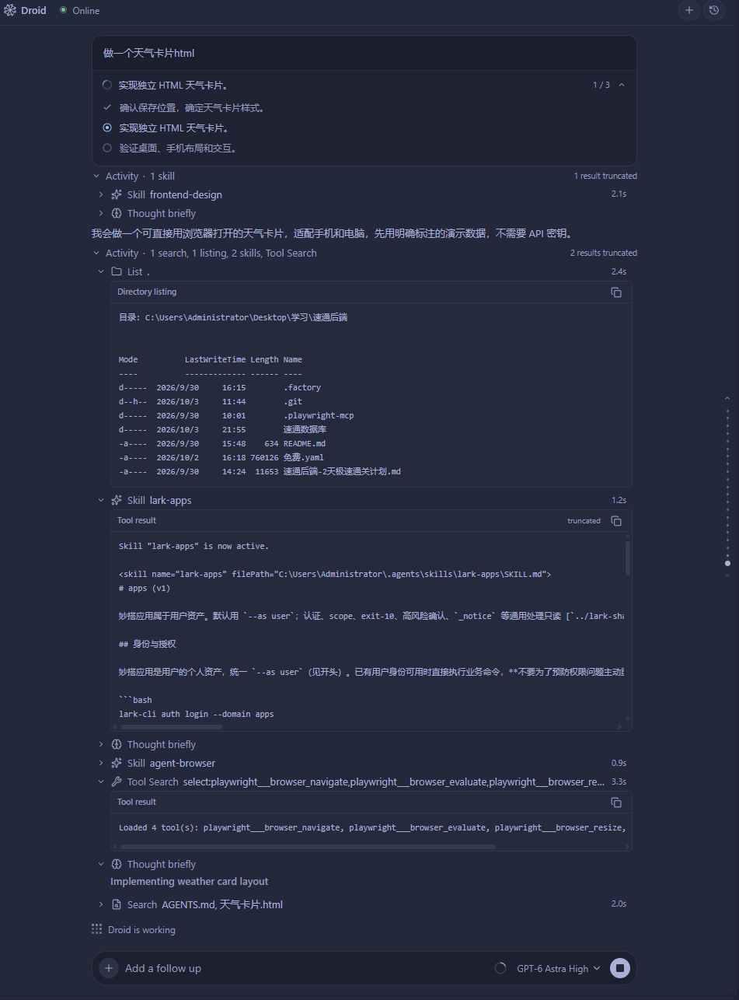

# 安装与第一次对话

你需要一个兼容的编辑器、本机 Droid CLI，以及可用的模型服务。
安装扩展本身不需要克隆源码或安装 Node.js。

## 1. 准备编辑器与 CLI

使用支持 VS Code API `1.108.0` 或更高版本的 VS Code / Cursor。
目前项目主要在 Windows 上开发和验证；macOS、Linux 及远程开发环境尚未完成同等验收。

按 [Factory 官方快速开始](https://docs.factory.ai/droid-cli/quickstart.md)
安装 Droid CLI 并完成认证。在编辑器的终端确认：

```sh
droid --version
```

再运行 `droid`，确认 CLI 能用你选定的模型完成一次正常对话。
这一步可以提前区分 CLI／模型服务问题与扩展界面问题。

模型可使用 Factory 提供的服务，或按 [官方 BYOK 说明](https://docs.factory.ai/model-independence/byok.md)
配置自己的服务。扩展不附带订阅、API Key 或免费额度。

## 2. 下载并安装扩展

1. 打开 [GitHub 最新版本](https://github.com/fireman-droid/droid-for-vscode/releases/latest)。
2. 在 **Assets** 下载 `droid-版本号.vsix`。`Source code` 压缩包是源码，不能直接作为扩展安装。
3. 打开编辑器的扩展面板，在 `…` 菜单选择 **Install from VSIX…**，选中下载的 VSIX。
4. 在命令面板执行 **Developer: Reload Window**。

命令面板在 Windows / Linux 上通常使用 `Ctrl+Shift+P`，macOS 使用 `Cmd+Shift+P`。

## 3. 开始第一次对话

打开你要处理的项目文件夹，在命令面板执行 **Droid: Open Chat**，
或点击活动栏中的 Droid 风车图标。

等待连接就绪，在输入框旁选择模型，再发送一个范围清楚的问题。例如：

> 先阅读这个项目的入口和 README，介绍各目录负责什么。暂时不要修改文件。

任务需要权限或补充信息时，在对话内对应的卡片回答。
模型开始修改文件后，可以从修改记录进入 [Review](REVIEW.md) 查看结果。

<figure class="droid-screenshot">

[](images/chat-task.png)

<figcaption>一次制作天气卡片的任务：顶部查看计划，Activity 中查看工具细节。点击图片查看原图。</figcaption>
</figure>

想使用自己的模型渠道，继续阅读 [模型与服务渠道](MODELS.md)。
想让编辑器自动显示代码建议，单独完成 [补全配置](AUTOCOMPLETE.md)。
聊天模型和补全服务分别配置。

## 更新安装包

从同一个 [Releases 页面](https://github.com/fireman-droid/droid-for-vscode/releases/latest)
下载新版 VSIX，重复安装并 Reload Window。GitHub 下载版需要手动更新。

扩展沿用 `droidvisx.droidvisx` 这个内部 ID，公开下载文件使用 `droid-版本号.vsix`。
无需先卸载旧版；模型配置和会话继续沿用已有数据。

## 连接不成功时

先确认当前终端里的 Droid CLI 可用，并检查是否还有等待回答的权限或提问卡片。
运行 **Droid: Open Logs** 查看错误，或按 [排障指南](TROUBLESHOOTING.md) 提供诊断信息。

默认 daemon 模式下，重载窗口或关闭面板并不等于停止后台任务。
需要中断时使用任务的停止操作，并确认状态发生变化。
