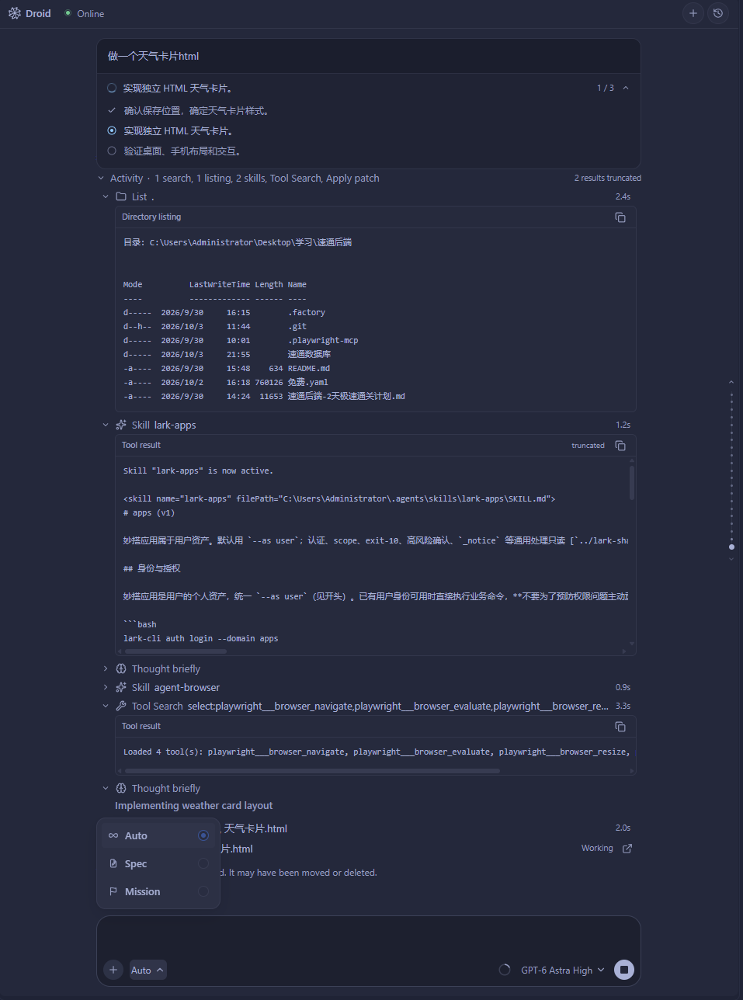

# 子代理与 Mission

子代理用于分担具体工作；Mission 用于组织包含多个 Feature 和 Worker 的持续任务。
两者的进度都来自 Droid，界面展示的是已收到的任务状态。

## 查看子代理

主对话派出子任务后，会出现对应卡片，展示标题、状态和最近活动。
点击卡片打开子会话，查看消息和工具记录；输入区上方的 Agents 列表用于在相关子任务之间切换。

默认 daemon 模式下，子会话复用聊天界面，可以跟进、附加上下文、回答权限请求和停止任务。
显式使用 process 模式时，子任务查看保留只读路径。
子会话暂不开放会改变会话身份的 Fork、Compact 和历史编辑重发。

关闭子会话标签不等于取消任务。停止时以后台确认的状态为准。

## 使用 Mission

聊天输入区的模式菜单提供 **Auto**、**Spec** 和 **Mission** 入口。

<figure class="droid-screenshot">

<figcaption>输入区的模式选择菜单。点击图片查看原图。</figcaption>
</figure>

运行 **Droid: Open Mission Control** 打开任务列表。查看已有 Mission，或点击 **New Mission** 创建任务：

1. 在 **Mission goal** 中填写要交付的目标和约束。
2. 确认负责规划的 **Orchestrator** 模型与推理强度。
3. 按需展开 **Execution settings**，配置 Worker／Validator 模型，以及 Scrutiny／User Testing 开关。
4. 点击 **Start Mission**，在主会话中完成后续提问与计划确认。

Mission 会经历规划、确认和执行；规划中出现的 Feature 列表并不表示 Worker 已经开始工作。

在 Mission 中主要查看：

| 内容 | 用途 |
| --- | --- |
| Feature 列表 | 了解任务拆分、当前执行项与完成进度 |
| Worker 记录 | 找到执行该项工作的子会话 |
| 验证信息 | 查看该 Mission 实际启用并执行的验证结果 |

Mission 的角色模型和验证开关属于任务配置，不能只根据完成数量推断所有验证已通过。
需要调整目标或补充条件时，回到负责协调的主会话说明。

## 连接、暂停与完成

连接状态表示编辑器和 Droid 的通信情况；任务状态表示执行进度。
编辑器离线时，后台可能仍在运行；卡片显示 **Status unavailable** 表示暂时无法确认当前状态，
不能解读为完成或失败。

遇到状态停留、记录没有更新或子会话打不开时，先查看是否有等待回答的提问／权限卡片，
再按 [排障指南](TROUBLESHOOTING.md) 检查连接和日志。
不要仅凭主对话中的“已开始”文字判断 Worker 已成功启动。

默认 daemon 允许任务在窗口重载后继续运行，但运行中 Reload 的恢复仍受 CLI、会话与连接状态影响。
具体能力和未验收范围见 [能力矩阵](CAPABILITIES.md)。
