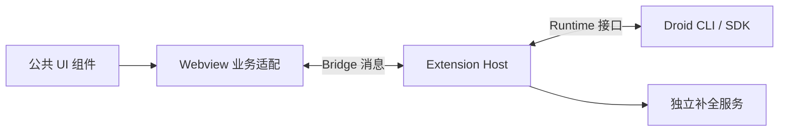

# Droid 文档

**从第一次对话，到读懂一次请求如何执行。**

Droid 是 Factory Droid CLI 的非官方 VS Code / Cursor 扩展。
这个文档入口按使用和开发两条路径组织：前者帮助你完成任务，后者帮助你找到代码、理解边界并提交修改。

[安装并开始使用](GETTING_STARTED.md) · [搭建开发环境](DEVELOPMENT.md) · [阅读系统架构](ARCHITECTURE.md)

## 使用 Droid

第一次使用按 **安装 → 配置模型 → 开始对话 → 审阅修改** 阅读。
补全使用独立服务，可以在需要时再配置。

| 你要完成的事 | 指南 | 读完可以做什么 |
| --- | --- | --- |
| 安装插件并连接本机 CLI | [安装与第一次对话](GETTING_STARTED.md) | 安装 VSIX，确认环境，发送第一条消息 |
| 使用自己的 API Key | [模型与服务渠道](MODELS.md) | 区分渠道与模型，管理别名及启停 |
| 读回复、查看工具，临时追问 | [聊天与 BTW 旁问](CHAT.md) | 引用上下文、带图提问、跟进执行过程 |
| 检查 AI 修改了什么 | [审阅文件改动](REVIEW.md) | 选择比较范围，查看 Diff，判断撤销条件 |
| 手动写代码时获得建议 | [代码补全与 Next Edit](AUTOCOMPLETE.md) | 配置服务，接受续写或跳到下一处编辑 |
| 跟进并行或长任务 | [子代理与 Mission](MISSIONS.md) | 打开子会话，查看 Worker 与任务状态 |
| 连接失败、正文停住或状态异常 | [排障与诊断](TROUBLESHOOTING.md) | 确认任务状态，定位日志，提供复现信息 |

## 参与开发

建议先跑起本地预览，再沿一次发送阅读代码。接着看状态归属和恢复流程，最后进入所改功能的细节。

| 顺序 | 阅读入口 | 解决的问题 |
| --- | --- | --- |
| 01 · 跑起来 | [环境与本地启动](DEVELOPMENT.md#environment) | 哪些依赖必须安装，怎样区分模拟预览和真实会话 |
| 02 · 找到位置 | [第一个修改](DEVELOPMENT.md#first-change) | 改控件、业务交互、SDK 行为分别从哪里开始 |
| 03 · 跟一次请求 | [发送调用链](ARCHITECTURE.md#send-turn) | 输入怎样到达 Droid，事件怎样返回页面 |
| 04 · 理解恢复 | [状态归属](ARCHITECTURE.md#state-ownership) · [会话恢复](ARCHITECTURE.md#session-recovery) | 什么是事实，什么能重建，哪些操作不能重放 |
| 05 · 处理故障 | [定位与复现](DEVELOPMENT.md#debugging) | 先查哪一层，怎样描述触发顺序和预期结果 |
| 06 · 交付修改 | [验证与提交](DEVELOPMENT.md#verification) · [构建与发布](DEVELOPMENT.md#build-install) | 验证什么、打包什么、哪些步骤会公开产物 |

### 代码分为哪些部分

公共控件、Markdown 和 Diff 展示在 `packages/chat-ui/`；Droid 业务页面与状态在 `src/webview-v2/`。
Host 管理编辑器、会话和文件，Runtime 负责适配 Droid。代码补全走独立请求路径。
完整目录职责与消息流见 [架构文档](ARCHITECTURE.md)，公共组件接入见 [chat-ui 文档](../packages/chat-ui/README.md)。

## 怎样阅读能力与状态

| 文档中的表述 | 含义 |
| --- | --- |
| 已接入 / 当前实现 | 源码存在对应调用链；不表示每个平台、模型或异常路径都已验收 |
| 依赖 CLI / 模型 / daemon | 需要当前环境提供能力；插件界面本身不能补齐后端支持 |
| 已构建 / 已测试 / 已安装 | 各自只说明对应的验证结果，不能相互替代 |
| 计划 / 待验收 | 尚不能作为已交付能力使用 |

网站文档跟随仓库源码，安装包以 [Releases](https://github.com/fireman-droid/droid-for-vscode/releases)
中的版本说明为准。具体功能边界查看 [能力矩阵](CAPABILITIES.md)。

## 维护者参考

| 需要维护的内容 | 唯一入口 |
| --- | --- |
| 当前实现与验证缺口 | [STATUS](STATUS.md) |
| 下一步工作与优先级 | [PLAN](PLAN.md) |
| 交互、样式与设计约束 | [DESIGN](DESIGN.md) |
| 按版本记录变化 | [CHANGELOG](../CHANGELOG.md) |
| 开发、测试、提交与安装规则 | [AGENTS](../AGENTS.md) |

维护记录用于追踪决策；开发者上手请先读上面的教程和架构，不需要从历史记录倒推现状。
旧基线审查保留在 [原记录](RUNTIME_CORRECTNESS_REVIEW.md)，当前结论以 STATUS 为准。

文档网站直接构建这些 Markdown，不维护第二套正文。修改页面、导航和部署的方式见
[维护文档网站](DEVELOPMENT.md#docs-site)。新增说明优先放回对应文档，不追加临时调研或交接文件。
