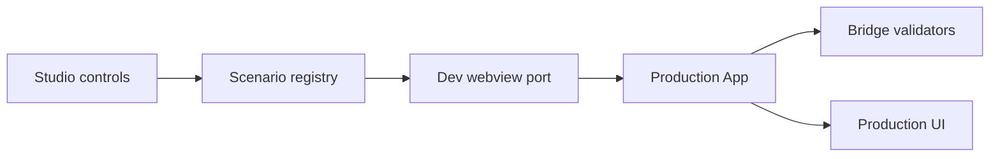

# 样式重构优化

只跟进 **视觉 / 布局 / 主题** 向条目。Bug、子代理探索、功能扩展见同目录其他文档。  
状态词：`已完成` / `待实机验收` / `未做` / `部分` / `待验证`。  
编号沿用原始清单。视觉基准（AGENTS.md）：轻奢质感，分层暖中性色、1px 边框、柔和阴影、精致字距，禁止扁平塑料感。

---

## 当前执行计划：Scenario Studio → 主聊天 UI 改造（2026-08-23）

状态：**Scenario Studio 已完成；主聊天 UI 改造待讨论**。本节是当前施工顺序；下方 2026-08-15 Cursor
重构计划保留为历史需求与几何参考，不再决定本轮视觉方向。

### 目标

先让浏览器端稳定控制主聊天的关键 UI 状态，再在同一个生产 `App` 和
同一套生产 CSS 上完成第一轮视觉改造。改造过程中不靠临时 DOM 注入、
手工等待真实 Droid 触发稀有状态或维护第二套展示组件。

本轮可观察结果：

1. `pnpm run dev:webview` 打开的 Webview Lab 能从页面控制条或 URL
   切换关键 Scenario、主题和窄/宽视口。
2. Scenario 使用真实 `HostToWebviewMessage` 类型和生产 reducer，
   Tool、Thinking、Plan、AskUser、Review、Subagent、长历史等状态能
   稳定重现。
3. Browser MCP 可直接导航到指定 Scenario，截图和检查真实生产组件。
4. 后续 UI 方向与用户聊定后，再用同一工作台改造主聊天壳、消息、活动行、
   Composer 和底部 Dock。

### 当前决策

- **Scenario 先行，Live Relay 延后。** 时间优先给 UI 改造。真实 Droid
  浏览器联调仍采用已确认的后续方案：Extension Host loopback relay
  复用 `ChatController.subscribe()` / `handleMessage()` 与现有双向严格
  Bridge 校验；浏览器不直接引入 Droid SDK。
- **只渲染生产组件。** Studio 外壳只负责选择状态、主题和视口，不复制
  `App`、Thread、Composer、Interaction 或 Review 组件。
- **UI 视觉方向暂不锁定。** Claude 暖中性方案保留为候选；具体参考、
  层级和材质等后续与用户聊定后再实施。Cursor 窄侧栏尺寸仍属于宿主约束。
- **保持 DroidVisX 身份。** 不复制 Claude 商标、营销页大字号、专有字体
  或示例文案；继续使用本地 Inter、系统字体、VS Code 变量和现有功能语义。
- **生产能力不变。** 本轮不改 Runtime、Session、权限、Bridge DTO 或
  Droid 能力，只补开发场景和视觉呈现。

### 范围

#### Scenario Studio

场景按“完整工作流 + 专用状态”组织：

| Scenario | 必须覆盖 |
| --- | --- |
| `full-workflow` | 长工作过程：Thinking、Tool、Plan、Subagent、Changes、队列与 Markdown 回答 |
| `conversation` | 普通用户消息、Markdown 回答、消息操作、Composer |
| `streaming` | Thinking、Tool running/completed、命令详情、Pending response |
| `plan` | Todo/Plan 进行中与完成态、Plan interaction |
| `ask-user` | 多问题、选项、自由输入、固定操作区 |
| `review` | Changes history、ReviewDock 收起与展开所需数据 |
| `subagent` | 运行中 Subagent 卡、最近活动、完成态 |
| `permission` | 多工具确认、风险说明和批准选项 |
| `queued-attachments` | 暂停队列、队列附件和 Composer 暂存附件 |
| `long-history` | 虚拟列表、吸顶用户卡、问题导航、Show earlier |
| `failure` | 断线、Turn error、Tool failure、恢复/截断提示 |
| `empty` | 已连接但还没有消息的会话 |

控制面：

- URL：`/app?scenario=<id>&theme=<light|dark|auto>&width=<px>`；
- 页面控制条：Scenario、Theme、Viewport、Reset；
- 全局只读控制 API：`window.__dvxStudio`，供 Browser MCP 选择场景和
  读取当前配置；
- Scenario 切换必须重置 sequence、持久化草稿和临时 UI 状态，避免前一
  场景污染后一场景。

#### 第一轮 UI 改造

包含：

- Header 与阅读列的共同宽度、品牌和状态层级；
- 用户消息、Assistant 正文、Markdown 与消息操作；
- Thinking、Tool、命令、Plan、Subagent 活动呈现；
- Composer、Mode/Model/Context 浮层；
- AskUser / Plan interaction Dock 与 ReviewDock；
- Question Navigator 在 320–480px 下不覆盖正文；
- Light、Dark、Auto 的表面、边框、文字和强调色层级。

不包含：

- Models / Provider 整页重做；
- Mission Setup / Mission Control 整页重做；
- Agent activity、Session Viewer、Canvas 的整体重做；
- Browser Live Relay；
- 新 Droid 能力、新 Bridge DTO 或新依赖。

### 结构

- `src/webview/dev/scenarios.ts`：类型安全的 Scenario registry 和消息；
- `src/webview/dev/studioRuntime.ts`：sequence、emit、postMessage 响应和
  Scenario reset；
- `src/webview/dev/StudioControls.tsx`：仅开发环境控制条；
- `src/webview/dev/main.tsx`：装配生产 App、Studio transport 和独立页面；
- `src/webview/dev/preview.css`：Studio 外壳，不承载生产视觉修补；
- 对应聚焦测试验证 URL 解析、场景切换、sequence 和关键场景消息合法。

新文件都需低于仓库预算；不把场景继续堆进已达 340 行的 `main.tsx`。

### 执行顺序

1. 拆出现有 Webview Lab transport 和基础 snapshot。
2. 建 Scenario registry、URL 配置和 `window.__dvxStudio`。
3. 增加控制条及 320 / 400 / 480 / 760px 画布。
4. 补齐上表 12 个场景，先让生产 App 全部可见。
5. 运行 Webview `tsc --noEmit`、`lint:budgets` 和触及的聚焦测试。
6. 更新 `implementation-status.md`，记录 Scenario Studio 为开发工具，
   不把它误记为用户产品能力。
7. 与用户聊定 UI 方向后，以 `conversation` / `streaming` / `ask-user` /
   `review` / `long-history` 为第一轮视觉验收面，实施主聊天 UI 改造。
8. 再次运行同样的聚焦门禁，随后 build、VSIX package、安装；用户在真实
   Cursor Secondary Sidebar Reload Window 后验收。

### 完成标准

Scenario 阶段完成：

- 12 个场景可由 URL 和控制条稳定切换；
- 320、400、480、760px 可视；
- Light、Dark、Auto 可切换；
- Scenario 消息均通过现有生产 Host message validator；
- 切换后无旧场景 transcript、interaction 或 sequence 残留；
- Browser MCP 能读取并截图指定场景。

实现结果：12 个场景、URL 配置、页面控制条、四档视口和
`window.__dvxStudio` 已落地；Webview TypeScript、文件预算及聚焦 6 项
测试通过。按当前仓库门禁未运行浏览器 smoke。

### Cursor Browser / Scenario Studio 实测注意

- 主题由两个值共同决定：`data-theme` 是解析后的明暗结果，
  `data-dvx-theme-preference` 才是 Light / Dark / Auto 偏好。
  `data-theme="dark"` 与 `data-dvx-theme-preference="auto"` 同时出现表示
  “Auto 当前解析为暗色”，不是固定 Dark。检查样式命中时必须同时读取两者；
  Auto 文件最后导入，会按 preference 覆盖固定暗色 token。
- `window.__dvxStudio.setTheme()` 经异步 `MessageEvent` 把主题送入生产
  `App`。自动化在调用后不能立刻截图或量 CSS，需等待 `.dvx-shell` 的两个
  theme data attribute 与 `window.__dvxStudio.getState()` 一致。
- Studio 的 `--vscode-*` 变量来自 `src/webview/dev/preview.css` 的固定开发
  样本，不是当前 Cursor 实际主题。它能验证 Auto selector、布局和 token
  映射，不能替代真实 Secondary Sidebar 中的最终颜色与对比度验收。
- 某些真实 Cursor 主题会把 `--vscode-panel-border` 或
  `--vscode-widget-border` 明确定义为 `transparent`；此时 CSS
  `var(--token, fallback)` 不会进入 fallback。Auto 的结构边框应从编辑器
  foreground 派生可见 hairline，不能只依赖 border token 回退。
- 控制条的 320 / 400 / 480 / 760px 只设置内部
  `.dvx-studio-viewport`，不是浏览器页面宽度。做覆盖或横向溢出测量时应以
  viewport / `.dvx-shell` 为边界，不能用整张截图宽度代替。

UI 阶段完成：

- 上述主聊天范围使用一套统一材质与文字层级；
- 320–480px 无正文覆盖、横向溢出或 Footer 控件裁切；
- Tool / Thinking 从属于最终回答，AskUser / Review 保持明确可操作；
- 不新增不受 Runtime 支持的控件或状态；
- 触及文件测试、Webview TypeScript、预算检查通过；
- build、package、安装完成，等待用户真实 Cursor 验收。

---

## 已完成 · 待实机验收

审计结论：下列条目已在对应版本落地，统一待实机过目后再标「已完成」。

| 编号 | 问题 | 截图 | 版本 | 状态 |
| --- | --- | --- | --- | --- |
| 10 / 20 | btw 用户消息与 droid 难区分；应对齐主聊天深色方框 + 吸顶；**点击跳转**到消息起始（不进编辑） | [image/吸顶.png](./image/吸顶.png)、[image/bytheway.png](./image/bytheway.png) | v0.7.18 | 待实机验收 |
| 11 | addmodel 排版样式有问题 | [image/addmodel.png](./image/addmodel.png) | v0.7.25 | 待实机验收 |
| 12 | 长模型名显示不全，需加长最大宽度 | [image/最大模型长度.png](./image/最大模型长度.png) | v0.7.18 | 待实机验收 |
| 19 | btw / add model 点击仍有灰色外层边框；应改为原边框变灰，同主聊天 | [image/灰色外层边框.png](./image/灰色外层边框.png)、[image/原边框.png](./image/原边框.png) | v0.7.18；与 bug **8** soft shadow 不完全同构，需对照主 Composer | 待实机验收 |
| 22 / 27 | theme `auto` 未实现 / auto 直接复用黑色未跟主题 | — | v0.7.19 + v0.7.25 | 待实机验收 |
| 23 | 左侧 + 号搜索框应为固定定位 | — | v0.7.19 | 待实机验收 |
| 24 | 字数过多换行；设最大长度 + 省略号 | [image/换行.png](./image/换行.png) | v0.7.19 | 待实机验收 |
| 26 | 模型选择扁平没质感；名称与编辑按钮过远；model edit 底部 cancel / fetch 列表布局怪 | [image/模型编辑.png](./image/模型编辑.png)、[image/modeledit.png](./image/modeledit.png) | v0.7.25 | 待实机验收 |

---

## 未做

| 编号 | 问题 | 截图 | 说明 | 状态 |
| --- | --- | --- | --- | --- |
| 30 | btw / 主会话卡片不完全吸顶，上方漏出一点文字 | [image/btw卡片不完全吸顶.png](./image/btw卡片不完全吸顶.png) | 段 A 已修（sticky 容器 padding 外移 + `--dvx-sticky-top`），**未装包** | 部分（代码未装包） |
| 33 | 图片排版：第一行两张、第二行一张；改为一行一张或更好排版 | [image/图片显示.png](./image/图片显示.png) | 段 A 已改为 block 一行一张，**未装包** | 部分（代码未装包） |
| 34a | 按钮多一个方框 | [image/按钮.png](./image/按钮.png) | — | 未做 |
| 34b | plan 选择模式太素、卡通感不对味 | [image/plan选择.png](./image/plan选择.png) | 按轻奢重做；**先静态稿**再实现 | 未做 |
| 34c | 计划卡片缺 padding、过于单调 | [image/计划卡片.png](./image/计划卡片.png) | 补 padding + 完整质感；**先静态稿**再实现 | 未做 |
| 40 | Edit connection 模型卡片布局丑：五列挤、按钮纯文字、Max tokens 与 checkbox 不对齐 | [image/model-card-test.png](./image/model-card-test.png) | 改为字段堆叠 + 底栏实体按钮 + 测试状态。**待装包验收** | 待实机验收 |

---

## 已确认决策（2026-08-15）

1. **10 / 20**：用户消息点击 → 跳转到该消息起始位置；吸顶行为对齐主聊天（审计：已落地，待实机验收）。
2. **22 / 27**：疑似已实现 → 标 **待实机验收**；通过即关。
3. **26 / 34b / 34c**：视觉重做项优先出静态稿再写进扩展。**26** 审计已为 v0.7.25 改过 → 标待实机验收；**34** 仍未做。静态稿 agent 已中止，**尚未派发新一轮静态稿**——实现前先聊定再派样式 agent。
4. **验收粒度**：剩余未做项全部做完后，再统一装包、一次验收。

---

## 不在本册

| 编号 | 去向 |
| --- | --- |
| 行为类 1–5、7–9、13–15、17–18、29、32、35、39 | [bug.md](./bug.md) |
| 16、31 | [explore-subagent.md](./explore-subagent.md) |
| 21、25、28 | [feature-extend.md](./feature-extend.md) |

## 整体重构计划（2026-08-15 定稿）

基线：整体向 Cursor 风格重构，参照 [image对比/](./image对比/)（cursor = 目标，droid = 现状）。功能与 Cursor 不同之处只改样式不改行为。
验收：**每段装包验收一次**，段 A 先行。
子代理页流式预期（已对齐）：快照轮询 + 增量渲染（近流式观感），非真 token 流，为 Droid 数据通道物理上限。

| 段 | 内容 | 对应条目 | 状态 |
| --- | --- | --- | --- |
| 0 | 设计基线 → [`ui-cursor-spec.md`](./ui-cursor-spec.md)（含 §1.5 三主题色板、§3.5 计划卡） | 全部的地基 | **完成**（仅文档） |
| A | 聊天主体 + token 落地 + ComposerControls 拆分 | 1、2、5、10 + 旧账 30、33 + 脏灰/auto 边框 | **代码完成、未装包** |
| B | 功能卡片：模式 / 压缩 / Review 吸底 / 终端 / 计划卡 / +号同宽 | 3、4、6、9 + 34a/b/c | **未做**（Fable 因 unpaid invoice 失败） |
| C | 子代理工作区 UI | 7 + 探索 #31 | **后端完成未装包；UI 未做** |
| D | 模型页：菜单照抄 + Add models 整页 + provider 独立新页 | 8 | **未做**（同 B，账单失败） |

进度细节与给 GPT 的开工顺序：[handover-2026-08-15.md](./handover-2026-08-15.md)。

### 补充需求（2026-08-15 下午）

1. **计划卡片样式重做**：并入段 B（与 34c 合并处理），新参照截图 [image/计划卡片-补充.png](./image/计划卡片-补充.png)——现状卡片（勾选行 + 3/3 进度）整体重做质感。
2. **黑 / 白 / auto 三主题配色方案**：归段 0 的全局 token 部分，三套主题各出一份完整色板（表面层次/边框/文字/强调色），auto 跟随 VS Code 主题变量。已补进 spec §1.5。
3. **暗色某卡片背景「黑中掺灰」显脏、显低级**（用户 2026-08-15，具体哪个卡片待认领）：段 A 施工时全量审计暗色表面色，逐一对照 spec §1.5 色板清洗「脏灰」混色；用户再次遇到时补截图认领。
4. **auto 主题部分边框看不清**：即需求 5 根因（映射到常同值/常透明的 VS Code 变量），修法已逐 token 写入 spec §1.5 auto 列，段 A 落地。

### spec 拍板进度（2026-08-15 定稿）

| 项 | 结论 |
| --- | --- |
| +号面板 | **通过，改一点**：结构照 spec（顶部搜索行 + 附件组 + 配置组），宽度**与聊天输入框同宽**（不做窄菜单） |
| 终端井底色 | 样式重做（几何照 Cursor），**底色保留暖调**（用户「要保留」） |
| add model 整页 | 就地展开向导**否决**；「+ Add provider」必须**打开独立新页**承载配置（网址 key → fetch 勾选 → 参数），模型列表页与配置页分离 |
| Review 吸底后消息流账本 | 迁吸底通过；消息流保留**安静单行**的每轮 Changes 历史行（代理决策，用户离线授权） |

### 执行波次（2026-08-15 15:36 起，用户离线 ~5h，全权执行）

- **波 1（并行）**：段 A（聊天主体 + §1.5 token 落地 + ComposerControls 拆分）；daemon 通道改造（bug 36/37 方案 A + 段 C 后端 + 抽屉过滤 exec）
- **波 2（段 A 后并行）**：段 B（功能卡片）；段 D（模型页）
- **波 3**：段 C 页面 UI（依赖段 A 渲染 + 波 1 后端）
- **收尾**：集成校验 → 打包装机（单独执行）→ 文档回写 → 总结给用户
- 约束：各波 worker 不改 docs、不跑 build/install；版本号由收尾统一升。
- **中断（2026-08-15 18:52）**：波 1 完成；波 2 段 B/D 因团队 unpaid invoice 失败。后续用 GPT 接 [handover-2026-08-15.md](./handover-2026-08-15.md)。

---

## 原始需求记录（用户，2026-08-15）

我想着是整体样式向cursor重构，目前来说，我们的这个样式卡片、结构简单单调，而且设计上面也不统一，我等下会跟你说照着cursor改，如果给你的图片中，我们的功能和他们的不一样，那肯定就是只要改样式了
1.聊天记录样式 D:\E\前端好玩的东西\droidvisx\docs\debug\image对比\droid\聊天记录.png D:\E\前端好玩的东西\droidvisx\docs\debug\image对比\cursor\聊天记录.png，位置和结构、样式都复刻
2.当整体页面宽度变大的时候，以发的聊天卡片宽度和底下的宽度不一样
3.选择模式这里，位置不用改，只用改样式 D:\E\前端好玩的东西\droidvisx\docs\debug\image对比\cursor\选择模式.png D:\E\前端好玩的东西\droidvisx\docs\debug\image对比\droid\选择模式.png
4.压缩内容也是，照着cursor做，但是我们多了个compact，看看放哪里合适 D:\E\前端好玩的东西\droidvisx\docs\debug\image对比\cursor\压缩内容.png D:\E\前端好玩的东西\droidvisx\docs\debug\image对比\droid\压缩内容.png
5.已发送内容和聊天区的卡片边缘和内容没有明显分界线，我都看不出来那是我问的，看看多主题会不会有bug，有则修复
6.review的位置请放在聊天区上面，具体看D:\E\前端好玩的东西\droidvisx\docs\debug\image对比\cursor\已发送卡片和聊天区.png，这是点开review的样子D:\E\前端好玩的东西\droidvisx\docs\debug\image对比\cursor\点开review.png
7.子代理参考这个，D:\E\前端好玩的东西\droidvisx\docs\debug\image对比\cursor\子代理ai回答.png，D:\E\前端好玩的东西\droidvisx\docs\debug\image对比\cursor\子代理聊天区.png 也是放在聊天区上面，点击子代理之后，D:\E\前端好玩的东西\droidvisx\docs\debug\image对比\cursor\点击子代理.png直接出现一个工作区页面，我看了这个，基本上跟主聊天页面，能复用就复用，主agnet发送的东西也是一样点击变大，点击别的地方就变小，这样应该就ok了，最重点还是跟主聊天的流逝渲染吧，以及ai回答的形式跟猪聊天一样，我感觉就是完全复用，所以我打算btw那个侧聊天区只留给btw了
8.模型卡片全抄cursor就行，D:\E\前端好玩的东西\droidvisx\docs\debug\image对比\cursor\模型卡片.png，然后的话add model放在底部，但是点击之后是直接一个大页面专门用来添加模型，不知道你懂不懂，就是直接切掉聊天页面，变成模型页面
9.终端照抄样式就行D:\E\前端好玩的东西\droidvisx\docs\debug\image对比\cursor\终端打开.png，D:\E\前端好玩的东西\droidvisx\docs\debug\image对比\cursor\终端没打开.png
10.像我们的其实问题也不是很大，主要是滥用卡片，卡片太大导致看起来很廉价，同时有些地方又没有动画效果。看着就更垃圾了，像是+号打开的样式，这些没有原型图，就需要自己设计，就很吃你的思想和搭配
