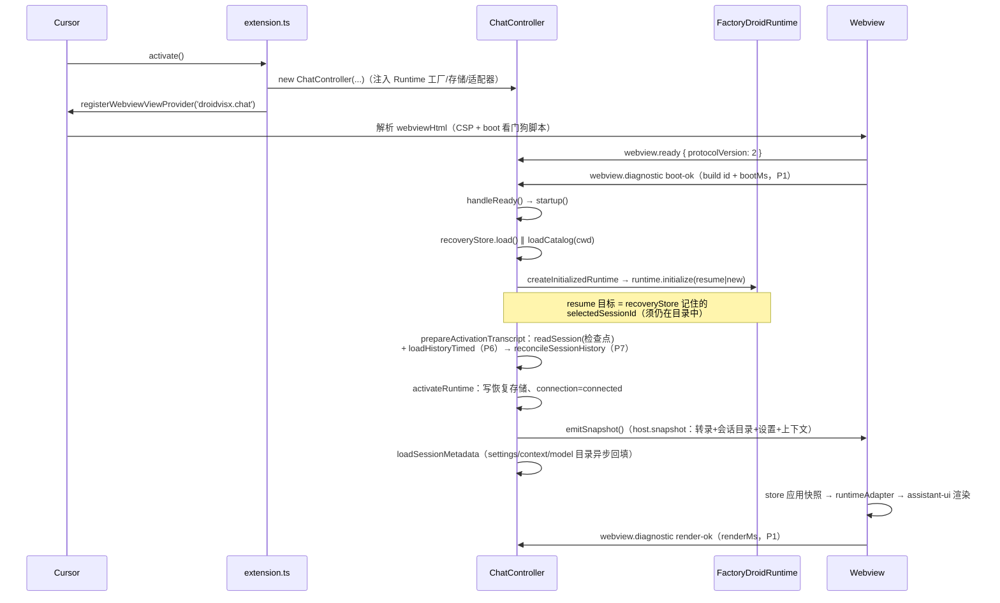
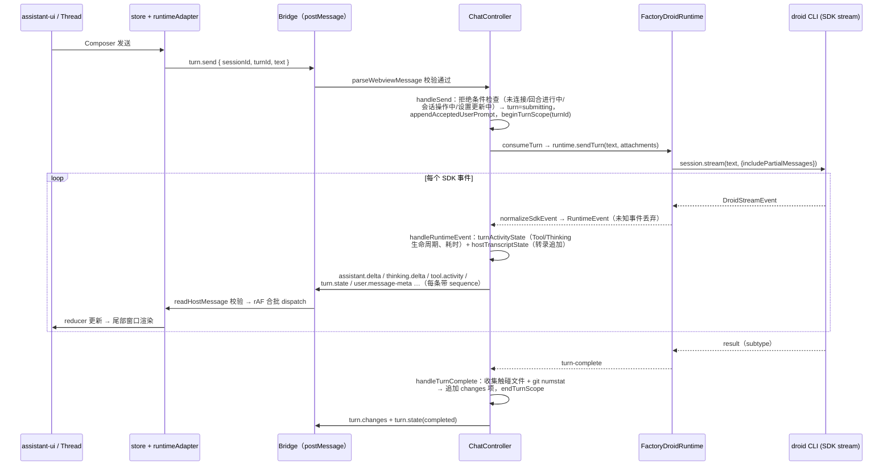
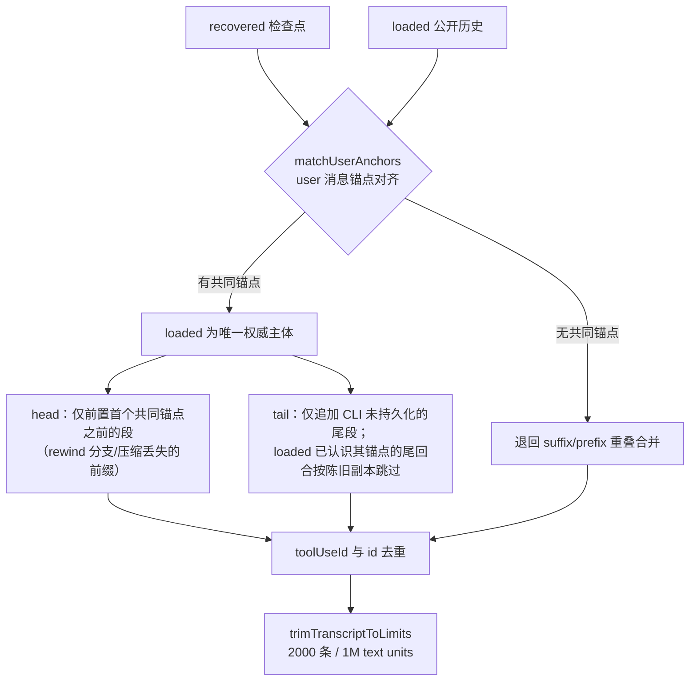

# DroidVisX 架构总览

> 写给零记忆接手者的架构 onboarding。内容全部从当前源码实证（文中
> 标注文件），不是设计愿景。交接总索引与剩余工作见
> [`docs/README.md`](../README.md)；当前进度
> [`docs/debug/handover-2026-08-15.md`](../debug/handover-2026-08-15.md)；
> 已装机能力
> [`docs/product/implementation-status.md`](../product/implementation-status.md)。
>
> 创建日期：2026-08-11。

## 1. 四层职责与 import 边界

```text
┌─ Webview（src/webview/）────────────────────────────┐
│  React 19 + assistant-ui；只消费已校验的 Bridge DTO   │
└──────────────▲───────────────────────────────────────┘
               │ postMessage（双向严格校验 + sequence）
┌─ shared Bridge（src/shared/）────────────────────────┐
│  纯类型/常量/校验函数；四层唯一共享物                  │
└──────────────▲───────────────────────────────────────┘
               │
┌─ Extension Host（src/extension/）────────────────────┐
│  ChatController 状态机 + VS Code API 适配 + 诊断      │
└──────────────▲───────────────────────────────────────┘
               │ RuntimeEvent（异步迭代器）
┌─ Runtime（src/runtime/）─────────────────────────────┐
│  @factory/droid-sdk 适配；vscode-free                 │
└──────────────────────────────────────────────────────┘
```

### 各层职责与关键文件

**`src/runtime/` —— Droid SDK 适配层（不 import `vscode`，实测零引用）**

- `FactoryDroidRuntime.ts`：生产 Runtime。持有 SDK `DroidClient` +
  `ProcessTransport`（本地 droid CLI 子进程），实现 `DroidRuntime.ts`
  接口：`initialize`（新建/恢复 Session）、`sendTurn`（异步生成器，
  内部 `session.stream(text, { includePartialMessages: true, ... })`）、
  `interrupt`、`rewind`、`fork`、`compact`、Settings/Context/Skills/
  MCP/Commands 读写等。
- `normalizeSdkEvent.ts`：SDK `DroidStreamEvent` → 内部 `RuntimeEvent`
  （`runtimeEvents.ts`）的唯一翻译点；丢弃未知事件、裁剪 ID/名称、
  提取 tool 的 `filePath`（`toolFilePath.ts`）与 `detail`
  （`toolDetail.ts`）。
- `runtimeInteractions.ts`：SDK 权限/AskUser 回调 → Host 交互请求。
- `FactorySessionCatalog.ts`（会话列表）、
  `history/FactorySessionHistoryLoader.ts` + `projectSessionHistory.ts`
  （公开 `DroidClient.loadSession()` 历史加载与安全投影）、
  `commands/FactoryCommandCatalog.ts`（`/` 命令目录）、
  `modelCatalogCaptureTransport.ts`（从初始化/加载响应捕获
  `availableModels`）、`runtimeDiagnostics.ts`（诊断 sink 接口）。
- `capabilities/`：Capability Probe，**未接入 Extension**，勿当产品功能。

**`src/extension/` —— Extension Host（唯一允许 import `vscode` 的业务层）**

- `extension.ts`：`activate()` 组装一切——`LocalDiagnostics`（JSONL
  日志）、`ChatController`（注入 Runtime 工厂与全部 VS Code 适配器）、
  `DroidViewProvider`（注册 `droidvisx.chat` Webview 视图）、三个命令
  （`droidvisx.focusView` / `openLogs` / `exportDiagnostics`）。
- `ChatController.ts`（~4700 行，核心状态机）：处理全部
  Webview→Host 消息；持有 `sessionId` / `turn` / `transcript` /
  `sequence` 等权威状态；用 **generation 计数**
  （`runtimeGeneration` / `turnGeneration` / `contextGeneration` /
  `workspaceContextGeneration`）拒绝旧 Runtime、旧 Session、旧 Turn
  的迟到结果。
- 状态积累器：`hostTranscriptState.ts`（Host 侧转录）、
  `turnActivityState.ts`（回合内 Thinking/Tool 活动）、
  `pendingInteractionCoordinator.ts`（权限/AskUser 生命周期与防重复
  响应）、`reconcileSessionHistory.ts`（恢复对账，见时序③）、
  `SessionRecoveryStore.ts`（workspaceState 恢复检查点）。
- VS Code 适配器：`vscodeAttachmentSources.ts`、`vscodeFileDiff.ts`、
  `changeStats.ts`（git numstat）、`vscodeExternalUrlOpener.ts`、
  `webviewHtml.ts`（CSP：禁网络连接、nonce 脚本）、
  `exportDiagnostics.ts`。

**`src/shared/` —— Bridge 契约（纯函数/类型，无 vscode、无 SDK、无 React）**

- `bridgeMessages.ts`：`BRIDGE_PROTOCOL_VERSION = 2`；
  `WebviewToHostMessage`（34 种）与 `HostToWebviewMessage`（23 种）
  联合类型；全部长度/数量上限常量。
- `validateMessage.ts`：Host 侧入站校验
  （`parseWebviewMessage` / `isWebviewToHostMessage`）。
- `interactionProtocol.ts`、`toolActivity.ts`、`transcriptLimits.ts`
  （2,000 条 / 1,000,000 text units + `trimTranscriptToLimits`）、
  `hostTranscriptState.ts`（`stableTranscriptId` FNV 哈希稳定 ID）、
  `strictValidation.ts`。

**`src/webview/` —— UI 层（浏览器环境，只依赖 `src/shared/`）**

- `main.tsx`：挂载 `AppErrorBoundary` + `App`（渲染崩溃显示可读错误
  而非白屏，并发信标）。
- `bridge/vscode.ts`：`acquireVsCodeApi` 共享（HTML boot 信标脚本先
  取）、`announceReady`（带协议版本）、boot/render/perf 信标、草稿
  持久化。`bridge/validateHostMessage.ts`：Webview 侧入站校验
  （`readHostMessage`，exact-keys + 枚举 + 上限）。
- `assistant/store.ts`：单一 reducer 状态（transcript、turn、
  interactions、settings、context、catalog、skills、mcp、commands、
  attachments…）；丢弃 `sequence` 不递增的消息。
- `assistant/App.tsx`：Bridge 消息按 **rAF 合批**（每动画帧一次批量
  dispatch，50ms 隐藏兜底）；P1–P3 性能信标。
- `assistant/runtimeAdapter.ts`：store 转录 → assistant-ui
  `ExternalStoreRuntime` 消息；默认只挂载**尾部 60 条**窗口
  （`DEFAULT_MESSAGE_WINDOW`，"Show earlier messages" 步长 120）；
  对 toolCallId 兜底去重。
- `assistant/Thread.tsx`（消息与活动行）、`Interactions.tsx`（权限/
  Plan/AskUser 内联交互块）、`ComposerControls.tsx`（Mode/Model/
  Context/`+` 面板）、`SessionDrawer.tsx`、`MarkdownText.tsx`
  （GFM 安全渲染）、`styles.css`（暖色 Token）。

### import 边界（构建期强制）

`esbuild.mjs` 在每次 build 时用 metafile 断言（违反即构建失败）：

- **Webview bundle 禁运入**（`assertNoForbiddenWebviewInputs`）：
  `@factory/droid-sdk`、`assistant-cloud`、`/runtimes/cloud/`、
  `src/extension/**`、`src/runtime/**`。即 Webview 只能 import
  `src/webview/` 与 `src/shared/`。
- **Extension bundle** 只允许 `vscode` 与 Node 内建为 external，
  其余全部打包（`assertExpectedExternals`）。
- Runtime 层不 import `vscode`（约定，非构建断言；VS Code 相关实现
  一律放 `src/extension/` 并由 `extension.ts` 注入）。

依赖方向汇总：`shared ← runtime ← extension`；`shared ← webview`；
webview 与 extension/runtime 之间**只有** postMessage Bridge。

## 2. 三条关键时序

### ① 冷启动：激活到首屏



要点：工作区缺失/未信任时 `startup()` 直接
`emitWorkspaceUnavailable`，不建 Runtime；Webview 刷新（再次
`webview.ready`）只重发快照并 `replayPending()` 未决交互，不重建
Runtime。boot/render 信标写入 JSONL 日志，是判断"陈旧 Bundle /
白屏"的第一证据（见
[`log-analysis-playbook.md`](../product/log-analysis-playbook.md)）。

### ② 一个回合的消息流



要点：迟到事件由 `isCurrentTurn`（runtime 引用 + runtimeGeneration +
turnGeneration + sessionId + turnId 五重比对）过滤；Stop 走
`turn.stop` → `runtime.interrupt()`，状态 `stopping` 期间非终态事件
被丢弃。权限/AskUser 由 `runtimeInteractions` 从 SDK 回调发起，经
`pendingInteractionCoordinator` 变成 `interaction.request`，Webview
以 `permission.respond` / `askuser.respond` 回应，Coordinator 保证
只结算一次且与精确的 Workspace/Session/Turn/Generation 绑定。

### ③ 会话恢复对账

恢复一个旧 Session 时有两个来源：本地恢复检查点
（`SessionRecoveryStore`，workspaceState 中的有界转录快照）和公开
SDK 历史（`FactorySessionHistoryLoader.loadSession()` 投影）。二者由
`src/extension/reconcileSessionHistory.ts` 合并：



锚点主键是 SDK `messageId`（`user.message-meta` 回传并持久化），无
messageId 的锚点退化为两侧唯一的 `text.trim()`（重复文本不作锚）。
中段差异（thinking 漂移、合成 changes 行）一律以 loaded 为准整体
丢弃——这是"对话重复显示"类 bug 的根治点。日志事件
`host.perf.recovery` 的 `reconciled ≈ recovered + loaded` 是退化为
拼接的告警特征。设计推导与已接受的窄边界见
[`session-management-design.md`](../product/session-management-design.md) §3。

## 3. Bridge 不变式清单

改任何 Bridge 消息前先核对这份清单；违反任意一条都是缺陷：

1. **双向校验对称**：每种 Webview→Host 消息在
   `src/shared/validateMessage.ts` 有解析器，每种 Host→Webview 消息
   在 `src/webview/bridge/validateHostMessage.ts` 有解析器；两侧都用
   exact-keys（多余字段即整条拒绝）、类型收窄、枚举白名单。新增消息
   必须**同一变更**里补齐两侧解析器 + 双向敌对输入测试。
2. **长度/数量上限两侧一致**：所有上限是
   `src/shared/bridgeMessages.ts`（及其转出的
   `interactionProtocol` / `toolActivity` / `transcriptLimits`）中的
   共享常量，两侧 import 同一常量，绝不各写一份数字。
3. **sequence 单调**：每条 Host→Webview 消息带 `sequence`
   （ChatController 单调递增计数器 `nextSequence()`）；Webview store
   丢弃 `sequence <= state.sequence` 的消息（乱序/重放保护）。快照
   （`host.snapshot`）整体替换状态，增量消息在其序号之后应用。
4. **消息类型是封闭枚举**：`WebviewToHostMessage` /
   `HostToWebviewMessage` 联合类型即全集；未知 `type` 两侧都直接
   丢弃（Host 侧额外记 `host.bridge.rejected` 日志）。
5. **会话/回合身份绑定**：会话级消息带 `sessionId`、回合级消息带
   `sessionId + turnId`；接收侧与当前身份不符时丢弃（webview 侧仍
   推进 sequence）。
6. **内容白名单**：不进 Webview 的东西——SDK 原始对象、原始错误/
   堆栈、工具参数与输出、OAuth URL、附件内容（只发元数据 chips）、
   凭据。Tool 只投影语义动作、生命周期、有界进度、可选
   `durationMs` / `filePath`（工作区相对、越界丢弃）/ `detail`
   （≤4000 字符）。
7. **协议版本握手**：`webview.ready` 携带
   `BRIDGE_PROTOCOL_VERSION`（当前 2）；契约破坏性变更须递增版本。
8. **构建期禁运入**：`esbuild.mjs` 保证 Webview bundle 物理上不含
   SDK 与 Host 代码（见第 1 节），CSP 禁 Webview 网络连接——Bridge
   是 Webview 唯一的外部世界。

## 4. 构建与验收命令速查

| 命令 | 作用 |
| --- | --- |
| `pnpm run typecheck` | 三个 tsconfig：`tsconfig.extension.json`、`tsconfig.webview.json`、`src/webview/tsconfig.json` |
| `pnpm run test` | vitest 全量（`test:extension` / `test:webview` 可分跑；单文件 `npx vitest run <路径>`） |
| `pnpm run build` | `node esbuild.mjs` → `dist/extension/extension.cjs` + `dist/webview/`（含禁运入断言与 build id 注入） |
| `pnpm run package:vsix` | typecheck + test + build + `vsce package --no-dependencies` → `dist/droidvisx.vsix` |
| `npx vsce package --no-dependencies` | 只打包（已验证过时用） |
| `pnpm run verify:vsix` | 校验 VSIX 入口与外部依赖 |
| `cursor --install-extension dist/droidvisx.vsix --force` | 安装到 Cursor |
| `pnpm run test:integration` | VS Code Electron 集成测试（激活 + 命令注册） |
| `pnpm run smoke:runtime` | 真实 Droid Runtime 冒烟（需本机 droid CLI 登录态） |

**安装后必须 Reload Window**（版本号恒为 `0.0.0`，同版本覆盖安装
不自动换 Bundle）；怀疑 Webview 资源被 service worker 缓存钉住时
（日志 `boot-ok` 的 build id 与本次构建不符）需**完整退出重启
Cursor**。完成一个切片的完整门禁与提交流程见
[`docs/HANDOVER.md`](../HANDOVER.md)。

## 5. 延伸阅读

- 排障与日志：[`log-analysis-playbook.md`](../product/log-analysis-playbook.md)
  （事件词典权威）、[`diagnosability-design.md`](../product/diagnosability-design.md)
  （日志体系为何长这样）。
- 交付原则与模块化：[`delivery-plan.md`](../product/delivery-plan.md)。
- 未来架构：[`daemon-architecture-design.md`](../product/daemon-architecture-design.md)
  （daemon 化调研）与 `daemon-implementation-plan.md`（实现计划，写作中）。
- Droid 能力证据：[`droid-capability-matrix.md`](./droid-capability-matrix.md)
  与各设计文档的"SDK 能力证据"节。
