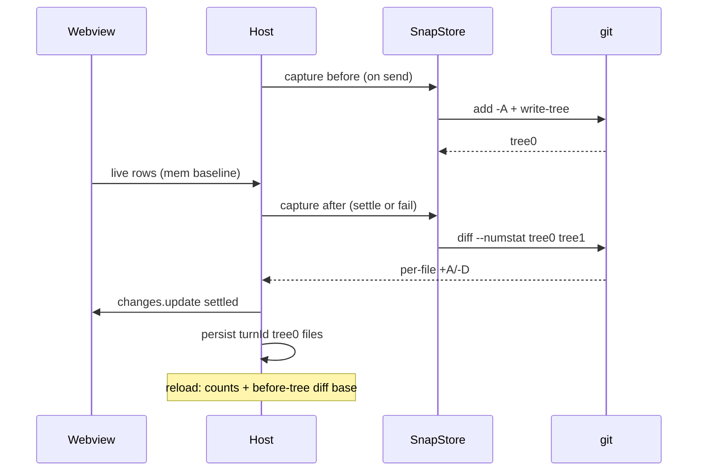

# Changes 账本改造方案（B：git 快照树为权威）

> 状态：**尚未开工的设计**。执行者请先读 `AGENTS.md`（交付循环、分层边界、文件行数预算是硬约束），再读本文。
> 仓库：`d:\E\前端好玩的东西\droidvisx`，分支 `main`。
> 本文自包含：不需要读上下文对话即可实施。

## 0. 一句话目标

把"这一回合改了哪些文件、各改了多少行、点开对比时跟什么比"的真相来源，从**进程内存里的 pre-tool 文件快照**换成**每回合前后各一棵 git tree**；并保证账本行一旦产生就必然进入宿主转录与持久化，跨 Reload 存活。

## 1. 现状链路

```text
runtime  normalizeSdkEvent.ts:96        tool_call → inputComplete:true
         toolFilePath.ts:11             仅 applypatch/create/edit/write 提取路径
host     liveChanges.ts:9               tool-start → captureTurnBaseline（内存读文件）
         turnFlow.ts:427                tool-result 且 !isError → 喂 ledger
         turnChangesLedger.ts           每文件 500ms 防抖 → changes.update{writing}
         turnFlow.ts:648                turn-complete(success|interrupted) → publishTurnChanges
                                        → appendTurnChanges → changes.update{settled}
reload   projectSessionHistory.ts:995   历史合成 changes 行，行数全 null
         reconcileSessionHistory.ts:351 用恢复检查点按段内游标补行数
         committedHistoryStats.ts:52    仅修最新一行
```

## 2. 要解决的缺陷（已核实，带锚点）

| # | 问题 | 锚点 | 后果 |
|---|---|---|---|
| 1 | 失败回合不发布 settled | `turnFlow.ts:993-1024`（`failTurn` 只 `changesLedger.cancel()`）；发布点只在 `turnFlow.ts:561/569` | 行只活在 Webview reducer（`store.ts:1575`），侧栏重挂载或 Reload 整行消失；`latestTurnChanges` 为空导致 Commit 面板 in-turn 归组失效 |
| 2 | writing 行不入宿主状态 | 仅 settled 才 `appendTurnChanges`（`turnFlow.ts:683`）；ledger 只在"新路径或计数变化"时 publish（`turnChangesLedger.ts:96,136`），不重播快照 | 回合中重挂载 Webview，已写文件行全丢，要等回合结束 |
| 3 | settle 行集含失败/被拒编辑 | `collectToolFilePaths`（`turnActivityState.ts:126`）取所有带 filePath 的工具项，而 live 只记 `!isError`（`turnFlow.ts:427`） | 被拒的编辑显示 `+0 −0`（`readBaselineStat` code===0 返回 `{0,0}`；渲染判空用 `!== null`，见 `transcriptRows.tsx:56`） |
| 4 | 无 baseline 时回退 `git diff HEAD` | `changeStats.ts` `read` 的 fallback → `readHeadStats` | 拿到的是工作树 vs HEAD 的**累计**差异，含此前回合与用户手改，数字偏大；untracked 新文件无行数 |
| 5 | baseline 与 daemon 写盘无同步 | 捕获发生在我们消费 `tool_call` 时（`turnFlow.ts:253` → `liveChanges.ts:24`） | 事件消费慢于实际写盘时，"回合前内容"其实是写后内容，该文件算 0 或少算 |
| 6 | 只认 4 个工具名 | `toolFilePath.ts:11`；Delete-only 头部按设计忽略（`toolFilePath.ts:19-25`） | Bash/sed/格式化器改的文件、纯删除的回合完全不记账 |
| 7 | 重载后行数恢复面窄 | 历史行行数全 null（`projectSessionHistory.ts:995-1005`）；补救只有 `reconcileSessionHistory.ts:351`（段内游标匹配）与 `committedHistoryStats.ts:52`（只修最新一行，`droidvisx.committedTurns` 每会话仅存 1 回合、最多 8 会话）；检查点自身还会被裁（`SessionRecoveryStore.enforceLimits`：8 会话上限，超文本预算时从最旧会话头部逐条切） | 稍旧的回合永远显示不出 +/− |
| 8 | 重载后对比基准静默降级 | `readTurnBaseline` 只读内存 `turns`（`MAX_BASELINE_TURNS = 4`，`dispose()` 全清）→ 落到 committedRef（仅最新已提交回合）→ `HEAD ↔ Working`（`vscodeFileDiff.ts:184-199`） | 点老回合文件看到的是整棵工作树累计差异；若已提交则打开"毫无差异"的对比。实测日志：`turn-baseline` 22 次 / `git-head` 1 次 |

### 本次明确不做

- 历史里根本没合成出 `changes` 行的回合，不凭空插入行（缺可靠锚点），仍依赖恢复检查点的分段合并放置。
- 无 hunk 级操作、无独立 Changes 页面。
- 非 git 工作区不获得任何新能力，保持今天的内存 baseline 行为。

## 3. 语义决策（已拍板，不要自行更改）

1. **行集 = 回合窗口内工作区所有变更文件**（含 Bash 改动、删除、新建）。用户在回合进行中手改的文件也会入账，这是接受的代价。
2. 排序：工具首现顺序在前，其余按 git 输出顺序追加，整体截断到 `MAX_CHANGED_FILES_PER_TURN`（`src/shared/bridgeMessages.ts`）。
3. 被 `.gitignore` 忽略的路径 git 树看不见；若工具点过则继续用内存 baseline 计数补上，其中 `additions === 0 && deletions === 0` 的丢弃。
4. live（writing）阶段继续用内存 baseline 出数，settle 时被树差整体覆盖。缺陷 5 的竞态因此只影响过程数字，不影响最终记录。

## 4. 目标架构



## 5. 详细设计

### 5.1 新模块 `src/extension/turnSnapshots.ts`

禁止在此模块 `import vscode`（依赖以结构型注入，和 `gitWorkflow.ts` 同风格，便于测试）。

```ts
export interface TurnSnapshotScope {
  readonly sessionId: string;
  readonly turnId: string;
}

export interface TurnSnapshotRecord {
  readonly turnId: string;
  readonly before?: string;   // tree oid
  readonly after?: string;    // tree oid
  readonly files?: readonly CommittedFileStat[]; // 复用 changeStats.ts 的类型
}

export interface TurnSnapshotStore {
  capture(scope: TurnSnapshotScope, phase: 'before' | 'after'): Promise<string | undefined>;
  diff(scope: TurnSnapshotScope): Promise<ReadonlyMap<string, FileChangeStat>>;
  readTreeFile(scope: TurnSnapshotScope, path: string): Promise<string | undefined>;
  rememberFiles(scope: TurnSnapshotScope, files: readonly CommittedFileStat[]): Promise<void>;
  read(sessionId: string, turnId?: string): TurnSnapshotRecord | undefined;
  prune(): Promise<void>;
  dispose(): void;
}

export function createTurnSnapshotStore(
  getWorkspaceRoot: () => string | undefined,
  storageDir: string,
  persistence: ChangeStatsPersistence,   // 复用 changeStats.ts 已有接口
  overrides?: Partial<TurnSnapshotDependencies>,
): TurnSnapshotStore;
```

**git 调用约定（所有命令统一）**

- 环境变量
  - `GIT_INDEX_FILE = <storageDir>/index-<seq>`（每次捕获独立临时文件，结束即删）
  - `GIT_OBJECT_DIRECTORY = <storageDir>/objects`
  - `GIT_ALTERNATE_OBJECT_DIRECTORIES = <repoGitDir>/objects`
- 配置：`-c core.autocrlf=false -c core.safecrlf=false`
  （与现有 `readBaselineStat` 一致；否则 CRLF 归一化会把整文件算成全改）
- 新对象只落进我们自己的 object 目录，**绝不污染用户仓库**；读取时通过 alternates 回落到仓库对象。

**capture(scope, phase)**

1. 解析并缓存 git-dir：`git rev-parse --git-dir`（兼容 worktree / submodule）。非 git 工作区 → 整个 store 停用，返回 `undefined`。
2. `copyFile(<gitDir>/index, GIT_INDEX_FILE)`；index 不存在则跳过（从空 index 起步）。复制是为了继承 stat cache，只重算脏文件。
3. `git add -A`
4. `git write-tree` → tree oid（`/^[0-9a-f]{40}$/` 校验）
5. 写入持久化记录对应字段（`before` 或 `after`），删除临时 index 文件。
6. **串行队列**：同一 store 内 capture 依次执行，避免临时 index 与 seq 冲突。
7. 超时 `SNAPSHOT_TIMEOUT_MS = 10_000`；任一步失败或超时 → 记 `host.changes.snapshot-failed` 诊断，该回合放弃快照（调用方回退内存 baseline），并对本会话降级不再重试。

**diff(scope)**

- `git diff --numstat --no-renames -z <before> <after>`；`after` 缺失时用 `git diff --numstat --no-renames -z <before>`（对工作树）。
- 复用 `changeStats.ts` 已导出的 `parseGitNumstat`。
- 输出上限沿用 `MAX_NUMSTAT_OUTPUT_BYTES = 1MB`，超限视为失败。

**readTreeFile(scope, path)**

- `git show <before>:<path>`，供对比视图取"回合前"内容。
- 含 NUL 字节视为二进制返回 `undefined`；体积上限沿用 `vscodeFileDiff.ts` 的 `MAX_OPEN_BASELINE_BYTES`。

**持久化**

- key `droidvisx.turnSnapshots`，写入 `workspaceState`（与 `extension.ts:376` 的 `persistence` 同源）。
- 结构：`{ version: 1, sessions: [{ sessionId, turns: [{ turnId, before?, after?, files? }] }] }`
- 环形上限：`MAX_SNAPSHOT_SESSIONS = 8`、`MAX_SNAPSHOT_TURNS_PER_SESSION = 24`，超出淘汰最旧。
- 读入严格校验，**照抄 `changeStats.ts` 的 `readCommittedTurns` / `sanitizeCommittedStats` 风格**：oid 匹配 40 位 hex；`sessionId`/`turnId` 受 `MAX_BRIDGE_ID_LENGTH` 约束；路径过 `isSafeWorkspaceRelativePath`；计数满足 `Number.isSafeInteger && >= 0` 或 `null`；任一不合法即丢弃该条目。

**prune()**

- 激活时调用：`<storageDir>/objects` 总体积超过 `MAX_SNAPSHOT_OBJECT_BYTES = 256 * 1024 * 1024`，或持久化记录为空 → 整目录删除并清空记录。
- 不做增量 GC，不引入任何依赖。

### 5.2 `src/extension/chat/turnFlow.ts`

**回合开始**：`handleSend` 中 `ctl.turn = { turnId, status: 'submitting', ... }`（约 :163-167）之后插入

```ts
void ctl.turnSnapshots?.capture({ sessionId, turnId }, 'before');
```

fire-and-forget，**不得 await**（不能阻塞提交）。

**恢复回合**：`src/extension/chat/recovery.ts:135` 建回合处同样补一行 capture。

**`publishTurnChanges`（:648）重写**

1. 保留开头 `ctl.sessionId !== sessionId || ctl.turn?.turnId !== turnId` 早退与 `changesLedger.cancel()`。
2. `const toolPaths = collectToolFilePaths(ctl.turn.activity)`。
3. **删除 `if (toolPaths.length === 0) return;`**，改为：既无工具路径又无快照记录时才早退（纯 Bash 回合必须能出账本）。
4. `capture(scope, 'after')` → `diff(scope)` 得到 `treeStats: Map<path, FileChangeStat>`。
5. 合成行集：
   - 主体 = `treeStats` 的 keys；
   - 追加 = `toolPaths` 中不在 `treeStats` 里的路径（.gitignore 忽略项），用现有 `ctl.changeStats.read(该子集, scope)` 补计数，丢弃 `0/0`；
   - 排序 = `toolPaths` 顺序优先，其余按 git 输出顺序；
   - 截断 `MAX_CHANGED_FILES_PER_TURN`。
6. 快照不可用（失败 / 非 git）→ 整体回退当前实现 `ctl.changeStats.read(toolPaths, scope)`，但保留缺陷 3 的修法：丢弃 `0/0` 行。
7. 生成 `files` 后：`appendTurnChanges` → `scheduleRecoveryCheckpoint` → `emit changes.update{state:'settled'}` → `void ctl.turnSnapshots?.rememberFiles(scope, files)`。
8. 保留原有 `ctl.disposed / sessionId / runtimeGeneration` 竞态校验。

**`failTurn`（:993）**：在 `ctl.turn.changesLedger?.cancel()` 之后、`ctl.turn.status = 'failed'` 之前插入

```ts
publishTurnChanges(ctl, sessionId, turnId);
```

`publishTurnChanges` 只校验 turnId 不校验 status，顺序安全。**同时更新那段注释**——现有注释写着 "No settled reconciliation follows a failed turn"，改造后不再成立。

### 5.3 `src/extension/changeStats.ts`

- `createGitChangeStatsReader` 新增可选依赖 `snapshots?: TurnSnapshotStore`。
- `readTurnBaseline(scope, path)`：内存 baseline 命中时行为不变；未命中且 `snapshots` 可用 → `snapshots.readTreeFile(scope, path)`。
- 其余（`captureTurnBaseline`、`read`、`readHeadStats`、`committedTurns` 一族）**保持不动**；`readHeadStats` 仍是非 git 快照场景的兜底。
- 该文件当前约 620 行，新增控制在 40 行内（TS 预算 900）。

### 5.4 `src/extension/committedHistoryStats.ts`

- `restoreCommittedHistoryStats`（只修最新一行）→ `restoreTurnChangeStats(state, records)`：
  - 遍历转录里**每一个** `changes` 行；
  - 先按 `turnId` 精确匹配持久化记录；
  - miss 则按路径集重叠匹配（从新到旧扫描，取重叠数最大者，每条记录只消费一次）；
  - 命中后**仅覆盖 `additions`/`deletions` 都为 `null` 的文件**，其它字段不动。
- loader 包装 `createCommittedStatsHistoryLoader` → 改名 `createTurnStatsHistoryLoader`，数据源换成 `TurnSnapshotStore.read(sessionId)`。
- `droidvisx.committedTurns` 只保留提交哈希职责（`workspaceActions.ts:61,235` 的 committedRef 逻辑不动）。

### 5.5 `src/extension/vscodeFileDiff.ts`

**无需改动**——它已经 `await changeStats.readTurnBaseline?.(scope, relativePath)`（:120），5.3 让这个调用在重载后自然命中 git 树，标题继续是 `Before turn ↔ Current`。执行者需回归确认这条路径没有被别的早退挡住。

### 5.6 `src/extension/extension.ts`

- 在 `createGitChangeStatsReader`（:437）之前建 store：
  ```ts
  const turnSnapshots = createTurnSnapshotStore(
    () => vscode.workspace.workspaceFolders?.[0]?.uri.fsPath,
    vscode.Uri.joinPath(context.globalStorageUri, 'turn-objects').fsPath,
    persistence,
  );
  void turnSnapshots.prune();
  ```
- 注入给 `createGitChangeStatsReader`，并把 `turnSnapshots` 挂到 ChatController 供 turnFlow 使用。
- `createCommittedStatsHistoryLoader` 调用点（:449 附近）换成新 loader。
- 注册 `dispose`。

### 5.7 Bridge / Webview

**零改动**。`changes.update` 载荷结构、`ChangedFileSummary`、reducer（`store.ts:972-1000`）、渲染（`transcriptRows.tsx`、`ReviewDock.tsx`）全部不动。删除的文件走 `vscodeFileDiff.ts` 已有的"文件不存在 → 空虚拟文档"分支。

## 6. 实施顺序

1. `turnSnapshots.ts` + 单测（纯逻辑，注入假 git runner）。
2. `extension.ts` 接线 + `changeStats.readTurnBaseline` 回落树。
3. `turnFlow.ts`：before 捕获、`publishTurnChanges` 重写、`failTurn` 发布。
4. `committedHistoryStats.ts` 多行恢复 + loader 改名。
5. 文档：`docs/product/implementation-status.md` 新增条目；`feature-overview.md` §12.3/§12.4 更新（12.3 现在还写着只有 `HEAD ↔ Working`，已过期）。

## 7. 验证门禁（严格按 AGENTS.md，不要多跑）

只跑这三样：

```powershell
pnpm run typecheck
pnpm run lint:budgets
pnpm exec vitest run src/extension/turnSnapshots.test.ts src/extension/committedHistoryStats.test.ts <其它被改到的测试文件>
```

- **不要**跑全量 vitest，**不要**跑 `artifacts/` 里的 smoke 脚本，**不要**做截图探针。
- `lint:budgets` 失败时：优先拆分文件，只有在确实无法拆分时才动 `scripts/checkFileBudgets.mjs` 的棘轮值，且只能调小。

装机由**发起方**执行，执行者不要跑 `vsce package` / `cursor --install-extension`（`dist/` 与全局扩展安装位置是共享资源）。

## 8. 风险与边界

- 每回合两次 `add -A`：本机实测参考——578 个跟踪文件、index 64KB、`git status` 53ms、`git diff --numstat HEAD` 99ms、未跟踪总量 1.1MB → 预计单次 100~300ms，且在关键路径外。超大仓库靠 10s 超时降级。
- 行集含用户在回合中手改的文件（已确认接受）。
- `.gitignore` 忽略的文件只能靠内存 baseline，重载后无行数、无对比基准。
- `<storageDir>/objects` 会随会话增长，靠 `prune()` 的 256MB 阈值整目录回收。
- 用户在回合中途手动 `git add`/`commit` 不影响正确性：快照比的是两棵树的内容，与 index 状态无关。

## 9. 执行者必须返回什么

完成后按下列格式回报，缺项视为未完成：

**1. 改动清单**
- 每个新增/修改文件的路径 + 改动后行数 + 一句话说明改了什么。
- 明确列出**新增的常量名与取值**（超时、上限、storage key）。

**2. 关键代码**
- `turnSnapshots.ts` 的 `capture` / `diff` 完整实现贴出来。
- `publishTurnChanges` 改写后的完整函数贴出来。
- `failTurn` 中新增调用的前后 5 行上下文。

**3. 持久化契约**
- 实际落地的 `droidvisx.turnSnapshots` JSON 结构（给一个真实样例）。
- 校验规则清单：哪些字段、什么条件下丢弃整条记录。

**4. 验证结果（原样粘贴命令输出的结论行）**
- `pnpm run typecheck`：通过 / 失败（失败贴报错）。
- `pnpm run lint:budgets`：通过 / 失败；若调了棘轮，说明哪个文件、从多少改到多少、为什么不能拆。
- vitest：跑了哪些文件、多少条通过、有无跳过。
- **没跑的检查要明说"未跑"**，不要沉默。

**5. 与本方案的偏差**
- 每一处偏离本文档的实现，写清：偏离了什么、为什么（附代码证据）、影响面。
- 特别注明：是否发现本文档里的锚点行号/结论与实际代码不符。

**6. 遗留风险**
- 已知未覆盖的场景（列出来，不要修）。
- 任何靠猜完成的地方（例如某个接口签名不确定、某处竞态未验证），单独列出并标注"需要复核"。

**7. 明确不要做的事**
- 不要跑 `vsce package` / `cursor --install-extension`。
- 不要动 `src/webview/**` 与 `src/shared/bridgeMessages.ts`（本方案零 Bridge 改动；若发现必须改，停下来先报告）。
- 不要顺手重构、补防御性代码、加新依赖。
- 不要动工作树里已有的未提交改动（自定义模型/图片附件等在制品）。
